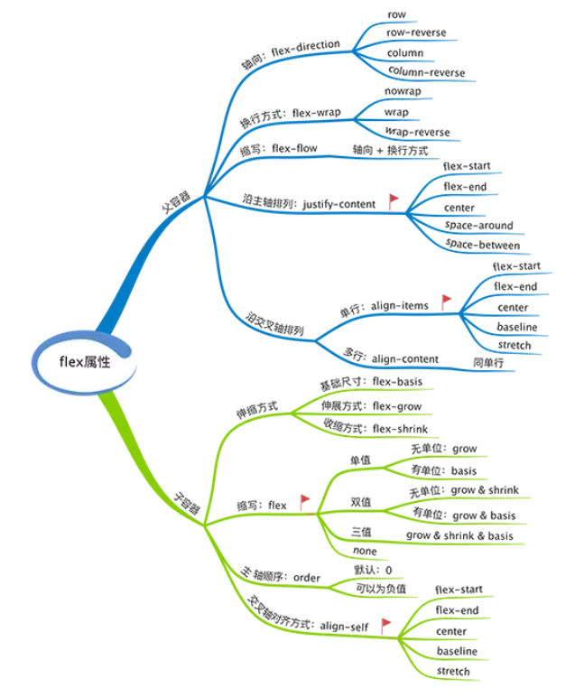

# CSS

---
这里用来记录一些有趣的小例子

1.边框可以透明

```css
border: 15px solid transparent;
```

2.文字溢出部分显示省略号

```css
white-space: nowrap; //规定段落中文本不换行
text-overflow: ellipsis;
```

3.字间距

```css
letter-spacing: 2px;
letter-spacing: -3px;
```

4.伪元素实现平行四边形

```html
<a href="#yolo" class="button"><div>Click me</div></a>
<button class="button"><div>Click me</div></button>
```

```css
.button {
    position: relative;
    display: inline-block;
    padding: .5em 1em;
    border: 0; margin: .5em;
    background: transparent;
    color: #000;
    text-transform: uppercase;
    text-decoration: none;
    font: bold 200%/1 sans-serif;
}

.button::before {
    content: '';
    position: absolute;
    top: 0; right: 0; bottom: 0; left: 0;
    z-index: -1;
    background: #58a;
    transform: skew(45deg);
}
```

> 如果你给默认内联的元素应用这个效果，`display`属性需要设置为`inline-block`或`block`，否则应用的变换不会生效。内部元素也一样。

定位偏移量设置为0，自动继承父元素的宽高，需要`z-index`来到下面去，不然会覆盖内容

5.table-layout

```css
.calendar {
  table-layout: fixed;
}
```

默认为automatic，设置为`fixed`之后可以使表格每一列固定宽度，不受内容影响

6.pointer-events是元素不可被点击

```css
.disabled {
   pointer-events: none;
}
```

7.字体模糊效果

```css
.blur {
    color: transparent;
    text-shadow: 0 0 5px rgba(0,0,0,0.5);
}
```

8.光标颜色

```css
input {
    color: #333;
    caret-color: red;
}
```

html的`contenteditable`允许编辑段落。

```html
<p contenteditable="true">这是一段可编辑的段落。请试着编辑该文本。</p>
```

9.`html`内容可编辑

一个HTML5全局属性`contenteditable`。

设置为`true`即可编辑。

## background

可以有如下属性:

+ `background-color`
+ `background-position`
+ `background-size`
+ `background-repeat`
+ `background-origin`
+ `background-clip`
+ `background-attachment`
+ `background-image`

`background-color`可能为`tansparent`。

### `background-position`

`background-position`属性设置背景图像的起始位置(左上角那一点)。

第一个值是`top`,`center`,`bottom`

第二个值是`left`,`center`,`right`

如果仅规定一个关键词，另一个为`center`

或者是百分比`x% y%`，第一个值是水平位置，第二个值是垂直位置。只规定一个值，另一个将是`50%`。

或者规定数值，单位，只规定一个值，另一个将是`50%`。

### `background-size`

`background-size`属性规定背景图像的尺寸

`background-size: length|percentage|cover|contain;`

`length`和`percentage`中如果只设置一个值，另一个值为`auto`。

> 背景图片要铺满一个容器，不论容器尺寸如何变化，`background-size:cover`这个属性都可以做到。

`contain`使其宽度或者高度适应内容区域。

### `background-repeat`

值|描述
---|---
`repeat`|默认。背景图像将在垂直方向和水平方向重复
`repeat-x`|背景图像将在水平方向重复
`repeat-y`|背景图像将在竖直方向重复
`no-repeat`|背景图像将仅显示一次

### `bacground-origin`

`background-origin`属性规定`background-position`属性相对于什么位置来定位。

`background-origin: padding-box|border-box|content-box;`

### `background-clip`

`background-clip`属性规定背景的绘制区域。

`background-clip: border-box|padding-box|content-box;`

### `background-attachment`

`background-attachment`属性设置背景图像是否固定或者随着页面的其余部分滚动。

`scroll`,`fixed`和`inherit`。

设置多重背景，先设置的在最上面

## box-shadow

```css
box-shadow: inset 18px -19px 300px 71px rgba(0,0,0,0.75);
```

+ 默认为outline外部shadow,inset设置为内部shadow
+ 水平/竖直 方向偏移
+ blur 焦距
+ spread radius 扩散范围

## border-image

```css
border-image:url(/i/border.png) 30 30 stretch;
```

+ url
+ 水平/竖直 剪裁图片位置 可以用百分比
+ stretch或者round，重复方式

## background

+ background-origin 可以确定背景在content-box，或是在border-box

## text-shadow

为文本添加阴影

## @font-face

```css
@font-face {
    font-family: myFirstFont;
    src: url('Sansation_Light.ttf'),
        url('Sansation_Light.eot'); /* IE9+ */
}

div {
    font-family:myFirstFont;
}
```

通过@font-face可以从服务器引入字体

## 2D转换

+ translate()
+ rotate()
+ scale()
+ skew()
+ matrix()

## 3D转换

+ rotateX()

## 过渡

+ transition

## calc()

使用`calc()`给元素的`border`、`margin`、`padding`、`font-size`和`width`等属性设置动态值。

+ 使用“+”、“-”、“*” 和 “/”四则运算；
+ 可以使用百分比、px、em、rem等单位；
+ 可以混合使用各种单位进行计算；
+ 表达式中有“+”和“-”时，其前后必须要有空格，如"widht: calc(12%+5em)"这种没有空格的写法是错误的；
+ 表达式中有“*”和“/”时，其前后可以没有空格，但建议留有空格。

```css
width: calc(100% - 80px);
```

1.定义变量

`--variable-name: variable-value;`(变量名大小写敏感)

```css
:root{
    --main-color: #4d4e53;
    --main-bg: rgb(255, 255, 255);
    --logo-border-color: rebeccapurple;
    --header-height: 68px;
    --content-padding: 10px 20px;
    --base-line-height: 1.428571429;
    --transition-duration: .35s;
    --external-link: "external link";
    --margin-top: calc(2vh + 20px);
}
```

2.使用变量

`some-css-value: var(--variable-name [, declaration-value]);`

3.作用域

使用`:root 作用域`来定义全局变量

```css
:root {
    --global-var: 'global';
}
```

媒体查询，伪类，特定元素下均可提供作用域

```css
body {
    --bg: #f00;
    background-color: var(--bg);
    transition: background-color 1s;
}
body:hover {
    --bg: #ff0;
}
```

## 行级格式化上下文

[img排版出错的问题](https://segmentfault.com/q/1010000004809008)

## outline

## HSLA

Hue：色相，就是平常所说的颜色名称，取值范围0-360
Saturation：饱和度是色彩的纯度，越高色彩越纯，低则逐渐变灰。取值范围0-100%
Lightness：颜色越高色彩越亮。取值范围0-100%

## 实现响应式图片固定宽高尺寸

`padding-top`依照父元素的宽度来计算。

`padding-top`设置为`100%`,图片通过`background`设置

## `transform-origin`

允许改变转换元素的参照位置，默认值`50% 50% 0`

`transform-origin: x-axis y-axis z-axis;`

可能的值

+ x-axis left|center|right|length|%
+ y-axis top|center|bottom|length|%
+ z-axis length

## 伪元素

`CSS`属性中有伪类和伪元素。

伪类的意义在于如果不使用伪类，需要给元素添加一个样式。伪元素的意义在于如果不使用伪元素，需要多一个标签，并在此标签添加样式来达到我们想要的效果。

> 伪类的效果可以通过添加一个实际的类来达到，而伪元素的效果则需要通过添加一个实际的元素才能达到，这也是为什么他们一个称为伪类，一个称为伪元素的原因。

`CSS3`为了区分两者，伪类用`:`，伪元素用`::`来表示。

伪元素默认为行内元素。

伪元素中的content是必须的，否则不生效。

`::before creates a pseudo-element that is the first child of the selected element. It is often used to add cosmetic content to an element with the content property. It is inline by default.`

## 高级选择器

`~`通用兄弟选择器，用于选择某元素后面所在的兄弟元素。

`+`相邻兄弟选择器，选择紧接在另一个元素后面的元素。它们具有一个相同的父元素。

```html
<div class="post">
    <h1>这是标题一</h1>
    <p>文章中第一个段落</p>
    <p>文章中第二个段落</p>
</div>
```

```css
.post>p:nth-child(2){color:red}
```

实际效果是第一个段落变红。

`:nth-child`选择的是某父元素的子元素，这个子元素并没有指定确切的类型，同时满足两个条件才能有效果，其一是子元素，其二是子元素刚好处在那个位置。

### 属性选择器

选择器|功能描述
---|---
`[attr]`|用于选取带有指定属性的元素
`[attr=val]`|用于选取带有指定属性和值的元素
`[attr~=val]`|用于选取属性值中包含指定词汇的元素
`[attr|=val]`|用于选取带有以指定值开头的属性值的元素，该值必须是整个单词
`[attr^=val]`|匹配属性值以指定值开头的每个元素
`[attr$=val]`|匹配属性值以指定值结尾的每个元素
`[attr*=val]`|匹配属性值中包含指定值的每个元素

## Flex



水平轴(`main axis`)

垂直交叉轴(`cross axis`)


### 容器的属性

+ flex-direction
+ flex-wrap
+ flex-flow
+ justify-content
+ align-items
+ align-content

#### `flex-direction`

`flex-direction`决定了主轴的方向，默认`row`。

```css
.box {
  flex-direction: row | row-reverse | column | column-reverse;
}
```


#### `flex-wrap`

`flex-wrap`属性控制换行，默认`nowrap`。

```css
.box{
  flex-wrap: nowrap | wrap | wrap-reverse;
}
```

#### `flex-flow`

是属性简写

```css
.box {
  flex-flow: <flex-direction> || <flex-wrap>;
}
```

默认`row nowrap`。

#### `justify-content`

`justify-content`定义了项目在主轴上的对齐方式，默认`flex-start`。

```css
.box {
  justify-content: flex-start | flex-end | center | space-between | space-around;
}
```


+ `space-between`：两端对齐，项目之间的间隔都相等。
+ `space-around`：每个项目两侧的间隔相等。所以，项目之间的间隔比项目与边框的间隔大一倍。

#### `align-items`

`align-items`属性定义项目在交叉轴上如何对齐，默认`stretch`。

```css
.box {
  align-items: flex-start | flex-end | center | baseline | stretch;
}
```


#### `align-content`

`align-content`属性定义了多根轴线的对齐方式。如果只有一根轴线，该属性不起作用，默认`stretch`。


+ `flex-start`：与交叉轴的起点对齐。
+ `flex-end`：与交叉轴的终点对齐。
+ `center`：与交叉轴的中点对齐。
+ `space-between`：与交叉轴两端对齐，轴线之间的间隔平均分布。
+ `space-around`：每根轴线两侧的间隔都相等。所以，轴线之间的间隔比轴线与边框的间隔大一倍。
+ `stretch`（默认值）：轴线占满整个交叉轴。

### 项目的属性

+ order
+ flex-grow
+ flex-shrink
+ flex-basis
+ flex
+ align-self

#### `order`

`order`属性定义项目的排列顺序，默认`0`。

#### `flex-grow`

`flex-grow`属性定义项目的放大比例，默认为`0`，即如果存在剩余空间，也不放大。

如果所有项目的`flex-grow`属性都为1，则它们将等分剩余空间（如果有的话）。如果一个项目的`flex-grow`属性为2，其他项目都为1，则前者占据的剩余空间将比其他项多一倍。

#### `flex-shrink`

`flex-shrink`属性定义了项目的缩小比例，默认为`1`，即如果空间不足，该项目将缩小。

#### `flex-basis`

`flex-basis`属性定义了在分配多余空间之前，项目占据的主轴空间（main size），默认值`auto`，即项目本来的大小。

#### `flex`

`flex`属性是`flex-grow`,`flex-shrink`和`flex-basis`的简写，默认值为`0 1 auto`。后两个属性可选。

#### `align-self`

`align-self`属性允许单个项目有与其他项目不一样的对齐方式，可覆盖`align-items`属性。默认值为`auto`，表示继承父元素的`align-items`属性，如果没有父元素，则等同于`stretch`。

## CSS3变形

CSS3 2D变形函数:

+ translate()
+ scale()
+ rotate()
+ skew()

CSS 3D变形函数:

+ rotateX()
+ rotateY()
+ rotate3d()
+ translateZ()
+ translate3d()
+ scaleZ()
+ scale3d()

### transform属性

```css
transform: rotate(-360deg) scale(.7)
```

#### transform-origin

改变变形原点

#### transform-style

flat | preserve-3d

如果设置了`flat`那么`translateZ()`就会失效

如果元素设置`preserve-3d`，就不能为了防止子元素溢出容器而设置`overflow`为`hidden`

#### perspective

通过给元素父节点设置`perspective`，使3d变形更加明显

`perspective`取值越小，效果越明显

#### perspective-origin

`perspective`属性的观察者角度

#### backface-visibility

元素旋转背面是否可见

### CSS3 2D变形

```css
transform: translate(x, y)
```

向右向下为正方向

这里使用百分比是针对元素自身的`border-box`尺寸

```css
transform: rotate(a)
```

a为正，顺时针旋转，a为负，逆时针旋转

### CSS3 3D变形

`translate3d`启用硬件加速

## CSS过渡

`transition-property`指定过渡的CSS属性

`transition-duration`指定完成过渡所需的时间

`transition-timing-function`指定过渡函数

`transition-delay`指定过渡开始出现的延迟时间

`transition: <property> <dutation> <animation type> <delay>`

### `transition-function`

function|description
---|---
ease(默认)|由快到慢
linear|线性
ease-in|加速显示
ease-out|减速显示
ease-in-out|先加速再减速

### CSS触发过渡

1.伪元素触发

2.媒体查询触发

3.JavaScript触发

通过JavaScript去控制标签的CSS样式达到目的

## CSS3动画

+ animation-name
+ animation-duration
+ animation-timing-function
+ animation-delay
+ animation-iteration-count
+ animation-direction
+ animation-play-state
+ animation-fill-mode

`animation-duration`是动画一次完成时间

`animation-iteration-count`默认为`1`，可以设置`infinite`

`animation-direction`设置动画的播放方向，`normal`每次都是向前播放，`alternate`偶数向后奇数向前

`animation-play-state`属性有`pause`和`running`，`pause`可以暂停动画

```css
.demo {
    margin-left: 100px;
    background: blue;
    animation: hehe .2s ease-in;
}

@keyframes hehe {
    0% {
        margin-left: 100px;
        background: green;
    }
    40% {
        margin-left: 150px;
        background: orange;
    }
    60% {
        margin-left: 75px;
        background: blue;
    }
    100% {
        margin-left: 100px;
        background: red;
    }
}
```

## 居中总结

### `margin auto`

块级元素水平居中

### `text-align: center;`

行级元素水平居中，添加在父元素上

### 水平垂直居中有n种

#### absolute负`margin`

```css
.parent{
    position: relative;
}
.child{
    width: 100px;
    height: 150px;
    position: absolute;
    top: 50%;
    left: 50%;
    margin-top: -75px;
    margin-left: -50px;
}
```

#### `absolute`和`margin:auto`

```css
.parent{
    position: relative;
}
.child{
    width: 100px;
    height: 150px;
    position: absolute;
    top: 0;
    left: 0;
    right: 0;
    bottom: 0;
    margin: auto;
}
```

#### `absolute`和`transform`

```css
.parent{
    position: relative;
}
.child{
    width: 100px;
    height: 150px;
    position: absolute;
    top: 50%;
    left: 50%;
    transform: translate(-50%,-50%);
}
```

#### `display:table-cell`

```css
.parent{
    display: table-cell;
    verticle-align: middle;
    text-align: center;
}
.child{
    width: 100px;
    height: 150px;
    margin: 0 auto;
}
```

#### flex

```css
.parent{
    display: flex;
    justify-content: center;
    align-items: center;
}
.child{
    width: 100px;
    height: 150px;
}
```

## BEM

Block Element Modifier

+ `-`中划线 ：仅作为连字符使用，表示某个块或者某个子元素的多单词之间的连接记号。
+ `__`双下划线：双下划线用来连接块和块的子元素
+ `_`单下划线：单下划线用来描述一个块或者块的子元素的一种状态

```css
.type-block__element_modifier {}
```

### Block

一个Block是设计或布局的一部分，要么是语义上的要么是视觉上的。

### Element

块中的子元素是块的子元素，并且子元素的子元素在BEM里也被认为是块的直接子元素。一个块中元素的类名必须用父级块的名称作为前缀。

### Modifier

一个“修饰符”可以理解为一个块的特定状态，标识着它持有一个特定的属性。

## position

position有四个常用的值

+ static，非定位，默认值
+ relative，相对定位(相对自己)
+ absolute，绝对定位，相对非static祖先元素定位(这里的祖先元素可以是父元素，父元素的父元素...)
+ fixed，相对于视口绝对定位

relative

+ 常规流
+ 相对于自己本应该在的位置进行偏移
+ 使用top、left、bottom、right设置偏移长度
+ 流内其他元素当它没有偏移一样布局

absolute

+ 脱离常规流
+ 相对于最近的非static祖先的padding box定位
+ 不会对流内元素布局造成影响
+ 可以有margin，但不会折叠