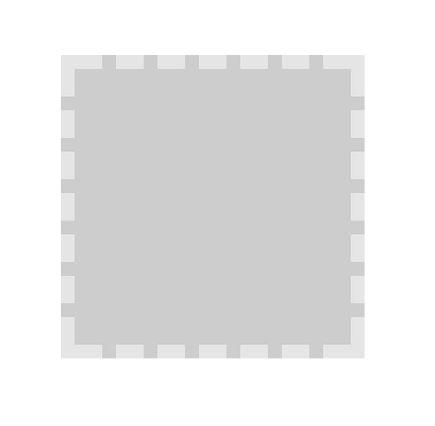
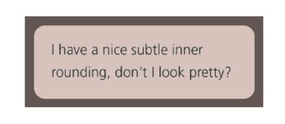
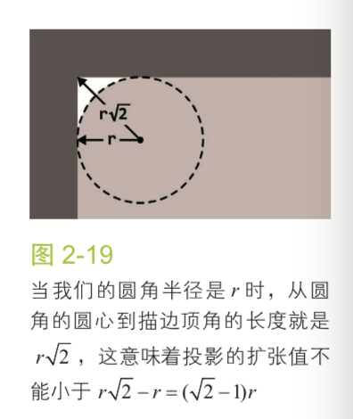
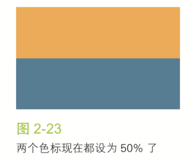
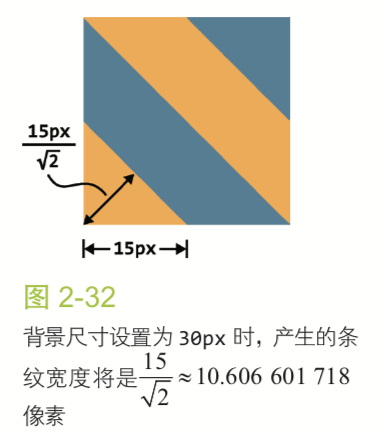
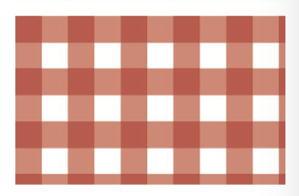
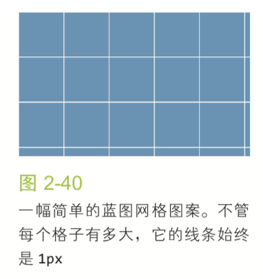
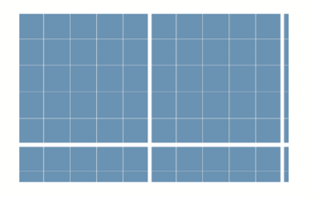
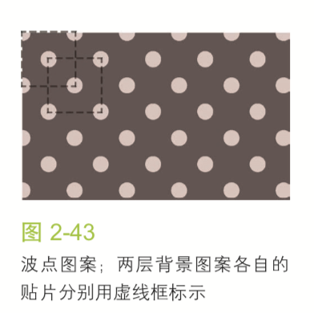

# CSS揭秘

## 前言

现代CSS中面临的挑战是保证`DRY`、可维护、灵活性、轻量级并且尽可能符合标准的前提下，把CSS特性转化为网页中的各种创意。

`DRY`:`Don't Repeat Yourself`的首字母缩写，意思是不该重复你已经做过的事，旨在提升代码某方面的可维护性。`DRY`的反面是`WET`，`We Enjoy Typing`或`Write Everything Twice`。

[demo链接](http://play.csssecrets.io/)

## 第一章 引言

### CSS编码技巧

#### 尽量减少代码重复

> 代码可维护性的最大要素是尽量减少改动时要编辑的地方。

当某些值相互依赖时，应该把它们的相互关系用代码表达出来。

```css
font-size: 20px;
line-height: 1.5;
```

`line-height`根据`font-size`计算行高

1.代码易维护vs代码量少

```css
border-width: 10px 10px 10px 0;
```

```css
border-width: 10px;
border-left-width: 0;
```

改起来容易许多且可读性更好。

2.currentColor

`currentColor`是`CSS`中有史以来的第一个变量。

它代表当前标签所继承的文字颜色。

3.继承

`inherit`可以用在任何`CSS`属性中，而且它总是绑定到父元素的计算值（对为元素来说，则会去生成该为元素的宿主元素）。

#### 相信眼睛而不是数字

视觉上的错觉在任何形式的视觉设计中都普遍存在，需要作出有针对性的调整。

#### 关于响应式网页设计

`Responsive Web Design(RWD)`

比较常见的是用多种分辨率来测试一个网站，然后添加越来越多的媒体查询(Media Query)规则来修补网站在这些分辨率下出现的问题，**每个媒体查询都会增加成本**。

媒体查询的断点不应该由具体的设备来决定。

下面这些建议可能会帮助避免不必要的媒体查询

+ 使用百分比长度来取代固定长度，或者尝试使用与视口相关的单位(`vm`、`vh`、`vmin`和`vmax`)

`vm`：视窗宽度的百分比
`vh`：视窗高度的百分比
`vmin`：当前较小的`vm`和`vh`
`vmax`：当前较大的`vm`和`vh`

+ 当需要在较大分辨率下得到固定宽度，使用`max-width`而不是`width`。
+ 不要忘记为替换元素(比如`img`、`object`、`video`、`iframe`等)设置一个`max-width`，值为`100%`。
+ 背景图片要铺满一个容器，不论容器尺寸如何变化，`background-size:cover`这个属性都可以做到。
+ 当图片(或其他元素)以行列式进行布局时，让视口的宽度来决定列的数量，`flex`或者`display:inline-block`都可以实现这一点。
+ 使用多列文本时，指定`column-width`(列宽)而不是指定`column-count`(列数)，这样就可以在较小的屏幕上自动显示为单列布局。

总的来说，我们的思路是尽最大努力**实现弹性可伸缩的布局，并在媒体查询的各个断点区间内指定相应的尺寸**

> “结果我们发现，想让网页在一堆不同的设备上合理展示，只需要在最终产品上添加一点`CSS`媒体查询就可以了。这件事情之所以这么简单，关键在于我们的布局原本就是弹性可伸缩的。因此，优化网页在小屏幕上的表现，其实只意味着把一些外边距收拢到最小程度，然后把因为屏幕太窄而无法显示成双列的侧栏调整为单列布局而已。”

### 合理使用简写

合理使用简写是一种良好的防卫性编码方式，可以抵御未来风险。

列表扩散规则：如果只为某个属性提供一个值，那 它就会扩散并应用到列表中的每一项。

```css
background: url(tr.png) top right, url(br.png) bottom right,
url(bl.png) bottom left; background-size: 2em 2em;
background-repeat: no-repeat;
```

### 关于预处理器

`Stylus`、`Sass`或`LESS`这样的预处理器为`CSS`的编写提供了一些便利，比如变量、mixin、函数、规则嵌套、颜色处理等。

如果使用得当，它们在大型项目中可以让代码更加灵活。不过它们也不是完美无缺的。

+ `CSS`文件体积和复杂度可能会失控。
+ 调试难度会增加，不过很多调试工具已经开始支持`SourceMap`，它会告诉浏览器编译的`CSS`代码所对应的预处理器`CSS`代码。
+ 预处理器在开发过程中引入一定程度的延迟。差不多需要一秒的时间才能预览到代码的效果。
+ 学习成本变高
+ 预处理器有自己的bug

很多受预处理器启发的特性都已经以各种方式融入到原生`CSS`中。

+ `calc()`函数，不仅在处理运算时非常强大，而且已经得到了广泛的支持。
+ `color()`函数会提供颜色运算方法。
+ 关于嵌套，`CSS`工作组在进行一些正式的讨论。

这些原生特性通常**比预处理器提供的版本要强大的多**。

举个例子，预处理器无法完成`100% - 50px`这样的计算，因为在页面真正被渲染之前，百分比值是无法解析的。但是，原生`CSS`的`calc()`在计算这样的表达式时没有任何压力。

```css
ul { --accent-color: purple; }
ol { --accent-color: rebeccapurple; }
li { background: var(--accent-color); }
```

`Myth`是一款实验性质的预处理器，模拟原生CSS新特性，本质上扮演了`CSSpolyfill`角色。

## 第二章 背景和边框

### 1.半透明边框

默认状态下，背景会延伸到边框的区域下层。

```CSS
border: 10px dashed hsla(0,0%,100%,.5); background: #cccccc;
```



可以通过`background-clip`属性来调整背景的默认属性。

这个属性的初始值是`border-box`，意味着背景会被元素的`border box`裁减掉，如果不希望背景入侵边框所在的范围，则将其设置为`padding-box`。

### 2.多重边框

#### `box-shadow`

回顾`box-shadow`

`box-shadow`的五个值：

1. inset(默认outset)
1. X offset
1. Y offset
1. blur
1. spread
1. color

`box-shadow`中一个正值的扩张半径(spread)加上两个为零的偏移量以及为零的模糊值(blur)，得到的“投影”就像一道实线边框。

`box-shadow`支持逗号分隔语法，可以创建任意数量的投影。

需要注意的是，`box-shadow`层层叠加，第一层投影位于最顶层。

有两点需要注意:

+ 投影的行为不会影响布局
+ 上述方法创建的假“边框”出现在元素外圈，不会影响鼠标事件。在`box-shadow`属性加上`inset`关键字来使投影绘制在元素的内圈。

#### `outline` 方案

`box-shadow`只能模拟实线边框效果

`outline`可以产生虚线效果

```css
background: yellowgreen;
border: 10px solid #655;
outline: 5px solid deeppink;
```

描边可以通过`outline-offset`来控制它跟元素边缘之间的间距。可以为负值。

### 3.灵活的背景定位

#### `background-position`的扩展语法方案

允许我们制定图片距离任意角的偏移量

```css
background: url(code-pirate.svg) no-repeat #58a;
background-position: right 20px bottom 10px;
```

不支持`background-position`扩展语法的浏览器中提供一个合适的回退方案。

```css
background: url(code-pirate.svg) no-repeat bottom right #58a;
background-position: right 20px bottom 10px;
```

#### `background-origin`方案

默认情况下，`background-position`是以`padding box`为准，即`background-position: top left;`这个`top left`会贴住`padding box`的左上角定位。

可以指定其为`padding-box`，`content-box`。

必要时将两种技巧组合起来，让偏移量与盒子边距做出细微调整。

#### `calc()`方案

```css
background: url("code-pirate.svg") no-repeat;
background-position: calc(100% - 20px) calc(100% - 10px);
```

### 4.边框内圆角

难题：

容器外有一道边框，但只在内侧有圆角，如何使用一个元素来解决。



描边(`outline`)不会跟着圆角走，但`box-shadow`会。

```css
background: tan;
border-radius: .8em;
padding: 1em;
box-shadow: 0 0 0 .6em #655;
outline: .6em solid #655;
```

思路使用`box-shadow`来填补圆角与`outline`之间的空隙。



为了让效果达成，`box-shadow`的扩张半径(`spread`)需要比描边的宽度值小，但同时又要比`(Math.SQRT2 - 1)r`大。

### 5.条纹背景

难题：渐变出现在总高60%的区域，剩下的部分显示为实色。

```css
background: linear-gradient(#fb3, #58a);
```

这是垂直线性渐变。

```css
background: linear-gradient(#fb3 20%, #58a 80%);
```

> 如果多个色标具有相同的位置，他们会产生一个无限小的过渡区域，过渡的起止色分别是第一个和最后一个指定值。从效果上看，颜色会在那个位置突然变化，而不是一个平滑的渐变过程。



渐变是一种由代码生成的图像，我们能像对待其他任何背景图像那样对待它，而且可以通过`background-size`来调整其尺寸:

```css
background: linear-gradient(#fb3 50%, #58a 50%);
background-size: 100% 30px;
```

通过调整色标的位置来创建不等宽的条纹。

```css
background: linear-gradient(#fb3 30%, #58a 30%);
background-size: 100% 30px;
```

从规范中找到捷径

> 如果某个色标的位置值比整个列表中在它之前的色标的位置值都要小，则该色标的位置值会被设置为它前面所有色标位置值的最大值。

```css
background: linear-gradient(#fb3 30%, #58a 0);
background-size: 100% 30px;
```

下面的代码创建三种颜色的水平条纹。

```css
background: linear-gradient(#fb3 33.3%,
#58a 0, #58a 66.6%, yellowgreen 0);
background-size: 100% 45px;
```

#### 垂直条纹

区别在于在开头加上一个参数来指定渐变的方向。

```css
background: linear-gradient(to right, /* 或 90deg */ #fb3 50%, #58a 0);
background-size: 30px 100%;
```

#### 斜向条纹

只有无缝拼接的图像才能生成斜向条纹。

```css
background: linear-gradient(45deg, #fb3 25%, #58a 0, #58a 50%, #fb3 0, #fb3 75%, #58a 0);
background-size: 30px 30px;
```



上图解释了为什么斜向条纹看起来会细一些。

#### 更好的斜向条纹

渐变有一个循环的加强版

`linear-gradient()`和`radial-gradient()`的加强版:`repeating-linear-gradient()`和`repeating-radial-gradient()`。

```css
background: repeating-linear-gradient(45deg,
#fb3, #fb3 15px, #58a 0, #58a 30px);
```

这里同样实现了45度条纹，与之前不同的是，渐变的色标中需要指定的是长度，而不是原来的`background-size`。

最大的好处是可以随心所欲的改变渐变的角度。

```css
background: repeating-linear-gradient(60deg,
#fb3, #fb3 15px, #58a 0, #58a 30px);
```

采用`linear-gradient()`来实现水平或者竖直的条纹，用`repeating-linear-gradient()`来实现斜向条纹。

#### 灵活的同色系条纹

大多数情况下，我们想要的条纹图案不是由差异极大的几种颜色组成的，这些颜色往往属于同意色系，只是在明度方面有着轻微差异。

实现方法为：把最深的颜色指定为背景色，同时把半透明白色的条纹叠加在背景色上得到浅色条纹。

```css
background: #58a;
background-image: repeating-linear-gradient(30deg, hsla(0,0%,100%,.1), hsla(0,0%,100%,.1) 15px, transparent 0, transparent 30px);
```

### 6.复杂的背景图案

用CSS渐变来创建任何种类的几何图案几乎都是可能的。

#### 网格

把多个渐变图案组合起来神奇的事情就发生了。

```css
background: white;
background-image: linear-gradient(90deg, rgba(200,0,0,.5) 50%, transparent 0), linear-gradient(rgba(200,0,0,.5) 50%, transparent 0);
background-size: 30px 30px;
```

这个代码创建桌布(方格纹)图案。



实现类似图纸辅助线的网格：

```css
background: #58a;
background-image:linear-gradient(white 1px, transparent 0), linear-gradient(90deg, white 1px, transparent 0);
background-size: 30px 30px;
```



更逼真的蓝图网格：

```css
background: #58a;
background-image:
    linear-gradient(white 2px, transparent 0),
    linear-gradient(90deg, white 2px, transparent 0),
    linear-gradient(hsla(0,0%,100%,.3) 1px, transparent 0),
    linear-gradient(90deg, hsla(0,0%,100%,.3) 1px, transparent 0);
background-size: 75px 75px, 75px 75px,
                 15px 15px, 15px 15px;
```



#### 波点

径向渐变允许我们创建圆心椭圆。

```css
background: #655;
background-image: radial-gradient(tan 30%, transparent 0);
background-size: 30px 30px;
```

通过对定位控制，得到真正的波点图案。

```css
background: #655;
background-image: radial-gradient(tan 30%, transparent 0),
radial-gradient(tan 30%, transparent 0);
background-size: 30px 30px;
background-position: 0 0, 15px 15px;
```

第二层背景的偏移定位值须是贴片宽高的一半。



#### 棋盘

各种应用程序中，灰色的棋盘图案已经是用于表示透明色的事实标准。

