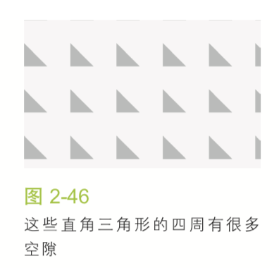
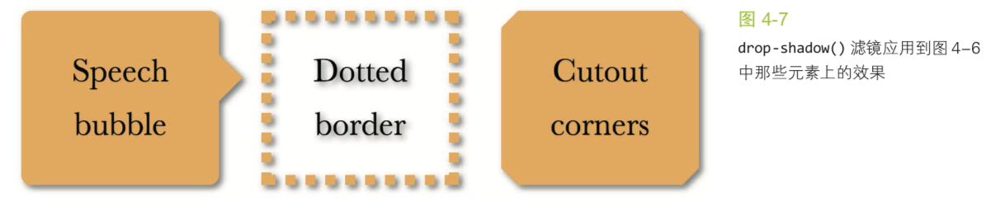

# CSS揭秘

## 前言

现代CSS中面临的挑战是保证`DRY`、可维护、灵活性、轻量级并且尽可能符合标准的前提下，把CSS特性转化为网页中的各种创意。

`DRY`:`Don't Repeat Yourself`的首字母缩写，意思是不该重复你已经做过的事，旨在提升代码某方面的可维护性。`DRY`的反面是`WET`，`We Enjoy Typing`或`Write Everything Twice`。

[demo链接](http://play.csssecrets.io/)

## 第一章 引言

### CSS编码技巧

#### 尽量减少代码重复

> 代码可维护性的最大要素是尽量减少改动时要编辑的地方。

当某些值相互依赖时，应该把它们的相互关系用代码表达出来。

```css
font-size: 20px;
line-height: 1.5;
```

`line-height`根据`font-size`计算行高

1.代码易维护vs代码量少

```css
border-width: 10px 10px 10px 0;
```

```css
border-width: 10px;
border-left-width: 0;
```

改起来容易许多且可读性更好。

2.currentColor

`currentColor`是`CSS`中有史以来的第一个变量。

它代表当前标签所继承的文字颜色。

3.继承

`inherit`可以用在任何`CSS`属性中，而且它总是绑定到父元素的计算值（对为元素来说，则会去生成该为元素的宿主元素）。

#### 相信眼睛而不是数字

视觉上的错觉在任何形式的视觉设计中都普遍存在，需要作出有针对性的调整。

#### 关于响应式网页设计

`Responsive Web Design(RWD)`

比较常见的是用多种分辨率来测试一个网站，然后添加越来越多的媒体查询(Media Query)规则来修补网站在这些分辨率下出现的问题，**每个媒体查询都会增加成本**。

媒体查询的断点不应该由具体的设备来决定。

下面这些建议可能会帮助避免不必要的媒体查询

+ 使用百分比长度来取代固定长度，或者尝试使用与视口相关的单位(`vm`、`vh`、`vmin`和`vmax`)

`vm`：视窗宽度的百分比
`vh`：视窗高度的百分比
`vmin`：当前较小的`vm`和`vh`
`vmax`：当前较大的`vm`和`vh`

+ 当需要在较大分辨率下得到固定宽度，使用`max-width`而不是`width`。
+ 不要忘记为替换元素(比如`img`、`object`、`video`、`iframe`等)设置一个`max-width`，值为`100%`。
+ 背景图片要铺满一个容器，不论容器尺寸如何变化，`background-size:cover`这个属性都可以做到。
+ 当图片(或其他元素)以行列式进行布局时，让视口的宽度来决定列的数量，`flex`或者`display:inline-block`都可以实现这一点。
+ 使用多列文本时，指定`column-width`(列宽)而不是指定`column-count`(列数)，这样就可以在较小的屏幕上自动显示为单列布局。

总的来说，我们的思路是尽最大努力**实现弹性可伸缩的布局，并在媒体查询的各个断点区间内指定相应的尺寸**

> “结果我们发现，想让网页在一堆不同的设备上合理展示，只需要在最终产品上添加一点`CSS`媒体查询就可以了。这件事情之所以这么简单，关键在于我们的布局原本就是弹性可伸缩的。因此，优化网页在小屏幕上的表现，其实只意味着把一些外边距收拢到最小程度，然后把因为屏幕太窄而无法显示成双列的侧栏调整为单列布局而已。”

### 合理使用简写

合理使用简写是一种良好的防卫性编码方式，可以抵御未来风险。

列表扩散规则：如果只为某个属性提供一个值，那 它就会扩散并应用到列表中的每一项。

```css
background: url(tr.png) top right, url(br.png) bottom right,
url(bl.png) bottom left; background-size: 2em 2em;
background-repeat: no-repeat;
```

### 关于预处理器

`Stylus`、`Sass`或`LESS`这样的预处理器为`CSS`的编写提供了一些便利，比如变量、mixin、函数、规则嵌套、颜色处理等。

如果使用得当，它们在大型项目中可以让代码更加灵活。不过它们也不是完美无缺的。

+ `CSS`文件体积和复杂度可能会失控。
+ 调试难度会增加，不过很多调试工具已经开始支持`SourceMap`，它会告诉浏览器编译的`CSS`代码所对应的预处理器`CSS`代码。
+ 预处理器在开发过程中引入一定程度的延迟。差不多需要一秒的时间才能预览到代码的效果。
+ 学习成本变高
+ 预处理器有自己的bug

很多受预处理器启发的特性都已经以各种方式融入到原生`CSS`中。

+ `calc()`函数，不仅在处理运算时非常强大，而且已经得到了广泛的支持。
+ `color()`函数会提供颜色运算方法。
+ 关于嵌套，`CSS`工作组在进行一些正式的讨论。

这些原生特性通常**比预处理器提供的版本要强大的多**。

举个例子，预处理器无法完成`100% - 50px`这样的计算，因为在页面真正被渲染之前，百分比值是无法解析的。但是，原生`CSS`的`calc()`在计算这样的表达式时没有任何压力。

```css
ul { --accent-color: purple; }
ol { --accent-color: rebeccapurple; }
li { background: var(--accent-color); }
```

`Myth`是一款实验性质的预处理器，模拟原生CSS新特性，本质上扮演了`CSSpolyfill`角色。

## 第二章 背景和边框

### 1.半透明边框

默认状态下，背景会延伸到边框的区域下层。

```CSS
border: 10px dashed hsla(0,0%,100%,.5); background: #cccccc;
```


可以通过`background-clip`属性来调整背景的默认属性。

这个属性的初始值是`border-box`，意味着背景会被元素的`border box`裁减掉，如果不希望背景入侵边框所在的范围，则将其设置为`padding-box`。

### 2.多重边框

#### `box-shadow`

回顾`box-shadow`

`box-shadow`的五个值：

1. inset(默认outset)
1. X offset
1. Y offset
1. blur
1. spread
1. color

`box-shadow`中一个正值的扩张半径(spread)加上两个为零的偏移量以及为零的模糊值(blur)，得到的“投影”就像一道实线边框。

`box-shadow`支持逗号分隔语法，可以创建任意数量的投影。

需要注意的是，`box-shadow`层层叠加，第一层投影位于最顶层。

有两点需要注意:

+ 投影的行为不会影响布局
+ 上述方法创建的假“边框”出现在元素外圈，不会影响鼠标事件。在`box-shadow`属性加上`inset`关键字来使投影绘制在元素的内圈。

#### `outline` 方案

`box-shadow`只能模拟实线边框效果

`outline`可以产生虚线效果

```css
background: yellowgreen;
border: 10px solid #655;
outline: 5px solid deeppink;
```

描边可以通过`outline-offset`来控制它跟元素边缘之间的间距。可以为负值。

### 3.灵活的背景定位

#### `background-position`的扩展语法方案

允许我们制定图片距离任意角的偏移量

```css
background: url(code-pirate.svg) no-repeat #58a;
background-position: right 20px bottom 10px;
```

不支持`background-position`扩展语法的浏览器中提供一个合适的回退方案。

```css
background: url(code-pirate.svg) no-repeat bottom right #58a;
background-position: right 20px bottom 10px;
```

#### `background-origin`方案

默认情况下，`background-position`是以`padding box`为准，即`background-position: top left;`这个`top left`会贴住`padding box`的左上角定位。

可以指定其为`padding-box`，`content-box`。

必要时将两种技巧组合起来，让偏移量与盒子边距做出细微调整。

#### `calc()`方案

```css
background: url("code-pirate.svg") no-repeat;
background-position: calc(100% - 20px) calc(100% - 10px);
```

### 4.边框内圆角

难题：

容器外有一道边框，但只在内侧有圆角，如何使用一个元素来解决。


描边(`outline`)不会跟着圆角走，但`box-shadow`会。

```css
background: tan;
border-radius: .8em;
padding: 1em;
box-shadow: 0 0 0 .6em #655;
outline: .6em solid #655;
```

思路使用`box-shadow`来填补圆角与`outline`之间的空隙。


为了让效果达成，`box-shadow`的扩张半径(`spread`)需要比描边的宽度值小，但同时又要比`(Math.SQRT2 - 1)r`大。

### 5.条纹背景

难题：渐变出现在总高60%的区域，剩下的部分显示为实色。

```css
background: linear-gradient(#fb3, #58a);
```

这是垂直线性渐变。

```css
background: linear-gradient(#fb3 20%, #58a 80%);
```

> 如果多个色标具有相同的位置，他们会产生一个无限小的过渡区域，过渡的起止色分别是第一个和最后一个指定值。从效果上看，颜色会在那个位置突然变化，而不是一个平滑的渐变过程。


渐变是一种由代码生成的图像，我们能像对待其他任何背景图像那样对待它，而且可以通过`background-size`来调整其尺寸:

```css
background: linear-gradient(#fb3 50%, #58a 50%);
background-size: 100% 30px;
```

通过调整色标的位置来创建不等宽的条纹。

```css
background: linear-gradient(#fb3 30%, #58a 30%);
background-size: 100% 30px;
```

从规范中找到捷径

> 如果某个色标的位置值比整个列表中在它之前的色标的位置值都要小，则该色标的位置值会被设置为它前面所有色标位置值的最大值。

```css
background: linear-gradient(#fb3 30%, #58a 0);
background-size: 100% 30px;
```

下面的代码创建三种颜色的水平条纹。

```css
background: linear-gradient(#fb3 33.3%,
#58a 0, #58a 66.6%, yellowgreen 0);
background-size: 100% 45px;
```

#### 垂直条纹

区别在于在开头加上一个参数来指定渐变的方向。

```css
background: linear-gradient(to right, /* 或 90deg */ #fb3 50%, #58a 0);
background-size: 30px 100%;
```

#### 斜向条纹

只有无缝拼接的图像才能生成斜向条纹。

```css
background: linear-gradient(45deg, #fb3 25%, #58a 0, #58a 50%, #fb3 0, #fb3 75%, #58a 0);
background-size: 30px 30px;
```


上图解释了为什么斜向条纹看起来会细一些。

#### 更好的斜向条纹

渐变有一个循环的加强版

`linear-gradient()`和`radial-gradient()`的加强版:`repeating-linear-gradient()`和`repeating-radial-gradient()`。

```css
background: repeating-linear-gradient(45deg,
#fb3, #fb3 15px, #58a 0, #58a 30px);
```

这里同样实现了45度条纹，与之前不同的是，渐变的色标中需要指定的是长度，而不是原来的`background-size`。

最大的好处是可以随心所欲的改变渐变的角度。

```css
background: repeating-linear-gradient(60deg,
#fb3, #fb3 15px, #58a 0, #58a 30px);
```

采用`linear-gradient()`来实现水平或者竖直的条纹，用`repeating-linear-gradient()`来实现斜向条纹。

#### 灵活的同色系条纹

大多数情况下，我们想要的条纹图案不是由差异极大的几种颜色组成的，这些颜色往往属于同意色系，只是在明度方面有着轻微差异。

实现方法为：把最深的颜色指定为背景色，同时把半透明白色的条纹叠加在背景色上得到浅色条纹。

```css
background: #58a;
background-image: repeating-linear-gradient(30deg, hsla(0,0%,100%,.1), hsla(0,0%,100%,.1) 15px, transparent 0, transparent 30px);
```

### 6.复杂的背景图案

用CSS渐变来创建任何种类的几何图案几乎都是可能的。

#### 网格

把多个渐变图案组合起来神奇的事情就发生了。

```css
background: white;
background-image: linear-gradient(90deg, rgba(200,0,0,.5) 50%, transparent 0), linear-gradient(rgba(200,0,0,.5) 50%, transparent 0);
background-size: 30px 30px;
```

这个代码创建桌布(方格纹)图案。


实现类似图纸辅助线的网格：

```css
background: #58a;
background-image:linear-gradient(white 1px, transparent 0), linear-gradient(90deg, white 1px, transparent 0);
background-size: 30px 30px;
```


更逼真的蓝图网格：

```css
background: #58a;
background-image:
    linear-gradient(white 2px, transparent 0),
    linear-gradient(90deg, white 2px, transparent 0),
    linear-gradient(hsla(0,0%,100%,.3) 1px, transparent 0),
    linear-gradient(90deg, hsla(0,0%,100%,.3) 1px, transparent 0);
background-size: 75px 75px, 75px 75px,
                 15px 15px, 15px 15px;
```


#### 波点

径向渐变允许我们创建圆心椭圆。

```css
background: #655;
background-image: radial-gradient(tan 30%, transparent 0);
background-size: 30px 30px;
```

通过对定位控制，得到真正的波点图案。

```css
background: #655;
background-image: radial-gradient(tan 30%, transparent 0),
radial-gradient(tan 30%, transparent 0);
background-size: 30px 30px;
background-position: 0 0, 15px 15px;
```

第二层背景的偏移定位值须是贴片宽高的一半。


#### 棋盘

各种应用程序中，灰色的棋盘图案已经是用于表示透明色的事实标准。

需要用两个直角三角形来拼合出我们想要的方块。

首先将三角形的直角边缩短到原来的一半，从而占据贴片面积的`1/8`将色标的位置改为25%。

```css
background: #eee;
background-image: linear-gradient(45deg, transparent 75%, #bbb 0);
background-size: 30px 30px;
```



再将色标翻转，创建相反方向的三角形。

```css
background: #eee;
background-image:
    linear-gradient(45deg, #bbb 25%, transparent 0),
    linear-gradient(45deg, transparent 75%, #bbb 0); background-size: 30px 30px;
```


把第二层渐变在水平和垂直方向均移动贴片长度的一半，拼合成一个完整的方块：

```css
background: #eee;
background-image:
    linear-gradient(45deg, #bbb 25%, transparent 0),
    linear-gradient(45deg, transparent 75%, #bbb 0);
background-position: 0 0, 15px 15px;
background-size: 30px 30px;
```


上述代码只完成了棋盘的一半，棋盘的全部实现代码如下

```css
background: #eee;
background-image:
    linear-gradient(45deg, #bbb 25%, transparent 0),
    linear-gradient(45deg, transparent 75%, #bbb 0),
    linear-gradient(45deg, #bbb 25%, transparent 0),
    linear-gradient(45deg, transparent 75%, #bbb 0);
background-position: 0 0, 15px 15px, 15px 15px, 30px 30px;
background-size: 30px 30px;
```

进一步优化将四次渐变变为两次渐变。

```css
background: #eee;
background-image:
    linear-gradient(45deg, rgba(0,0,0,.25) 25%, transparent 0, transparent 75%, rgba(0,0,0,.25) 0),
    linear-gradient(45deg, rgba(0,0,0,.25) 25%, transparent 0, transparent 75%, rgba(0,0,0,.25) 0);
background-position: 0 0, 15px 15px; background-size: 30px 30px;
```

任何情况下这样的代码量都不能算少，所以转到`SVG`方案可能是更好的选择。

### 7.伪随机背景

重复平铺图案看起来呆板，自然界中的事物都不是以无限平铺的方式存在的。

> 当你注意到一个有辨识度的特征（比如，木纹）再以固定的规律循环重复时，那它试图营造的自然随机性就会立即崩塌。

创建一个具有四种颜色的条纹图案：

```css
background: linear-gradient(90deg,
#fb3 15%, #655 0, #655 40%,
#ab4 0, #ab4 65%, hsl(20, 40%, 90%) 0);
background-size: 80px 100%;
```

这个重复规律是非常明显的，渐变图案每隔80px就会重复一次。


把这组条纹从一个平面拆散为多个图层：一种颜色作为底色，另三种颜色作为条纹，然后再让条纹以不同的间隔进行重复平铺。

在色标中定好条纹宽度，再用`background-size`来控制条纹的间距。

```css
background: hsl(20, 40%, 90%);
background-image:
    linear-gradient(90deg, #fb3 10px, transparent 0),
    linear-gradient(90deg, #ab4 20px, transparent 0),
    linear-gradient(90deg, #655 20px, transparent 0);
background-size: 80px 100%, 60px 100%, 40px 100%;
```


仔细观察可发现还是有重复，重复贴片的尺寸是`background-size`的最小公倍数240px。

我们需要让最小公倍数最大化。尽量选择质数。

```css
background: hsl(20, 40%, 90%);
background-image:
    linear-gradient(90deg, #fb3 11px, transparent 0),
    linear-gradient(90deg, #ab4 23px, transparent 0),
    linear-gradient(90deg, #655 41px, transparent 0);
background-size: 41px 100%, 61px 100%, 83px 100%;
```


这样平铺贴片的尺寸是`41x61x83=207 583`像素。

这个技巧被`Alex Walker`称为“蝉原则”，通过质数来增加随机性真实性，这个方法还适用于其他有规律重复的情况：

+ 照片图库中，为每幅图片应用细微的伪随机旋转效果时，可以使用多个`:nth-child(a)`选择符，且让`a`是质数。
+ 生成一个动画，应用多个时长为质数的动画，可让其看起来不是有明确的规律性。

### 8.连续的图像边框

难题：把一幅图案或图片应用为边框，而不是背景。图片可以自动延伸并覆盖完整的边框区域。

`border-image`的原理是九宫格伸缩法

```css
border-image:url(/i/border.png) 30 30 stretch;
```

+ url
+ 水平/竖直 剪裁图片位置 可以用百分比
+ stretch或者round，重复方式

最简单的方法是需要两个`HTML`元素

```html
<div class="something-meaningful">
    <div> I have a nice stone art border, don't I look pretty?</div>
</div>
```

```css
.something-meaningful {
    background: url(stone-art.jpg);
    background-size: cover;
    padding: 1em;
}
.something-meaningful > div {
    background: white;
    padding: 1em;
}
```

如果只用一个`HTML`元素，我们的主要思路是在背景图上再叠加一层纯白的实色背景。我们只能在多重背景的最底层设置背景色，需要一道从白色过渡到白色的`CSS`渐变来模拟纯白背景效果。

```css
padding: 1em;
border: 1em solid transparent; background: linear-gradient(white, white),
url(stone-art.jpg);
background-size: cover;
background-clip: padding-box, border-box;
background-origin: border-box;
```

+ `background-clip`是背景从图片的哪个盒模型裁。
+ `background-origin`是`background-position`所参照的定位点。

这个技巧还可以用在渐变图案上，生成老式信封样式的边框：

```css
padding: 1em;
border: 1em solid transparent;
background:
    linear-gradient(white, white) padding-box,
    repeating-linear-gradient(-45deg, red 0, red 12.5%, transparent 0, transparent 25%, #58a 0, #58a 37.5%, transparent 0, transparent 50%) 0 / 5em 5em;
```


## 第三章 形状

### 9.自适应的椭圆

`border-radius`可以单独制定水平和垂直半径，只要用一个斜杠(/)分隔即可。

> 当任意两个相邻圆角的半径之和超过`border box`的尺寸时，用户代理必须按比例减小各个边框半径所使用的值，直到它们不会相互重叠为止。

可以接受百分比值。这个百分比值会基于元素的尺寸进行解析，即宽度用于水平半径的解析，而高度用于垂直半径的解析。这意味着相同的百分比可能会计算出不同的水平和垂直半径。

```css
border-radius: 50% / 50%;
```

代码简化为

```css
border-radius: 50%;
```

`border-radius`由何得名？

`border-radius`是对元素的`border box`进行切圆角处理的。

#### 半椭圆

可以为四个角提供完全不同的水平和垂直半径。

当`border-radius`的值为`10px / 5px 20px`时，效果相当于`10px 10px 10px 10px / 5px 20px 5px 20px`。

当一个角的水平/垂直半径为零时。它的垂直/水平圆角完全不重要，因为总是会被计算为0。

#### 四分之一椭圆

其中一个角的水平和垂直半径都需要是`100%`，而其他三个角都不能设为圆角。

```css
border-radius: 100% 0 0 0 ;
```

### 10.平行四边形

视觉设计中，平行四边形往往可以传达出一种动感。

使用`skew()`变形属性对元素进行斜向拉伸。

```css
transform: skewX(-45deg);
```

这个属性对默认`display`为`inline`的元素的变形是不会生效的。


#### 嵌套元素方案

这种方式会让元素中的内容也进行变形，如果不想让内容变形，可以对内容进行一次反向变形。

#### 伪元素方案

把所有样式(背景、边框等)应用到伪元素上，对伪元素进行变形。内容不包含在伪元素中，所以内容不会受到变形的影响。

为了让伪元素保持良好的灵活性，可以继承其宿主元素的尺寸，一个简单的办法是给宿主元素应用`position:relative`样式，并为伪元素设置`position:absolute`，然后再把所有偏移量设置为零，以便让它在水平和垂直方向上都被拉伸至宿主元素的尺寸。

```css
.button {
    position: relative;
    /* 其他的文字颜色、内边距等样式...... */
}
.button::before {
    content: '';
    position: absolute;
    top: 0; right: 0; bottom: 0; left: 0;
}
```

此时，用伪元素生成的方块是重叠在内容之上的，一旦给设置背景就会遮住内容，为了修复这个问题，可以给伪元素设置`z-index: -1`的样式，这样它的堆叠层次就会被推到宿主元素之后。

```css
.button {
    position: relative;
    /* 其他的文字颜色、内边距等样式...... */
}
.button::before {
    content: ''; /* 用伪元素来生成一个矩形 */
    position: absolute;
    top: 0; right: 0; bottom: 0; left: 0;
    z-index: -1;
    background: #58a;
    transform: skew(45deg);
}
```

这个技巧不仅对`skew()`变形来说很有用，还适用于其他任何变形样式，当我们想变形一个元素而不想变形它的内容时就可以用到它。举个例子，我们把这个技巧针对`rotate()`变形样式稍稍调整一下，再用到一个正方形元素上，就可以很容易地得到一个菱形。

这个技巧的关键在于，我们利用伪元素以及定位属性产生了一个方块，然后对伪元素设置样式，并将其放置在其宿主元素的下层。这种思路同样可以运用在其他场景中，从而得到各种各样的效果。

### 11.菱形图片

在视觉设计中，把图片裁切为菱形是一种常见的设计手法，但是网页设计师通常不希望在图像处理软件中预先把图片裁好。显然不用说你也知道，这个方法的可维护性并不好。如果未来有人想修改图片风格，将很难增加其他效果，而且最终往往会搞得一团糟。

#### 基于变形的方案


与平行四边形的方案一致，把图片用一个`<div>`包裹起来，然后对其应用相反的`rotate()`变形样式。

问题在于图片反向转回来宽度没有填满容器。使用`scale`属性将其变形为根号2。

```html
<div class="picture">
    
</div>
```

```css
.picture {
    width: 400px;
    transform: rotate(45deg);
    overflow: hidden;
}
.picture > img {
    max-width: 100%;
    transform: rotate(-45deg) scale(1.42);
}
```

> 通过`scale()`变形样式来缩放图片时，是以它的中心点来进行缩放的(除非我们额外指定了`transform-origin`样式)。

#### 剪裁路径方案

`clip-path`属性

```css
clip-path: polygon(50% 0, 100% 50%, 50% 100%, 0 50%);
```

### 12.切角效果

把角切掉是一种流行的设计风格。

第一种方案是CSS渐变，色标的位置信息可以是一个绝对的长度值。

```css
background: #58a;
background: linear-gradient(-45deg, transparent 15px, #58a 0);
```


现在我们想要两个角被切掉的效果。

两层渐变会相互覆盖，需要让渐变分别只占整个元素一半的面积。还需要把`background-repeat`设置为`no-repeat`。

最终代码在这里

```css
background: #58a;
background:
    linear-gradient(-45deg, transparent 15px, #58a 0) right,
    linear-gradient(45deg, transparent 15px, #655 0) left;
background-size: 50% 100%;
background-repeat: no-repeat;
```

还可以做出四个角的切角效果

```css
background: #58a;
background:
    linear-gradient(135deg,  transparent 15px, #58a 0) top left,
    linear-gradient(-135deg, transparent 15px, #58a 0) top right,
    linear-gradient(-45deg, transparent 15px, #58a 0) bottom right,
    linear-gradient(45deg, transparent 15px, #58a 0) bottom left;
background-size: 50% 50%;
background-repeat: no-repeat;
```


#### 弧形切角

弧形切角，“内凹圆角”。

```css
background: #58a;
background:
    radial-gradient(circle at top left, transparent 15px, #58a 0) top left,
    radial-gradient(circle at top right, transparent 15px, #58a 0) top right,
    radial-gradient(circle at bottom right, transparent 15px, #58a 0) bottom right,
    radial-gradient(circle at bottom left, transparent 15px, #58a 0) bottom left;
background-size: 50% 50%;
background-repeat: no-repeat;
```


#### 内联`SVG`与`border-image`方案

详见67页

#### 裁剪路径方案

```css
background: #58a;
clip-path: polygon(20px 0, calc(100% - 20px) 0, 100% 20px, 100% calc(100% - 20px), calc(100% - 20px) 100%, 20px 100%, 0 calc(100% - 20px), 0 20px
);
```

### 13.梯形标签页

三维世界中旋转一个矩形，由于透视的关系，我们最终看到的二维图像往往是一个梯形。

```css
transform: perspective(.5em) rotateX(5deg);
```

这样造成元素内容也变形，与伪元素平行四边形一致，使用伪元素来变形，内容可以保持不变。

当没有设置`transform-origin`属性时，变形效果会让元素以它自身的中心线为轴进行空间上的旋转。


高度会有缩水，通过`scaleY()`属性来弥补，这样一来如果浏览器不支持3D变形，所有的变形属性都会被丢弃。

```css
transform: scaleY(1.3) perspective(.5em) rotateX(5deg);
transform-origin: bottom;
```


完整案例查看74页


### 14.简单的拼图

思路:圆形左右两部分指定上述两种颜色，用伪元素覆盖上去，通过旋转来决定露出多大扇区。


```css
.pie {
    width: 100px;
    height: 100px;
    border-radius: 50%;
    background: yellowgreen;
    background-image: linear-gradient(to right, transparent 50%, #655 0);
}
.pie::before {
    content: '';
    display: block;
    margin-left: 50%;
    height: 100%;
    border-radius: 0 100% 100% 0 / 50%;
    background-color: inherit; // 避免代码重复
    transform-origin: left;
}
```

伪元素上加入`transform: rotate(.1turn);`，可以让伪元素转起来，`72deg(0.2x360=72)`。

## 第四章 视觉效果

### 15.单侧投影

```css
box-shadow: 2px 3px 4px rgba(0,0,0,.5);
```


1. 以该元素相同的尺寸和位置，画一个`rgba(0,0,0,.5)`的矩形。
2. 右移`2px`，下移`3px`。
3. 使用模糊算法进行`4px`模糊处理。
4. 模糊后的矩形与原始元素的交集部分会被切除掉。

`box-shadow`第四个参数会根据你指定的值去扩大或(当指定负值时)缩小投影的尺寸。举例来说，一个`-5px`的扩张半径会把投影的宽度和高度各减少`10px`(即每边各`5px`)。

```css
box-shadow: 0 5px 4px -4px black;
```

这样可以看不见两边投影。


#### 邻边投影


```css
box-shadow: 3px 3px 6px -3px black;
```

### 16.不规则投影

当元素添加了一些伪元素或半透明装饰之后，`box-shadow`的表现不尽人意。


滤镜效果规范为这个问题提供了一个解决方案。引入一个`filter`的新属性。

可以方便指定滤镜效果，甚至可以串联起来，只需要用空格分隔起来。

```css
filter: blur() grayscale() drop-shadow();
```

`drop-shadow()`滤镜可接受的参数基本上跟`box-shadow`属性是一样的，但不包括扩张半径，不包括`inset`关键字，也不支持逗号分割的多层投影语法。

```css
box-shadow: 2px 2px 10px rgba(0,0,0,.5);
```

可以这样来写

```css
filter: drop-shadow(2px 2px 10px rgba(0,0,0,.5));
```



### 17.染色效果

#### 基于滤镜的方案

`sepia()`滤镜会给图片增加一种降饱和度的橙黄色染色效果，像是老照片。

`saturate()`滤镜会提升像素的饱和度。

`hue-rotate()`滤镜把像素的色相以指定的度数进行偏移。

```css
filter: sepia(1) saturate(4) hue-rotate(295deg);
```

#### 基于混合模式的方案

`mix-blend-mode`和`background-blend-mode`

### 18.毛玻璃效果

背景是图片，上面有文字显示，一般这么处理。

```css
body {
    background: url("tiger.jpg") 0 / cover fixed;
}
main {
    background: hsla(0,0%,100%,.3);
}
```


传统的平面设计中，这个问题的解决方案通常是把文本层所覆盖的那部分图片作模糊处理。

#### 解决方案

假定背景是固定的，不能直接对元素模糊处理，使用一个伪元素进行处理。

```css
main {
    position: relative; /* [其余样式] */
}
main::before {
    content: '';
    position: absolute;
    top: 0; right: 0; bottom: 0; left: 0;
    background: rgba(255,0,0,.5); /* 仅用于调试 */
}
```

伪元素现在覆盖在内容元素之上。用`z-index: -1;`来修正这个问题。

模糊从边上向内算起，如果扩大模糊范围，给-的`margin`即可。父元素再配合使用`overflow:hidden;`使玻璃边缘锋芒。

```css
body, main::before {
    background: url("tiger.jpg") 0 / cover fixed;
}
main {
    position: relative;
    background: hsla(0,0%,100%,.3);
    overflow: hidden;
}
main::before {
    content: '';
    position: absolute;
    top: 0; right: 0; bottom: 0; left: 0; filter: blur(20px);
    margin: -30px;
}
```

### 19.折角效果

#### 45°折角的解决方案

先弄出一个右上角斜面切角的元素。

```css
background: #58a; /* 回退样式 */
background: linear-gradient(-135deg, transparent 2em, #58a 0);
```

增加一个暗色的三角形来实现翻折效果，再增加一层渐变生成这个三角形来实现翻折效果。实现方法是增加另一层渐变来生成这个三角形并将其定位在右上角。通过`background-size`来控制折角的大小。

```css
background: linear-gradient(to left bottom, transparent 50%, rgba(0,0,0,.4) 0) no-repeat 100% 0 / 2em 2em;
```

将切角放在渐变之上

```css
background: #58a; /* 回退样式 */
background: linear-gradient(to left bottom, transparent 50%, rgba(0,0,0,.4) 0) no-repeat 100% 0 / 2em 2em, linear-gradient(-135deg, transparent 2em, #58a 0);
```


第二层渐变的`2em`折角尺寸是写在色标中的，沿着渐变轴进行度量，是对角线尺寸。勾股定理算一下。

```css
background: #58a; /* 回退样式 */
background: linear-gradient(to left bottom, transparent 50%, rgba(0,0,0,.4) 0) no-repeat 100% 0 / 2em 2em, linear-gradient(-135deg, transparent 1.5em, #58a 0);
```


#### 其他角度的解决方案

勾股定理勾股定理！


```css
background: #58a; /* 回退样式 */
background: linear-gradient(to left bottom, transparent 50%, rgba(0,0,0,.4) 0) no-repeat 100% 0 / 3em 1.73em, linear-gradient(-150deg, transparent 1.5em, #58a 0);
```


真实的折角需要微微旋转。

需要用到伪元素，因为背景不能旋转。

```css
.note::before {
    content: '';
    position: absolute;
    top: 0; right: 0;
    background: linear-gradient(to left bottom, transparent 50%, rgba(0,0,0,.4) 0) 100% 0 no-repeat; width: 1.73em;
    height: 3em;
    transform: rotate(-30deg);
}
```

指定一下变形定位点

```css
.note::before {
    /* [其余样式] */
    transform: rotate(-30deg);
    transform-origin: bottom right;
}
```


垂直方向位置调整

```css
.note::before {
    /* [其余样式] */
    transform: translateY(-1.3em) rotate(-30deg);
    transform-origin: bottom right;
}
```


再加入一些圆角，渐变和投影

```css
.note {
    position: relative;
    background: #58a; /* 回退样式 */
    background:
        linear-gradient(-150deg, transparent 1.5em, #58a 0);
    border-radius: .5em;
}

.note::before {
    content: '';
    position: absolute;
    top: 0; right: 0;
    background: linear-gradient(to left bottom, transparent 50%, rgba(0,0,0,.2) 0, rgba(0,0,0,.4)) 100% 0 no-repeat;
    width: 1.73em;
    height: 3em;
    transform: translateY(-1.3em) rotate(-30deg);
    transform-origin: bottom right;
    border-bottom-left-radius: inherit;
    box-shadow: -.2em .2em .3em -.1em rgba(0,0,0,.15);
}
```

.png)