# HTTP

## 第1章 了解`Web`及网络基础

### 1.1 使用`HTTP`协议访问`Web`

`HTTP(HyperText Transfer Protocol)`超文本传输协议。

`Web`是建立在`HTTP`协议上通信的。

### 1.2 `HTTP`的诞生

`HTTP/0.9`

`HTTP`于1990年问世。那时并没有作为正式的标准被建立。

`HTTP/1.0`

1996年5月被公布，虽说是初期标准，但该协议标准至今仍被广泛使用在服务器端。

`HTTP/1.1`

1997年1月公布，是目前主流的`HTTP`协议版本。

### 1.3 网络基础`TCP/IP`

计算机与网络设备要相互通信，双方就必须基于相同的方法。比如，如何探测到通信目标、由哪一边先发起通信、使用哪种语言进行通信、怎样结束通信等规则都需要事先确定。不同的硬件、操作系统之间的通信，所有的这一切都需要一种规则。我们把这种规则称为协议(`protocol`)。

`TCP/IP`是在`IP`协议的通信过程中，使用到的协议族的统称。

#### `TCP/IP`的分层管理

`TCP/IP`协议族按层次分别分为以下4层：应用层、传输层、网络层和数据链路层。

1.应用层

应用层决定了向用户提供应用服务时的通信。

比如`FTP(File Transfer Protocol，文件传输协议)`和`DNS(Domain Name System，域名系统)`。

`HTTP`协议也处于该层。

2.传输层

传输层对上层应用层，提供处于网络连接中的两台计算机之间的数据传输。

传输层有两个性质不同的协议:`TCP(Transmission Control Protocol，传输控制协议)`和`UDP(User Data Protocol，用户数据报协议)`。

3.网络层(又名网络互联层)

网络层用来处理在网络上流动的数据包。数据包是网络传输的最小数据单位。该层规定了通过怎样的路径（所谓的传输路线）到达对方计算机，并把数据包传送给对方。

与对方计算机之间通过多台计算机或网络设备进行传输时，网络层所起的作用就是在众多的选项内选择一条传输线路。

4.链路层(又名数据链路层，网络接口层)

用来处理连接网络的硬件部分。包括控制操作系统、硬件的设备驱动、`NIC(Network Interface Card，网络适配器，即网卡)`，及光纤等物理课件部分（还包括连接器等一切传输媒介）。硬件上的范畴均在链路层的作用范围之内。

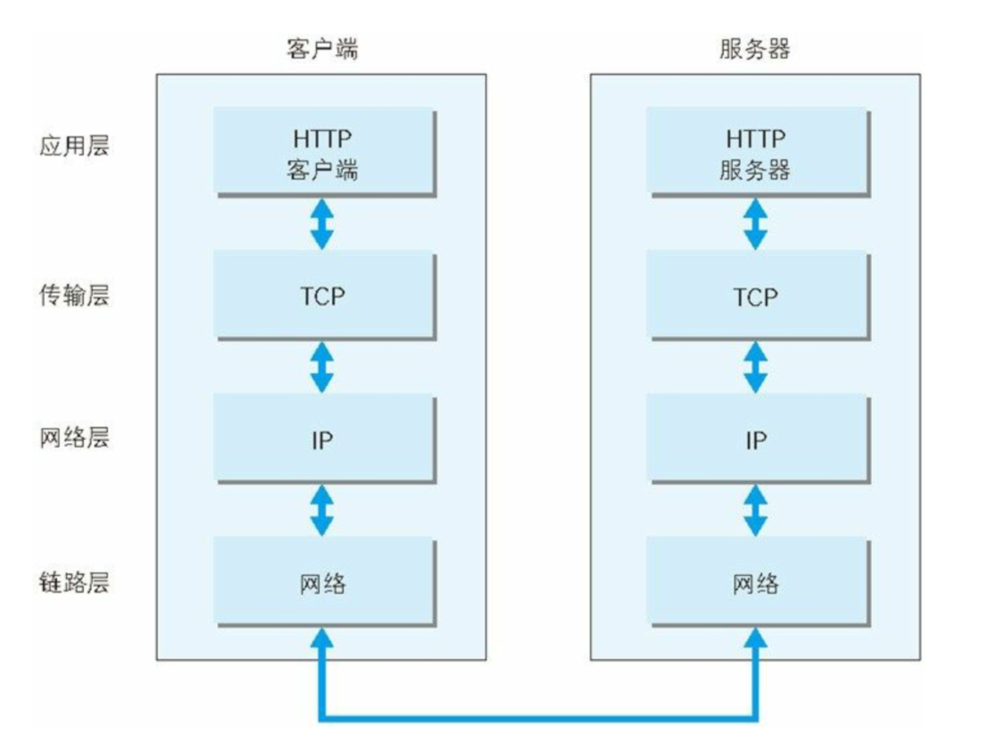

利用`TCP/IP`协议族进行网络通信时，会通过分层顺序与对方进行通信，发送端从应用层往下走，接收端则从应用层往上走。

以`HTTP`举例来说明，首先作为发送端的客户端在应用层(`HTTP`协议)发出一个想看某个`Web`页面的`HTTP`请求。

为了传输方便，在传输层(`TCP`协议)把从应用层处收到的数据(`HTTP`请求报文)进行分割，并在各个报文上打上标记序号及端口号后转发给网络层。

在网络层(`IP`协议)，增加作为通信目的地的`MAC`地址后转发给链路层。

接收端的服务器在链路层接受到数据，按序往上层发送，一直到应用层。

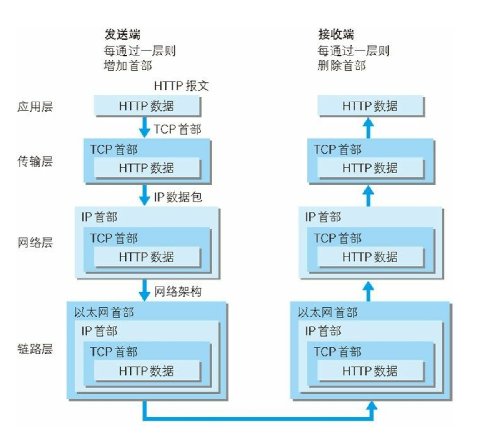

发送端在层与层之间传输数据时，每经过一层时必定会被打上一个该层所属的首部信息。反之，接收端在层与层传输数据时，每经过一层时会把对应的首部消去。

### 与`HTTP`关系密切的协议：`IP`、`TCP`和`DNS`

#### 负责传输的`IP`协议

`IP`协议的作用是把各种数据包传送给对方。而要保证确实传送到对方那里，则需要满足各类条件。其中两个重要的条件是`IP`地址和`MAC`地址(`Media Access Control Address`)。

`IP`间的通信依赖`MAC`地址，网络上通信的双方在同一局域网(`LAN`)内的情况是很少的，通常是经过多台计算机和网络设备中转才能连接到对方。而在进行中转时，会利用下一站中转设备的`MAC`地址来搜索下一个中转目标。这时会采用`ARP`协议(`Address Resolution Protocol`)。`ARP`是一种以解析地址的协议，根据通信方的`IP`地址就可以反查出对应的`MAC`地址。

无论哪台计算机、哪台网络设备，它们都无法全面掌握互联网中的细节。

#### 确保可靠性的`TCP`协议

按层次分，`TCP`位于传输层，提供可靠的字节流服务。

字节流服务(`Byte Stream Service`)是指，为了方便传输，将大块数据分割成以报文段(`segment`)为单位的数据包进行管理。而可靠的传输服务是指，能够把数据准确可靠地传给对方。简而言之`TCP`协议为了更容易传送大数据才把数据分割，而且`TCP`协议能够确认数据最终是否送达到对方。

确保数据能到达目标。

为了准确无误将数据送达目标，`TCP`协议采用了三次握手(`three-way handshaking`)策略。用`TCP`协议把数据包送出去后，一定会向对方确认是否送达。握手过程中使用了`TCP`的标志---`SYN(synchronize)`和`ACK(acknowledgement)`。

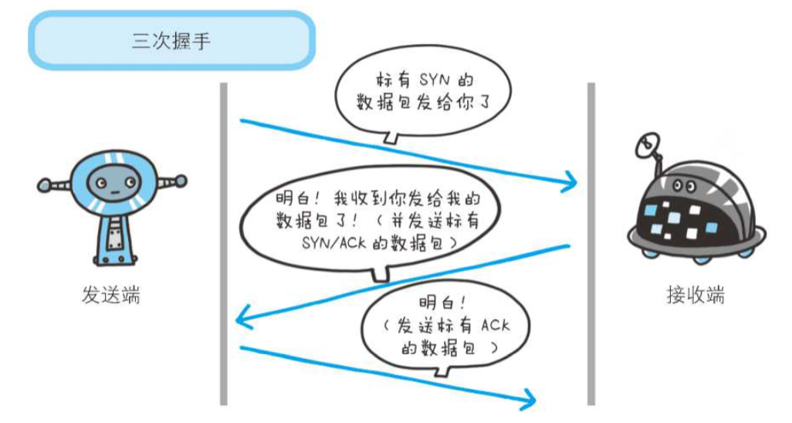

除了三次握手，`TCP`协议还有其他各种手段来保证通信的可靠性。

#### 负责域名解析的`DNS`服务

`DNS(Domain Name System)`服务是和`HTTP`协议一样位于应用层的协议。它提供域名到`IP`地址之间的解析服务。

计算机既可以被赋予`IP`地址，也可以被赋予主机名和域名。

`DNS`协议通过域名查找`IP`地址，或逆向从`IP`地址反查域名。

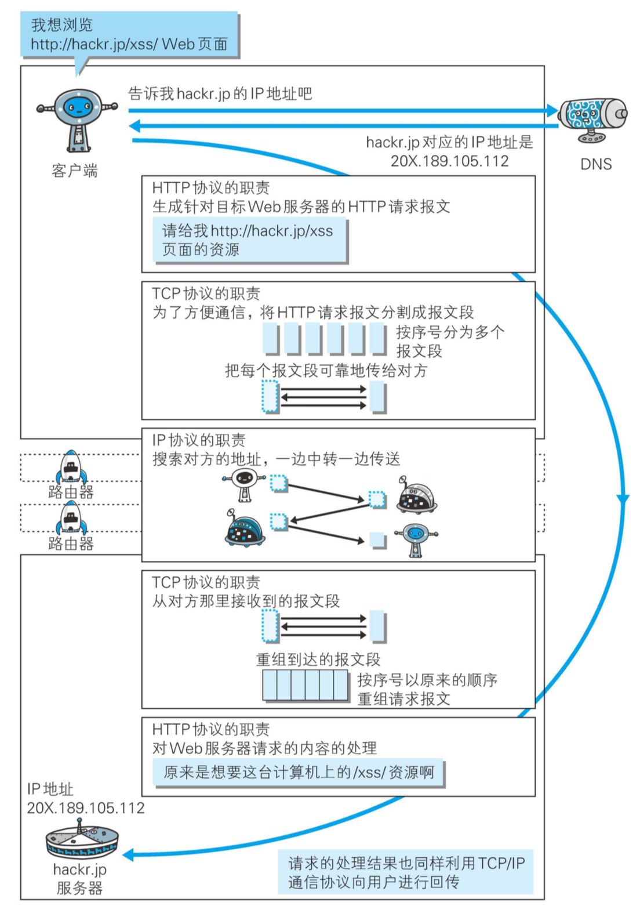

### 1.7 `URI`和`URL`

`URI(Uniform Resource Identifier)`

`URI`用字符串标识某一互联网资源，`URL`表示资源的地点(互联网上所处的位置)。`URL`是`URI`的子集。

#### `URI`格式

绝对`URI`的格式

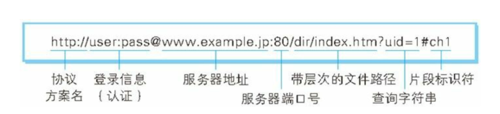

协议方案名最后要附冒号

登录信息是可选项

服务器地址可以是`google.com`这种`DNS`可解析的名称，或是`192.168.1.1`这类`IPv4`地址名，还可以是`[0:0:0:0:0:0:0:1]`这样用方括号括起来的`IPv6`地址名。

端口号是可选项，用户省略则自动使用默认端口号。

## 第2章 简单的`HTTP`协议

请求访问文本或图像等资源的一端称为客户端，而提供资源响应的一端称为服务器端。

应用`HTTP`协议时，必定是一端担任客户端角色，另一端担任服务器端角色。

`HTTP`协议规定，请求从客户端发出，服务器端响应该请求并返回。肯定是从客户端开始建立通信，服务器端在没有接收到请求之前不会发送响应。

请求报文是由请求方法、请求`URI`、协议版本、可选的请求首部字段和内容实体构成。

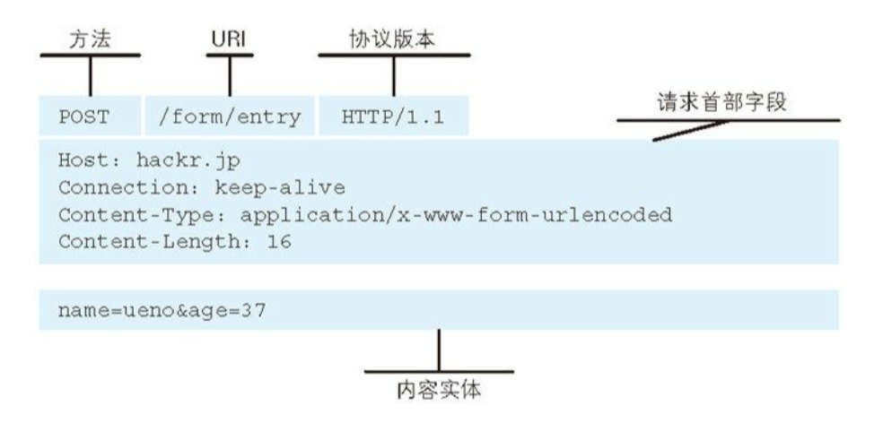

接收到请求的服务器，会将请求内容的处理结果以响应的形式返回。

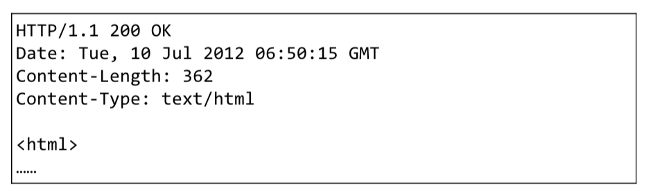

开头的`HTTP/1.1`表示服务器对应的`HTTP`版本。

`200 OK`表示请求的处理结果的状态码(`status code`)和原因短语(`reson-phrase`)。下一行显示了创建响应的日期时间，是首部字段(`header field`)内的一个属性。

之后的内容都称为资源实体的主体(`entity body`)。

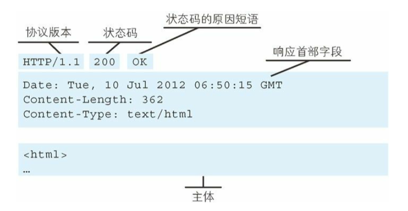

### `HTTP`是不保存状态的协议

`HTTP`是一种不保存状态，即无状态(`stateless`)协议。协议自身不对请求和响应之间的通信状态进行保存。也就是说在`HTTP`这个级别，协议对于发送过的请求或响应不做持久化处理。

`HTTP/1.1`虽然是无状态协议，但为了实现期望的保持状态功能，于是引入了`Cookie`技术。有了`Cookie`再用`HTTP`协议通信，就可以管理状态了。

### 告知服务器意图的`HTTP`方法

`GET`:获取资源

`GET`方法用来请求访问已被`URI`识别的资源。指定的资源经服务器端解析后返回响应内容。也就是说，如果请求的资源是文本，那就保持原样返回;如果是像`CGI`(Common Gateway Interface，通用网关接口)那样的程序，则返回经过执行后的输出结果。

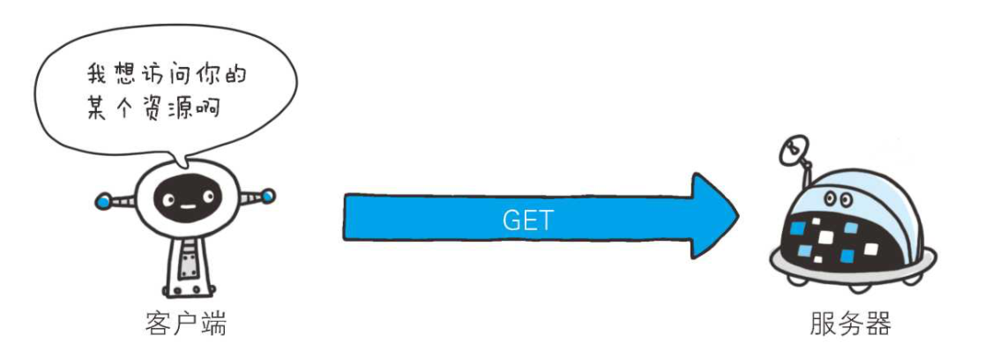

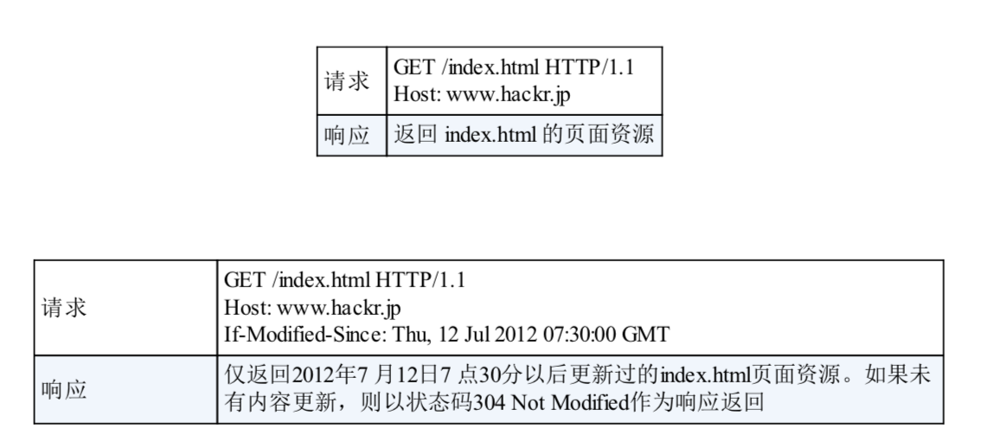

`POST`:传输实体主体

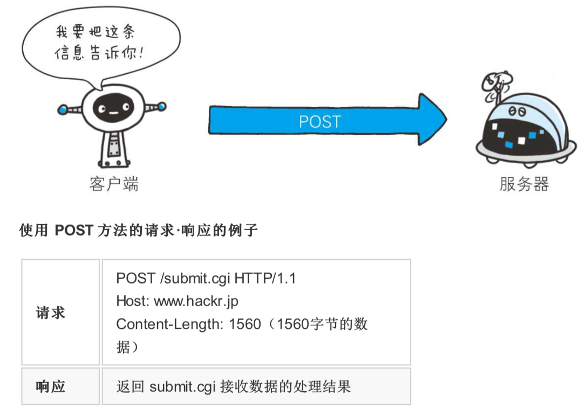

`PUT`:传输文件

鉴于`HTTP/1.1`的`PUT`方法自身不带验证机制，任何人都可以上传文件, 存在安全性问题，因此一般的`Web`网站不使用该方法。若配合`Web`应用程序的验证机制，或架构设计采用`REST`(REpresentational State Transfer，表征状态转移)标准的同类`Web`网站，就可能会开放使用`PUT`方法。

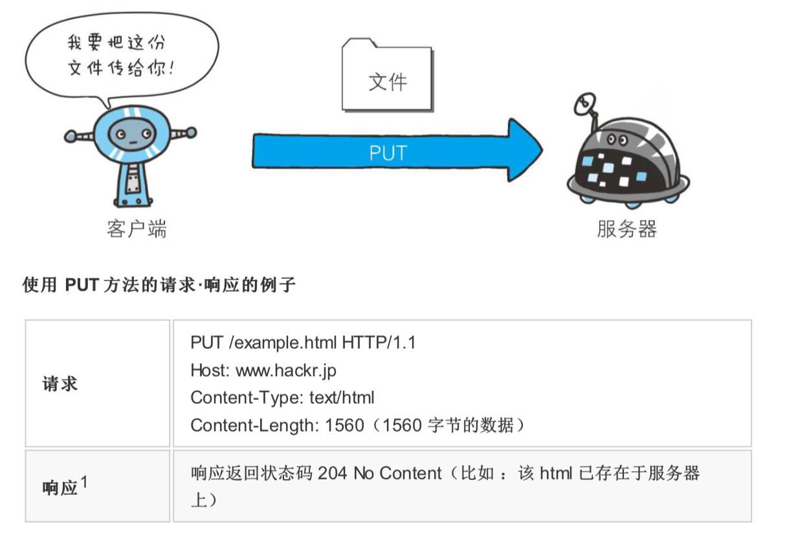

`HEAD`:获取报文首部

`HEAD`方法和`GET`方法一样，只是不返回报文主体部分。用于确认`URI`的有效性及资源更新的日期时间等。

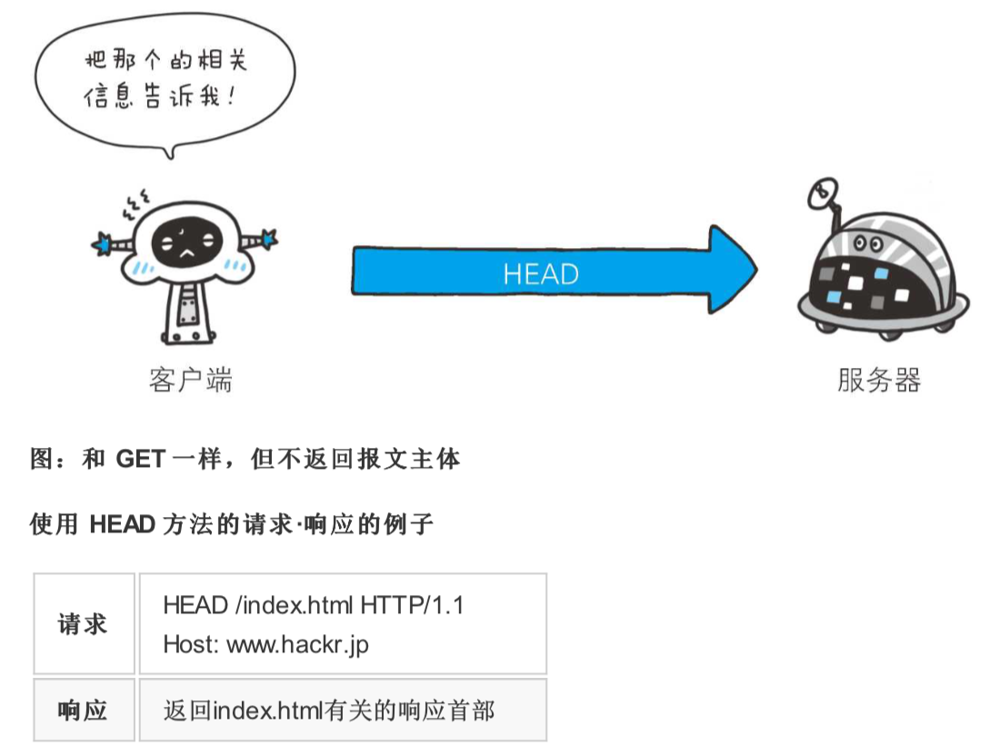

`DELETE`:删除文件

`DELETE`方法用来删除文件，是与`PUT`相反的方法。`DELETE`方法按请求`URI`删除指定的资源。但是，`HTTP/1.1`的`DELETE`方法本身和`PUT`方法一样不带验证机制，所以一般的`Web`网站也不使用`DELETE`方法。当配合`Web`应用程序的验证机制，或遵守`REST`标准时还是有可能会开放使用的。

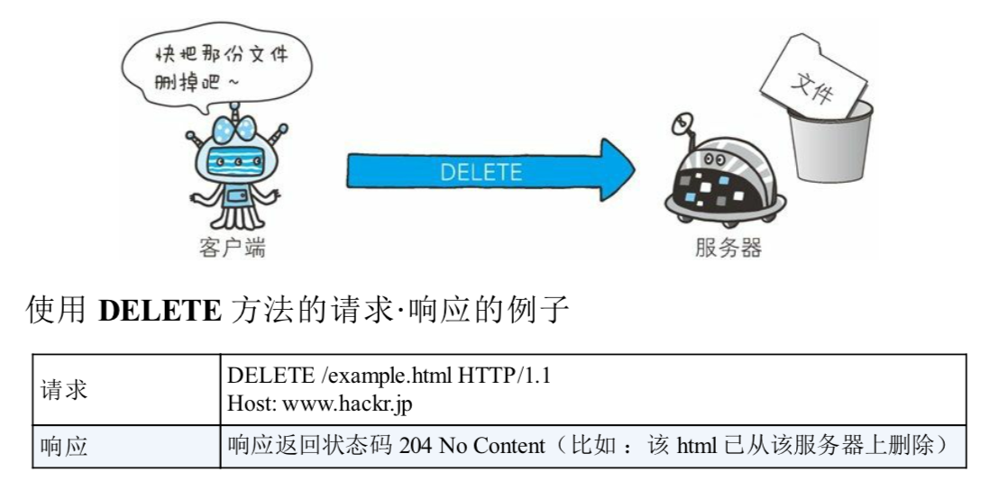

`OPTIONS`:询问支持的方法

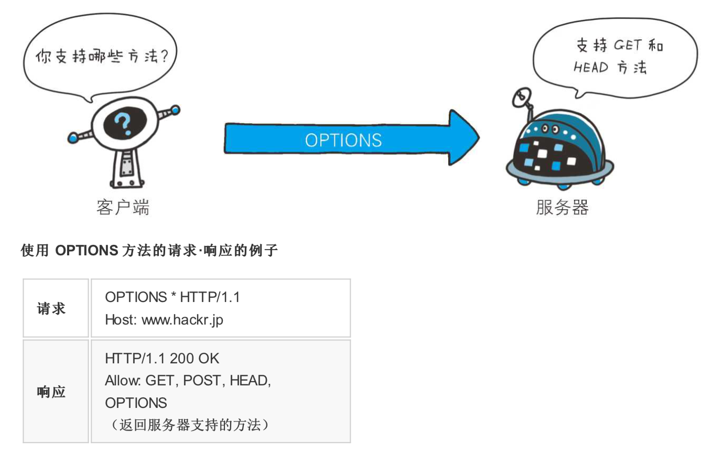

`TRACE`:追踪路径

`TRACE`方法本来就不怎么常用，再加上它容易引发`XST`(Cross-Site Tracing，跨站追踪)攻击，通常就更不会用到了。

`CONNECT`:要求用隧道协议连接代理

`CONNECT`方法要求在与代理服务器通信时建立隧道，实现用隧道协议进行`TCP`通信。主要使用`SSL`(Secure Sockets Layer，安全套接层)和`TLS`(Transport Layer Security，传输层安全)协议把通信内容加密后经网络隧道传输。

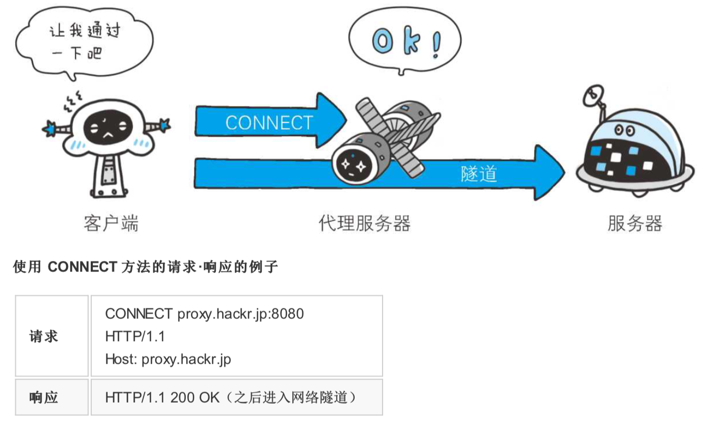

### `HTTP/1.0`和`HTTP/1.1`支持的方法

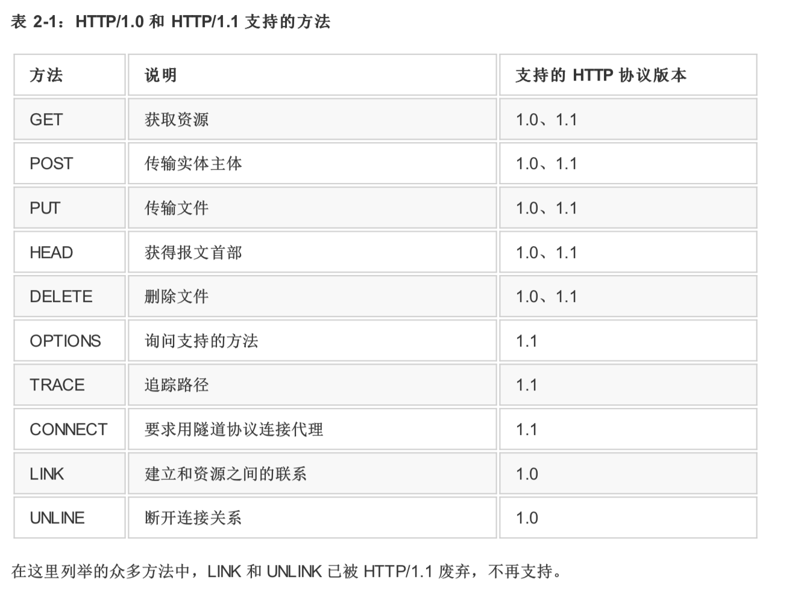

### 建立持久连接节省通信量

`HTTP`协议的初始版本中，每进行一次`HTTP`通信就要断开一次`TCP`连接。

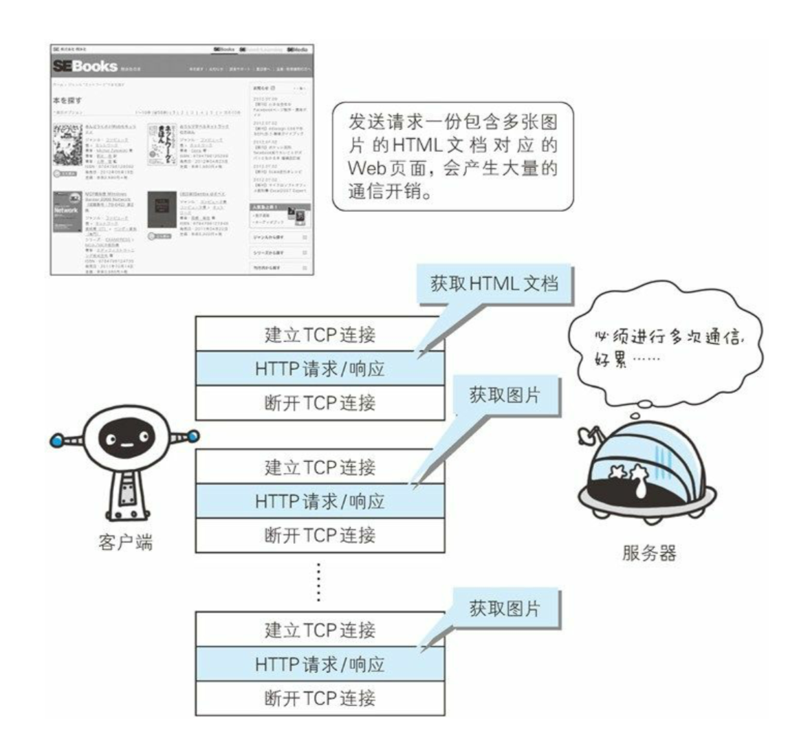

为解决上述`TCP`连接的问题，`HTTP/1.1`和一部分的`HTTP/1.0`想出了持久连接(`HTTP Persistent Connections`，也称为`HTTP keep-alive`或`HTTP connection reuse`)的方法。持久连接的特点是，只要任意一端没有明确提出断开连接，则保持`TCP`连接状态。

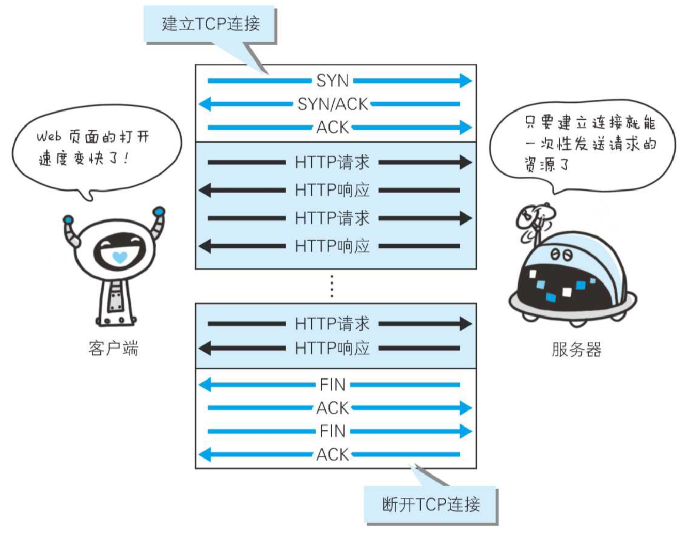

持久连接的好处在于减少了`TCP`连接的重复建立和断开所造成的额外开销，减轻了服务器端的负载。另外，减少开销的那部分时间，使`HTTP`请求和响应能够更早地结束，这样`Web`页面的显示速度也就相应提高了。

#### 管线化

持久连接使得多数请求以管线化(pipelining)方式发送成为可能。从前发送请求后需等待并收到响应，才能
发送下一个请求。管线化技术出现后，不用等待响应亦可直接发送下一个请求。

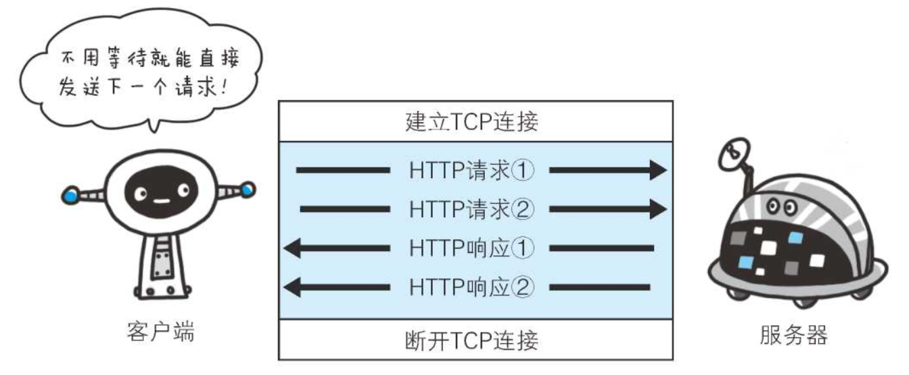

### 使用`Cookie`的状态管理

`HTTP`是无状态协议，它不对之前发生过的请求和响应的状态进行管理。也就是说，无法根据之前的状态进行本次的请求处理。

假设要求登录认证的`Web`页面本身无法进行状态的管理(不记录已登录的状态)，那么每次跳转新页面不是要再次登录，就是要在每次请求报文中附加参数来管理登录状态。

不可否认，无状态协议当然也有它的优点。由于不必保存状态，自然可减少服务器的`CPU`及内存资源的消耗。从另一侧面来说，也正是因为`HTTP`协议本身是非常简单的，所以才会被应用在各种场景里。

保留无状态协议这个特征的同时又要解决类似的矛盾问题，于是引入了`Cookie`技术。`Cookie`技术通过在请
求和响应报文中写入`Cookie`信息来控制客户端的状态。

`Cookie`会根据从服务器端发送的响应报文内的一个叫做`Set-Cookie`的首部字段信息，通知客户端保存`Cookie`。当下次客户端再往该服务器发送请求时，客户端会自动在请求报文中加入`Cookie`值后发送出去。

服务器端发现客户端发送过来的`Cookie`后，会去检查究竟是从哪一个客户端发来的连接请求，然后对比服务器上的记录，最后得到之前的状态信息。

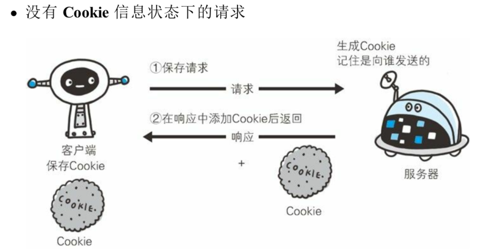

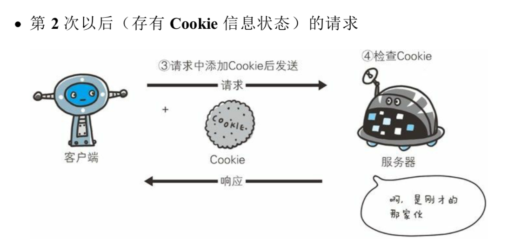

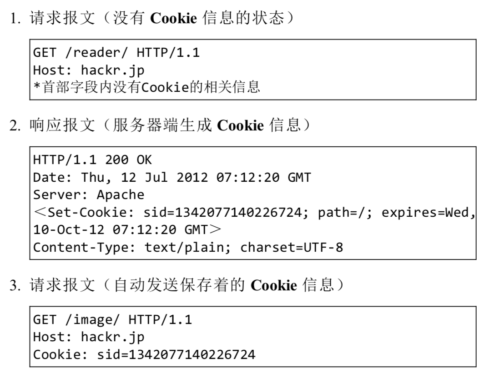

## 第3章 `HTTP`报文内的`HTTP`信息

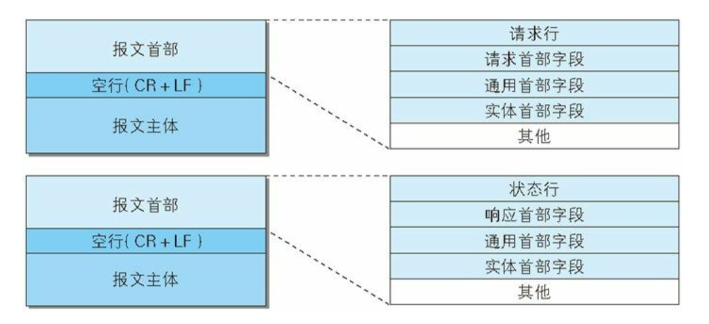

+ 报文(`message`)

是`HTTP`通信中的基本单位，由8位组字节流(octet sequence，其中octet为8个比特)组成，通过`HTTP`通信传输。

+ 实体(`entity`)

请求或响应的有效载荷数据(补充项)被传输，其内容由实体首部和实体主体组成。

内容编码指明应用在实体内容上的编码格式，并保持实体信息原样压缩。内容编码后的实体由客户端接收并负责解码。

常用的内容编码有以下几种:

+ `gzip(GNU zip)`
+ `compress(UNIX标准压缩)`
+ `default(zlib)`
+ `identity(不进行编码)`

## 第四章 返回结果的`HTTP`状态码

借助状态码用户就可以知道服务器是正常处理的请求还是出现了错误。

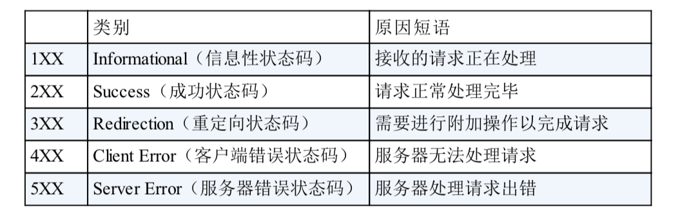

### `2XX`成功

#### `200 OK`

表示从客户端发来的请求在服务器端被正常处理了。

#### `204 No Content`

该状态码代表服务器接收的请求已成功处理，但在返回的响应报文中不含实体的主体部分。另外，也不允许返回任何实体的主体。比如，当从浏览器发出请求处理后，返回`204`响应，那么浏览器显示的页面不发生更新。

#### `206 Partial Content`

该状态码表示客户端进行了范围请求，而服务器成功执行了这部分的`GET`请求。响应报文中包含由 `Content-Range`指定范围的实体内容。

### `3XX`重定向

#### `301 Moved Permanently`

永久性重定向。该状态码表示请求的资源已被分配了新的`URI`，以后应使用资源现在所指的`URI`。也就是说，如果已经把资源对应的`URI`保存为书签了，这时应该按`Location`首部字段提示的`URI`重新保存。

#### `302 Found`

临时性重定向。该状态码表示请求的资源已被分配了新的`URI`，希望用户(本次)能使用新的`URI`访问。

#### `303 See Other`

`303`状态码和`302 Found`状态码有着相同的功能，但`303`状态码明确表示客户端应当采用`GET`方法获取资
源，这点与`302`状态码有区别。

#### `304 Not Modified`

该状态码表示客户端发送附带条件的请求时，服务器端允许请求访问资源，但未满足条件的情况。`304`状态码返回时，不包含任何响应的主体部分。`304`虽然被划分在`3XX`类别中，但是和重定向没有关系。

附带条件的请求是指采用`GET`方法的请求报文中包含`If-Match`，`If-Modified-Since`，`If-None-Match`，`If-Range`，`If- Unmodified-Since`中任一首部。

#### `307 Temporary Redirect`

临时重定向。该状态码与`302 Found`有着相同的含义。

### `4XX`客户端错误

#### `400 Bad Request`

该状态码表示请求报文中存在语法错误。当错误发生时，需修改请求的内容后再次发送请求。另外，浏览器会像 `200 OK`一样对待该状态码。

#### `401 Unauthorized`

该状态码表示发送的请求需要有通过`HTTP`认证(`BASIC` 认证、`DIGEST`认证)的认证信息。另外若之前已进行过`1`次请求，则表示用户认证失败。

#### `403 Forbidden`

该状态码表明对请求资源的访问被服务器拒绝了。服务器端没有必要给出拒绝的详细理由，但如果想作说明的话，可以在实体的主体部分对原因进行描述，这样就能让用户看到了。

#### `404 Not Found`

该状态码表明服务器上无法找到请求的资源。除此之外，也可以在服务器端拒绝请求且不想说明理由时使用。

### `5XX`服务器错误

#### `500 Internal Server Error`

该状态码表明服务器端在执行请求时发生了错误。也有可能是`Web`应用存在的`bug`或某些临时的故障。

#### `503 Service Unavailable`

该状态码表明服务器暂时处于超负载或正在进行停机维护，现在无法处理请求。如果事先得知解除以上状况需要的时间，最好写入`RetryAfter`首部字段再返回给客户端。

## 第5章 与HTTP协作的Web服务器

### 5.1 用单台虚拟主机实现多个域名

`HTTP/1.1`规范允许一台`HTTP`服务器搭建多个`Web`站点。比如，提供`Web`托管服务(`Web Hosting Service`)的供应商，可以用一台服务器为多位客户服务，也可以以每位客户持有的域名运行各自不同的网站。这是因为利用了虚拟主机(`Virtual Host`，又称虚拟服务器)的功能。

### 5.2 通信数据转发程序:代理、网关、隧道

代理

代理是一种有转发功能的应用程序，它扮演了位于服务器和客户端“中间人”的角色，接收由客户端发送的请求 并转发给服务器，同时也接收服务器返回的响应并转发给客户端。

网关

网关是转发其他服务器通信数据的服务器，接收从客户端发送来的请求时，它就像自己拥有资源的源服务器一样对请求进行处理。有时客户端可能都不会察觉，自己的通信目标是一个网关。

隧道

隧道是在相隔甚远的客户端和服务器两者之间进行中转，并保持双方通信连接的应用程序。

#### 5.2.1 代理

代理服务器的基本行为就是接收客户端发送的请求后转发给其他服务器。代理不改变请求 URI，会直接发送 给前方持有资源的目标服务器。

持有资源实体的服务器被称为源服务器。从源服务器返回的响应经过代理服务器后再传给客户端。

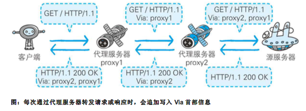

使用代理服务器的理由有:利用缓存技术减少网络带宽的流量，组织内部针对特定网站的访问控制，以获取访问日志为主要目的，等等。

代理有多种使用方法，按两种基准分类。一种是是否使用缓存，另一种是是否会修改报文。

##### 缓存代理

代理转发响应时，缓存代理(`Caching Proxy`)会预先将资源的副本(缓存)保存在代理服务器上。

当代理再次接收到对相同资源的请求时，就可以不从源服务器那里获取资源，而是将之前缓存的资源作为响应返回。

##### 透明代理

转发请求或响应时，不对报文做任何加工的代理类型被称为透明代理(`Transparent Proxy`)。反之，对报文 内容进行加工的代理被称为非透明代理。

#### 5.2.2 网关

网关的工作机制和代理十分相似。而网关能使通信线路上的服务器提供非`HTTP`协议服务。

利用网关能提高通信的安全性，因为可以在客户端与网关之间的通信线路上加密以确保连接的安全。比如，网关可以连接数据库，使用`SQL`语句查询数据。另外，在`Web`购物网站上进行信用卡结算时，网关可以和信用卡结算系统联动。

#### 5.2.3 隧道

隧道可按要求建立起一条与其他服务器的通信线路，届时使用`SSL`等加密手段进行通信。隧道的目的是确保客户端能与服务器进行安全的通信。

隧道本身不会去解析`HTTP`请求。也就是说，请求保持原样中转给之后的服务器。隧道会在通信双方断开连接时结束。

隧道本身是透明的，可以和远距离的服务器安全通信。

### 5.3 保存资源的缓存

缓存是指代理服务器或客户端本地磁盘内保存的资源副本。利用缓存可减少对源服务器的访问，因此也就节省了通信流量和通信时间。

缓存服务器是代理服务器的一种，并归类在缓存代理类型中。换句话说，当代理转发从服务器返回的响应 时，代理服务器将会保存一份资源的副本。

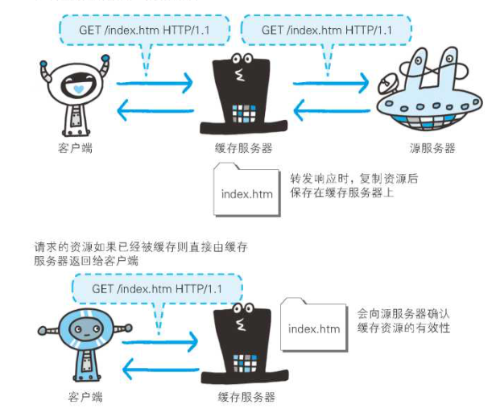

缓存服务器的优势在于利用缓存可避免多次从源服务器转发资源。因此客户端可就近从缓存服务器上获取资源，而源服务器也不必多次处理相同的请求了。

#### 5.3.1 缓存的有效期限

即使存在缓存，也会因为客户端的要求、缓存的有效期等因素，向源服务器确认资源的有效性。若判断缓存失效，缓存服务器将会再次从源服务器上获取“新”资源。

#### 5.3.2 客户端缓存

缓存不仅可以存在于缓存服务器内，还可以存在客户端浏览器中。以`Internet Explorer`程序为例，把客户端缓存称为临时网络文件(`Temporary Internet File`)。

浏览器缓存如果有效，就不必再向服务器请求相同的资源了，可以直接从本地磁盘内读取。

另外，和缓存服务器相同的一点是，当判定缓存过期后，会向源服务器确认资源的有效性。若判断浏览器缓存失效，浏览器会再次请求新资源。

### `HTTP`出现之前的协议

`FTP`(File Transfer Protocol)

传输文件时使用的协议。该协议历史久远，可追溯到 `1973`年前后，比`TCP/IP`协议族的出现还要早。虽然它在`1995`年被`HTTP`的流量(`Traffic`)超越，但时至今日，仍被广泛沿用。

`NNTP`(Network News Transfer Protocol)

用于`NetNews`电子会议室内传送消息的协议。在`1986`年前后出现，属于比较古老的一类协议。现在，利用`Web`交换信息已成主流，所以该协议已经不怎么使用了。

`Archie`

搜索`anonymous FTP`公开的文件信息的协议。`1990`年前后出现，现在已经不常使用。

`WAIS`(Wide Area Information Servers)

以关键词检索多个数据库使用的协议。`1991`年前后出现。由于现在已经被`HTTP`协议替代，也已经不怎么使用了。

`Gopher`

查找与互联网连接的计算机内信息的协议。`1991`年前后出现，由于现在已经被`HTTP`协议替代，也已 经不怎么使用了。

## 缓存

`Web`缓存是可以自动保存常见文档副本的`HTTP`设备。当`Web`请求抵达缓存时，如果本地有“已缓存的”副本，就可以从本地存储设备而不是原始服务器中提取这个文档。

使用缓存有如下优点：

+ 缓存减少了冗余的数据传输，节省了你的网络费用。
+ 缓存缓解了网络瓶颈的问题。不需要更多的带宽就能够更快地加载页面。
+ 缓存降低了对原始服务器的要求。服务器可以更快地响应，避免过载的出现。缓存降低了距离时延，因为从较远的地方加载页面会更慢一些。

瞬间拥塞(`Flash Crowds`)

距离延时，光速自身会造成显著的延迟。

### 缓存命中

+ 缓存命中(`cache hit`)
+ 缓存未命中(`cache miss`)
+ 再验证(`revalidation`)

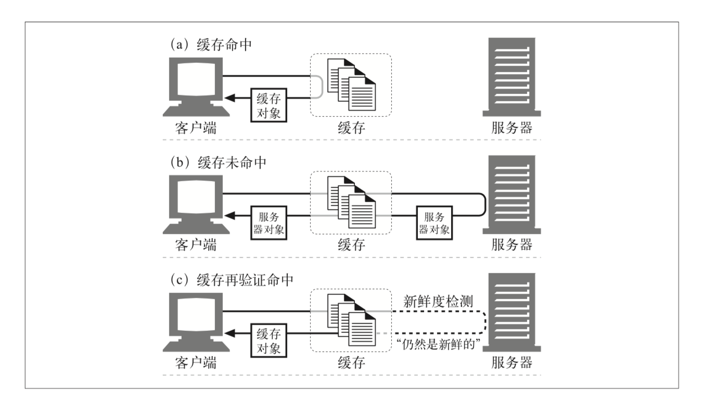

缓存对缓存的副本进行再验证时，会向原始服务器发送一个小的再验证请求。如果内容没有变化，服务器会以一个小的`304 Not Modified`进行响应。只要缓存知道副本仍然有效，就会再次将副本标识为暂时新鲜的，并将副本提供给客户端。这被称作再验证命中(`revalidate hit`)或缓慢命中(`slow hit`)。

`HTTP`提供了几个队已缓存对象再验证的工具，最常见的是`If-Modified-Since`首部。只有在本地缓存了对象，而服务器又对缓存对象作出修改的情况下，服务器才发送此对象。

1.再验证命中

如果服务器对象未被修改，服务器会向客户端发送一个小的`HTTP 304 Not Modified`响应。

2.再验证未命中

如果服务器对象与已缓存副本不同，服务器向客户端发送一条普通的、带有完整内容的`HTTP 200 OK`响应。

3.对象被删除

如果服务器对象已经被删除了，服务器就回送一个`404 Not Found`响应，缓存也会将其副本删除。

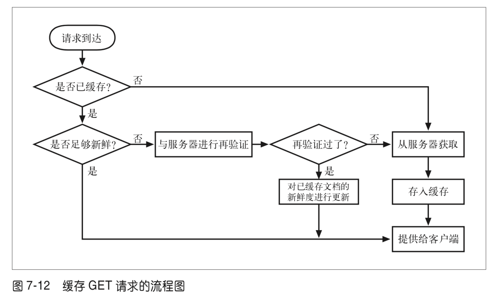

### 保持新鲜的副本

通过特殊的`HTTP Cache-Control`首部和`Expires`首部，`HTTP`让原始服务器向每个文档附加了一个"过期日期"，这些首部说明了在多长时间内可以将这些内容视为新鲜的。

#### 文档过期

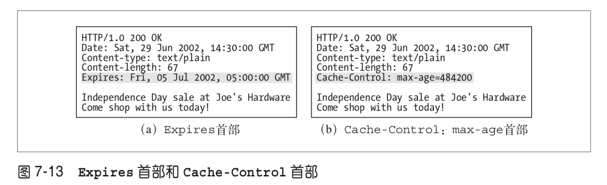

在缓存文档过期之前，缓存可以以任意频率使用这些副本，而无需与服务器联系——当然，除非客户端请求中包含有阻止提供已缓存或未验证资源的首部。但一旦已缓存文档过期，缓存就必须与服务器进行核对，询问文档是否被修改过，如果被修改过，就要获取一份新鲜(带有新的过期日期)的副本。

服务器用`HTTP/1.0+`的`Expires`首部或`HTTP/1.1`的`Cache-Control`:`max-age`响应首部来指定过期日期，同时还会带有响应主体。

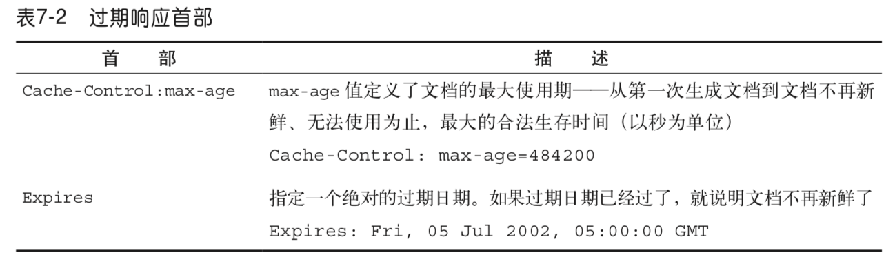

#### 服务器再验证(强制缓存)

缓存文档过期意味着到了进行核对的时间了，这种情况被称为"服务器再验证"，说明缓存需要询问原始服务器文档是否发生了变化。

+ 如果再验证显示内容发生了变化，缓存会获取一份新的文档副本，并将其存储在旧文档的位置上，然后将文档发送给客户端。
+ 如果再验证显示内容没有发生变化，缓存只需要获取新的首部，包括一个新的过期日期，并对缓存中的首部进行更新就行了。

#### 条件方法再验证(协商缓存)

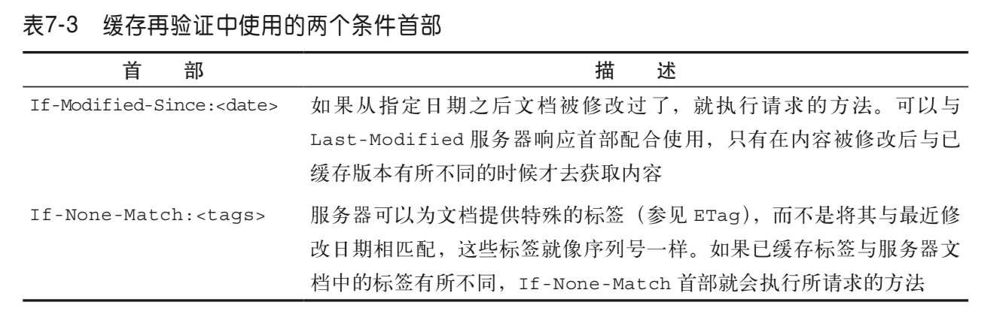

##### `If-Modified-Since`再验证

`If-Modified-Since`再验证请求通常被称为`IMS`请求。

+ 如果自指定日期后，文档被修改了，`If-Modified-Since`条件就为真，通常`GET`就会成功执行。携带新首部的新文档会被返回给缓存，新首部除了其他信息之外，还包含了一个新的过期日期。
+ 如果自指定日期后，文档没被修改过，条件就为假，会向客户端返回一个小的`304 Not Modified`响应报文，为了提高有效性，不会返回文档的主体。这些首部是放在响应中返回的，但只会返回那些需要在源端更新的首部。比如，`Content-Type`首部通常不会被修改，所以通常不需要发送。一般会发送一个新的过期日期。

`If-Modified-Since`首部可以与`Last-Modified`服务器响应首部配合工作。原始服务器会将最后的修改日期附加到所提供的文档上去。

##### `If-None-Match`实体标签再验证

有些情况下仅使用最后修改日期进行再验证是不够的。

+ 有些文档可能会被周期性地重写(比如，从一个后台进程中写入)，但实际包含的数据常常是一样的。尽管内容没有变化，但修改日期会发生变化。
+ 有些文档可能被修改了，但所做修改并不重要，不需要让世界范围内的缓存都重装数据(比如对拼写或注释的修改)。
+ 有些服务器无法准确地判定其页面的最后修改日期。
+ 有些服务器提供的文档会在亚秒间隙发生变化(比如，实时监视器)，对这些服务器来说，以一秒为粒度的修改日期可能就不够用了。

`HTTP`允许用户对被称为实体标签(`Etag`)的"版本标识符"进行比较。

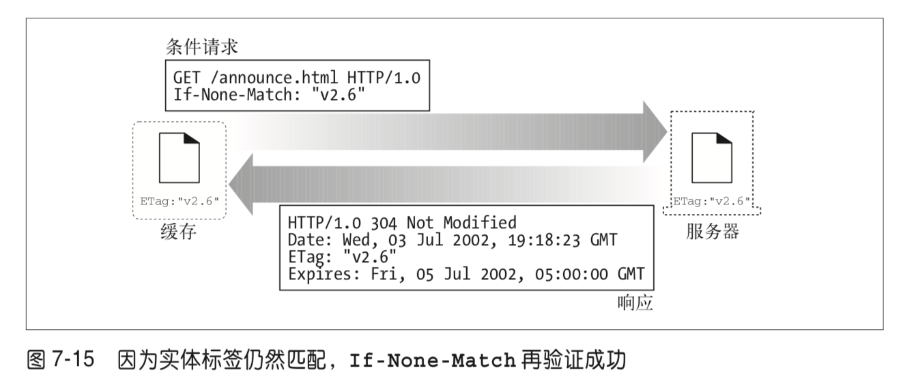

#### 客户端对新鲜度的控制

客户端通过`Cache-Control`请求首部来强化或放松对过期时间的限制。