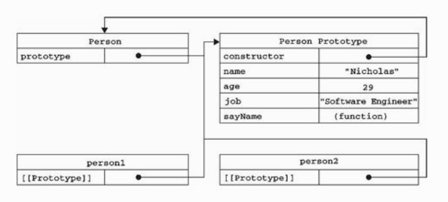
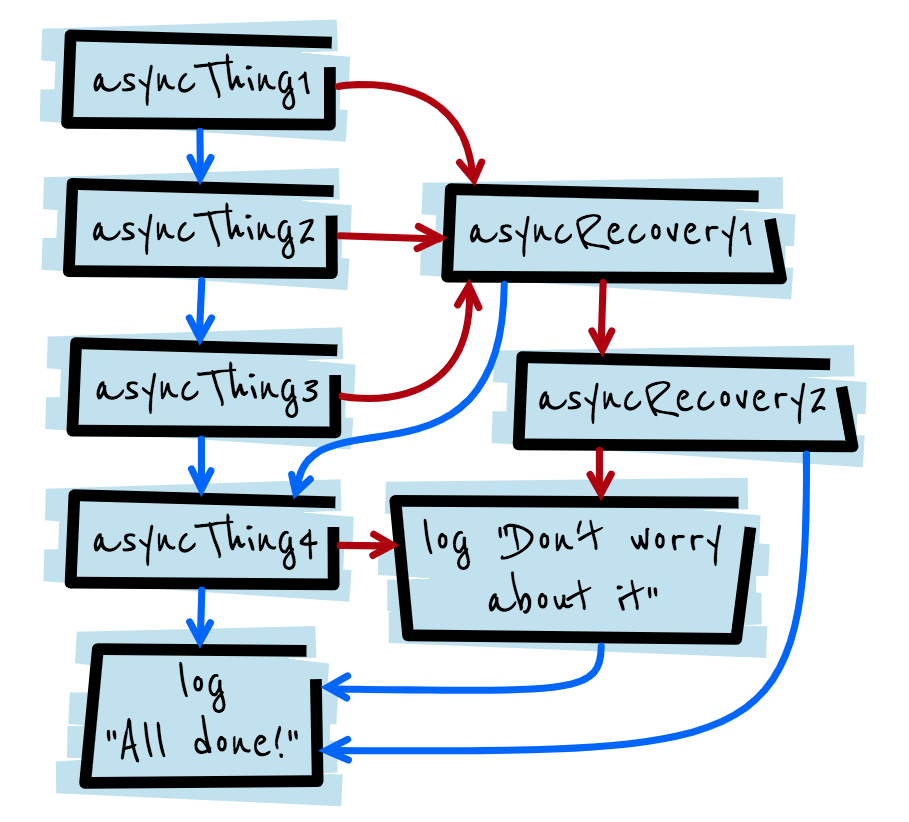
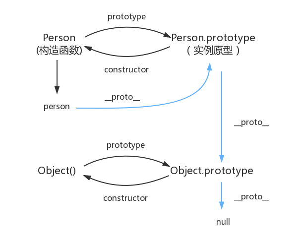

# 不只是 JS 高级程序设计

## Chap1.JavaScript 简介

JS 诞生-->浏览器表单客户端验证

完整的 Javascript 实现由以下三个部分组成

1. 核心 ECMAScript
1. DOM 提供访问和操作网页内容的方法和接口
1. BOM 提供与浏览器交互的方法和接口

web 浏览器只是 ECMAScript 的宿主环境之一,Node 是服务器端的 JavaScript 平台

## Chap2.在 HTML 中使用 JavaScript

### 浏览器加载

HTML 网页中,浏览器通过`<script>`标签加载 JavaScript 脚本。

由于脚本的默认语言是 JavaScript,`type="application/javascript"`可以省略。

### 延迟脚本

> HTML4.01 为`<script>`标签定义了`defer`属性。这个属性的用途是表明脚本在执行时不会影响页面的构造。脚本会被延迟到整个页面都解析完毕后再运行。在`<script>`元素中设置`defer`属性,相当于告诉浏览器立即下载,但延迟执行。

```html
<script type="text/javascript" defer="defer" src="example1.js"></script>
<script type="text/javascript" defer="defer" src="example2.js"></script>
```

### 异步脚本

> HTML5 为`<script>`元素定义了`async`属性。标记为`async`的脚本并不保证按照指定的先后顺序执行。

```html
<script type="text/javascript" async src="example1.js"></script>
<script type="text/javascript" async src="example2.js"></script>
```

### `defer`与`async`差别

`defer`与`async`的区别是：`defer`要等到整个页面在内存中正常渲染结束（`DOM`结构完全生成,以及其他脚本执行完成）,才会执行；`async`一旦下载完,渲染引擎就会中断渲染,执行这个脚本以后,再继续渲染。一句话,`defer`是“渲染完再执行”,`async`是“下载完就执行”。另外,如果有多个`defer`脚本,会按照它们在页面出现的顺序加载,而多个`async`脚本是不能保证加载顺序的。

## Chap3.基本概念

ECMAScript 中的一切（变量、函数名和操作符）都区分大小写

标识符即变量、函数、属性的名字,采用驼峰大小写格式

ECMAscript 的变量是松散类型的,可以用来保存任何值,未初始化的变量默认值为 undefined

可以使用一条语句定义多个变量

```javascript
var message = "hi",
  found = false,
  age = 29;
```

### 数据类型

> ECMAScript 中有 5 中简单数据类型（也称为基本数据类型）:Undefined、Null、Boolean、Number 和 String。还有一种复杂数据类型 Object,Object 本质上是由一组无序名值对（也成键值对或属性值对）组成

#### typeof 操作符

typeof 操作符可能返回下列字符串，要注意函数和 null 的返回，还有 ES6 中的 symbol

- undefined
- boolean
- string
- number
- object
- function
- symbol

```javascript
var message = "some string";
alert(typeof message); //"string"
alert(typeof message); //"string"
alert(typeof 95); //"number"
```

```javascript
typeof NaN; // "number"
typeof null; // "object"
```

null 会被认为是一个空的对象引用

#### Boolean

Boolean 类型的字面值 true 和 false 是区分大小写的,True 和 False 都不是 Boolean 值,只是标识符

```javascript
var message = "Hello World!";
var messageAsBoolean = Boolean(message);
```

| 数据类型  | 转换为 true 的值           | 转换为 false 的值 |
| --------- | -------------------------- | ----------------- |
| Boolean   | true                       | false             |
| String    | 任何非空字符串             | ""(空字符串)      |
| Number    | 任何非零数字值(包括无穷大) | 0 和 NaN          |
| Object    | 任何对象                   | null              |
| Undefined | n/a(not applicate)         | undefined         |

这些转换规则对理解流程控制语句自动执行相应的 Boolean 转换非常重要

```javascript
var message = "hehe";
if (message) {
  alert("amazing");
}
```

### Number 类型

支持 8 进制和 16 进制

```javascript
var octalNum1 = 070; //八进制的56
var octalNum2 = 079; //无效的八进制数---解析为79
var octalNum3 = 08; //无效的八进制数---解析为8（忽略前导的0）
var hexNum1 = 0xa; //十六进制的10
var hexNum2 = 0x1f; //十六进制的31
```

浮点数的运算精度远远不如整数,不要测试浮点数的值

如果某次计算的值超过了 JavaScript 数值范围的值,那么这个数值将会被自动转换成特殊的 Infinity 值,如果是负数则会被转换成-Infinity

```javascript
var result = Number.MAX_VALUE + Number.MAX_VALUE;
alert(isFinite(result)); //false
```

#### NaN

NaN(Not a Number)

> 其他编程语言中,任何数值除以非数值都会导致错误,从而停止代码执行。但在 ECMAScript 中,任何数值除以非数值会返回 NaN,因此不会影响其他代码的执行。

NaN 有两个特点

1. 任何涉及 NaN 的操作都会返回 NaN
1. NaN 与任何值都不相等,包括 NaN 本身

isNaN()函数判断传入参数是否“不是数值”

利用`NaN`与自身不相等,严格判断`NaN`的方法

```javascript
function myIsNaN(value) {
  return value !== value;
}
```

#### 数值转换

Number(), parseInt(), parseFloat()这个三个函数可以把非数值转换为数值

Number()可以适用于任何数据类型,parseInt()和 parseFloat()只适用于字符串

Number()函数的转换规则：

- 如果是`Boolean`值,`true`和`false`将分别被转换为`1`和`0`
- 如果是数字值,只是简单的传入和返回
- 如果是`null`,返回`0`
- 如果是`undefined`,返回`NaN`
- 如果是字符串,遵循下列规则

  - 如果字符串只中包含数字(包括前面带正号或负号的情况),则将其转为十进制数值,即`"1"`会变成`1`,`"123"`会变成`123`,而`"011"`会变成`11`(前导的零被忽略了)
  - 如果字符串包含有效的浮点格式,如`"1.1"`,则将其转换为对应的浮点值数(同样忽略前导的零)
  - 如果字符串中包含有效的十六进制格式,例如`"0xf"`,则将其转换为相同大小的十进制整数值
  - 如果字符串是空的(不包含任何字符),则将其转换为`0`
  - 如果字符串中包含除上述格式之外的字符,则将其转化为`NaN`

- 如果是对象,则调用对象的`valueOf()`方法,然后依照前面的规则转换返回的值。如果转换的结果是`NaN`,则调用对象的`toString()`方法,然后再次依照前面的规则转换返回的字符串值。

parseInt()指定基数会影响到转换的结果,为避免错误的解析,最好在什么情况下都明确指定基数

```javascript
var num1 = parseInt("10", 2); //2 （按二进制解析）
var num1 = parseInt("10", 8); //8 （按八进制解析）
var num1 = parseInt("10", 10); //10 （按十进制解析）
var num1 = parseInt("10", 16); //16 （按十六进制解析）
```

### String 类型

EcmaScript 中单引号双引号表示的字符串完全相同

> EcmaScript 中的字符串是不可变的,字符串一旦创建,它们的值就不能改变,要改变某个变量保存的字符串,首先要销毁原来的字符串,然后再用另一个包含新值得字符串填充该变量。

转换为字符串有`toString()`方法

`Number, Boolean, Object , String`都有`toString()`方法,`Null`和`Undefined`没有

调用数值的`toString()`方法时可以传递一个参数:输出数值的基数,默认为 10 进制

```javascript
var num = 10;
alert(num.toString()); // '10'
alert(num.toString(2)); // '1010'
alert(num.toString(8)); // '12'
alert(num.toString(10)); // '10'
alert(num.toString(16)); // 'a'
```

`String()`函数适用于`null`和`undefined`,返回`'null'`和`'undefined'`,如果值有`toString()`方法,则调用`toString()`方法

### Object 类型

Object 的每个实例都具有下列属性和方法

1. `constructor`:保存着用于创建当前对象的函数,如果是`var o = new Object();`,那么构造函数`constructor`就是`Object()`。
1. `hasOwnProperty(propertyName)`:用于检查给定的属性在当前对象实例中（而不是在实例的原型中）是否存在。其中`propertyName`必须以字符串的形式指定。
1. `isPrototypeOf(object)`:用于检查传入的对象是否是当前对象的原型。
1. `propertyIsEnumerable(propertyName)`:用于检查给定的属性是否能够使用 for-in 语句来枚举,同样传入的`propertyName`必须以字符串的形式指定。
1. `toLocaleString()`:返回对象的字符串表示,该字符串与执行环境的地区对应。
1. `toString()`:返回对象的字符串表示。
1. `valueOf()`:返回对象的字符串、数值或布尔值表示。

### 操作符

> EcmaScript 操作符的与众不同之处出在于,它们能够适用于很多值,应用于对象时,相应的操作符通常会调用对象的 valueOf()和 toString()方法,以便取得可以操作的值。

#### ++ --操作符

执行前置递增和递减操作时,变量的值都是在语句被求值以前改变的

```javascript
var age = 29;
var anotherAge = --age + 2;

alert(age); // 输出28
alert(anotherAge); //输出30
```

后置递增递减则是在语句被求值以后执行

```javascript
var num1 = 2;
var num2 = 20;
var num3 = num1-- + num2; // 等于22
var num4 = num1 + num2; // 等于21
```

#### 一元加和减操作符

> 对非数值应用一元加号操作符时,该操作会像 Number()转型函数一样对这个值执行转换。`++`,`--`,操作也是如此

```javascript
var s1 = "01";
var a = "01";
var s2 = "1.1";
var s3 = "z";
var b = false;
var f = 1.1;
var o = {
  valueOf: function() {
    return -1;
  }
};

s1 = +s1; // 值变成数值1
a++; // 值变成2
s2 = +s2; // 值变成数值1.1
s3 = +s3; // 值变成NaN
b = +b; // 值变成数值0
f = +f; // 值未变,仍然是1.1
o = +o; // 值变成数值-1
```

#### 位操作符

> 位操作符用在最基本的层次上,即按内存中表示数值的位来操作数值。ECMAScript 中的所有数值都以 IEEE-754 64 位格式存储,但位操作符并不直接操作 64 位的值。而是先将 64 位的值转换成 32 位的整数,然后执行操作,最后再将结果转换回 64 位。

1. 按位非（NOT）`~`
1. 按位与 (AND) `&`
1. 按位或 (OR) `|`
1. 按位异或 (XOR) `^` 两个数值对应位上只有一个 1 时才返回 1
1. 左移 `<<` 左移不会影响符号位
1. 有符号的右移 `>>`
1. 无符号右移 `>>>`

#### 逻辑非

> `!`可以应用与 ECMAScript 中的任何值。无论这个值是什么数据类型,这个操作符都会返回一个布尔值。逻辑操作符首先会将它的操作数转换为一个布尔值,然后再对其求反。

`!!`同时使用两个逻辑非操作符,实际上会模拟 Boolean()转型函数的行为。

```javascript
alert(!!"blue"); //true
alert(!!0); //false
alert(!!NaN); //false
alert(!!""); //false
alert(!!12345); //true
```

#### 逻辑与`&&`逻辑或`||`

牢记是短路操作符！！！,如果第一个操作数的求值结果能够决定结果就不会对第二个操作数求值。

逻辑与或可以应用于任何类型的操作数,不仅仅是布尔值。在有一个操作数不是布尔值的情况下,逻辑与或操作不一定返回布尔值。

```javascript
alert(0 || 1); //1
alert("a" || 1); //'a'
alert("" || 0); //0
```

1、只要`||`前面为 false,不管`||`后面是 true 还是 false,都返回`||`后面的值。
2、只要`||`前面为 true,不管`||`后面是 true 还是 false,都返回`||`前面的值。

```javascript
alert("" && 1); //''
alert("a" && 1); //1
alert(0 && ""); //0
```

1、只要`&&`前面是 false,无论`&&`后面是 true 还是 false,结果都将返`&&`前面的值;
2、只要`&&`前面是 true,无论`&&`后面是 true 还是 false,结果都将返`&&`后面的值;

#### 简单应用

假设需求：

- 成长速度为 5 显示 1 个箭头；
- 成长速度为 10 显示 2 个箭头；
- 成长速度为 12 显示 3 个箭头；
- 成长速度为 15 显示 4 个箭头；
- 其他都显示都显示 0 个箭头。

`if-else`

```javascript
var add_level = 0;
if (add_step == 5) {
  add_level = 1;
} else if (add_step == 10) {
  add_level = 2;
} else if (add_step == 12) {
  add_level = 3;
} else if (add_step == 15) {
  add_level = 4;
} else {
  add_level = 0;
}
```

`switch-case`

```javascript
var add_level = 0;
switch (add_step) {
  case 5:
    add_level = 1;
    break;
  case 10:
    add_level = 2;
    break;
  case 12:
    add_level = 3;
    break;
  case 15:
    add_level = 4;
    break;
  default:
    add_level = 0;
    break;
}
```

```javascript
var add_level =
  (add_step == 5 && 1) ||
  (add_step == 10 && 2) ||
  (add_step == 12 && 3) ||
  (add_step == 15 && 4) ||
  0;
```

```javascript
var add_level = { "5": 1, "10": 2, "12": 3, "15": 4 }[add_step] || 0;
```

高级需求：

- 成长速度为>12 显示 4 个箭头；
- 成长速度为>10 显示 3 个箭头；
- 成长速度为>5 显示 2 个箭头；
- 成长速度为>0 显示 1 个箭头；
- 成长速度为<=0 显示 0 个箭头。

```javascript
var add_level =
  (add_step > 12 && 4) ||
  (add_step > 10 && 3) ||
  (add_step > 5 && 2) ||
  (add_step > 0 && 1) ||
  0;
```

#### 加性操作符

- 如果两个操作数都是字符串,则将第二个操作数与第一个操作数拼接起来；
- 如果只有一个操作数是字符串,则将另一个操作数转换为字符串,然后再将两个字符串拼接起来
- 如果有一个操作数是对象、数值或布尔值,调用它们的 toString()方法取得相应的字符串值。

```javascript
var num1 = 5;
var num2 = 10;
var message = "The  sum of 5 and 10 is " + num1 + num2;
alert(message); // "The sum of 5 and 10 is 510"
```

#### 减法

- 如果有一个操作数是字符串、布尔值、null 或 undefined,则先在后台调用 Number()函数将其转换为数值,然后再执行减法计算。如果转换的结果是 NaN,则减法的结果就是 NaN;
- 如果有一个操作数是对象,调用对象的 valueOf()方法取得表示该对象的数值。如果对象没有 valueOf()方法,则调用其 toString()方法并将得到的字符串转换为数值。

```javascript
var result1 = 5 - true; // 4
var result2 = NaN - 1; // NaN
var result3 = 5 - 3; // 2
var result4 = 5 - ""; // 5
var result5 = 5 - "2"; // 3
var result6 = 5 - null; // 5
```

#### 关系操作符

#### > < <= >=操作符

- 如果两个操作数都是数值,则执行数值比较
- 如果两个操作数都是字符串,则比较两个字符串对应的编码值
- 如果一个操作数是数值,则将另一个操作数转换为一个数值,然后进行数值比较
- 如果一个操作数是对象,则调用这个对象的`valueOf()`,用得到的结果按照前面的规则进行比较,如果对象没有`valueOf()`方法,则调用`toString()`方法,并用得到的结果根据前面的规则进行比较
- 如果一个操作数是布尔值,则先将其转化为数值,然后再执行比较

#### 相等操作符

> ECMAScript 提供了两组操作符：相等和不相等---先转换再比较,全等和不全等---仅比较而不转换。

##### `==`与`!=`

- 如果一个操作数是对象,另一个操作数不是,则调用对象的 valueOf()方法,用得到的基本类型值按照前面的规则进行比较;
- null 和 undefined 是相等的;
- 如果两个操作数都是对象,则比较他们是不是同一个对象。如果两个操作数都指向同一个对象则相等操作符返回 true；否则,返回 false;
- NaN 与任何值都不相等,包括 NaN。

| 类型(x) | 类型(y)   | `==`结果         |
| ------- | --------- | ---------------- |
| null    | undefined | true             |
| 数字    | 字符串    | x == toNumber(y) |
| 布尔值  | 任何类型  | toNumber(x) == y |

```js
console.log("hehe" == true);
```

1. 首先,布尔值会被转成数字
1. 字符串转换成数字,因为包含字母,所以`NaN`,于是结果是`false`

##### `===`

全等要求数据类型也相等

#### 条件操作符（三元运算符）

`var max = (num1 > num2) ? num1 : num2;`

**总结：比较规则有很多,关键是操作符期望是什么操作数,往期望操作符的类型去转换,比如期望得到数值,object 就先调用`valueOf()`方法,期望得到字符串,object 就先调用`toString()`方法**

### 语句

语句通常按照从上到下的顺序被执行。JavaScript 可以通过条件语句(`if`和`switch`)、循环语句(`while`、`for`、和`do`)、强制跳转语句(`break`、`return`和`throw`)和函数调用来改变执行序列。

`return`语句会导致从函数中提前返回。它可以指定要被返回的值。如果没有指定返回表达式,那么返回值是`undefined`。

#### `if`语句

ECMAScript 会自动调用`Boolean()`转换函数将这个表达式的结果转换为一个布尔值。

#### `for-in`语句

```javascript
for (var propName in window) {
  document.write(propName);
}
```

> ECMAScript 对象的属性没有顺序,因此通过`for-in`循环输出的属性名的顺序是不可预测的。

#### `label`语句与`break`,`continue`

`label`语句在代码中添加标签,可以在将来由 break 或 continue 语句引用。

```javascript
var num = 0;

outermost: for (var i = 0; i < 10; i++) {
  for (var j = 0; j < 10; j++) {
    if (i == 5 && j == 5) {
      break outermost;
    }
    num++;
  }
}

alert(num); //55
```

#### `switch`语句

```javascript
switch (i) {
  case 25:
    alert("25");
    break;
  case 35:
    alert("35");
    break;
  case 45:
    alert("45");
    break;
  default:
    alert("Other");
}
```

可以在 switch 语句中使用任何数据类型

```javascript
switch ("hello world") {
  case "hello " + "world":
    alert("Greeting was found.");
  default:
    alert("Unexpected message was found");
}
```

#### 注释

JavaScript 提供两种注释形式,一种是用`/* */`包围的块注释,另一种是以`//`为开头的行注释

```js
/*
 var rm_a = /a*./.match(s);
*/
```

上面的注释导致了一个语法错误,JS 语言精粹中提倡使用`//`注释

### 函数

> 函数会在执行完`return`语句之后停止并立即退出。因此,`return`之后的任何代码永远不会执行。

ECMAScript 中的参数在内部是用一个数组来表示的,函数接收到的始终都是这个数组,而不关心数组中包含哪些参数。`arguments`类数组,可以通过索引访问传入参数的值。

引用自语言精粹

> 因为语言的一个设计错误,`arguments`并不是一个真正的数组。只是一个类似数组(array-lick)的对象,`arguments`拥有一个`length`属性。

> `arguments`的值永远与对应命名参数的值保持同步

```javascript
function doAdd(uum1, num2) {
  arguments[1] = 10;
  alert(arguments[0] + num2);
}
```

每次执行`doAdd`都会重写第二个参数,将第二个参数的值修改为 10.因为`arguments`对象中的值会自动反映到对应的命名参数,所以修改`arguments[1]`,也就修改了`num2`,结果它们的值都会变成 10。不过,这并不是说读取这两个值会访问相同的内存空间；它们的内存空间是独立的,但是它们的值会同步。另外还要记住,如果只传入了一个参数,那么`arguments[1]`设置的值不会反映到命名参数中。这是因为`arguments`对象的长度是由传入的参数个数决定的,不是由定义函数时的命名参数的个数决定的。没有被传递值的命名参数为 undefined。

> ECMAScript 不能实现传统意义上的重载。

## chap4.变量、作用域和内存问题

### 基本类型和引用类型的值

`Undefined`,`Null`,`Boolean`, `Number`,`String`五种基本类型的数据按值访问,基本类型值在内存中占据固定大小的空间,保存在栈内存中。`Object`引用类型按引用访问,引用类型的值是对象,保存在堆内存中。

```javascript
var num1 = 5;
var num2 = num1;
```

num1 与 num2 中的值是完全独立的,复制完成之后这两个变量可以参与任何操作而不会相互影响。

当从一个变量向另一个变量复制引用类型的值时,这个值实际上是指针,这个指针指向堆内存中的一个对象,复制完成之后,两个变量实际上将引用同一个对象。

#### 传递参数

> ECMAScript 中所有函数的参数都是按值传递的(也就是说通过拷贝传递)。

基本类型值的传递如同基本类型变量的复制一样。在向参数传递引用类型的值时,会把这个值在内存中的地址复制给一个局部变量,因此这个局部变量的变化会反映在函数的外部。

```javascript
function setName(obj) {
  obj.name = "Nicholas";
  obj = new Object();
  obj.name = "Greg";
}

var person = new Object();
setName(person);
alert(person.name); //'Nicholas'
```

引用类型参数传递也是按值传递,传入地址,person 与 obj 共同管理一个对象,接着给这个对象 name 属性赋值,后来的操作是让 obj 去管理另一个对象,即改变 obj 的引用,person 的引用不会改变。实际上 obj 引用的是一个局部对象,这个局部对象在函数执行完毕之后立即被销毁。

### 执行环境及作用域

> 执行环境（execution context）定义了变量或函数有权访问的其他数据。每个执行环境都有一个与之关联的变量对象（variable object）,环境中定义的所有变量和函数都保存在这个对象中。虽然我们编写的代码无法访问这个对象,但解析器在处理数据时会在后台使用它。

全局执行环境是最外围的一个执行环境。根据 ECMAScript 实现的宿主环境不同,表示执行环境的东西也不同。Web 浏览器中,全局执行环境被认为是 window 对象,因此所有的全局变量和函数都是作为 window 对象的属性和方法创建的。某个执行环境中的所有代码执行完毕后,该环境被销毁,保存在其中的所有变量和函数定义也随之销毁（全局执行环境知道应用程序退出---例如关闭浏览器或网页时才会被销毁）。

每个函数都有自己的执行环境,当执行流进入一个函数时,函数的环境就会被推入一个环境栈中,函数执行后,栈将其环境弹出,把控制权返回给之前的执行环境。ECMAScript 程序中的执行流正是由这个方便的机制控制着。

当代码在一个环境中执行时,会创建变量对象的一个作用域链（scope chain）。作用域链的用途,是保证对执行环境有权访问的所有变量和函数的有序访问。作用域链的前端,始终都是当前执行的代码所在的变量对象。如果这个环境是函数,则将其活动对象（activation object）作为变量对象。活动对象在最开始只包含一个变量,即`arguments`对象（这个对象在全局环境中是不存在的）。

内部环境可以通过作用域链访问所有的外部环境,但外部环境不能访问内部环境中的任何变量和函数。

- 执行环境有全局执行环境（也称为全局环境）和函数执行环境之分；
- 每次进入一个新执行环境,都会创建一个用于搜索变量和函数的作用域链。

#### 延长作用域链

`try-catch`语句的`catch`块

#### 没有块级作用域

```javascript
if (true) {
  var color = "blue";
}

alert(color); //"blue"
```

在 C、C++、Java 中,color 会在`if`语句执行完毕后被销毁,在 JavaScript 中,`if`语句中的变量声明会将变量添加到当前的执行环境（这里是全局环境）中。使用 for 语句时由其牢记这一差异,例如：

```javascript
for (var i = 0; i < 10; i++) {
  doSomething(i);
}

alert(i); //10
```

> 使用 var 声明的变量会自动被添加到最接近的环境中。在函数内部,最接近的环境就是函数的局部环境；如果初始化变量时没有使用 var 声明,该变量会被添加到全局环境。

如果局部环境中存在着同名标识符,就不会使用位于父环境中的标识符。

```javascript
var color = "blue";

function getColor() {
  var color = "red";
  return color;
}

alert(getColor()); //"red"
```

### 垃圾收集

垃圾回收机制的原理很简单：找出那些不再继续使用的变量，然后释放其占用的内存。垃圾收集器会按照固定的时间间隔(或代码执行中预定的收集时间)，**周期性**地执行这一操作。

#### 标记清除(mark-and-sweep)

垃圾收集器在运行的时候会给存储在内存中的所有变量都加上标记，然后它会去掉环境中的变量以及被环境中的变量引用的变量的标记。在此之后再被加上标记的变量将被视为准备删除的变量。

#### 引用计数(reference counting)

跟踪每个记录每个值被引用的次数。当声明了一个变量并将一个引用类型值赋给该变量时，这个值的引用次数就是 1。如果同一个值又被赋给另一个变量，则该值引用次数+1，相反，包含对这个值引用的变量取得了另外一个值，则这个值的引用次数-1。

### 内存泄露

为了持续运行的服务进程，必须及时释放不再用到的内存，否则内存占用越来越高，轻则影响系统性能，重则导致进程崩溃。不再用到的内存，没有及时释放，叫做内存泄露(memory leak)。

#### 识别方法

使用浏览器开发工具检测内存泄露，performance 中勾选 memory，点击录制，模拟用户操作，点击 stop，查看面板的内存占用情况，如果内存占用平稳，接近水平，说明不存在内存泄露。

在 Node 中可以使用提供的`process.memoryUsage`方法查看。

### WeakMap

ES6 中两种新的数据结构 WeakSet 和 WeakMap 对于值的引用是不计入垃圾回收机制的。

## chap5.引用类型

> 引用类型的值（对象）是引用类型的一个实例。在 ECMAScript 中,引用类型是一种数据结构,用于将数据和功能组织在一起。

### Object 类型

创建 Object 实例的方式有两种

1.使用`new`操作符后跟 Object 构造函数

```javascript
var person = new Object();
person.name = "Nicholas";
person.age = 29;
```

2.使用对象字面量表示法

```javascript
var person = {
  name: "Nicholas",
  age: 29
};
```

> 在这个例子中,左边的花括号（{）表示对象字面量的开始,因为它出现在了表达式上下文(expression context)中。ECMAScript 中的表达式上下文指的是该上下文期待的一个值（表达式）。赋值操作符表示后面是一个值,所以左花括号在这里表示一个表达式的开始。同样的花括号,如果出现在一个语句上下文（statement context）中,例如跟在 if 语句条件的后面,则表示一个语句块的开始。

理解一个操作符期望得到什么对于理解 JS 非常重要！

JavaScript 中也可以使用方括号表示法来访问对象属性

使用方括号语法时,应该将要访问的属性以字符串的形式放在方括号中。

```javascript
alert(person["name"]); //"Nicholas"
```

方括号语法的主要优点是可以通过变量来访问属性。

```javascript
var propertyName = "name";
alert(person[pripertyName]); //"Nicholas"
```

如果属性名中包含会导致语法错误的字符,或者属性名使用的是关键字或保留字,也可以使用方括号语法。

```javascript
person["first name"] = "Nicholas";
```

除非必须使用变量来访问属性,否则使用点表示法！

### Array 类型

ECMAScript 数组与其他语言中的数组都是数据的有序列表,与其他语言不同的是,ECMAScript 数组的每一项可以保存任何类型的数据,另外数组的大小可以动态调整,即可以随着数据的添加自动增长以容纳新数据。

创建数组的基本方式有两种

1.Array 构造函数

```javascript
var colors = new Array();
```

如果预先知道数组要保存的项目数量,也可以给构造函数传递该数量

```javascript
var colors = new Array(20);
```

也可以向 Array 构造函数传递数组中应该包含的项

```javascript
var colors = new Array("red", "blue", "green");
```

给构造函数传递一个值也可以创建数组

```javascript
var colors = new Array(3); // 创建一个包含3项的数组
var names = new Array("greg"); // 创建一个包含1项,即字符串"greg"的数组
```

在使用构造函数的时候也可以省略 new 操作符,结果相同。

2.字面量表示法

```javascript
var colors = ["red", "green", "blue"];
```

#### length 属性

> 数组的 length 属性很有特点---它不是只读的,通过设置这个属性,可以从数组的末尾移除项或向数组中添加新项。

```javascript
var num = [1, 2, 3];
num.length = 2;
alert(num[2]); //undefined
```

这个例子中移除了数组位置为 2 的那一项,如果将`length`属性设置为大于数组项数的值,则新增的每一项都会去的`undefined`值

```javascript
var num = [1, 2, 3];
num.length = 4;
alert(num[3]); //undefined
```

利用`length`属性可以方便地在数组末尾添加新项

```javascript
var num = [1, 2, 3];
num[num.length] = 4;
```

> 数组最多可以包含 4294967295 个项,如果添加的项数超过这个上限,就会发生异常。

#### Array 的 API

##### 检测数组

`Array.isArray(value)` 确定某个值是否是数组

##### 转换方法

> 所有对象都具有`toLocaleString()`、`toString()`、`valueOf()`方法。调用数组的`toString()`方法会返回由数组中的每个值的字符串形式拼接而成的一个以逗号分隔的字符串。而调用`valueOf()`返回的还是数组。实际上,为了创建这个字符串会调用数组每一项的`toString()`方法。

```javascript
var colors = ["red", "green", "blue"];
alert(colors.toString()); //red,green,blue
alert(colors.valueOf()); //red,green,blue
alert(colors); //red,green,blue
```

在这里,我们首先显示地调用了`toString()`方法,以便返回数组的字符串表示,每个值的字符串表示拼接成了一个字符串,中间以逗号分隔。接着调用`valueOf()`方法,而最后一行代码直接将数组传递给了`alert()`。由于`alert()`要求接受字符串参数,所以它会在后台调用`toString()`方法,由此会得到与直接调用`toString()`方法相同的结果。

`toLocaleString()`方法不同的是调用的是每一项的`toLocaleString()`方法。

`join()`方法将数组中的项通过不同的分隔符来构建字符串

```javascript
var colors = ['red', 'green', 'blue'];
alert(colors.join(',')); //red,green,blue
alert((colors.join('||'); //red||green||blue
```

```javascript
function repeatString(str, n) {
  return new Array(n + 1).join(str);
}
repeatString("a", 3); //"aaa"
repearString("Hi", 5); //"HiHiHiHiHi"
```

##### 栈方法

栈(stack)是一种 LIFO(Last-In-First-Out,后进先出)的数据结构,类比于堆叠起来的盘子。栈中的插入 push(推入)和移除 pop(弹出),只发生在栈的顶部。

`push()`方法接受任意数量的参数,将它们逐个添加到数组末尾,返回修改后数组的长度

`pop()`方法从数组末尾移除最后一项,减少数组的`length`值,然后返回移除的项

##### 队列方法

队列(queue)数据结构的访问规则是 FIFO(First-In-First-Out,先进先出)。

`shift()`移除数组中的第一个项并返回该项,同时数组长度减 1。结合使用`shift()`和`push()`方法,可以像用队列一样使用数组。

`unshift()`在数组前端添加任意个项并返回新数组的长度,使用`unshift()`和`pop()`方法可以从相反的方向来模拟队列。

##### 重排序方法

`reverse()`方法,反转数组项的顺序,返回值是经过排序后的数组,会改变原数组

`sort()`方法会调用每个数组项的`toString()`转型方法,然后比较得到的字符串,按 ASCII 进行比较。

```javascript
var values = [0, 1, 5, 10, 15];
values.sort();
alert(values); //0,1,10,15,5
```

`sort()`方法可以接收一个比较函数作为参数,比较函数接受两个参数,如果第一个参数应该位于第二个之前则返回一个负数,如果两个参数相等则返回 0,如果第一个参数应该位于第二个之后则返回一个正数。

```javascript
function compare(val1, val2) {
  return val1 - val2;
}

var values = [0, 5, 1, 10, 15];
values.sort(compare);
alert(values); //0,1,5,10,15
```

`sort()`方法的原理是冒泡算法

##### 操作方法

`concat()` 方法用于连接两个或多个数组。
该方法不会改变现有的数组,而仅仅会返回被连接数组的一个副本。在没有给`concat()`方法传递参数的情况下,它只是赋值当前数组并返回副本。如果传递给`concat()`的是一或多个数组,则该方法会将这些数组中的每一项都添加到结果数组中。

```javascript
var colors = ["red", "green", "blue"];
var colors = colors.concat("yellow", ["black", "brown"]);

alert(colors); //red,green,blue
alert(colors); //red,green,blue,yellow,black,brown
```

`slice()`方法基于当前数组切出一个新数组,不会影响原来的数组

```javascript
var colors = ["red", "green", "blue", "yellow", "purple"];
var colors2 = colors.slice(1);
var colors3 = colors.slice(1, 4);

alert(colors2); //green,blue,yellow,purple
alert(colors3); //green,blue,yellow
```

> 如果`slice()`方法的参数有负数,则用数组长度加上该数来确定相应的位置。

`splice()`方法向数组中添加/删除项目,然后返回被删除的项目。该方法会改变原始数组。

`splice(val1, val2, val3)`

- `val1`是索引,从什么位置开始操作
- `val2`是项数,删除几项
- `val3`是插入的项,可以插入任意数量

```javascript
var colors = ["red", "green", "blue"];
var removed = colors.splice(0, 1);
alert(colors); //green,blue
alert(removed); //red,返回的数组中只包含一项

removed = colors.splice(1, 0, "yellow", "orange");
alert(colors); //green,yellow,orange,blue
alert(removed); //返回的是一个空数组

removed = colors.splice(1, 1, "red", "purple");
alert(colors); //green,red,purple,orange,blue
alert(removed); //yellow,返回的数组中只包含一项
```

##### 位置方法

`indexOf()`和`lastIndexOf()`。这两个方法都接受两个参数：要查找的项和（可选）表示查找起点位置的索引。其中`indexOf()`方法从数组的开头（位置 0）开始向后查找,`lastIndexOf()`方法则从数组的末尾开始向前查找。两个方法都返回要查找项在数组中的位置,没找到的情况下返回-1。

```javascript
var numbers = [1, 2, 3, 4, 5, 4, 3, 2, 1];

alert(numbers.indexOf(4)); //3
alert(numbers.lastIndexOf(4)); //5

alert(numbers.indexOf(4, 4)); //5
alert(numbers.lastIndexOf(4, 4)); //3
```

ES6中引入了`find()`和`findIndex()`方法

`find()`找出第一个返回值为`true`的成员，返回该成员，如果没有符合条件的成员，返回`undefined`。

```js
[1, 4, -5, 10].find(n => n < 0) // -5
```

`findIndex()`返回第一个符合条件的数组成员的位置，如果所有成员都不符合条件，则返回`-1`。

```js
[1, 5, 10, 15].findIndex(function(value, index, arr) {
  return value > 9;
}) // 2
```

##### 迭代方法

ECMAScript5 为数组定义了 5 个迭代方法。每个方法都接受两个参数：要在每一项上运行的函数和（可选）运行该函数的作用域对象---影响 this 的值。传入这些方法的函数会接受三个参数：数组项的值、该项数组中的位置和数组对象本身。

- `every()`:对数组中的每一项运行给定函数,如果该函数对每一项都返回`true`,则返回`true`。
- `some()`:对数组中的每一项运行给定函数,如果该函数任意一项返回`true`,则返回`true`。
- `filter()`:对数组中的每一项运行给定函数,返回该函数会返回`true`的项组成的数组。
- `map()`:对数组中的每一项运行给定函数,返回每次函数调用的结果组成的数组。
- `forEach()`:对数组中的每一项运行给定函数,这个方法没有返回值。

```javascript
var numbers = [1, 2, 3, 4, 5, 4, 3, 2, 1];

var everyResult = numbers.every(function(item, index, array) {
  return item > 2;
});

alert(everyResult); //false

var someResult = numbers.some(function(item, index, array) {
  return item > 2;
});

alert(someResult); //true
```

```javascript
var numbers = [1, 2, 3, 4, 5, 4, 3, 2, 1];

var filterResult = numbers.filter(function(item, index, array) {
  return item > 2;
});

alert(filterResult); //[3,4,5,4,3]
```

```javascript
var numbers = [1, 2, 3, 4, 5, 4, 3, 2, 1];

var mapResult = numbers.map(function(item, index, array) {
  return item * 2;
});

alert(mapResult); //[2,3,4,6,8,10,8,6,4,2]
```

```javascript
var numbers = [1, 2, 3, 4, 5, 4, 3, 2, 1];

numbers.forEach(function(item, index, array) {
  numbers[index] += index;
});

alert(numbers); //[1,3,5,7,9,9,9,9,9]
```

##### 归并方法

ECMAScript5 新增了两个归并数组的方法：`reduce()`和`reduceRight()`。这两个方法都会迭代数组的所有项,然后构建一个最终返回的值。`reduce()`方法从数组的第一项开始,逐个遍历到最后。`reduceRight()`从数组的最后一项开始,向前遍历到第一项。

这两个方法都接收两个参数：一个在每一项上调用的函数和（可选）作为归并基础的初始值。传给这两个方法的函数接收 4 个参数：前一个值、当前值、项的索引和数组对象。这个函数返回的任何值都会作为第一个参数自动传给下一项。如果传入归并初始值,则从第一项开始迭代。否则第一次迭代发生在数组的第二项上,因此第一个参数是数组的第一项,第二个参数就是数组的第二项。索引`index`也是一个道理,不传入初始值从 0 开始,传入初始值从 1 开始。

```javascript
var total = [0, 1, 2, 3].reduce(function(sum, value) {
  return sum + value;
}, 0);
// total is 6

var flattened = [[0, 1], [2, 3], [4, 5]].reduce(function(a, b) {
  return a.concat(b);
}, []);
// flattened is [0, 1, 2, 3, 4, 5]

var values = [1, 2, 3, 4, 5].reduce(function(prev, cur, index, array) {
  return prev + cur;
};
alert(values); //15

var values = [1, 2, 3, 4, 5];
var sum = values.reduceRight(function(prev, cur, index, array) {
  return prev + cur;
}, 10);
alert(sum); //25
```

### Date 类型

两个小常识

UTC -> Coordinated Universal Time

GMT -> Greenwich Mean Time

Date对象可以作为普通函数直接调用，返回一个代表当前时间的字符串。

当作为普通函数使用的时候，即使带有参数，返回的还是当前时间。

```js
Date() // "Fri Sep 28 2018 14:10:44 GMT+0800 (中国标准时间)"
Date(2018, 9, 28) // "Fri Sep 28 2018 14:16:19 GMT+0800 (中国标准时间)"
```

#### 构造函数

```js
// 本地时间2005年5月5日下午5:55:55
var date = new Date(2005, 4, 5, 17, 55, 55); // 注意这里传入的month是从0开始计算,而day从1计算
date.getTime(); // 返回表示日期的毫秒数
```

作为构造函数时，`Date`对象可以接受多种格式的参数，返回一个该参数对应的时间实例。

- 参数可以是负整数，代表1970/1/1之前的时间
- 凡是能被`Date.parse()`方法解析的字符串，都可以当做参数
- 参数为年、月、日等多个整数时，年和月不能省略，如果传一个参数，`Date`会将其解释为毫秒数

```js
new Date('2013-2-15')
new Date('2013/2/15')
new Date('02/15/2013')
new Date('2013-FEB-15')
new Date('FEB, 15, 2013')
new Date('FEB 15, 2013')
new Date('Feberuary, 15, 2013')
new Date('Feberuary 15, 2013')
new Date('15 Feb 2013')
new Date('15, Feberuary, 2013')
```

月份需要特别注意，从0开始计算，0表示一月。

#### 日期的运算

两个日期实例对象进行减法运算时，返回的是他们间隔的毫秒数；进行加法运算时，返回的是两个字符串连接而成的新字符串。

```js
var d1 = new Date(2000, 1, 1)
var d2 = new Date(2018,1,1)

d2 - d1 // 568080000000
d1 + d2 // "Tue Feb 01 2000 00:00:00 GMT+0800 (中国标准时间)Thu Feb 01 2018 00:00:00 GMT+0800 (中国标准时间)"
```

#### 静态方法

`Date.now()`返回的是当前时间距离零点(1970/1/1 00:00:00 UTC)的毫秒数。

`Date.parse()`用来解析日期字符串(需要符合一定标准/格式)。

这个标准有RFC 2822和IOS 8061，其他的格式也可以被解析。

```js
`Date.now()` // 1538116532905
```

#### 实例方法

1.`Date.prototype.toString()`

`toString`方法返回一个完整的日期字符串，`toString`是默认的调用方法，如果直接读取`Date`实例，就相当于调用这个方法。

```js
var d = new Date(2013, 0, 1)

d.toString() // "Tue Jan 01 2013 00:00:00 GMT+0800 (CST)"
d // "Tue Jan 01 2013 00:00:00 GMT+0800 (CST)"
```

2.`Date.prototype.toUTCString()`

`toUTCString`方法对应的是UTC时间，比北京时间晚8个小时。

```js
var d = new Date()
d // Fri Sep 28 2018 14:44:49 GMT+0800 (中国标准时间)
d.toUTCString() // "Fri, 28 Sep 2018 06:44:49 GMT"
```

3.`Date.prototype.toISOString()`

`toISOString`方法返回对应时间的ISO8601方法。

4.`Date.prototype.toDateString()`

`toDateString`方法返回日期字符串(不含小时、分和秒)。

```js
var d = new Date(2013, 0, 1);
d.toDateString() // "Tue Jan 01 2013"
```

5.`Date.prototype.toTimeString()`

`toTimeString`方法返回时间字符串(不含年月日)。

```js
var d = new Date(2013, 0, 1);
d.toTimeString() // "00:00:00 GMT+0800 (CST)"
```

6.本地时间

以下三种方法，可以将 Date 实例转为表示本地时间的字符串。

- Date.prototype.toLocaleString()：完整的本地时间。
- Date.prototype.toLocaleDateString()：本地日期（不含小时、分和秒）。
- Date.prototype.toLocaleTimeString()：本地时间（不含年月日）。

这几项可以传入配置

### RegExp 类型

#### RegExp 基础

预定义类

| .          | 任意字符（除换行符以外：\n,\r,\u2028 or \u2029） | /.../.test('1a@')';       |
| ---------- | ------------------------------------------------ | ------------------------- |
| \d         | 数字 0-9                                         | /\d\d\d/.test('123');     |
| \D         | 非\d,即不是数字 0-9 的字符                       | /\D\D\D/.test('ab!');     |
| \w         | 数字 0-9,或字母 a-z 及 A-Z（大小写）,或下划线）  | /\w\w\w\w/.test('aB9\_'); |
| \W         | 非\w                                             | /\W\W\W/.test('@!#');     |
| \s         | 空格符、TAB、换页符、换行符                      | /\sabc/.test(' abc');     |
| \s         | 非\s                                             |
| \t\r\n\v\f | tab 回车 换行 垂直制表符 换页符                  |

##### 范围符号

[abcd]表示这个字符只能是 abcd 中的一个(one of),字符类

| [...]  | 字符范围(范围类) | [a-z][0-9] [A-Z0-9a-z_] |
| ------ | ---------------- | ----------------------- |
| [^...] | 字符范围以外     | [^a-z] [^abc]           |
| ^      | 行首             | ^Hi                     |
| $      | 行尾             | test$                   |
| \b     | 零宽单词边界     | \bno                    |
| \B     | 非\b             |

`\b`通常用于查找位于单词的开头或结尾的匹配,是单词的分界处。

##### 分组

使用分组可以让量词(重复)作用域于分组

\n 可能分了好几组,n 代表分组的序号
(x)|分组,并记录匹配到的字符串|/(abc)/
---|---|---
\n|表示使用分组符(x)匹配到的字符串|/(abc)\1/.test('abcabc');
(?:x)|仅分组(非捕获组)|(?:abc)(def)\1/.test('abcdefdef');

##### 重复

| x\* x+          | 重复次数>=0 重复次数>0 贪婪算法           | 正则表达式：abc\*将匹配 ab、abc/abccccc 正则表达式：abc+将匹配 abc、abcccc、却不匹配 ab |
| --------------- | ----------------------------------------- | --------------------------------------------------------------------------------------- |
| x\*? x+?        | 同 x\*,x+,非贪婪算法(往少了匹配)          | 正则表达式：abc\*?在字符串 abcccccc 中将匹配 ab,abc+？则匹配 abc。                      |
| x?              | 出现 0 或 1 次                            |
| x\|y            | x 或者 y                                  | x\|y 匹配 x,也匹配 y 再比如：ab\|cd\|ef 匹配 ab 或 cd 或 ef                             |
| x{n}x{n,}x{n,m} | 重复 n 次,重复>=n 次,重复次数满足 n<=x<=m | x{5}匹配 xxxxx,不匹配 xxo,x{1,3}匹配 x,xx,xxx                                           |

##### 反向引用

```js
"2015-12-25".replace(/(\d{4})-(\d{2})-(\d{2})/g, "$2/$3/$1"); // 1995-12-26 => 12/26/1995
```

##### 前瞻

JavaScript 只支持正向前瞻和负向前瞻,即在正则表达式后面加上断言,断言部分不匹配。

表达式|名称|描述
---|---|---
(?=exp)|正向前瞻|匹配后面满足表达式exp的位置
(?!exp)|负向前瞻|匹配后面不满足表达式exp的位置

```js
"a2*3".replace(/\w(?=\d)/g, "X"); // 'X2*3'
"a2*34vv".replace(/\w(?!=\d)/g, "X"); // 'aX*3XXX'
```

ECMAScript 通过 RegExp 类型来支持正则表达式。

`var expression = / pattern / flags ;`

pattern（模式）部分是正则表达式,每个正则表达式都可带有一或多个 flags

- **g**：表示全局（global）模式,即模式将被应用于所有字符串,而非在发现第一个匹配项时立即停止；
- **i**：表示不区分大小写（case-insensitive）模式；
- **m**：表示多行（multiple）模式,即在到达一行文本末尾时还会继续查找下一行中是否存在与模式匹配的项。

模式中使用的所有元字符必须转义。正则表达式中的元字符包括：

`( [ { \ ^ $ | ) ? * + . ] }`

还可以通过`RegExp`构造函数创建正则表达式

```js
/*
* 匹配第一个'bat'或'cat',不区分大小写
*/
var pattern1 = /[bc]at/i;

/*
* 与pattern1相同,只不过是使用构造函数创建的
*/
var pattern2 = new RegExp("[bc]at", "i");
```

有些时候需创建含有变量的`RegExp`,这个时候就需要使用构造函数去创建正则表达式,需要注意转义的一些问题。

由于`RegExp`构造函数的模式参数是字符串,某些情况需要双重转义

| 字面量模式   | 等价的字符串     |
| ------------ | ---------------- |
| /\\[bc\\]at/ | '\\\\[bc\\\\]at' |
| /\\.at/      | '\\\\.at'        |
| /name\\/age/ | 'name\\\\/age'   |

##### 关于正则匹配的 API 小结

如果想要知道一个字符串是否匹配一个正则表达式`RegExp`,可使用`String.search()`,或者`RegExp.test()`。

如果需要第一个匹配结果,需要使用`RegExp.exec()`,或者`String.match()`。

如果需要捕获组,需要使用`RegExp.exec()`。

如果需要一次获得所有匹配结果,需要使用全局的`String.match()`。

##### RegExp 实例属性

- `global` ：布尔值,是否设置 g 标志
- `ignoreCase`：布尔值,是否设置 i 标志
- `lastIndex`：整数,表示开始搜索下一个匹配项的字符位置,从 0 算起。
- `multiline`：布尔值,是否设置 m 标志
- `source`：正则表达式的字符串表示,按照字面量形式返回。

```javascript
var pattern1 = /\[bc\]at/i;

alert(pattern1.global); //false
alert(pattern1.ignoreCase); //true
alert(pattern1.multiline); //false
alert(pattern1.lastIndex); //0
alert(pattern1.source); //"\[bc\]at"
```

##### RegExp 实例方法

- `compile()`：编译正则表达式。
- `exec()`：检索字符串中指定的值。返回找到的值,并确定其位置。
- `test()`：检索字符串中指定的值。返回`true`或 `false`。

`exec()`专为捕获组设计,返回包含第一个匹配项信息的数组；或者在没有匹配项的情况下返回`null`。数组包含两个额外的属性`index`和`input`,`index`是匹配项在字符串中的位置,`input`表示应用正则表达式的字符串。在数组中,第一项是与整个模式匹配的字符串,其他项是与模式中的捕获组匹配的字符串(如果没有捕获组,则该数组只含一项)。

该方法与`String.match()`方法相对。

```javascript
var text = "mom and dad and baby";
var pattern = /mom( and dad( and baby)?)?/gi;

var matches = pattern.exec(text);
alert(matches.index); //0
alert(matches.input); //"mom and dad and baby"
alert(matches[0]); //"mom and dad and baby"
alert(matches[1]); //"and dad and baby"
alert(matches[2]); //" and baby"
```

即使使用 g 标签,每次只返回一个匹配项,不设置 g 标签的情况下,同一个字符串上多次调用`exec()`将始终返回第一个匹配项的信息,每次调用都会在字符串中继续查找新匹配项。

```javascript
var text = "cat, bat, sat, fat";
var pattern1 = /.at/;

var matches = pattern1.exec(text);
alert(matches.index); //0
alert(matches[0]); //cat
alert(pattern1.lastIndex); //0

matches = pattern1.exec(text);
alert(matches.index); //0
alert(matches[0]); //cat
alert(pattern1.lastIndex); //0

var pattern2 = /.at/g;

var matches = pattern2.exec(text);
alert(matches.index); //0
alert(matches[0]); //cat
alert(pattern1.lastIndex); //3

matches = pattern2.exec(text);
alert(matches.index); //5
alert(matches[0]); //bat
alert(pattern1.lastIndex); //8
```

`test()`方法接受一个字符串参数。在模式与该参数匹配的情况下返回 true,否则,返回 false。

该方法与`String.search()`方法相对。

```javascript
var text = "000-00-0000";
var pattern = /\d{3}-\d{2}-\d{4}/;

if (pattern.test(text)) {
  alert("The pattern was matched.");
}
```

`RegExp`实例继承的`toLocaleString()`和`toString()`方法都会返回正则表达式的字面量。

##### 匹配 URL 实例

```js
var parse_url = /^(?:([A-Za-z]+):)?(\/{0,3})([0-9.\-A-Za-z]+)(?::(\d+))?(?:\/([^?#]*))?(?:\?([^#]*))?(?:#(.*))?$/;
var url = "https://harttle.land:80/tags.html?simple=true#HTML",
  result = parse_url.exec(url);
blanks = "       ";
fields = ["url", "scheme", "slash", "host", "port", "path", "query", "hash"];
fields.forEach(function(field, i) {
  console.log(field + ":" + blanks.substr(field.length) + result[i]);
});
```

```txt
// output
url: https://harttle.land:80/tags.html?simple=true#HTML
scheme: http
slash: //
host: harttle.land
port: 80
path: tags.html
query: single = true
hash: HTML
```

### Function 类型

函数实际上是对象,每个函数都是 Function 类型的实例,函数名实际上是一个指向函数对象的指针。

函数名是指向函数的指针,函数名与包含对象指针的其他变量没有什么不同。一个函数可能有多个名字。使用不带括号的函数名是访问函数指针而非调用函数。

```javascript
function sum(num1, num2) {
  return num1 + num2;
}
alert(sum(10, 10)); //20

var anotherSum = sum;
alert(another(10, 10)); //20

sum = null;
alert(anotherSum(10, 10)); //20
```

#### 没有重载

将函数名想象为指针,理解 ECMAScript 中没有函数重载的概念。

```javascript
var addSomeNumber = function(num) {
  return num + 100;
};

addSomeNumber = function(num) {
  return num + 200;
};

var result = addSomeNumber(100); //300
```

##### 函数声明与函数表达式

函数声明提升（function declaration hoisting）

```javascript
alert(sum(10, 10));
function sum(num1, num2) {
  return num1 + num2;
}
```

改为函数表达式则会产生错误

```javascript
alert(sum(10, 10));
var sum = function(num1, num2) {
  return num1 + num2;
};
```

##### 作为值的函数

实例：对数组中的对象排序

```javascript
function createComparisonFunction(propertyName) {
  return function(object1, object2) {
    var value1 = object1[propertyName];
    var value2 = object2[propertyName];
    if (value1 < value2) {
      return -1;
    } else if (value1 > value2) {
      return 1;
    } else {
      return 0;
    }
  };
}
```

```javascript
var data = [{ name: "xmy", age: 22 }, { name: "yl", age: 21 }];

data.sort(createComparisonFunction("name"));
alert(data[0].name); //xmy

data.sort(createComparisonFunction("age"));
alert(data[0].name); //yl
```

##### 函数内部属性

`arguments.callee`是一个指向正在执行的函数的指针。

```javascript
function factorial(num) {
  if (num <= 1) {
    return 1;
  } else {
    return num * arguments.callee(num - 1);
  }
}
```

`this`是函数内部的对象,`this`引用的是函数执行的环境对象。

`caller`函数对象的属性。调用当前函数的函数的引用。如果在全局作用域中调用当前函数,它的值为 null。

##### 函数属性和方法

每个函数都包含两个属性：`length`和`prototype`。其中`length`属性表示函数期望接受的命名参数的个数。

```javascript
function sayName(name) {
  alert(name);
}

function sum(sum1, sum2) {
  return num1 + num2;
}

function sayHi() {
  alert("hi");
}

alert(sayName.length); //1
alert(sum.length); //2
alert(sayHi.length); //0
```

`apply()`和`call()`这两个方法的用途都是在特定的作用域中调用函数,实际上等于设置函数体内`this`对象的值。这两个方法的区别在于接收参数的方式不同,`apply()`第二个参数可以使`Array`的实例也可以是`arguments`对象,`call()`的参数必须逐个列举出来。

```javascript
function sum(num1, num2) {
  return num1 + num2;
}

function callSum1(num1, num2) {
  return sum.apply(this, [num1, num2]); //传入数组
}

alert(callSum1(10, 10)); //20
```

```javascript
function sum(num1, num2) {
  return num1 + num2;
}

function callSum1(num1, num2) {
  return sum.call(this, num1, num2);
}

alert(callSum1(10, 10)); //20
```

`apply()`和`call()`的真正用武之地在于能够扩充函数的作用域。

```javascript
window.color = "red";
var o = { color: "blue" };

function sayColor() {
  alert(this.color);
}

sayColor(); //red

sayColor.call(this); //red
sayColor.call(window); //red
sayColor.call(o); //blue
```

```javascript
function cat() {}
cat.prototype = {
  food: "fish",
  say: function() {
    alert("I love " + this.food);
  }
};
var blackCat = new cat();
blackCat.say();
```

但是如果我们有一个对象`whiteDog = {food:"bone"}`,我们不想对它重新定义`say`方法,那么我们可以通过`call`或`apply`用`blackCat`的`say`方法：`blackCat.say.call(whiteDog)`;所以,可以看出`call`和`apply`是为了动态改变`this`而出现的,当一个`object`没有某个方法,但是其他的有,我们可以借助`call`或`apply`用其它对象的方法来操作。

如果`call()`和`apply()`的第一个参数传入的是`undefined`或者是`null`,那么这个函数的执行环境将是全局。

##### call和apply的深入

`call()`方法在使用一个指定的this值和若干个指定的参数的前提下调用某个函数或方法。

```js
var foo = {
  value: 1
};

function bar() {
  console.log(this.value);
}

bar.call(foo); // 1
```

- call改变了this的指向，指向foo
- bar函数执行了

模拟实现`call`和`apply`方法

当调用call的时候，把foo对象改造

```js
var foo = {
  value: 1,
  bar: function() {
    console.log(this.value)
  }
};

foo.bar(); // 1
```

模拟的步骤大概为:

1. 将函数设为对象的属性 foo.fn = bar
1. 执行该函数 foo.fn()
1. 删除该函数 delete foo.fn

还有两个点注意一下

1. this参数可以传null，当为null的时候，视为指向window
1. 函数可以有返回值

可以用ES6的参数去做参数传递，但是call是ES3的方法，这里的eval可以理解为一个`<script>`标签。

```js
Function.prototype.call2 = function (context) {
  var context = context || window;
  context.fn = this;

  var args = [];
  for(var i = 1, len = arguments.length; i < len; i++) {
    args.push('arguments[' + i + ']');
  }

  var result = eval('context.fn(' + args +')');

  delete context.fn
  return result;
}

// 测试一下
var value = 2;

var obj = {
  value: 1
}

function bar(name, age) {
  console.log(this.value);
  return {
    value: this.value,
    name: name,
    age: age
  }
}

bar.call2(null); // 2

console.log(bar.call2(obj, 'kevin', 18));
// 1
// Object {
//    value: 1,
//    name: 'kevin',
//    age: 18
// }
```

##### bind深入

`ECMAScript 5`引入了`Function.prototype.bind`。调用`f.bind(someObject)`会创建一个与`f`具有相同函数体和作用域的函数,但是在这个新函数中,`this`将永久地被绑定到了`bind`的第一个参数,无论这个函数是如何被调用的。

```javascript
window.color = "red";
var o = { color: "blue" };

function sayColor() {
  alert(this.color);
}
var objectSayColor = sayColor.bind(o);
objectSayColor(); //blue
```

```js
function f() {
  return this.a;
}

var g = f.bind({ a: "azerty" });
console.log(g()); // azerty

var h = g.bind({ a: "yoo" }); // bind只生效一次！
console.log(h()); // azerty

var o = { a: 37, f: f, g: g, h: h };
console.log(o.f(), o.g(), o.h()); // 37, azerty, azerty
```

模拟实现bind方法

> bind() 方法会创建一个新函数。当这个新函数被调用时，bind() 的第一个参数将作为它运行时的 this，之后的一序列参数将会在传递的实参前传入作为它的参数。

### 基本包装类型

为了便于操作基本类型值,ECMAScript 提供了 3 个特殊的引用类型：Boolean、Number 和 String,每当读取一个基本类型值的时候,后台就会创建一个对应的基本包装类型的对象,从而可以调用一些方法来操作这些数据。

引用类型与基本包装类型的主要区别就是对象的生存期。使用 new 操作符创建的引用类型的实例,在执行流离开当前作用域之前都一直保存在内存中。而自动创建的基本包装类型的对象,则只存在于一行代码的执行瞬间,然后立即被销毁。

```javascript
var s1 = "some text";
s1.color = "red";
alert(s1.color); //undefined
```

对基本包装类型的实例调用`typeof`会返回`"object"`

#### Boolean 类型

`Boolean`类型的实例重写了`valueOf()`,返回基本类型值`true`或`false`；重写了`toString()`方法,返回字符串`"true"`和`"false"`。

```javascript
var falseObject = new Boolean(false);
var result = falseObject && true;
alert(result); //true
```

布尔表达式中所有的对象都会被转换为`true`

#### Number 类型

与`Boolean`类型一样,`Number`类型也重写了`valueOf()`,`toLocaleString()`,`toString()`方法。重写后的`valueOf()`方法返回对象的基本类型的数值,另外两个方法则返回字符串形式的数值。

```javascript
var num = 10;
alert(num.toString()); // '10'
alert(num.toString(2)); // '1010'
alert(num.toString(8)); // '12'
alert(num.toString(10)); // '10'
alert(num.toString(16)); // 'a'
```

`toFixed()`方法会按照指定的小数位返回数值的字符串表示,能够自动舍入的特性,使得`toFixed()`方法很适合处理货币,传入一个参数为小数位数。

```javascript
var num = 10;
alert(num.toFixed(2)); //"10.00"

var num = 10.005;
alert(num.toFixed(2)); //"10.01"
```

`toExponential()`该方法返回以指数表示法（也称 e 表示法）,传入参数为小数位数。

```javascript
var num = 10;
alert(num.toExponential(1)); //"1.0e+1"
```

如果想得到表示某个数值的最合适的格式,使用`toPrecision()`,参数为数字的位数,指定有效位数的显示位数。

```javascript
var num = 99;
alert(num.toPreicision(1)); //"1e+2"
alert(num.toPreicision(2)); //"99"
alert(num.toPreicision(3)); //"99.0"
```

不建议显式实例化`Number`类型,使用`typeof`和`instanceof`操作符测试基本类型数值与引用类型数值时,得到的结果完全不同。

```javascript
var numberObject = new Number(10);
var numberValue = 10;
alert(typeof numberObject); //"object"
alert(typeof numberValue); //"number"
alert(numberObject instanceof Number); //true
alert(numberValue instanceof Number); //false
```

#### String 类型

`String`类型的每个实例都有一个`length`属性

```javascript
var stringValue = "hello world";
alert(stringValue.length); //"11"
```

##### 字符方法

```javascript
var stringValue = "hello world";
alert(stringValue.charAt(1)); //"e"
```

```javascript
var stringValue = "hello world";
alert(stringValue.charCodeAt(1)); //"101"
```

`String`构造函数本身还有一个静态方法：fromCharCode()。这个方法的任务是接收一个或字符编码,然后将它们转换为一个字符串。

```javascript
alert(String.fromCharCode(104, 101, 108, 108, 111)); //"hello"
```

##### 字符串操作方法

`concat()`用于将一个或多个字符串拼接起来,返回拼接得到的新字符串。

```javascript
var stringValue = "hello";
var result = stringValue.concat("world", "!");

alert(result); //"hello world!"
alrt(stringValue); //"hello"
```

实践中使用更多的还是加号操作符(+)。

ECMAScript 提供了三个基于子字符串创建的新字符串的方法：`slice()`,`substr()`,`substring()`。

```javascript
var stringValue = "hello world";

alert(stringValue.slice(3)); //"lo world"
alert(stringValue.substring(3)); //"lo world"
alert(stringValue.substr(3)); //"lo world"

alert(stringValue.slice(3, 7)); //"lo w"
alert(stringValue.substring(3, 7)); //"lo w"
alert(stringValue.substr(3, 7)); //"lo worl"
```

`slice()`,`substring()`第二个参数是切到第几位,`substr()`是切几位。

```javascript
var stringValue = "hello world";

alert(stringValue.slice(-3)); //"rld"
alert(stringValue.substring(-3)); //"hello world"
alert(stringValue.substr(-3)); //"rld"

alert(stringValue.slice(3, -4)); //"lo w"
alert(stringValue.substring(3, -4)); //"hel"
alert(stringValue.substr(3, -4)); //""
```

- `slice()`会将传入的负值与字符串长度相加
- `substring()`会把所有的负数都转换为 0,本例中`substring(3, 0)`由于这个方法会将较小的数作为开始位置,相当于`substring(0, 3)`
- `substr()`将负的第一个参数加上字符串的长度,第二个参数转换为 0

##### 字符串位置方法

与数组方法类似

```javascript
var stringValue = "hello world";
alert(stringValue.indexOf("o")); //4
alert(stringValue.lastIndexOf("o")); //7

alert(stringValue.indexOf("o", 6)); //7
alert(stringValue.lastIndexOf("o", 6)); //4
```

两个方法都可以接收第二个参数,表示从字符串的哪个位置开始搜索,`indexOf()`会从该参数指定的位置向后搜索,`lastIndexOf()`会从该参数指定的位置向前搜索。

循环调用`indexOf()`或`lastIndexOf()`来找到所有匹配的子字符串。

```javascript
var stringValue = "Lorem ipsum dolor sit amet,, consectetur adipisicing elit";
var positions = [];
var pos = stringValue.indexOf("e");

while (pos > -1) {
  positions.push(pos);
  pos = stringValue.indexOf("e", pos + 1);
}

alert(position); //"3,24,32,35,52"
```

##### `trim()`方法

`trim()`方法会创建一个字符串的副本,删除前置以及后缀的所有空格,然后返回结果。

```javascript
var stringValue = "   hello world   ";
var trimmedStringValue = stringValue.trim();
alert(stringValue); //"   hello world   "
alert(trimmedStringValue); //"hello world"
```

##### 字符串大小写转换方法

`toUpperCase()`,`toLowerCase()`,借鉴自 java.lang.String 中的同名方法。
`toLocaleUpperCase()`,`toLocaleLowerCase()`方法则是针对特定地区的实现。

##### 字符串的模式匹配方法

`String.prototype.match()`

`match()`方法本质上与调用 RegExp 的`exec()`方法相同,`match()`只接受一个参数,正则表达式,或者 RegExp 对象。如果匹配到了表达式,会返回一个数组,数组的第一项是进行匹配完整的字符串,之后的项是用圆括号捕获的结果。如果没有匹配到,返回`null`。

```javascript
var text = "cat, bat, sat, fat";
var pattern = /.at/;

//与pattern.exec(text)相同
var matches = text.match(pattern);
alert(matches.index); //0
alert(matches[0]); //"cat"
alert(pattern.lastIndex); //0
```

如果进行全局匹配,则一次匹配到所有项

```javascript
var text = "cat, bat, sat, fat";
var pattern = /.at/g;

var matches = text.match(pattern);
alert(matches); //cat,bat,sat,fat
```

`search()`方法返回字符串中第一个匹配项的索引,如果没有找到匹配项,则返回-1。

```javascript
var text = "cat, bat, sat, fat";
var pos = text.search(/at/);
alert(pos); //1
```

`replace()`方法
如果第一个参数是字符串,只会替换第一个子字符串。想要替换所有子字符串,唯一的办法是提供正则表达式,且指定全局（g）标志。

```javascript
var text = "cat, bat, sat, fat";
var result = text.replace("at", "ond");
alert(result); //"cond, bat, sat, fat"

result = text.replace(/at/g, "ond");
alert(result); //"cond, bond, sond, fond"
```

高级方法,字符序列,传入函数作为参数,实现更加精细的替换操作,详见高程 128

```javascript
var text = "cat, bat, sat, fat";
result = text.replace(/(.at)/g, "word ($1)");
alert(result); //word (cat), word (bat), word (sat), word (fat)
```

```javascript
name = "aaa bbb ccc";
uw = name.replace(/\b\w+\b/g, function(word) {
  return word.substring(0, 1).toUpperCase() + word.substring(1);
});
alert(um); //Aaa Bbb Ccc
```

```javascript
function htmlEscape(text) {
  return text.replace(/[<>"&]/g, function(match, pos, originText) {
    switch (match) {
      case "<":
        return "&lt;";
      case "<":
        return "&gt;";
      case "&":
        return "&amp;";
      case '"':
        return "&quot;";
    }
  });
}

alert(htmlEscape("Dolce & Gabbana")); //Dolce &​amp; Gabbana
```

`split()`

```javascript
var colorText = "red,blue,green,yellow";
var colors1 = colorText.split(","); //["red", "blue", "green", "yellow"]
var colors2 = colorText.split(",", 2); //["red", "blue"]
var colors = colorText.split(/[^\,]+/); //["", ",", ",", ",", ""]
```

关于`/[^\,]+/`表达式中的`\`,`,`虽然不是正则表达式中的元字符,这里使用`\`保险起见防止后面的字符被解析为其他含义。

字符串中单个`\`表示转义,要想表示`\`这个字符,需要使用`\\`。

##### `localeCompare()`方法

这个方法比较两个字符串,按字母表排序比较先后

```javascript
var stringValue = "yellow";
alert(stringValue.localeCompare("brick")); //1
alert(stringValue.localeCompare("yellow")); //0
alert(stringValue.localeCompare("zoo")); //-1
```

#### 单体内置对象

##### Global 对象

1.URI 编码方法

`Global`对象的`encodeURI()`和`encodeURIComponent()`方法可以对`URI`(Uniform Resource Identifiers)进行编码,以便发送给浏览器,用特殊的`UTF-8`编码替换所有无效的字符,从而让浏览器能够接受和理解。

两个方法区别在于,`encodeURI()`不会对本身属于`URI`的特殊字符进行编码,例如冒号、正斜杠、问号和井字号；而`encodeURIComponent()`则会对它发现的任何非标准字符进行编码。

> 一般来说使用`encodeURIComponent()`对查询字符串参数而不是对基础`URI`进行编码。

与这两个方法对应的解码方法分别是`deCodeURI()`,`decodeURIComponent()`。

2.`eval()`方法

`eval()`方法就像一个完整的`ECMAScript`解析器,只接受一个参数,即要执行的`ECMAScript`字符串。

```js
eval("alert('hi')");
```

这行代码的作用等价于下面这行代码：

```js
alert("hi");
```

当解析器发现代码中调用`eval()`方法时,它将会传入的参数当做实际的`ECMAScript`语句来解析,然后把执行结果插入到原位置。通过`eval()`执行的代码被认为是包含该次调用的执行环境的一部分,因此被执行的代码具有与该执行环境相同的作用域链。这意味着通过`eval()`执行的代码可以引用在包含环境中定义的变量。

3.`Global`对象的属性

| 属性           | 说明                    |
| -------------- | ----------------------- |
| undefined      | 特殊值 undefined        |
| NaN            | 特殊值 NaN              |
| Infinity       | 特殊值 Infinity         |
| Object         | 构造函数 Object         |
| Array          | 构造函数 Array          |
| Function       | 构造函数 Function       |
| Boolean        | 构造函数 Boolean        |
| String         | 构造函数 String         |
| Number         | 构造函数 Number         |
| Date           | 构造函数 Date           |
| RegExp         | 构造函数 RegExp         |
| Error          | 构造函数 Error          |
| EvalError      | 构造函数 EvalError      |
| RangeError     | 构造函数 RangeError     |
| ReferenceError | 构造函数 ReferenceError |
| SyntaxError    | 构造函数 SyntaxError    |
| TypeError      | 构造函数 TypeError      |
| URIError       | 构造函数 URIError       |

ECMAScript5 明确禁止给`undefined`、`NaN`和`Infinity`赋值,这样做即使在非严格模式下也会导致错误

4.`window`对象

定义的全局变量和全局函数都可以通过`window`对象来访问到。

```js
var global = (function() {
  return this;
})();
```

该代码创建了一个立即调用的表达式,返回`this`的值,在没有给函数明确指定`this`的情况下,`this`的值等于`Global`对象。

#### Math 对象

##### Math 对象的属性

| 属性           | 说明                                |
| -------------- | ----------------------------------- |
| `Math.E`       | 自然对数的底数,即常量 e 的值        |
| `Math.LN10`    | 10 的自然对数                       |
| `Math.LN2`     | 2 的自然对数                        |
| `Math.LOG2E`   | 以 2 为底 e 的对数                  |
| `Math.LOG10E`  | 以 10 为底 e 的对数                 |
| `Math.PI`      | pi 的值                             |
| `Math.SQRT1_2` | 1/2 的平方根（即 2 的平方根的倒数） |
| `Math.SQRT2`   | 2 的平方根                          |

##### `min()`和`max()`方法

```javascript
var max = Math.max(3, 54, 32, 16);
alert(max); //54

var min = Math.min(3, 54, 32, 16);
alert(min); //3
```

找到数组中的最大或最小值,这里`apply`的作用在于传参。

```javascript
var values = [1, 2, 3, 4, 5, 6, 7, 8];
var max = Math.max.apply(Math, values);
```

##### 舍入方法

- `Math.ceil()`执行向上舍入
- `Math.floor()`执行向下舍入
- `Math.round()`执行标准舍入

```javascript
alert(Math.ceil(25.9)); //26
alert(Math.ceil(25.5)); //26
alert(Math.ceil(25.1)); //26

alert(Math.round(25.9)); //26
alert(Math.round(25.5)); //26
alert(Math.round(25.1)); //25

alert(Math.floor(25.9)); //25
alert(Math.floor(25.5)); //25
alert(Math.floor(25.1)); //25
```

##### `random()`方法

`Math.random()`返回一个大于等于 0 小于 1 的随机数。

`var num = Math.floor(Math.random() * 10 + 1); //选择一个1到10之间的数值`

`var num = Math.floor(Math.random() * 9 + 2); //选择一个2到10之间的数值`

```javascript
function selectFrom(lowerValue, upperValue) {
  var choices = upperValue - lowerValue + 1;
  return Math.floor(Math.random() * choices + lowerValue);
}

var num = selectFrom(2, 10);
alert(num); //介于2和10之间的一个数值
```

```javascript
var colors = ["red", "green", "blue", "yellow", "black", "purple", "brown"];
var color = colors[selectFrom(0, colors.length)];
alert(color); //可能是数组中包含的任何一个字符串
```

##### 其他方法

| 方法                  | 说明                    |
| --------------------- | ----------------------- |
| `Math.abs(num)`       | 返回 num 的绝对值       |
| `Math.exp(num)`       | 返回 Math.E 的 num 次幂 |
| `Math.log(num)`       | 返回 num 的自然对数     |
| `Math.pow(num,power)` | 返回 num 的 power 次幂  |
| `Math.sqrt(num)`      | 返回 num 的平方根       |
| `Math.acos(x)`        | 返回 x 的反余弦值       |
| `Math.asin(x)`        | 返回 x 的反正弦值       |
| `Math.atan(x)`        | 返回 x 的反正切值       |
| `Math.atan2(y,x)`     | 返回 y/x 的反正弦值     |
| `Math.cos(x)`         | 返回 x 的余弦值         |
| `Math.sin(x)`         | 返回 x 的正弦值         |
| `Math.tan(x)`         | 返回 x 的正切值         |

## chap6.面向对象的程序设计

ECMA-262 把对象定义为：“无序属性的集合,其属性可以包含基本值、对象或者函数”。

### 理解对象

创建自定义对象最简单的方式就是创建一个 Object 实例,然后再为他们添加属性和方法

```javascript
var person = new Object();
person.name = "Nicholas";
person.age = 29;
person.job = "Software Engineer";

person.sayName = function() {
  alert(this.name);
};
```

用字面量语法可以写成这样：

```javascript
var person = {
  name: "Nicholas",
  age: 29,
  job: "Software Engineer",

  sayName: function() {
    alert(this.name);
  }
};
```

#### 属性类型

ECMAScript 中有两种属性：数据属性和访问器属性。

1.数据属性

- Configurable 可否通过 delete 删除,能否修改其他数据属性
- Enumerable 这个属性是否可以通过 for-in 循环出来
- Writable 能否修改属性的值
- Value 这个属性的值

```javascript
var person = {};
Object.defineProperty(person, "name", {
  configurable: false,
  value: "Nicholas"
});

alert(person.name); //"Nicholas"
delete person.name;
alert(person.name); //"Nicholas"
```

把`configurable`设置为`false`,不能从对象中删除属性,一旦把属性定义为`configurable: false`,就不可以再变回`configurable`

2.访问器属性

访问器属性不包含数据值,包含一对`getter`、`setter`函数,不可以直接定义,必须使用`Object.defineProperty()`来定义。包含如下 4 个特性。

- Configurable
- Enumerable
- Get
- Set

```javascript
var book = {
  _year: 2004,
  edition: 1
};

Object.defineProperty(book, "year", {
  get: function() {
    return this._year;
  },
  set: function(newValue) {
    if (newValue) {
      this._year = newValue;
      this.edition += newValue - 2004;
    }
  }
});

book.year = 2005;
alert(book.edition); //2
```

`_year`前面的下划线是一种常用的记号,用于表示只能通过对象方法访问的属性。

使用`Object.defineProperties()`方法来一次性定义多个属性,`Object.getOwnPropertyDescriptor()`取得给定属性的描述符。

```javascript
var book = {};

Object.defineProperties(book, {
  _year: {
    writable: true,
    value: 2004
  },

  edition: {
    writable: true,
    value: 1
  },

  year: {
    get: function() {
      return this._year;
    },

    set: function() {
      if (newValue > 2004) {
        this._year = newValue;
        this.edition += newValue - 2004;
      }
    }
  }
});
```

#### 检索

如果尝试检索一个并不存在的成员属性的值,将返回`undefined`。

`||`运算符可以用来填充默认值:

```js
var middle = sttle["middle-name"] || "none";
var status = flight.status || "unknown";
```

通过`&&`运算符来避免取值为空的错误

```js
flight.equipment && flight.equipment.model;
```

### 创建对象

#### 1.工厂模式

```javascript
function createPerson(name, age, job) {
  var o = new Object();
  o.name = name;
  o.age = age;
  o.job = job;
  o.sayName = function() {
    alert(this.name);
  };
  return o;
}

var person1 = createPerson("Nicholas", "29", "Software Engineer");
var person2 = createPerson("Greg", "27", "Doctor");
```

解决了创建多个相似对象的问题,但没有解决对象识别的问题（即怎样知道一个对象的类型）

#### 2.构造函数模式

使用构造函数模式重写前面例子

```javascript
function Person(name, age, job) {
  this.name = name;
  this.age = age;
  this.job = job;
  this.sayName = function() {
    alert(this.name);
  };
}

var person1 = new Person("Nicholas", "29", "Software Engineer");
var person2 = new Person("Greg", "27", "Doctor");
```

函数名`Person`使用的是大写字母。按照惯例,构造函数始终都应该以一个大写字母开头,非构造函数则应该以一个小写字母开头。

创建`Person`新实例,必须使用`new`操作符,否则跟普通函数不会有什么两样

new 操作符构造函数实际经历以下 4 个步骤:

1. 创建一个新对象；
1. 将构造函数的作用域赋给新对象（因此 this 就指向了这个新对象）；
1. 执行构造函数中的代码（为这个新对象添加属性）；
1. 返回新对象。

MDN 上对 new foo(...)执行的解释:

1. 一个新对象被创建。它继承自 foo.prototype.
1. 构造函数 foo 被执行。执行的时候,相应的参数会被传入,同时上下文(this)会被指定为这个新实例。new foo 等同于 new foo(), 只能用在不传递任何参数的情况。
1. 如果构造函数返回了一个“对象”,那么这个对象会取代整个 new 出来的结果。如果构造函数没有返回对象,那么 new 出来的结果为步骤 1 创建的对象,ps：一般情况下构造函数不返回任何值,不过用户如果想覆盖这个返回值,可以自己选择返回一个普通对象来覆盖。当然,返回数组也会覆盖,因为数组也是对象。

`new`操作符的简单模拟实现

```js
function objectFactory() {
  var obj = new Object(),

  Constructor = [].shift.call(arguments);

  obj.__proto__ = Constructor.prototype;

  var ret = Constructor.apply(obj, arguments);

  return typeof ret === 'object' ? ret : obj;
};
```

#### 将构造函数当做函数

任何函数,只要通过`new`操作符来调用,就可以作为构造函数

```javascript
// 当做构造函数使用
var person = new Person("Nicholas", 29, "Software Engineer");
person.sayName(); //"Nicholas"

// 作为普通函数调用
Person("Greg", 27, "Doctor"); //添加到window
window.sayName(); //"Greg"

//在另一个对象的作用域中调用
var o = new Object();
Person.call(o, "Kristen", "25", "Nurse");
o.sayName(); //'Kristen'
```

不使用`new`操作符会导致属性和方法都被添加到了 Global 对象上。

构造函数的主要问题是每个方法都要在每个实例上重新创建一遍

#### 3.原型模式

```javascript
function Person() {}

Person.prototype.name = "Nicholas";
Person.prototype.age = 29;
Person.prototype.job = "Software Engineer";
Person.prototype.sayName = function() {
  alert(this.name);
};

var person1 = new Person();
person1.sayName(); //'Nicholas'

var person2 = new Person();
person2.sayName(); //'Nicholas'

alert(person1.sayName == person2.sayName); //true
```

1.理解原型对象



只要创建了一个新函数,就会根据一组特定的规则为该函数创建一个`prototype`属性,这个属性是一个指针,指向函数的原型对象。

`isPrototype()`方法来确定对象之间原型关系

```javascript
alert(Person.prototype.isPrototypeOf(person1)); //true
alert(Person.prototype.isPrototypeOf(person2)); //true
```

ECMAScript5 中增加`Object.getPrototypeOf()`,返回[[Prototype]]的值。

```javascript
alert(Object.getPrototypeOf(person1) == Person.prototype); //true

alert(Object.getPrototypeOf(person1).name); //'Nicholas'
```

`delete`操作符可以完全删除实例属性,从而可以直接访问原型中的属性

```javascript
function Person() {}

Person.protytype.name = "Nicholas";
Person.protytype.age = 29;
Person.protytype.job = "Software Engineer";
Person.protytype.sayName = function() {
  alert(this.name);
};

var person1 = new Person();
var person2 = new Person();

person1.name = "Greg";
alert(person1.name); //"Greg"---来自实例
alert(person2.name); //"Nicholas"---来自原型

delete person1.name;
alert(person1.name); //"Nicholas"---来自原型
```

使用`hasOwnProperty()`方法检测一个属性是否存在于实例中,还是存在于原型中。只有给定属性存在于对象实例中,才会返回`true`。

2.`in`操作符

`in`操作符会在通过对象能够访问给定属性时返回`true`,无论该属性存在于实例还是原型中。
`'name' in person1; //true`

```javascript
function hasPrototypeProperty(object, name) {
  return !object.hasOwnProperty(name) && name in object;
}
```

这个函数可以检测对象中的属性是否仅存在于原型中

`Object.keys()`接受一个对象作为参数,返回一个包含所有可枚举属性的字符串数组。

```javascript
function Person() {}

Person.protytype.name = "Nicholas";
Person.protytype.age = 29;
Person.protytype.job = "Software Engineer";
Person.protytype.sayName = function() {
  alert(this.name);
};

var keys = Object.keys(Person.prototype);
alert(keys); //"name,age,job,sayName"

var p1 = new Person();
p1.name = "Rob";
p1.age = 31;
var p1keys = Object.keys(p1);
alert(p1keys); //"name,age"
```

3.更简单的原型语法

更简单的原型语法,字面量形式,实际上重写了原型对象,重写原型对象切断了现有原型与任何之前已经存在的对象实例之间的联系；它们引用的仍然是最初的原型。

```javascript
Person.prototype = {
  name: "Nicholas",
  age: 29,
  job: "Software Engineer",
  sayName: function() {
    alert(this.name);
  }
};
```

每创建一个函数,同时会创建它的`prototype`对象,这个对象自动获得`constructor`属性,这里的语法本质上重写了默认的`prototype`对象,因此`constructor`属性也就变成了新对象的`constructor`属性（指向`Object`构造函数）,不再指向`Person`函数。

如果`constructor`属性很重要,可以显示指定。

```javascript
function Person() {}

Person.prototype = {
  constructor: Person,
  name: "Nicholas",
  age: 29
};
```

4.原型的动态性

实例中的指针仅指向原型对象,而不指向构造函数。

重写原型对象切断了现有原型与任何之前已经存在的对象实例之间的联系；它们引用的仍然是最初的原型。

5.原型对象的问题

```javascript
function Person() {}

Person.prototype = {
  constructor: Person,
  name: "Nicholas",
  age: 29,
  job: "Software Engineer",
  friends: ["Shelby", "Court"],
  sayName: function() {
    alert(this.name);
  }
};

var person1 = new Person();
var person2 = new Person();

person1.friends.push("Van");

alert(person1.friends); //"Shelby,Court,Van"
alert(person2.friends); //"Shelby,Court,Van"
alert(person1.friends === person2.friends); //true
```

1. 省略了为构造函数传递初始化参数这一环节,所有实例默认情况下都取得相同的属性值
1. 原型中的所有属性被很多实例共享,由于 friends 数组存在于 Person.prototype 而非 person1 中,所以 person1 的 push('Van')在 person2 中也会反映出来

实例上访问原型对象的属性,如果是引用类型的属性比如数组,实例上访问的是该数组的引用,任何操作都会发生改变

#### 4.组合使用构造函数模式和原型模式

```javascript
function Person(name, age, job) {
  this.name = name;
  this.age = age;
  this.job = job;
  this.friends = ["Shelby", "Court"];
}

Person.prototype = {
  constructor: Person,
  sayName: function() {
    alert(this.name);
  }
};

var person1 = new Person("Nicholas", 29, "Software Engineer");
var person2 = new Person("Greg", 27, "Doctor");

person1.friends.push("Van");
alert(person1.friends); //"Shelby,Count,Van"
alert(person2.friends); //"Shelby,Count"
alert(person1.friends === person2.friends); //false
alert(person1.sayName === person2.sayName); //true
```

使用构造函数就是在实例上创建构造函数中的属性

#### 5.动态原型模式

将所有信息都封装在构造函数中,在构造函数中初始化原型

```javascript
function Person() {
  //属性
  this.name = name;
  this.age = age;
  this.job = job;

  //方法
  if (typeof this.sayName != "function") {
    Person.prototype.sayName = function() {
      alert(this.name);
    };
  }
}
```

#### 6.寄生构造函数模式

寄生的意思就是增强创建出来的对象

基本思想是创建一个函数,该函数的作用仅仅是封装创建对象的代码,然后再返回新创建的对象。除了使用`new`操作符以外,这个模式与工厂模式其实是一模一样的。构造函数在不返回值得情况下,默认会返回新对象实例。通过在构造函数的末尾添加一个`return`语句,可以重写调用构造函数时返回的值。

假设我们想创建一个具有额外方法的特殊数组,由于不能直接修改`Array`构造函数,因此使用这个模式。

```javascript
function SpecialArray() {
  //创建数组
  var values = new Array();

  //添加值
  values.push.apply(values, arguments);

  //添加方法
  values.toPipedString = function() {
    return this.join("|");
  };

  //返回数组
  return values;
}

var colors = new SpecialArray("red", "blue", "green");
alert(colors.toPipedString()); //"red|blue|green"
```

### 继承

许多 OO 语言都支持两种继承方式：接口继承和实现继承。接口继承只继承方法签名,而实现继承则继承实际的方法。由于函数没有签名,在 ECMAScript 中无法实现接口继承。ECMAScript 只支持实现继承,依靠原型链实现。

#### 1.原型链继承

```javascript
function SuperType() {
  this.property = true;
}

SuperType.prototype.getSuperValue = function() {
  return this.perperty;
};

function SubType() {
  this.subproperty = false;
}

//继承了SuperType
SubType.prototype = new SuperType();

SubType.prototype.getSubValue = function() {
  return this.subproperty;
};

var instance = new SubType();
alert(instance.getSuperValue()); //true
```

> 无论什么时候,只要创建了一个新函数,就会根据一组特定的规则为该函数创建一个 prototype 属性,这个属性指向函数的原型对象

原型链继承的本质是重写原型对象,代之以一个新类型的实例

所有的函数的默认原型都是 Object 的实例,因此默认原型会包含一个内部指针,指向 Object.prototype

确定原型和实例的关系`instanceof`操作符,`isPrototypeOf()`方法。

```javascript
alert(instance instanceof Object);
alert(Object.prototype.isPrototypeOf(instance));
```

给原型添加方法的代码一定要放在替换原型的语句之后

原型链的问题

```javascript
function SuperType() {
  this.colors = ["red", "blue", "green"];
}

function SubType() {}

//继承了 SuperType
SubType.prototype = new SuperType();

var instance1 = new SubType();
instance1.colors.push("black");
alert(instance1.colors); //"red,blue,green,black"

var instance2 = new SubType();
alert(instance2.colors); //"red,blue,green,black"
```

原先的实例属性变成了现在的原型属性,不能向超类型的构造函数中传递参数

#### 2.借用构造函数

```javascript
function SuperType() {
  this.colors = ["red", "blue", "green"];
}

function SubType() {
  //继承了SuperType
  SuperType.call(this);
}

var instance1 = new SubType();
instance1.colors.push("black");
alert(instance1.colors); //"red,blue,green,black"

var instance2 = new SubType();
alert(instance2.colors); //"red,blue,green"
```

call 和 apply 是为了动态改变 this 而出现的,当一个 object 没有某个方法,但是其他的有,我们可以借助 call 或 apply 用其它对象的方法来操作。

实际上是在将要创建的 SubType 实例环境中调用了 SuperType 构造函数,这样一来就会在新 SubType 对象上执行 SuperType()函数中定义的所有对象初始化代码。这样 SubType 每个实例就会有自己 colors 属性副本了。

借用构造函数还可以传递参数

```javascript
function SuperType(name) {
  this.name = name;
}

function SubType() {
  //继承了SuperType,同时还传递了参数
  SuperType.call(this, "Nicholas");

  //实例属性
  this.age = 29;
}

var instance = new SubType();
alert(instance.name); //"Nicholas";
alert(instance.age); //29

var instance1 = new SubType();
alert(instance1.age);
```

借用构造函数的问题：方法都在构造函数中,做不到函数复用。

#### 3.组合继承

背后的思路是使用原型链实现对原型属性和方法的继承,通过借用构造函数来实现对实例属性的继承。

在原型上定义方法实现函数复用,又保证每个实例都有自己的属性。

```javascript
function SuperType(name) {
  this.name = name;
  this.colors = ["red", "blue", "green"];
}

SuperType.prototype.sayName = function() {
  alert(this.name);
};

function SubType(name, age) {
  //继承属性
  SuperType.call(this, name, age);
  this.age = age;
}

SubType.prototype = new SuperType();
SubType.prototype.constructor = SubType;
SubType.prototype.sayAge = function() {
  alert(this.age);
};

var instance1 = new SubType("Nicholas", "29");
instance1.colors.push("black");
alert(instance1.colors); //"red,blue,green,black"
instance1.sayName(); //"Nicholas"
instance1.sayAge(); //29

var instance2 = new SubType("Greg", "27");
alert(instance2.colors); //"red,blue,green"
instance2.sayName(); //"Greg"
instance2.sayAge(); //27
```

#### 4.原型式继承

```javascript
function object(o) {
  function F() {}
  F.prototype = o;
  return new F();
}
```

```javascript
var person = {
  name: "Nicholas",
  friend: ["Shelby", "Court", "Van"]
};

var anotherPerson = object(person);
anotherPerson.name = "Greg";
anotherPerson.friends.push("Rob");

var yetAnotherPerson = object(person);
yetAnotherPerson.name = "Linda";
yetAnotherPerson.friends.push("Barbie");

alert(person.friends); //"Shelby,Court,Van,Rob,Barbie"
```

ECMAscript5 新增`Object.create()`方法规范了原型式继承。传入一个参数的情况下,`Object.create()`与`object()`方法行为相同。

```javascript
var person = {
  name: "Nicholas",
  friend: ["Shelby", "Court", "Van"]
};

var anotherPerson = Object.create(person);
anotherPerson.name = "Greg";
anotherPerson.friends.push("Rob");

var yetAnotherPerson = Object.create(person);
yetAnotherPerson.name = "Linda";
yetAnotherPerson.friends.push("Barbie");

alert(person.friends); //"Shelby,Court,Van,Rob,Barbie"
```

`Object.create()`方法第二个参数与`Object.defineProperties()`第二个参数格式相同。

#### 5.寄生式继承

```javascript
function createAnother(original) {
  var clone = object(original); //通过调用函数创建一个新对象
  clone.sayHi = function() {
    //以某种方式来增强这个对象
    alert("hi");
  };
  return clone; //返回这个对象
}
```

```javascript
var person = {
  name: "Nicholas",
  friends: ["Shelby", "Court", "Van"]
};

var anotherPerson = createAnother(person);
anotherPrson.sayHi(); //"hi"
```

> 使用寄生式继承做不到函数复用,效率不高

#### 6.寄生组合式继承

组合继承的不足在于,无论什么情况下,都会调用两次超类型构造函数

寄生组合式继承,即通过借用构造函数来继承属性,通过原型链的混成形式来继承方法。不必为了指定子类型的原型而调用超类型构造函数。

```javascript
function inheritPrototype(subType, superType) {
  var prototype = object(superType.prototype); //创建对象,返回的是superType.prototype的实例
  prototype.constructor = subType; //增强对象
  subType.prototype = prototype; //指定对象
}
```

```javascript
function SuperType(name) {
  this.name = name;
  this.color = ['red', 'blue', 'green'];
}

SuperType.prototype.sayName = function() {
  alert(this.name);
};

function SubType(name, age) {
  SuperType.call(this, name);

  this.age = age;
}

inheritPrototype(SubType, SuperType);

SubType.ptototype.sayAge = funciton() {
  alert(this.age);
};
```

这种方式的高效在于只调用了一次`SuperType`构造函数,因此避免了在`SubType.prorotype`上面创建不必要的、多余的属性。与此同时,原型链还能保持不变。

### 总结

#### 创建对象的模式

1.工厂模式

在函数中创建对象,为对象添加属性和方法,然后 return 这个对象。

2.构造函数模式

创建自定义引用类型,使用 new 操作符。缺点是每个成员无法得到复用,包括函数。

3.原型模式

使用构造函数的`prototype`属性来指定那些共享的属性和方法。组合使用构造函数模式和原型模式,使用构造函数定义实例属性,而使用原型定义共享的属性和方法。

#### 继承

使用最多的继承模式是组合继承,这种模式使用原型链继承共享的属性和方法,而通过借用构造函数继承实例属性。

1.原型式继承

本质是执行对给定对象的浅复制

2.寄生式继承

与原型式继承非常相似,复制对象之后进行增强对象的操作

3.寄生组合式继承

集寄生式继承和组合继承的有点于一身,解决了组合继承模式由于多次调用超类型构造函数而导致的低效率问题

## chap7.函数

JavaScript 中的函数就是对象,函数对象(Function Objects)。

- 函数表达式的特征
- 使用函数实现递归
- 使用闭包定义私有变量

函数声明的重要特性就是函数声明提升(function declaration hoisting)

```javascript
sayHi();
function sayHi() {
  alert("Hi!");
}
```

第二种创建函数的方式是使用函数表达式

```javascript
var functionName = function(arg0, arg1, arg2) {
  //函数体
};
```

创建一个函数并将其赋给变量 functionName,这种情况下创建的函数叫做匿名函数(anonymous function),因为`fucntion`关键字后面没有标识符。（匿名函数有时候也叫做拉达姆函数）

1.递归

`arguments.callee`是一个指向正在执行函数的指针

```javascript
function factorial(num) {
  if (num <= 1) {
    return 1;
  } else {
    return num * arguments.callee(num - 1);
  }
}
```

2.闭包（Closure）

**闭包**是指有权访问另一个函数作用域中的变量的函数。

通过函数字面量创建的函数对象包含一个连到外部上下文的连接。这被称为闭包,它是 JavaScript 强大表现力的来源。

```javascript
function createComparisonFunction(propertyName) {
  return function(object1, object2) {
    var value1 = object1[propertyName]; //
    var value2 = object2[propertyName]; //
    if (value1 < value2) {
      return -1;
    } else if (value1 > value2) {
      return 1;
    } else {
      return 0;
    }
  };
}
```

这个例子中,"//"标记的那两行是内部（一个匿名函数）中的代码,这两行代码访问了外部函数中的变量`propertyName`。即使这个函数被返回了,在其他地方被调用,仍可以访问这个变量,因为函数内部作用域链中包含`createComparisonFunction()`的作用域。

```javascript
function compare(value1, value2) {
  if (value1 < value2) {
    return -1;
  } else if (value1 > value2) {
    return 1;
  } else {
    return 0;
  }
}

var result = compare(5, 10);
```

后台的每个执行环境都有一个表示变量的对象---变量对象。全局环境的变量对象始终存在,而像`compare()`函数这样的局部环境的变量对象,则只在函数执行的过程中存在。在创建`compare()`函数时,会创建一个预先包含全局变量对象的作用域链,这个作用域链被保存在内部的[[Scope]]属性中。当调用`compare()`函数时,会为函数创建一个执行环境,然后通过复制函数的[[Scope]]属性中的对象构件起执行环境的作用域链。

`compare`的执行环境-->作用域链-->变量对象

> 作用域链本质上是一个指向变量对象的指针列表,它只引用但不实际包含变量对象。

一般来讲,当函数执行完毕之后,局部活动对象就会被销毁,内存中仅保存全局作用域(全局执行环境的变量对象),但是,闭包的情况又有所不同。

在另一个函数内部定义的函数会将包含函数（即外部函数）的活动对象添加到它的作用域链中。在`createComparisonFunction()`函数内部定义的匿名函数的作用域链中,实际上会包含外部函数`createComparisonFunction()`的活动对象。

`createComparisonFunction()`函数在执行完毕后,其活动对象不会被销毁,因为匿名函数的作用域链仍然在引用这个活动对象。直到匿名函数被销毁后,`createComparisonFunction()`的活动对象才会被销毁

```javascript
//创建函数
var compareNames = createComparisonFunction("name");

//调用函数
var result = compareNames({ name: "Nicholas" }, { name: "Greg" });

//解除对匿名函数的引用（以便释放内存）
compareNames = null;
```

### 执行上下文

- 执行上下文（Execution Context）
  - 单线程
  - 同步执行
  - 只有一个全局上下文
  - 可有无数个函数上下文
  - 每个函数调用都会创建一个新的执行上下文,哪怕是递归调用

In English

- Single threaded.
- Synchronous execution.
- 1 Global context.
- Infinite function contexts.
- Each function call creates a new execution context, even a call to itself.

就是当前代码的执行环境/作用域,有全局环境,和函数（局部）环境,`eval`暂时不讨论

- 执行栈（Execution Context Stack）

浏览器第一次加载脚本, 它将默认进入全局执行上下文中。如果,你在全局环境中调用了一个函数, 你的程序序列流会进入被调用的函数的当中,创建一个新的执行上下文并且将这个上下文压入执行栈之中。

- 活动对象/变量对象（AO/VO）

每个执行环境都有一个与之关联的变量对象（variable object）,环境中定义的所有变量和函数都保存在这个对象中。虽然我们编写的代码无法访问这个对象,但解析器在处理数据时会在后台使用它。如果这个执行环境是函数,则将其活动对象（activation object）作为变量对象。

当进入到一个执行上下文中，执行上下文的变量对象才会被激活，所以才叫`activation object`。

举个例子

```js
function foo(a) {
  var b = 2;
  function c() {};
  var d = function() {};

  b = 3;
}

foo(1);
```

进入执行上下文后的AO

```js
AO = {
  arguments: {
    0: 1,
    length: 1
  },
  a: 1,
  b: undefined,
  c: reference to function c(){},
  d: undefined
}
```

代码执行完之后

```js
AO = {
  arguments: {
    0: 1,
    length: 1
  },
  a: 1,
  b: 3,
  c: reference to function c(){},
  d: reference to FunctionExpression "d"
}
```

#### 执行上下文中的细节

首先分为两个阶段

创建阶段（当函数被调用,内部的代码还没开始执行）：

1. 创建作用域链
1. 创建变量、函数以及参数
1. 决定`this`的值

激活、代码执行阶段：

1. 赋值,寻找函数引用以及解释/执行代码

Creation Stage [when the function is called, but before it executes any code inside]:

1. Create the Scope Chain.
1. Create variables, functions and arguments.
1. Determine the value of "this".

Activation / Code Execution Stage:

1. Assign values, references to functions and interpret / execute code.

It is possible to represent each execution context conceptually as an object with 3 properties:

```js
executionContextObj = {
  scopeChain: {
    /* variableObject + all parent execution context's variableObject */
  },
  variableObject: {
    /* function arguments / parameters, inner variable and function declarations */
  },
  this: {}
};
```

这个对象在函数被调用的时候就被创建,早于函数中代码的执行

这是解释器执行代码时的伪概述:

1. 寻找调用函数的代码
1. 在执行函数代码之前, 创建执行上下文.
1. 进入创建阶段:
1. 初始化 作用域链.
1. 创建变量对象：
1. 创建参数对象, 检查参数的上下文,初始化其名称和值并创建一个引用拷贝。
1. 扫描上下文中的函数声明：
1. 对于每个被发现的函数, 在变量对象中创建一个和函数名同名的属性,这是函数在内存中的引用。
1. 如果函数名已经存在,引用值将会被覆盖。
1. 扫描上下文中的变量声明：
1. 对于每个被发现的变量声明,在变量对象中创建一个同名属性并初始化值为 undefined。
1. 如果变量名在变量对象中已经存在, 什么都不做,继续扫描。
1. 确定上下文中的"this"
1. 激活 / 代码执行阶段：
1. 执行 / 在上下文中解释函数代码,并在代码逐行执行时给变量赋值。

```javascript
function foo(i) {
  var a = "hello";
  var b = function privateB() {};
  function c() {}
}

foo(22);
```

在调用 foo(22)的时候, 创建阶段(`creation stage`)看起来像是这样:

```javascript
fooExecutionContext = {
  scopeChain: { ... },
  variableObject: {
    arguments: {
      0: 22,
      length: 1
    },
    i: 22,
    c: pointer to function c()
    a: undefined,
    b: undefined
  },
  this: { ... }
}
```

激活/代码(`activation/code excution stage`)执行阶段看起来像是这样：

```javascript
fooExecutionContext = {
  scopeChain: { ... },
  variableObject: {
    arguments: {
      0: 22,
      length: 1
    },
    i: 22,
    c: pointer to function c()
    a: 'hello',
    b: pointer to function privateB()
  },
  this: { ... }
}
```

#### 立即执行函数

> Javascript 语言精粹：
> 表达式是由运算符构成,并运算产生结果的语法结构。
> 程序是由语句构成,语句则是由“;(分号)”分隔的句子或命令。
> 如果在表达式后面加上一个“;”分隔符,这就被称为“表达式语句”。它表明“只有表达式,而没有其他语法元素的语句”

```javascript
function() {
    //这里是函数作用域
}(); //出错！
```

JavaScript 将`function`关键字当做一个函数声明的开始,而函数声明后面不能跟圆括号。

`!function(){alert('iifksp')}(); // true`

在控制台运行后得到的值是 true,为什么是 true 这很容易理解,因为这个匿名函数没有返回值,默认返回的就是 undefined,求反的结果很自然的就是 true。

其实无论是括号,还是感叹号,让整个语句合法做的事情只有一件,就是让一个函数声明语句变成了一个表达式。

```javascript
var i = (function() {
  return 10;
})(); // undefined
1 &&
  (function() {
    return true;
  })(); // true
1,
  (function() {
    alert("iifksp");
  })(); // undefined
```

任何消除函数声明和函数表达式间歧义的方法,都可以被解析器正确识别。

```javascript
!(function() {
  alert("iifksp");
})(); // true
+(function() {
  alert("iifksp");
})(); // NaN
-(function() {
  alert("iifksp");
})(); // NaN
~(function() {
  alert("iifksp");
})(); // -1
```

##### 模拟块级作用域

使用匿名立即执行函数来模拟块级作用域

```javascript
(function() {
  var now = new Date();
  if (now.getMonth() == 0 && now.getDate() == 1) {
    alert("Happy new year!");
  }
})();
```

> 这种做法可以减少闭包占用的内存问题,因为没有指向匿名函数的引用。只要函数执行完毕,就可以立即销毁其作用域链了。

3.闭包与变量

作用域链机制引出了一个副作用,即闭包只能取得包含函数中任何变量的最后一个值,因为闭包保存的是整个变量对象。

```javascript
function createFunctions() {
  var result = new Array();

  for (var i = 0; i < 10; i++) {
    result[i] = function() {
      return i;
    };
  }

  return result;
}
```

每个函数都返回 10,因为每个函数的作用域链中都保存着`createFunctions()`函数的活动对象,所以他们引用的都是同一个变量`i`。当`createFunctions()`函数返回后,变量`i`的值是 10,此时每个函数都引用着保存变量`i`的同一个变量对象,所以在每个函数每部`i`的值都是 10。

通过创建另一个匿名函数强制让闭包的行为符合预期。

```javascript
function createFunctions() {
  var result = new Array();

  for (var i = 0; i < 10; i++) {
    result[i] = (function(num) {
      return function() {
        return num;
      };
    })(i);
  }
}
```

闭包还可以这么理解

```javascript
function init() {
  var name = "Mozilla";
  function displayName() {
    alert(name);
  }
  displayName();
}

init(); // "Mozilla"
```

```javascript
function makeFunc() {
  var name = "Mozilla";
  function displayName() {
    alert(name);
  }
  return displayName;
}

var myFunc = makeFunc();
myFunc(); //"Mozilla"
```

4.关于`this`对象

`this`对象是在运行时基于函数的执行环境绑定的：在全局函数中,`this`等于`window`,而当函数被作为某个对象的方法调用时,`this`等于那个对象。匿名函数的执行环境具有全局性,因此其`this`对象通常指向`window`。

the value of this inside any function is never static, it is always determined every time you call a function, but before the function actually executes it’s code.

```javascript
var name = 'The Window';

var object = {
  name : 'My Object',

  getNameFunc : function() {
    return function() {
      return this.name;
    };
  }
;}

alert(object.getNameFunc()()); //"The Window"
```

```javascript
var name = 'The Window';

var object = {
  name : 'My Object',

  getNameFunc : function() {
    var that = this;
    return function() {
      return that.name;
    };
  }
;}

alert(object.getNameFunc()()); //"My Object"
```

保存一下`this`,可以通过闭包访问

```javascript
var name = "The Window";
var object = {
  name: "My Object",
  getName: function() {
    return this.name;
  }
};
(object.getName = object.getName)(); //"The Window"
```

如何理解这个输出结果？

```javascript
var _func = object.getName;
_func();
```

`object.getName = object.getName`这是一个表达式

这段表达式的作用是：为`object`设置`getName`属性（方法）。这段表达式运行后返回了一个返回值,即后面那部分（object.getName）的值,也就是这个函数了。把函数括起来,再在后面加一对括号,就是执行这个函数。

## chap8.BOM

> BOM 提供了很多对象用于访问浏览器的功能,浏览器厂商会按照各自的想法去扩展它,浏览器之间共有的对象成了事实上的标准。W3C 将 BOM 的主要方面纳入 HTML5 的规范中。

### window 对象

> BOM 的核心对象是 window,表示浏览器的一个实例。浏览器中,window 对象具有双重角色,既是 JavaScript 访问浏览器窗口的一个街口,又是 ECMAScript 规定的 Global 对象。

#### window.screen 对象

- `screen.height`显示设备的高度
- `screen.width`显示设备的宽度

- `screen.availHeight`显示屏幕的可用高度
- `screen.availWidth`显示屏幕的可用宽度

可用宽度的值为屏幕的实际大小减去操作系统某些功能占据的空间。

#### window 相关的高宽查询

- `window.screenX`
- `window.screenY`

返回浏览器窗口左上角相对于当前屏幕左上角(0, 0)的水平距离和垂直距离,单位为像素。

- `window.innerHeight`
- `window.innerWidth`

返回网页在当前窗口中可见部分的高度和宽度,即“视口”(viewport),单位为像素。当用户给网页放大/缩小的时候这个值会变化。这两个属性值包括滚动条的高度和宽度。

- `window.outerHeight`
- `window.outerWidth`

这两个属性返回浏览器窗口的高度和宽度,包括浏览器菜单和边框。

- `window.pageXOffset`
- `window.pageYOffset`

这两个属性返回页面的水平/垂直滚动距离。

### 全局作用域

所有在全局作用域中声明的变量、函数都会变成`window`对象的属性和方法。

全局变量不能通过`delete`操作符删除,而直接在`window`对象上定义的属性可以。

尝试访问未声明的变量会抛出错误,但是通过查询`window`对象,可以知道某个可能未声明的变量是否存在。

```js
//这里会抛出错误,因为oldValue未定义
var newValue = oldValue;

//这里不会抛出错误,因为这是一次属性查询
//newValue的值是undefined
var newValue = window.oldValue;
```

### 间歇调用和超时调用

`setTimeout`和`setInterval`

- 当第二个参数缺省时,默认为 0;
- 当指定的值小于 4 毫秒,则增加到 4ms（4ms 是 HTML5 标准指定的,对于 2010 年及之前的浏览器则是 10ms）;

```js
//不建议传递字符串！
setTimeout("alert('Hello World!')", 1000);

//推荐的调用方式
setTimeout(function() {
  alert("Hello world!");
}, 1000);
```

传递字符串可能导致性能损失,不建议以字符串作为第一个参数。

返回值`timeoutID`是一个正整数,表示定时器的编号。这个值可以传递给`clearTimeout()`来取消该定时。

需要注意的是`setTimeout()`和`setInterval()`共用一个编号池,技术上,`clearTimeout()`和`clearInterval()`可以互换。但是,为了避免混淆,不要混用取消定时函数。

在同一个对象上（一个 window 或者 worker）,`setTimeout()`或者`setInterval()`返回的定时器编号不会重复。但是不同的对象使用独立的编号池。

### `location`对象

| 属性名   | 例子                  |
| -------- | --------------------- |
| hash     | "#contents"           |
| host     | "www.wrox.com:80"     |
| hostname | "www.wrox.com"        |
| href     | "http://www.wrox.com" |
| pathname | "/WileyCDA/"          |
| port     | "8080"                |
| protocol | "http:"               |
| search   | "?q=javascript"       |

#### 位置操作

```js
location.assign("http://www.wrox.com");
window.location = "http://www.wrox.com";
location.href = "http://www.wrox.com";
```

使用`location.href`或`window.location`设置一个`URL`,会以该值作为参数调用`assign`方法。

修改`location`对象的其他属性也可以改变当前加载的页面。

```js
//假设初始URL为http://www.wrox.com/WileyCDA/

//将URL修改为"http://www.wrox.com/WileyCDA/#section1"
location.hash = "#section1";

//将URL修改为"http://www.wrox.com/WileyCDA/?q=javascript"
location.search = "?q=javascript";

//将URL修改为"http://www.yahoo.com/WileyCDA/"
location.hostname = "www.yahoo.com";

//将URL修改为http://www.yahoo.com/mydir/"
location.pathname = "mydir";

//将URL修改为http://www.yahoo.com:8080/WileyCDA/"
location.port = 8080;
```

每次修改`location`属性(hash 除外),页面都会以新的`URL`重新加载。

当用上述任何一种方式修改`URL`之后,浏览器的历史记录就会生成一条新记录,用户通过返回按钮就会导航到前一个页面。禁用这种行为,使用`replace()`方法。

在调用`replace()`方法之后,用户不能回到前一个页面。

`reload()`方法可以重新加载当前显示的页面,有可能会从缓存加载,强制浏览器刷新加入`true`参数。

```js
location.reload(); //重新加载（有可能从缓存中加载）
location.reload(true); //重新加载（从服务器重新加载）
```

### `history`对象

`history`对象用来保存浏览历史。

- `back()`:移动到上一个访问页面,等同于浏览器的后退键
- `forward()`:移动到下一个访问页面,等同于浏览器的前进键
- `go()`:接受一个整数作为参数,移动到该整数指定的页面,比如`go(1)`相当于`forward()`,`go(-1)`相当于`back()`。

`history.go(0)`相当于刷新当前页面。

```js
if (!!(window.history && history.pushState)) {
  // 支持History API
} else {
  // 不支持
}
```

以上代码用于检测浏览器是否支持 History API,如果不支持可以考虑使用 Polyfill 库,比如`History.js`。

`pushState()`、`replaceState()`这两个方法用于在浏览历史中添加和修改记录。

`pushState()`方法传入三个参数:

- `state`:这个对象可以在`popstate`事件触发时被传入 callback
- `title`:新页面的`title`,目前一般传字符串或者`null`
- `url`:新的网址

`replaceState()`方法的参数与`pushState()`相同,区别是修改浏览历史中的当前记录。

`history.state`属性用来获取`state`对象的值。

#### `popstate`事件

`popstate`事件能监听除`history.pushState()`和`history.replaceState()`外 url 的变化。

### `navigator`对象

> 识别客户端浏览器的事实标准

获取 url

- window.location.href(设置或获取整个 URL 为字符串)
- window.location.protocol(设置或获取 URL 的协议部分)
- window.location.host(设置或获取 URL 的主机部分)
- window.location.port(设置或获取与 URL 关联的端口号码)
- window.location.pathname(设置或获取与 URL 的路径部分（就是文件地址）)
- window.location.search(设置或获取 href 属性中跟在问号后面的部分)
- window.location.hash(设置或获取 href 属性中在井号“#”后面的分段)

## chap9.客户端检测

## chap10.DOM

原生 js 模拟 jQuery 获取元素

```js
function g(selector) {
  var method =
    selector.substr(0, 1) == "." ? "getElementsByClassName" : "getElementById";
  return document[method](selector.substr(1));
}
```

DOM 是针对 HTML 和 XML 文档的一个 API,DOM 描绘了一个层次化的节点树,允许开发人员添加,移除和修改页面的某一部分。

NodeList 对象有 length 属性,但它并不是 Array 的实例,NodeList 对象实际上是基于 DOM 结构动态执行查询的结果,DOM 结构的变化能够自动反映在 NodeList 对象中。

所有的 NodeList 对象都是在访问 DOM 文档时实时运行查询 。下面这个例子会导致无限循环

```js
var divs = document.getElementsByTagName("div"),
  i,
  div;

for (i = 0; i < divs.length; i++) {
  div = docuemnt.createElement("div");
  document.body.appendChild(div);
}
```

### Document 类型

```js
// 取得完整的URL
var url = document.URL;

// 取得域名
var domain = document.domain;

// 取得来源页面的URL
var referrer = document.referrer;
```

两个查找元素的方法

`getElementById()`和`getElementByTagName()`

两个获取`DOM`节点 api

- `document.querySelector()`
- `document.querySelectorAll()`

特殊集合

- `document.anchors` 文档中所有带`name`特性的`<a>`元素
- `document.forms` 包含文档中所有的`<form>`元素
- `document.images` 包含文档中所有的``元素
- `document.links` 包含文档中所有带`href`特性的`<a>`元素

### Element 类型

HTML 元素的标准特性

- `id` 元素在文档中的唯一标识
- `title` 有关元素的附加说明信息
- `lang` 元素内容的语言代码
- `dir` 语言的方向,值为"ltr"或"rtl"
- `className` 与元素的 class 特性对应

操作特性的三个主要方法

- `getAttribute()`
- `setAttribute()`
- `removeAttribute()`

理解 DOM 的关键,就是理解 DOM 对性能的影响。DOM 操作往往是 JavaScript 程序是中开销最大的部分,NodeList 对象是"动态的",意味着每次访问"NodeList"对象,都会运行一次查询。最好的办法就是尽量减少 DOM 操作。

## chap11.DOM 扩展

`document.querySelector()`会返回当前文档中第一个命中元素。

`document.querySelectorAll()`则会返回当前文档中所有命中元素,返回的是一个 NodeList 实例。

具体来说,返回的值是带有属性和方法的 NodeList,这样可以避免直接使用 NodeList 带来的性能问题。

### HTML5 扩展

`getElementsByClassName()`

#### 焦点管理

`document.activeElement`这个属性始终引用 DOM 中当前获得焦点的元素

`document.hasFocus()`方法用于确定文档是否获得焦点

#### 自定义数据属性

通过自定义前缀`data-`,目的是为元素提供与渲染无关的信息,或者提供语义信息。

```html
<div id="myDiv" data-appId="12345" data-myName="Nicholas"></div>
```

自定义属性通过元素的`dataset`属性来访问。

```js
var div = document.getElementById("myDiv");

var appId = div.dataset.appId;
var myName = div.dataset.myName;
```

## chap12.DOM2 和 DOM3

### 样式

| CSS 属性         | JavaScript 属性       |
| ---------------- | --------------------- |
| background-image | style.backgroundImage |
| color            | style.color           |
| display          | style.display         |
| font-family      | style.fontFamily      |

```js
var myDiv = document.getElementById("myDiv");

myDiv.style.backgroundColor = "red";
```

通过`getComputedStyle()`获取元素的计算属性

### 元素大小

- 偏移量(offset dimension)
- 客户区大小(client dimension)
- 滚动大小(scroll dimension)

#### 偏移量

偏移量包括元素在屏幕上占用的所有可见的空间。元素的可见大小由其高度、宽度决定,包括所有内边距、滚动条和边框大小(不包括外边距)。

4 个属性可以取得元素的偏移量:

- `offsetHeight`: 元素在垂直方向上占用的空间大小,以像素计。包括元素的高度、(可见的)滚动条高度、上边框高度和下边框高度
- `offsetWidth`
- `offsetLeft`
- `offsetTop`

#### 客户区大小

`clientWidth`与`clientHeight`是元素`padding-box`的宽高。

客户区大小就是元素内部的空间大小,滚动条占用的空间不计算在内

#### 滚动大小

4 个与滚动大小相关的属性:

- scrollHeight: 在没有滚动条的情况下,元素内容的总高度
- scrollWidth: 在没有滚动条的情况下,元素内容的总宽度
- scrollLeft: 被隐藏在内容区左侧的像素数。通过设置这个属性可以改变元素的滚动位置
- scrollTop: 被隐藏在内容区上方的像素数。通过设置这个属性可以改变元素的滚动位置

两种获取页面滚动条距离页面顶部写法

```js
var top = document.documentElement.scrollTop || document.body.scrollTop;
var top = document.documentElement.scrollTop
  ? document.documentElement.scrollTop
  : document.body.scrollTop;
```

document.documentElement 是整个文档节点树的根节点,在网页中即 html 标签

### Image 对象

```js
var img = new Image();
img.src = "logo.jpg";
img.onload = function() {
  alert("image is loaded");
};
document.body.appendChild(img);
```

`Image`对象有`onload`和`onerror`属性

## chap13.事件

## 事件流

事件流是描述从页面中接收时间的顺序,IE 的事件流是事件冒泡流,而 Netscape 的事件流是时间捕获流。

### 事件冒泡(event bubbling)

事件开始时由最具体的元素接收,逐级向上传播到较为不具体的节点。

### 事件捕获(event capturing)

事件捕获的思想是不太具体的节点更早接收到事件,而最具体的节点最后接收到时间。

### DOM 事件流

"DOM2 级事件"规定的事件流包括三个阶段：事件捕获阶段、处于目标阶段和事件冒泡阶段。

### 事件处理程序

#### HTML 事件处理程序

```html
<input type="button" value="Click me" onclick="alert('Clicked')">
```

`onclick`的值是`javascript`代码。

缺点:

1. 存在时差,事件处理程序可能不具备执行条件
1. 作用域链在不同浏览器中不同
1. HTML 与 JavaScript 紧密耦合

#### DOM0 级事件处理程序

```javascript
var btn = document.getElementById("myBtn");
btn.onclick = function() {
  alert("Clicked");
};
```

> 使用 DOM0 级方法指定的事件处理程序被认为是元素的方法。

这种方式添加的时间处理程序会在事件流的冒泡阶段被处理。

`btn.onclick = null; //删除事件处理程序`

#### DOM2 级事件处理程序

定义了两个方法

1. `addEventListener()`
1. `removeEventListener()`

所有 DOM 节点都包含这两个方法,三个参数：

1. 要处理的事件名
1. 作为事件处理程序的函数
1. `true`表示在捕获阶段调用事件处理程序；`false`表示在冒泡阶段调用事件处理程序

```javascript
var btn = document.getElementById("myBtn");
btn.addEventListener(
  "click",
  function() {
    alert("Hello world!");
  },
  false
);
```

与 DOM0 级相同,这种方式添加的事件处理程序也是在其依附的作用域中运行,使用 DOM2 级方法添加事件处理程序的好处在于可以添加多个事件处理程序。

```javascript
var btn = document.getElementById("myBtn");

btn.addEventListener(
  "click",
  function() {
    alert(this.id);
  },
  false
);

btn.addEventListener(
  "click",
  function() {
    alert("Hello world!");
  },
  false
);
```

通过`addEventListener()`添加的事件处理程序只能使用`removeEventListener()`来移除；移除时传入参数与添加时相同,这意味着通过`addEventListener()`添加的匿名函数将无法移除。

```javascript
var btn = document.getElementById("myBtn");
var handler = function() {
  alert(this.id);
};

btn.addEventListener("click", handler, false);

btn.removeEventListener("click", handler, false); //有效!
```

#### IE 事件处理程序

IE 实现了类似于 DOM 的两个方法

1. `attachEvent()`
1. `detachEvent()`

```javascript
var btn = document.getElementById("myBtn");
btn.attachEvent("onclick", function() {
  alert("Clicked");
});
```

都是传入两个参数,事件处理程序名称与事件处理函数。

> `attachEvent()`的第一个参数是’onclick’,而非 DOM 的`addEventListener()`方法中的'click'。

`attachEvent()`事件处理程序会在全局作用域中运行,this 等于 window

> 支持 IE 事件处理程序的浏览器有 IE 和 Oprea

#### 跨浏览器的事件处理程序

```javascript
var EventUtil = {
  addHandler: function(element, type, handler) {
    if (element.addEventListener) {
      element.addEventListener(type, handler, false);
    } else if (element.attachEvent) {
      element.attachEvent("on" + type, handler);
    } else {
      element["on" + type] = handler;
    }
  },
  removeHandler: function(element, type, handler) {
    if (element.removeEventListener) {
      element.removeEventListener(type, handler, false);
    } else if (element.detachEvent) {
      element.detachEvent("on" + type, handler);
    } else {
      element["on" + type] = null;
    }
  }
};
```

### 事件对象

> 在触发 DOM 上的某个事件时,会产生一个事件对象 event,这个对象中包含着所有与事件相关的信息。

#### DOM 中的事件对象

无论指定事件处理程序用什么方法,都会传入`event`对象,即使没有显式传入`event`参数。

```javascript
var btn = document.getElementById("myBtn");
btn.onclick = function() {
  alert(event.type); //"click"
};
btn.addEventListener(
  "click",
  function(event) {
    alert(event.type); //"click"
  },
  false
);
```

event 对象简要属性/方法

| 属性/方法         | 类型     | 说明                                                                     |
| ----------------- | -------- | ------------------------------------------------------------------------ |
| cancelable        | Boolean  | 表明是否可以取消事件的默认行为                                           |
| currentTarget     | Boolean  | 其事件处理程序正在处理事件的那个元素                                     |
| eventPhase        | Integer  | 调用事件处理程序的阶段：1 表示捕获阶段,2 表示“处于目标”,3 表示“冒泡阶段” |
| preventDefault()  | Function | 取消事件的默认行为                                                       |
| stopPropagation() | Funciton | 取消事件的进一步捕获或冒泡                                               |
| target            | Element  | 事件的目标                                                               |
| type              | String   | 被触发事件的类型                                                         |

在事件处理程序内部,对象`this`的值式中等于`currentTarget`的值,而`target`则只包含事件的实际目标。

通过一个函数处理多个事件,可以使用`type`属性

```javascript
var btn = document.getElementById('myBtn');
var handler = function(event) {
    switch(event.type) {
        case 'click':
            alert('Clicked');
            break;

        case 'mouseover':
            event.target.style.backgroundColor = 'red';
            break;

        case 'mouseout';
            event.target.style.backgroundColor = '';
            break;
    }
};

btn.onclick = handler;
btn.onmouseover = handler;
btn.onmouseout = handler;
```

#### 键盘与文本事件

有三个键盘事件

1. `keydown`:用户按下键盘上的任意键时触发,如果按住不放,重复触发
1. `keypress`:用户按下键盘上的字符键时触发,如果按住不放,重复触发
1. `keyup`:用户释放键盘上的键时触发

根据`keyCode`判断用户按的是哪个键

#### HTML5 事件

1. hashchange 事件

#### 触摸与手势事件

触摸事件

- `touchStart`:当手指触摸屏幕时触发；即使有一个手指放在屏幕上也会触发
- `touchmove`:当手指在屏幕上滑动时连续地触发。在这个事件期间调用`preventDefault()`可以阻止滚动
- `touchend`:当手指从屏幕上移开时触发
- `touchcancel`:当系统停止跟踪触摸时触发

除了常见的`DOM`属性外,触摸事件还包括下列三个用于跟踪触摸的属性

- `touches`:表示当前跟踪的触摸操作的`Touch`对象的数组
- `targetTouchs`:特定于事件目标的`Touch`对象的数组
- `changeTouches`:表示自上次触摸以来发生了什么改变的`Touch`对象的数组

每个`Touch`对象包含下列属性:

- `clientX`:触摸目标在视口中的`x`坐标
- `clientY`:触摸目标在视口中的`y`坐标
- `identifier`:标识触摸的唯一`ID`
- `pageX`:触摸目标在页面中的`x`坐标
- `pageY`:触摸目标在页面中的`y`坐标
- `screenX`:触摸目标在屏幕中的`x`坐标
- `screenY`:触摸目标在屏幕中的`y`坐标
- `target`:触摸的`DOM`节点目标

### 模拟事件

#### 自定义 DOM 事件

DOM3 级定义了"自定义事件",返回的对象有一个`initCustomEvent()`的方法,接收如下三个参数。

- `type`(String): 触发的事件类型
- `bubbles`(Boolean): 该事件是否应该冒泡
- `cancelable`(Boolean): 表示该事件是否可以取消
- `detail`(Object): 任意值,保存在`event`对象的`detail`属性中

```js
var div = document.getElementById("myDiv"),
  event;

EventUtil.addHandler(div, "myevent", function(event) {
  alert("DIV: " + event.detail);
});

EventUtil.addHandler(document, "myevent", function(event) {
  alert("DOCUMENT: " + event.detail);
});

event = document.createEvent("CustomEvent");
event.initCustomEvent("myevent", true, false, "Hello world!");
div.dispatchEvent(event);
```

## Chap15.使用`Canvas`绘图

### 基本用法

要使用`<canvas>`元素,必须先设置其`width`和`height`属性,指定可以绘图的区域大小。出现在开始和结束标签中的内容是后备信息,如果浏览器不支持`<canvas>`元素,就会显示这些信息。

```html
<canvas id="drawing" width="200" height="200">A drawing of something.</canvas>
```

## Chap17.错误处理与调试

ECMAScript3 致力于解决错误处理与调试的问题,引入`try-catch`和`throw`语句以及一些错误类型,几年之后,Web 浏览器中也出现了一些 JavaScript 调试程序和工具。

### 17.2 错误处理

任何有影响力的 Web 应用程序都需要一套完善的错误处理机制

#### 17.2.1 `try-catch`语句

```js
try {
  // 可能导致错误的代码
} catch {
  // 在错误发生时怎么处理
}
```

如果`try`块中的任何代码发生了错误,就会立即退出代码执行过程,接着执行`catch`块,`catch`块会接收到一个包含错误信息的对象,与其他语言不同的是,即使不想使用这个对象,也要给它起个名字。

1.`finally`子句

`finally`子句一经使用,其代码无论如何都会执行。

```js
function testFinally() {
  try {
    return 2;
  } catch (error) {
    return 1;
  } finally {
    return 0;
  }
}
```

调用这个函数只会返回`0`,只要代码中包含`finally`子句,无论`try`或`catch`语句块中包含什么代码---甚至`return`语句,都不会阻止`finally`子句的执行。

如果提供了`finally`子句,则`catch`子句就成了可选的(`catch`或`finally`有一个即可)。

再来看几个例子

```js
try {
  try {
    throw new Error("oops");
  } finally {
    console.log("finally");
  }
} catch (ex) {
  console.error("outer", ex.message);
}

//"finally"
//"outer","oops"
```

错误在内部处理的例子

```js
try {
  try {
    throw new Error("oops");
  } catch (ex) {
    console.error("inner", ex.message);
  } finally {
    console.log("finally");
  }
} catch (ex) {
  console.log("outer", ex.message);
}
//"inner""oops"
//"finally"
```

内部错误抛到外面,会先执行内部的`finally`

```js
try {
  try {
    throw new Error("oops");
  } catch (ex) {
    console.error("innner", ex.message);
  } finally {
    console.log("finally");
  }
} catch (ex) {
  console.error("outer", ex.message);
}
```

2.错误类型

ECMA-262 定义了下列 7 种错误类型：

1. Error
1. EvalError
1. RangeError
1. ReferenceError
1. SyntaxError
1. TypeError
1. URIError

`Error`是基类型,其他错误类型继承自该类型。

`RangeError`类型的错误会在数值超出相应范围时触发。

```js
var items1 = new Array(-20); // 抛出RangeError
var items2 = new Array(Number.MAX_VALUE); // 抛出RangeError
```

在找不到对象的情况下,会发生`ReferenceError`,通常在访问不存在的变量时,就会发生这种错误：

```js
var obj = x; //在x并未声明的情况下抛出ReferenceError
```

执行特定类型的操作时,变量的类型不符合要求会导致`TypeError`错误。

```js
var o = new 10(); //抛出TypeError
alert("name" in true); //抛出TypeError
Function.prototype.toString.call("name"); //抛出TypeError
```

在使用`encodeURI()`或`decodeURI()`,`URI`格式不正确时,就会导致`URIError`错误。

#### 17.2.2 抛出错误

`throw`操作符用于抛出错误

```js
throw 12345;
throw "Hello World";
throw true;
throw { name: "JavaScript" };
```

在遇到`throw`操作符时,代码会立即停止执行。仅当有`try-catch`语句捕获到被抛出的值时,代码才会继续执行。

```js
throw new Error("Something bad happend.");
```

#### 17.2.3 错误(error)事件

只要发生错误,无论是不是浏览器生成的,都会触发`error`事件,并执行这个事件处理程序。

像下面这样在事件处理程序中返回`false`,可以阻止浏览器报告错误的默认位置。

```js
window.onerror = function(message, url, line) {
  alert(message);
  return false;
};
```

#### 17.2.4 常见的错误类型

一般来说有三种错误：

- 类型转换错误
- 数据类型错误
- 通信错误

  1.类型转换错误

在流控制语句中使用使用非布尔值,是极为常见的一个错误来源。

```js
function concat(str1, str2, str3) {
  var result = str1 + str2;
  if (str3) {
    //绝对不要这样
    result += str3;
  }
  return result;
}
```

```js
function concat(str1, str2, str3) {
  var result = str1 + str2;
  if (typeof str3 == "string") {
    //恰当的比较
    result += str3;
  }
  return result;
}
```

2.数据类型错误

```js
function getQueryString(url) {
  if (typeof url == "string") {
    //通过类型检查更安全
    var pos = url.indexOf("?");
    if (pos > -1) {
      return url.substring(pos + 1);
    }
  }
  return "";
}
```

```js
// 安全,非数组将被忽略
function reverseSort(values) {
  if (values instanceof Array) {
    values.sort();
    values.reverse();
  }
}
```

简而言之,基本类型的值应该使用`typeof`来检测,而对象的值则应该使用`indtanceof`来检测。

## Chap20.JSON

`JSON`(JavaScript Object Notation)

JavaScript 对象表示法

### 语法

JSON 语法可以表示以下三种类型的值。

- 简单值 不支持`undefined`
- 对象 无序键值对 复杂数据类型
- 数组 有序值得列表 复杂数据类型

#### 简单值

```js
5; //JSON中表示数值5的方式

("Hello World!");
```

`JavaScript`与`JSON`字符串最大区别在于,JSON 字符串必须使用双引号(单引号导致语法错误)。

#### 对象

```js
var object = {
    name: 'Nicholas',
    age: 29
}

{
    "name": "Nicholas",
    "age": 29
}
```

> 与 JS 对象字面量相比,JSON 对象没有变量声明,没有末尾分号,对象的属性必须加双引号,属性的值可以使简单值,也可以是复杂类型的值。

#### 数组

采用 JS 中数组字面量形式

`JSON`数组没有变量和分号,把数组和对象结合起来,构成复杂的数据集合

```js
[
  {
    title: "hehe",
    author: ["xmy", "yl"]
  },
  {
    title: "haha",
    author: ["xmy", "yl"]
  }
];
```

### 解析和序列化

#### JSON 对象

- `stringify()` JS 对象-->JSON 字符串
- `parse()` JSON 字符串-->JS 值

```js
var book = {
  title: "Professional JavaScript",
  author: ["Nicholas C. Zakas"],
  edition: 3,
  year: 2011
};

var jsonText = JSON.stringify(book);
```

`"{"title":"Professional JavaScript","author":["Nicholas C. Zakas"],"edition":3,"year":2011}"`

#### 序列化选项

- 第一个参数是一个过滤器,可以是一个数组,也可以是一个函数
- 第二个参数是一个选项,表示是否在 JSON 字符串中保留缩进

##### 过滤结果

```js
var book = {
  title: "Professional JavaScript",
  author: ["Nicholas C. Zakas"],
  edition: 3,
  year: 2011
};

var jsonText = JSON.stringify(book, ["title", "edition"]);
```

`"{"title":"Professional JavaScript","edition":3}"`

通过传入函数实现更精细的过滤操作,如果函数返回了`undefined`那么相应的属性会被忽略。

```js
var book = {
  title: "Professional JavaScript",
  author: ["Nicholas C. Zakas", "nihao"],
  edition: 3,
  year: 2011
};

var jsonText = JSON.stringify(book, function(key, value) {
  switch (key) {
    case "author":
      return value.join("-");

    case "year":
      return 5000;

    case "edition":
      return undefined;

    default:
      return value;
  }
});
```

`"{"title":"Professional JavaScript","author":"Nicholas C. Zakas-nihao","year":5000}"`

##### 字符串缩进

`JSON.stringify()`方法的第三个参数用于控制结果中的缩进和空白符,如果这个参数是一个数值,表示的是每个级别缩进的空格数。

```js
var book = {
  title: "Professional JavaScript",
  author: ["Nicholas C. Zakas", "nihao"],
  edition: 3,
  year: 2011
};

var jsonText = JSON.stringify(book, null, 4);
```

```json
"{
    "title": "Professional JavaScript",
    "author": [
        "Nicholas C. Zakas",
        "nihao"
    ],
    "edition": 3,
    "year": 2011
}"
```

如果传入字符串,可以将缩进字符设置成制表符

`var jsonText = JSON.stringify(book, null, "--");`

```json
"{
--"title": "Professional JavaScript",
--"author": [
----"Nicholas C. Zakas",
----"nihao"
--],
--"edition": 3,
--"year": 2011
}"
```

#### toJSON 方法

详见高程 569

## Chap21.Ajax 与 Comet

2005 年,Jesse James Garrett 发表文章介绍了`Ajax`,是`Asynchronous JavaScript + XML`的简写。

`Ajax`的核心技术是`XMLHttpRequest`对象

### XMLHttpRequest

创建`XHR`对象

```js
var xhr = new XMLHttpRequest();
```

### `XHR`的用法

`open()`接受 3 个参数,要发送请求的类型("get"、"post"等)、请求 URL 和是否异步发送请求的布尔值。

```js
xhr.open("get", "example.php", false);
```

调用`open()`方法并不会真正发送请求,而是启动一个请求以备发送。

`send()`方法发送请求,对于`get`请求,必须传入`null`参数。

监听

```js
var xhr = createXHR();
xhr.onreadystatechange = function() {
  if (xhr.readyState == 4) {
    if ((xhr.status >= 200 && xhr.status < 300) == 304) {
      alert(xhr.responseText);
    } else {
      alert("Request was unsuccessful:" + xhr.status);
    }
  }
};
xhr.open("get", "example.txt", true);
xhr.send(null);
```

`XHR`对象的`readyState`属性

- 0:未初始化。尚未调用`open()`方法。
- 1:启动。已经调用`open()`方法,但尚未调用`send()`方法。
- 2:发送。已经调用`send()`方法,但尚未接受到响应。
- 3:接收。已经接收到部分响应数据。
- 4:完成。已经接收到全部响应数据,而且已经可以在客户端使用了。

### HTTP 头部信息

默认情况下,在发送`XHR`请求的同时,还会发送下列头部信息。

- `Accept`: 浏览器能够处理的内容类型
- `Accept-Charset`: 浏览器能够显示的字符集
- `Accept-Encoding`: 浏览器能够处理的压缩编码
- `Accept-Language`: 浏览器当前设置的语言
- `Connection`: 浏览器与服务器之间连接的类型
- `Cookie`: 当前页面设置的任何 Cookie
- `Host`: 发出请求的页面所在的域
- `Referer`: 发出请求的页面所在的域
- `User-Agent`: 浏览器的用户代理字符串

### GET 请求

```js
shr.open("get", "example.php?name1=value1&name2=value2", true);
```

使用下面这个函数可以向现有`URL`的末尾添加查询字符串参数:

```js
function addURLParam(url, name, value) {
  url += url.indexOf("?") == -1 ? "?" : "&";
  url += encodeURIComponent(name) + "=" + encodeURIComponent(value);
  return url;
}
```

### GET 与 POST 请求的区别

- GET 请求是将请求信息放在 URL 中的一种请求方式
- get 请求内容需要使用`encodeURIComponent()`进行编码,然后才能放到 URL 的末尾,每一键值对之间使用`&`分隔
- post 请求内容作为`xhr.open()`方法参数传入
- get 请求速度快,最快可达到 post 的两倍
- post 请求内容大小一般可以达到 4MB,get 请求一般一次最多 1kb~2kb

### 资源共享

`CORS(Cross-Origin Resource Sharing)`跨域资源共享

其背后思想就是使用自定义的 HTTP 头部让浏览器与服务器进行沟通,从而决定请求或响应是否应该成功。

```http req header
Origin: http://www.nczonline.net
```

如果服务端认为这个请求可以接受,就会

```http res header
Access-Control-Allow-Origin: http://www.nczonline.net
```

请求或者响应都不应该带有`cookie`信息

### 其他跨域技术

#### 图像 Ping

使用``标签,一个网页可以从任何网页中加载图像,不用担心跨不跨域。

```js
var img = new Image();
img.onload = img.onerror = function() {
  alert("Done!");
};
img.src = "http://www.example.com/test?name=Nicholas";
```

请求从设置`src`属性的那一刻开始,图像 Ping 最常用于跟踪用户点击页面或动态广告曝光次数。主要有两个缺点,一是只能发送`GET 请求,二是无法访问服务器的响应文本。图像 Ping 只能用于浏览器与服务器间的单向通信。

#### JSONP

`JSONP`是`JSON with padding`(填充式 JSON 或参数式 JSON)的简写。

`JSONP`是包含在函数调用中的`JSON`。

```js
callback({ name: "Nicholas" });
```

`JSONP`由两部分组成:回调函数和数据。

`<script>`和``元素类似,都有能力不受限制从其他域加载资源。

```js
function handleResponse(response) {
  alert(
    "You' re at IP address " +
      response.ip +
      ", which is in " +
      response.city +
      ", " +
      response.region_name
  );
}

var script = document.createElement("script");
script.src = "http://freegeoip.net/json/?callback=handleResponse";
document.body.insertBefore(script, document.body.firstChild);
```

通俗理解就是请求一段可执行`js`,这个`js`就是`functionName(json)`,我们告诉服务端需要调用的函数名`functionName`,`json`就是请求的`JSON`数据。

#### Comet

Comet 是一种服务器向页面推送数据的技术。有两种实现方式,长轮询和流。

长轮询是传统轮询(也称为短轮询)的一个翻版。

短轮询:客户端向服务器端发起请求,服务器端立即返回相关信息并且关闭链接。同时客户端再次发起请求,与服务器端建立链接。

长轮询:与短轮询不同的是服务器端会保持住链接,等待有数据的情况下返回并且关闭连接。随即再次请求。

#### Web Sockets

WebSocket 是一个为支持实时通讯而设计的轻量的双向通行协议。

```js
var socket = new WebSocket("ws://www.example.com/server.php");
```

必须给 WebSocket 构造函数传入绝对 URL,同源策略对 WebSocket 不适用。

```js
// 关闭Web Socket连接
socket.close();
```

Web Sockets 只能发送纯文本,对于复杂的数据结构,发送之前需要进行序列化。

有三个事件

- open 在成功建立连接时触发
- error 在发生错误时触发,连接不能持续
- close 在连接关闭时触发

```js
var socket = new WebSocket("ws://www.example.com/server.php");

socket.onopen = function() {
  alert("Connection established.");
};

socket.onerror = function() {
  alert("Connection error.");
};

socket.onclose = function() {
  alert("Connection closed.");
};
```

close 事件的`event`对象有额外的信息,`wasClean`,`code`,和`reason`。

## chap.22 高级技巧

### once

高阶函数: 接受一个函数为参数,返回另一个函数

```js
function once(fn) {
  return function(...args) {
    if (fn) {
      let ret = fn.apply(this, args);
      fn = null;
      return ret;
    }
  };
}

function foo(idx) {
  console.log(`I'm called:${idx}`);
}

foo(0);
foo(1);
foo(2);

foo = once(foo);

foo(3);
foo(4);
foo(5);

// "I'm called:0"
// "I'm called:1"
// "I'm called:2"
// "I'm called:3"
```

### 函数节流(throttle)和防抖(debounce)

以下是高程上的函数节流

比如在浏览器中使用`onresize`事件处理程序,调整浏览器窗口大小时,该事件会连续触发,如果在`onresize`事件处理程序内部尝试`DOM`操作,高频更改会导致浏览器崩溃,使用定时器对函数节流。

函数节流的背后基本思想是,某些代码不可以在没有间断的情况下连续重复执行。第一次调用函数,创建一个定时器,在指定的时间间隔之后运行代码。当第二次调用该函数时,它会清除前一次的定时器并设置另一个。如果前一个定时器已经执行过了,这个操作没有任何意义。然而,如果前一个定时器尚未执行,就将其替换为一个新的定时器。目的是只有在函数执行的请求停止了一段时间后才执行。

```js
function throttle(method, context) {
  clearTimeout(method.tId);
  method.tId = setTimeout(function() {
    method.call(context);
  }, 100);
}
```

由于`setTimeout`的`this`总是`window`,所以有些情况下需要传入`context`。

#### 函数防抖

函数防抖（debounce）：当持续触发事件时,一定时间段内没有再触发事件,事件处理函数才会执行一次,如果设定的时间到来之前,又一次触发了事件,就重新开始延时。持续触发 scroll 事件时,并不执行 handle 函数,当 1000 毫秒内没有触发 scroll 事件时,才会延时触发 scroll 事件。

```js
function debounce(fn, wait) {
  var timeout = null;
  return function() {
    if (timeout !== null) {
      clearTimeout(timeout);
    }
    timeout = setTimeout(fn, wait);
  };
}
// 处理函数
function handle() {
  console.log(Math.random());
}
// 滚动事件
window.addEventListener("scroll", debounce(handle, 1000));
```

#### 函数节流(社区版本)

当持续触发事件时,保证一定时间段内只调用一次事件处理函数。

时间戳实现

```js
var throttle = function(func, delay) {
  var prev = Date.now();
  return function() {
    var context = this;
    var args = arguments;
    var now = Date.now();
    if (now - prev >= delay) {
      func.apply(context, args);
      prev = Date.now();
    }
  };
};
function handle() {
  console.log(Math.random());
}
window.addEventListener("scroll", throttle(handle, 1000));
```

定时器实现

```js
var throttle = function(func, delay) {
  var timer = null;
  return function() {
    var context = this;
    var args = arguments;
    if (!timer) {
      timer = setTimeout(function() {
        func.apply(context, args);
        timer = null;
      }, delay);
    }
  };
};
function handle() {
  console.log(Math.random());
}
window.addEventListener("scroll", throttle(handle, 1000));
```

75 团版本

```js
function throttle(fn, time = 500) {
  let timer;
  return function(...args) {
    if (timer == null) {
      fn.apply(this, args);
      timer = setTimeout(() => {
        timer = null;
      }, time);
    }
  };
}
```

```js
function debounce(fn, dur) {
  dur = dur || 100;
  var timer;
  return function() {
    clearTimeout(timer);
    timer = setTimeout(() => {
      fn.apply(this, arguments);
    }, dur);
  };
}
```

```js
function debounce(fn) {
  let timer = null;
  return function(...args) {
    if (timer != null) {
      clearTimeout(timer);
    }
    timer = setTimeout(() => {
      fn.apply(this, args);
      timer = null;
    }, 300);
  };
}
```

debounce 加入 immediate 功能

```js
/**
 * debounce 搬运underscore的实现
 * @param  {Function} func    待处理函数
 * @param  {Number} timeout  延迟毫秒
 * @param  {Boolean} immediate 立即执行
 * @return {Function}        处理后函数
 */
function debounce(func, wait, immediate) {
  let timeout = null;
  let result;

  return function(...args) {
    const context = this;

    if (timeout) {
      clearTimeout(timeout);
    }

    if (immediate) {
      // 如果已经执行过，不再执行
      const callNow = !timeout;
      timeout = setTimeout(() => {
        timeout = null;
      }, wait);
      if (callNow) {
        result = func.apply(context, args);
      }
    } else {
      timeout = setTimeout(() => {
        func.apply(context, args);
      }, wait);
    }
    return result;
  };
}
```

还有 consumer 函数用于将操作累计滞后触发事件

```js
function consumer(fn, time) {
  let tasks = [],
    timer;

  return function(...args) {
    tasks.push(fn.bind(this, ...args));
    if (timer == null) {
      timer = setInterval(() => {
        tasks.shift().call(this);
        if (tasks.length <= 0) {
          clearInterval(timer);
          timer = null;
        }
      }, time);
    }
  };
}
```

### 函数柯里化(function currying)

用于创建已经设置好了一个或多个参数的函数。使用一个闭包返回一个函数。

```js
function curry(fn) {
  var args = Array.prototype.slice.call(arguments, 1);
  return function() {
    var innerArgs = Array.prototype.slice.call(arguments);
    var finalArgs = args.concat(innerArgs);
    return fn.apply(null, finalArgs);
  };
}
```

```js
function add(num1, num2) {
  return num1 + num2;
}

var curriedAdd = curry(add, 5);
alert(curriedAdd(3)); //8
```

curry 一个的用途可以理解为：参数复用。降低通用性，提高适用性。

### 函数式编程

- Declarative 声明式 What to do
- Imperative 指令式 How to do

看一个相加的例子

```js
function add(x, y) {
  return x + y;
}

function sub(x, y) {
  return x - y;
}

console.log(add(add(add(1, 2), 3), 4)); //不好！！
console.log([1, 2, 3, 4].reduce(add));
console.log([1, 2, 3, 4].reduce(sub));
```

```js
function add(x, y) {
  return x + y;
}

function sub(x, y) {
  return x - y;
}

function addMany(...args) {
  return args.reduce(add);
}

function subMany(...args) {
  return args.reduce(sub);
}

console.log(addMany(1, 2, 3, 4));
console.log(subMany(1, 2, 3, 4));
```

```js
function iterative(fn) {
  return function(...args) {
    return args.reduce(fn.bind(this));
  };
}

const add = iterative((x, y) => x + y);
const sub = iterative((x, y) => x - y);

console.log(add(1, 2, 3, 4));
console.log(sub(1, 2, 3, 4));
```

再看一个切换状态的例子

指令式

```js
switcher.onclick = function(evt) {
  if (evt.target.className === "on") {
    evt.target.className = "off";
  } else {
    evt.target.className = "on";
  }
};
```

声明式

```js
function toggle(...actions) {
  return function(...args) {
    let action = actions.shift();
    actions.push(action);
    return action.apply(this, args);
  };
}

switcher.onclick = toggle(
  evt => (evt.target.className = "off"),
  evt => (evt.target.className = "on")
);
```

使用生成器

```js
function* loop(list, max = Infinity) {
  let i = 0;

  //noprotect
  while (i < max) {
    yield list[i++ % list.length];
  }
}

function toggle(...actions) {
  let action = loop(actions);
  return function(...args) {
    return action.next().value.apply(this, args);
  };
}

switcher.onclick = toggle(
  evt => (evt.target.className = "warn"),
  evt => (evt.target.className = "off"),
  evt => (evt.target.className = "on")
);
```

## chap.23 离线应用与客户端储存

### 离线检测

`navigator.onLine`,属性值为`true`表示能上网,`false`表示离线。

除了`navigator.onLine`,还有`online`和`offline`两个事件,当网络从离线变为在线或者从在线变为离线时,分别触发这两个事件。

### 应用缓存

application cache 是专门为开发离线 Web 应用而设计的。使用一个描述文件`manifest file`列出要下载和缓存的资源。

在 html 中将描述文件与页面关联起来:

```html
<html manifest="/offline.manifest">
```

通过 window 的`applicationCache`对象来控制页面的缓存。

### Cookie

cookie 的构成

- 名称 一个唯一确定的 cookie 的名称,这个名称不区分大小写,必须经过 URL 编码
- 值 储存在 cookie 中的字符串值,必须经过 url 编码
- 域 cookie 对于哪个域是有效的
- 路径 对于指定域中的路径
- 失效时间 表示 cookie 何时应该被删除的时间戳
- 安全标志 指定后,只有在使用 SSL 连接的时候才会发送到服务器

通过`document.cookie`对象来操作 cookie,一般会将其进行封装

### Storage 类型

`Storage`类型提供最大的存储空间来存储 key-value,实例有如下方法:

- `clear()` 删除所有值
- `getItem(name)` 根据指定的名字 name 获取对应的值
- `key(index)` 获得 index 位置处的值的名字
- `removeItem(name)` 删除由 name 指定的 key-value
- `setItem(name, value)` 为指定的 name 设置一个对应的值

`sessionStorage`和`localStorage`的 value 只能存储字符串,如果是 Object 需要存储为 JSON 字符串。

`localStorage`与`sessionStorage`的 API 都是同步操作。

`sessionStorage`严格用于在一个浏览器会话中存储数据,数据只在当前标签页有效。

`localStorage`用于跨会话持久化数据并遵循安全策略。

对于`localStorage`而言,大多数桌面浏览器会设置每个来源 5MB 的限制,Chrome 和 Safari 对每个来源的限制是 2.5MB。iOS 版 Safari 和 Android 版 Webkit 的限制也是 2.5MB。

## ES6

1.用`let`替代`var`声明变量

2.常量`const`

3.模板字面量

模板字面量是用一对`包裹。$()里面放变量

```js
var book = {
  name: "学习JavaScript数据结构与算法"
};
console.log(`这什么破书啊${book.name}`);
```

4.箭头函数

如果函数只有一条语句,`return`关键字可以省去

5.函数的参数默认值

```js
function sum(x = 1, y = 2, z = 3) {
  return x + y + z;
}
console.log(sum(4, 2)); //输出9
```

6.声明展开和剩余参数

> ES5 中,用`apply()`函数把数组转化为参数。ES6 中有了展开操作符(...)。

```js
var params = [3, 4, 5];
console.log(sum(...params));

//效果相同
console.log(sum.apply(undefined, params));
```

在函数中,展开操作符(...)也可以代替`arguments`,当做剩余参数使用。

```js
function restParamaterFunction(x, y, ...a) {
  return (x + y) * a.length;
}

console.log(restParamaterFunction(1, 2, "hello", true, 7)); //输出9
```

7.解构赋值

一次性初始化多个变量

```js
var [x, y] = ["a", "b"];

//等价
var x = "a";
var y = "b";
```

```js
[x, y] = [y, x];

//等价
var temp = x;
x = y;
y = temp;
```

8.使用类进行面向对象编程

ES5 声明一个类

```js
function Book(title, pages, isbn) {
  this.title = title;
  this.pages = pages;
  this.isbn = isbn;
}
Book.prototype.printTitle = function() {
  console.log(this.title);
};
```

ES6 语法简化

```js
class Book {
  constructor(title, pages, isbn) {
    this.title = title;
    this.pages = pages;
    this.isbn = isbn;
  }
  printIsbn() {
    console.log(this.isbn);
  }
}
```

继承

```js
class ITBook extends Book {
  constructor(title, pages, isbn, technology) {
    super(title, pages, isbn);
    this.technology = technology;
  }
  printTechnology() {
    console.log(this.technology);
  }
}

let jsBook = new ITBook("hehe", "200", "12345678", "Javascript");
console.log(jsBook.title);
jsBook.printTechnology();
```

属性存取器

```js
class Person {
  constructor(name) {
    this._name = name;
  }
  get name() {
    return this._name;
  }
  set name(value) {
    this._name = value;
  }
}

let lotrChar = new Person("Frodo");
console.log(lotrChar.name);
lotrChar.name = "Gandalf";
console.log(lotrChar.name);
lotrChar._name = "Sam";
console.log(lotrChar.name);
```

9.ECMA2016 新特性

`Array.prototype.includes`

`includes()`方法用来判断一个数组是否包含一个指定的值,如果是,酌情返回`true`或`false`。

`arr.includes(searchElement, fromIndex)`

`searchElement`需要查找的元素值。`fromIndex`可选
从该索引处开始查找`searchElement`。如果为负值,则按升序从`array.length + fromIndex`的索引开始搜索。默认为 0。

```js
[1, 2, 3].includes(2); // true
[1, 2, 3].includes(4); // false
[1, 2, 3].includes(3, 3); // false
[1, 2, 3].includes(3, -1); // true
[1, 2, NaN].includes(NaN); // true
```

`幂运算符(Exponentiation Operator)`

```js
console.log(2 ** 3);
```

## 异步

JS 中实现异步的几种方式

- callbacks
- listeners(事件监听)
- publish-subscribe/observer pattern(发布订阅/观察者模式)
- Promise
- async/await

事件监听的例子

```js
// 这里只是举个例子
f1.on("done", f2);

// 执行代码
f1.trigger("done");
```

发布订阅指有一个"信号中心",任务 2 区订阅一个信号,任务 1 在完成时向信号中心发送这个信号,任务 2 便可知道自己在什么时候执行。

### Promise

一个`Promise`就是一个代表了异步操作最终完成或者失败的对象。

本质上,一个`Promise`是某个函数返回的对象,可以把回调函数绑定在这个对象上,而不是把回调函数当参数传进函数。

将 callback 包装成 promise 返回的形式

```js
import originJSONP from "jsonp";

export default function jsonp(url, data, option) {
  url += (url.indexOf("?") < 0 ? "?" : "&") + param(data);

  return new Promise((resolve, reject) => {
    originJSONP(url, option, (err, data) => {
      if (!err) {
        resolve(data);
      } else {
        reject(err);
      }
    });
  });
}
```

如果 promise 已成功或失败，且在之后添加了成功/失败回调，则将会调用正确的回调，即使事件发生在先也可以调用，这与事件监听不同。

`promise`会有如下保证:

1. 在事件队列的当前运行完成之前,回调函数永远不会被调用。
1. 通过`.then`形式添加的回调函数,都会被调用。
1. 通过多次调用`.then`,可以添加多个回调函数,他们会按照插入顺序并且独立运行。

[promise/A+](http://www.ituring.com.cn/article/66566)规范,一个开放、健全且通用的`JavaScript Promise`标准。由开发者制定,供开发者参考。

#### 几个 Promise 的例子

1.立即执行性

```js
var p = new Promise(function(resolve, reject) {
  console.log("create a promise");
  resolve("success");
});

console.log("after new Promise");

p.then(function(value) {
  console.log(value);
});
```

```console
"create a promise"
"after new Promise"
"success"
```

Promise 对象表示未来某个将要发生的事件,在创建(new)Promise 时,作为 Promise 参数传入的函数会被立即执行,其中执行的代码可以是异步操作。

2.三种状态

```js
var p1 = new Promise(function(resolve, reject) {
  resolve(1);
});
var p2 = new Promise(function(resolve, reject) {
  setTimeout(function() {
    resolve(2);
  }, 500);
});
var p3 = new Promise(function(resolve, reject) {
  setTimeout(function() {
    reject(3);
  }, 500);
});

console.log(p1);
console.log(p2);
console.log(p3);
setTimeout(function() {
  console.log(p2);
}, 1000);
setTimeout(function() {
  console.log(p3);
}, 1000);

p1.then(function(value) {
  console.log(value);
});
p2.then(function(value) {
  console.log(value);
});
p3.catch(function(err) {
  console.log(err);
});
```

```console
Promise {[[PromiseStatus]]: "resolved", [[PromiseValue]]: 1}
Promise {[[PromiseStatus]]: "pending", [[PromiseValue]]: undefined}
Promise {[[PromiseStatus]]: "pending", [[PromiseValue]]: undefined}
1
2
3
Promise {[[PromiseStatus]]: "resolved", [[PromiseValue]]: 2}
Promise {[[PromiseStatus]]: "rejected", [[PromiseValue]]: 3}
```

3.Promise 状态的不可逆性

```js
var p1 = new Promise(function(resolve, reject) {
  resolve("success1");
  resolve("success2");
});

var p2 = new Promise(function(resolve, reject) {
  resolve("success");
  reject("reject");
});

p1.then(function(value) {
  console.log(value);
});

p2.then(function(value) {
  console.log(value);
});
```

```console
"success1"
"success"
```

Promise 状态一旦变成`resolved`或`rejected`,Promise 的状态和值就固定下来,不论后续怎么调用`resolved`或`rejected`都不能改变其状态和值。

4.链式调用

```js
var p = new Promise(function(resolve, reject) {
  resolve(1);
});
p.then(function(value) {
  //第一个then
  console.log(value);
  return value * 2;
})
.then(function(value) {
    //第二个then
    console.log(value);
})
.then(function(value) {
  //第三个then
  console.log(value);
  return Promise.resolve("resolve");
})
.then(function(value) {
  //第四个then
  console.log(value);
  return Promise.reject("reject");
})
.then(
  function(value) {
    //第五个then
    console.log("resolve: " + value);
  },
  function(err) {
    console.log("reject: " + err);
  }
);
```

```console
1
2
undefined
"resolve"
"reject: reject"
```

Promise 对象的`then`方法返回一个新的 Promise 对象,因此可以通过链式调用`then`方法。`then`方法接收两个函数作为参数,第一个参数是 Promise 执行成功时的回调,第二个参数是 Promise 执行失败时的回调。两个函数只会有一个被调用,函数的返回值将被用作创建`then`返回的 Promise 对象。这两个参数的返回值可以是以下三种情况中的一种：

- `return`一个同步的值 ,或者`undefined`（当没有返回一个有效值时,默认返回`undefined`）,`then`方法将返回一个`resolved`状态的 Promise 对象,Promise 对象的值就是这个返回值。
- `return`另一个 Promise,`then`方法将根据这个 Promise 的状态和值创建一个新的 Promise 对象返回，并在这个promise产生结果时调用。
- `throw`一个同步异常,`then`方法将返回一个`rejected`状态的 Promise, 值是该异常。

5.`Promise.then()`回调异步性

```js
var p = new Promise(function(resolve, reject) {
  resolve("success");
});

p.then(function(value) {
  console.log(value);
});

console.log("which one is called first ?");
```

```console
"which one is called first ?"
"success"
```

Promise 接受的函数参数是同步执行的,但`then`方法中的回调执行则是异步的。

6.Promise 的中的异常

```js
var p1 = new Promise(function(resolve, reject) {
  foo.bar();
  resolve(1);
});

p1.then(
  function(value) {
    console.log("p1 then value: " + value);
  },
  function(err) {
    console.log("p1 then err: " + err);
  }
).then(
  function(value) {
    console.log("p1 then then value: " + value);
  },
  function(err) {
    console.log("p1 then then err: " + err);
  }
);

var p2 = new Promise(function(resolve, reject) {
  resolve(2);
});

p2.then(
  function(value) {
    console.log("p2 then value: " + value);
    foo.bar();
  },
  function(err) {
    console.log("p2 then err: " + err);
  }
)
  .then(
    function(value) {
      console.log("p2 then then value: " + value);
    },
    function(err) {
      console.log("p2 then then err: " + err);
      return 1;
    }
  )
  .then(
    function(value) {
      console.log("p2 then then then value: " + value);
    },
    function(err) {
      console.log("p2 then then then err: " + err);
    }
  );
```

```console
p1 then err: ReferenceError: foo is not defined
p2 then value: 2
p1 then then value: undefined
p2 then then err: ReferenceError: foo is not defined
p2 then then then value: 1
```

Promise 中的异常由`then`参数中的第二个回调处理,异常信息将作为 Promise 的值。异常一旦得到处理,`then`返回的后续 Promise 对象将恢复正常。

`Promise.prototype.catch`方法是`.then(null, rejection)`的别名，用于指定发生错误时的回调函数。

7.`Promise.resolve()`

```js
var p1 = Promise.resolve(1);
var p2 = Promise.resolve(p1);
var p3 = new Promise(function(resolve, reject) {
  resolve(1);
});
var p4 = new Promise(function(resolve, reject) {
  resolve(p1);
});

console.log(p1 === p2);
console.log(p1 === p3);
console.log(p1 === p4);
console.log(p3 === p4);

p4.then(function(value) {
  console.log("p4=" + value);
});

p2.then(function(value) {
  console.log("p2=" + value);
});

p1.then(function(value) {
  console.log("p1=" + value);
});
```

```console
true
false
false
false
p2=1
p1=1
p4=1
```

`Promise.resolve(...)`可以接受一个值或或者是一个 Promise 对象。当参数是普通值时,返回一个`resolved`状态的 Promise 对象,对象的值就是这个参数。当参数是一个 Promise 对象时,直接返回这个 Promise 参数。通过`new`方式创建的 Promise 都是一个新的对象,因此比较结果都是`false`。p4 的`resolve`中接收的是一个 Promise,`resolve`会对 p1"拆箱",获取 p1 的状态和值,这个过程是异步的。

8.`resolve`和`reject`

```js
var p1 = new Promise(function(resolve, reject) {
  resolve(Promise.resolve("resolve"));
});

var p2 = new Promise(function(resolve, reject) {
  resolve(Promise.reject("reject"));
});

var p3 = new Promise(function(resolve, reject) {
  reject(Promise.resolve("resolve"));
});

p1.then(
  function fulfilled(value) {
    console.log("fulfilled: " + value);
  },
  function rejected(err) {
    console.log("rejected: " + err);
  }
);

p2.then(
  function fulfilled(value) {
    console.log("fulfilled: " + value);
  },
  function rejected(err) {
    console.log("rejected: " + err);
  }
);

p3.then(
  function fulfilled(value) {
    console.log("fulfilled: " + value);
  },
  function rejected(err) {
    console.log("rejected: " + err);
  }
);
```

```js
p3 rejected: [object Promise]
p1 fulfilled: resolve
p2 rejected: reject
```

Promise 回调中的第一个参数`resolve`,会对 Promise 执行"拆箱"动作,当`resolve`参数是一个 Promise 对象,`resolve`会"拆箱"获取这个 Promise 对象的状态和值,这个过程是异步的。由于"拆箱"的结果是`resolved`,`fulfilled`回调被执行。`reject`不具备"拆箱"能力,将参数直接传给`then`方法中`reject`回调。

> 注意，调用`resolve`或`reject`并不会终结 `Promise`的参数函数的执行。

```js
new Promise((resolve, reject) => {
  resolve(1);
  console.log(2);
}).then(r => {
  console.log(r);
});
// 2
// 1
```

9.finally

```js
new Promise((resolve, reject) => {
  reject(1)
})
  .then(res => {
    console.log(res)
    return 2
  }, err => {
    console.log(err)
    return 3
  })
  .catch(err => {
    console.log(err)
    return 4
  })
  .finally(res => {
    console.log(res)
    return 5
  })
  .then(
    res => console.log(res),
    err => console.log(err),
  )
```

```console
1
undefined
3
```

`finally` 方法的回调函数不接收任何参数，`finally` 方法里面的操作不依赖于 `Promise` 的执行结果。

#### 错误处理流程图

```js
asyncThing1().then(function() {
  return asyncThing2();
}).then(function() {
  return asyncThing3();
}).catch(function(err) {
  return asyncRecovery1();
}).then(function() {
  return asyncThing4();
}, function(err) {
  return asyncRecovery2();
}).catch(function(err) {
  console.log("Don't worry about it");
}).then(function() {
  console.log("All done!");
})
```



### Node 中的异步

`Nodejs 8`有一个新的工具函数`util.promisify()`。他将一个接收回调函数参数的函数转换成一个返回`Promise`的函数。

```js
// echo.js

const { promisify } = require("util");

const fs = require("fs");
const readFileAsync = promisify(fs.readFile); // (A)

const filePath = process.argv[2];

readFileAsync(filePath, { encoding: "utf8" })
  .then(text => {
    console.log("CONTENT:", text);
  })
  .catch(err => {
    console.log("ERROR:", err);
  });
```

使用`async`函数

```js
// echoa.js

const { promisify } = require("util");

const fs = require("fs");
const readFileAsync = promisify(fs.readFile);

const filePath = process.argv[2];

async function main() {
  try {
    const text = await readFileAsync(filePath, { encoding: "utf8" });
    console.log("CONTENT:", text);
  } catch (err) {
    console.log("ERROR:", err);
  }
}
main();
```

再看一个`async/await`改写

```js
function logFetch(url) {
  return fetch(url)
    .then(response => response.text())
    .then(text => {
      console.log(text);
    })
    .catch(err => {
      console.error("fetch failed", err);
    });
}
```

```js
async function logFetch(url) {
  try {
    const response = await fetch(url);
    console.log(await response.text());
  } catch (err) {
    console.log("fetch failed", err);
  }
}
```

一个反例

```js
async getBooksAndAuthor(authorId) {
  const books = await bookModel.fetchAll();
  const author = await authorModel.fetch(authorId);
  return {
      author,
      books: books.filter(book => book.authorId === authorId),
  };
}
```

这个例子的错误在于,原本可以并行的事却做了串行,总的执行时间会变长,下面是正确版本

```js
async getBooksAndAuthor(authorId) {
  const bookPromise = bookModel.fetchAll();
  const authorPromise = authorModel.fetch(authorId);
  const book = await bookPromise;
  const author = await authorPromise;
  return {
    author,
    books: books.filter(book => book.authorId === authorId),
  };
}
```

## 原型与原型链



每个函数都有一个`prototype`属性，指向一个对象，这个对象是调用该构造函数创建的实例的原型。

每一个对象(`null`除外)都有一个`__proto__`属性，指向该对象的原型。

每一个原型都有一个`constructor`属性指向关联的构造函数。

```js
function Person() {
}

var person = new Person();

console.log(person.__proto__ == Person.prototype) // true
console.log(Person.prototype.constructor == Person) // true
// 顺便学习一个ES5的方法,可以获得对象的原型
console.log(Object.getPrototypeOf(person) === Person.prototype) // true
```

三个容易忽视的点

- 实例中并没有`constructor`属性，当访问其`constructor`属性会从其原型中读取
- `__proto__`绝大多数浏览器都支持这个非标准方法，实际上来自`Object.prototype`，`obj.__prototype__`可以理解为返回了`Object.getPrototypeOf(obj)`
- JavaScript中委托(delegation)的叫法更准确，只是在两个对象之间创建一个关联
