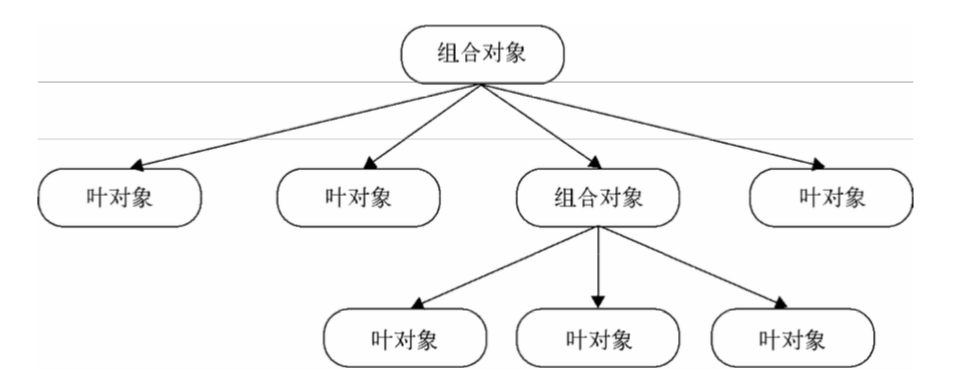

# JavaScript设计模式与开发实践

## 前言

"模式"最早诞生于建筑学。哈佛大学建筑学博士Christopher Alexander和他的研究团队花了约20年的时间，研究了为解决同一个问题而设计出的不同建筑结构，从中发现了那些高质量设计中的相似性，并且用"模式"来指代这种相似性。

通俗一点来说，设计模式是在某种场合下对某个问题的一种解决方案。

"好的设计"并不是某人发明的，而是一直存在的，大家会凭经验一直使用，"模式"不过是给"好的设计"起个名字。

设计模式的作用是让人们写出可复用和可维护性高的程序。

所有设计模式的实现都遵循"找出程序中变化的地方，将其封装起来"。

“高内聚，低耦合”

内聚指的是模块内部代码的关联程度，耦合则是模块间的关联程度。

## 第一部分 基础知识

### 第1章 面向对象的JavaScript

#### 动态类型语言和鸭子类型

编程语言按照数据类型大体可以分为两类

+ 静态类型语言(编译时确定类型)
+ 动态类型语言(运行时确定类型)

> 鸭子类型(duck typing)，如果它走起路来像鸭子，叫起来也是鸭子，那么它就是鸭子。

在动态类型语言的面相对象设计中，鸭子类型的概念至关重要。我们可以轻松地实现"面相接口编程"。例如一个对象若有`push`和`pop`方法，它就可以被当做栈来使用。

#### 多态

JavaScript对象的多态性是与生俱来的，某一种动物能否发出叫声，只取决于它有没有`makeSound`方法，而不取决于它是否是某种类型的对象。

> 多态最根本的作用就是通过把过程化的条件分支语句转化为对象的多态性，从而消除这些条件分支语句。

一个例子很好的诠释

电影拍摄现场，导演喊出"action"，主角开始背台词，灯光师傅打灯，群众演员倒地。得到同一个消息时，每个对象都知道自己应该做什么。

每个对象该做什么，事先已经是该对象的一个方法，被安装在对象的内部。

用代码举个🌰

一个地图应用，我们选择google的API

```js
const googleMap = {
  show() {
    console.log('开始渲染谷歌地图')
  }
}

const renderMap = () => {
  googleMap.show()
}

renderMap()
```

后来由于某些原因，我们需要把google换成百度，于是代码变成了这样:

```js
const googleMap = {
  show() {
    console.log('开始渲染谷歌地图')
  }
}

const baiduMap = {
  show() {
    console.log('开始渲染百度地图')
  }
}

const renderMap = type => {
  if (type === 'google') {
    googleMap.show()
  } else if (type === 'baidu') {
    baiduMap.show()
  }
}

renderMap('google')
renderMap('baidu')
```

一旦需要将其换成高德地图，必须要改动renderMap函数，继续堆砌条件分支语句。

将程序中相同的部分抽象出来:

```js
const renderMap = map => {
  if (map.show instanceof Function) {
    map.show()
  }
}

renderMap(googleMap)
renderMap(baiduMap)
```

#### 封装

#### 原型模式和基于原型继承的JavaScript对象系统

原型模式的实现关键，是语言本身是否提供了`clone`的方法。

```js
Object.create = Object.create || function( obj ){
  const F = function(){}
  F.prototype = obj
  return new F()
}
```

基于原型链的委托机制就是原型继承的本质。

原型编程范型至少包括以下基本规则:

+ 所有的数据都是对象
+ 要得到一个对象，不是通过实例化类，而是找到一个对象作为原型并克隆它
+ 对象会记住它的原型
+ 如果对象无法响应某个请求，它会把这个请求委托给它自己的原型

##### JavaScript中的原型继承

要得到一个对象，不是通过实例化类，而是找到一个对象作为原型并克隆它。

JavaScript个对象提供了一个名为`__proto__`的隐藏属性，某个对象的`__proto__`属性默认会指向它的构造器的原型对象，即{Construcrot}.prototype。在一些浏览器上`__proto__`属性被公开出来。

```js
const a = new Object()
console.log(a.__proto__ === Object.prototype)
```

### 第2章 this、call和apply

#### this

`this`的指向大致分为以下四种:

+ 作为对象的方法调用
+ 作为普通函数调用
+ 构造器调用
+ Function.prototype.call或Function.prototype.apply调用

当函数作为对象的方法被调用时，`this`指向该对象

函数不作为对象的属性被调用时，`this`总是指向全局对象

当用`new`运算符调用函数时，该函数总会返回一个对象，通常情况下，构造器里的`this`就指向返回的这个对象:

```js
let MyClass = function() {
  this.name = 'hehe'
}

let obj = new MyClass()
alert(obj.name) // output: hehe
```

如果构造器显式返回了一个object类型的对象，那么此次运算结果最终会返回这个对象，而不是之前期待的`this`。

```js
let MyClass = function() {
  this.name = 'hehe'
  return {
    name: 'haha'
  }
}
var obj = new MyClass()
alert ( obj.name ) // 输出:haha
```

#### call和apply

能够熟练使用`call`和`apply`是真正成为JavaScript程序员的重要一步。

##### call和apply的用途

1.改变`this`指向

```js
document.getElementById = (function(func){
  return function() {
    return func.apply(document, arguments)
  }
})(document.getElementById)
var getId = document.getElementById
var div = getId('div')
alert(div.id)
```

2.Function.prototype.bind
3.借用其他对象的方法

### 第3章 闭包和高阶函数

#### 闭包

一个🌰

```js
const Type = {};

for (let i = 0, type; type = ['String', 'Array', 'Number'][i++];) {
  Type['is' + type] = obj => {
    return Object.prototype.toString.call(obj) === `[object ${type}]`
  }
};

Type.isArray([])
Type.isString('str')
```

##### 封装变量

闭包可以将一些不需要暴露在全局的变量封装成"私有变量"。

```js
const mult = (...args) => {
  let val  = 1
  for (let i = 0; i < args.length; i++) {
    val *= args[i]
  }
  return val
}
```

加入缓存来提高这个函数的性能

```js
const cache = {}

const mult = (...args) => {
  let key = args.join(',')
  if (cache[key]) {
    return cache[key]
  }
  let val = 1
  for (let i = 0; i < args.length; i++) {
    val *= args[i]
  }
  return cache[key] = val
}
```

`cache`这个变量仅仅在`mult`函数中被使用，将其封闭在`mult`函数内部。

```js
const mult = () => {
  const cache = {}
  return function (...args) {
    let key = args.join(',')
    if (key in cache) {
      return cache[key]
    }
    let val = 1
    for (let i = 0; i < args.length; i++) {
      val *= args[i]
    }
    return cache[key] = val
  }
}
```

提炼函数是代码重构中的常见技巧，如果在一个大函数中有一些代码块能够独立出来，常常把这些代码块封装在独立的小函数里面。独立出来的小函数有助于代码复用，如果这些小函数有一个良好的命名，它们本身也起到了注释的作用。

```js
const mult = () => {
  const cache = {}
  const calculate = (...args) => {
    let val = 1
    for (let i = 0; i < args.length; i++) {
      val *= args[i]
    }
    return val
  }
  return function (...args) {
    let key = args.join(',')
    if (key in cache) {
      return cache[key]
    }
    return cache[key] = calculate.apply(null, args)
  }
}
```

#### 高阶函数

高阶函数式指至少满足下列条件之一的函数

+ 函数可以作为参数传递
+ 函数可以作为返回值输出

函数作为参数传递，代表可以抽离一部分容易变化的业务逻辑，将这部分业务逻辑放在函数参数中，回调函数就是一个重要的应用场景。

##### 函数作为参数传递

1.回调函数

直接看🌰

在页面中创建100个div节点，然后将这些节点设置为隐藏

```js
const appendDiv = function() {
  for(let i = 0; i < 100; i++) {
    const div = document.createElement('div')
    div.innerHTML = i
    document.body.appendChild(div)
    div.style.display = 'none'
  }
}

appendDiv()
```

将`div.style.display = 'none'`放在函数中是不合理的，这个函数过于"个性化"，难以复用，这样改造:

```js
const appendDiv = function(callback) {
  for (let i = 0; i < 100; i++) {
    const div = document.createElement('div')
    div.innerHTML = i
    document.body.appendChild(div)
    if (typeof callback === 'function') {
      callback(div)
    }
  }
}

appendDiv(node => {
  node.style.display = 'none'
})
```

2.Array.prototype.sort

接受一个函数作为参数，这个函数里封装了数组元素的排序规则

##### 函数作为返回值输出

这是一个单例模式的🌰

```js
const getSingle = function(fn) {
  let ret
  return function(...args) {
    return ret || (ret = fn.apply(this, args))
  }
}
```

##### 高阶函数实现AOP

AOP(面向切面编程)的主要作用是把一些跟核心业务逻辑无关的功能抽离出来，通常包括日志同级、安全控制、异常处理。这样做的好处是保持业务逻辑模块的纯净和高内聚性。

在JavaScript中实现AOP，通常是把一个函数"动态织入"到另外一个函数之中。

```js
Function.prototype.before = function(beforefn) {
  const __self = this // 保存原函数的引用
  return function(...args) {
    beforefn.apply(this, args)
    return __self.apply(this, args)
  }
}

Function.prototype.after = function(afterfn) {
  const __self = this
  return function(...args) {
    let ret = __self.apply(this, args)
    afterfn.apply(this, args)
    return ret
  }
}

const func = function() {
  console.log(2)
}

const funcAOP = func.before(function() {
  console.log(1)
}).after(function() {
  console.log(3)
})

funcAOP()
```

这是装饰者模式实现。

##### 高阶函数的其他应用

1.currying

`currying`又称部分求值。一个`currying`的函数首先会接收一些参数，接收这些参数之后，该函数不会立即求值，而是继续返回另外一个函数，刚才传入的参数在函数形成的闭包中被保存起来。待到函数真正需要求值的时候，之前传入的所有参数都会被一次性用于求值。

2.uncurrying

3.函数节流

下列场景

+ window.onsize事件
+ mousemove事件
+ 上传进度

4.分时函数

场景:在WebQQ好友列表中，可能一次性往页面中添加千数量级的节点。

`timeChunk`函数让创建节点的工作分批进行，比如一秒创建1000个改为每隔200毫秒创建200个。

```js
const timeChunk = function(array, fn, count) {
  const start = function() {
    for(let i = 0; i < Math.min(count || 1, array.length); i++) {
      let obj = array.shift()
      fn(obj)
    }
  }

  return function() {
    let t = setInterval(() => {
      if (array.length === 0) {
        return clearInterval(t)
      }
      start()
    }, 200)
  }
}
```

5.惰性加载函数

避免每次都让程序执行判断过程

```js
const addEvent = (() => {
  if (window.addEventListener) {
    return function(elem, type, handler) {
      elem.addEventListener(type, handler, flase)
    }
  }
  if (window.attachEvent) {
    return function(elem, type, handler) {
      elem.attachEvent(`on${type}`, handler)
    }
  }
})()
```

对于这个场景还有这种解决，即在调用过程中改写函数，这样的好处是减少初始化开销

```js
let addEvent = function(elem, type, handler) {
  if (window.addEventListener) {
    addEvent = function(elem, type, handler) {
      elem.addEventListener(type, handler, flase)
    }
  } else if (window.attachEvent) {
    addEvent = function(elem, type, handler) {
      elem.attachEvent(`on${type}`, handler)
    }
  }

  addEvent(elem, type, handler)
}
```

## 第二部分 设计模式

### 第4章 单例模式(Singleton Pattern)

> Ensure a class has only one instance, and provide a global point of access to it.（保证一个类仅有一个实例，并提供一个访问它的全局访问点。）

单例模式是一种常用的模式，有些对象往往只需要一个。比如Toast。

#### 实现单例模式

使用一个变量来标志当前是否已经为某个类创建过对象，如果是，则在下一次获取该类的实例时，直接返回之前创建的对象。

```js
class Singleton {
  constructor(name) {
    this.name = name
    this.instance = null
  }

  getName() {
    console.log(this.name)
  }

  getInstance(name) {
    if(!this.instance) {
      this.instance = new Singleton(name)
    }
    return this.instance
  }
}
```

或者

```js
const Singleton = function(name) {
  this.name = name
}

Singleton.prototype.getName = function() {
  console.log(this.name)
}

Singleton.getInstance = (function(name) {
  let instance = null
  return function() {
    if (!this.instance) {
      instance = new Singleton(name)
    }
    return instance
  }
})()
```

以上两种方式中，使用`Singleton.getInstance`来获取`Singleton`类的唯一对象，但是增加了这个类的"不透明性"。

#### 透明的单例模式

```js
const CreateDiv = (function() {
  let instance

  const CreateDiv = function(html) {
    if (instance) {
      return instance
    }
    this.html = html
    this.init()
    return instance = this
  }

  CreateDiv.prototype.init = function() {
    let div = document.createElement('div')
    div.innerHTML = this.html
    document.body.appendChild(div)
  }

  return CreateDiv
})()

let a = new CreateDiv('1')
let b = new CreateDiv('2')

console.log(a === b)
```

使用了闭包保存单例，立即执行函数返回真正的构造方法。

现在的构造函数实际上负责了两件事情。第一是创建对象和执行初始化init方法，第二是保证只有一个对象

```js
const CreateDiv = function(html) {
  if (instance) {
    return instance
  }
  this.html = html
  this.init()
  return instance = this
}
```

#### 用代理实现单例模式

引入代理类，将负责管理单例的代码放进去。

```js
const CreateDiv = function(html) {
  this.html = html
  this.init()
}

CreateDiv.prototype.init = function() {
  let div = document.createElement('div')
  div.innerHTML = this.html
  document.body.appendChild(div)
}

const ProxySingletonCreateDiv = (function() {
  let instance
  return function(html) {
    if (!instance) {
      instance = new CreateDiv(html)
    }
    return instance
  }
})()

const a = new ProxySingletonCreateDiv('hehe')
const b = new ProxySingletonCreateDiv('haha')
```

#### JavaScript中的单例模式

JavaScript其实是一门无类(class-free)语言。

> 单例模式的核心是确保只有一个实例，并提供全局访问。

在JavaScript开发中，会把全局变量当成单例来使用。

```js
var a = {};
```

全局变量存在很多问题，容易造成命名空间污染。大中型项目中容易出现问题。

有两种方式*降低*全局变量带来的命名污染。

+ 使用命名空间
+ 闭包

```js
// 命名空间
const namespace = {
  a: function() {
    alert(1);
  },
  b: function() {
    alert(2);
  }
}
```

减少变量和全局作用域打交道的机会。

```js
const user = (function() {
  let __name = 'myoung',
      __age = 23;

  return {
    getUserInfo: function() {
      return `${__name}-${__age}`;
    }
  }
})();
```

#### 惰性单例

在需要的时候才创建对象实例。惰性单例是单例模式的重点。

```js
const createLoginLayer = (function() {
  let div;
  return function() {
    if (!div) {
      div = document.createElement("div");
      div.innerHTML = "我是登录浮窗";
      div.style.display = "none";
      document.body.appendChild(div);
    }
    return div;
  };
})();
```

这段代码的问题

+ 违反单一职责原则，创建对象和管理单例的逻辑都放在`createLoginLayer`中
+ 下次再需要创建单例的时候，还是一样的思路，`createLoginLayer`照抄一遍

需要将相同的逻辑抽象出来

```js
var obj
if (!obj) {
  obj = xxx;
}
```

```js
const getSingle = function(fn) {
  let result;
  return function() {
    return result || (result = fn.apply(this, arguments));
  }
}
```

于是这么去用

```js
const createLoginLayer = function() {
  div = document.createElement("div");
  div.innerHTML = "我是登录浮窗";
  div.style.display = "none";
  document.body.appendChild(div);
  return div;
};

const createSingleLoginLayer = getSingle(createLoginLayer)

document.getElementById('loginBtn').onclick = function() {
  const loginLayer = createSingleLoginLayer();
  loginLayer.style.display = 'block';
};
```

### 第5章 策略模式(Strategy Pattern)

> Define a family of algorithms, encapsulate each one, and make them interchangeable.（定义一组算法，将每个算法都封装起来，并且使他们之间可以互换。）

到同一个目的地可以有多种途径，根据实际情况来选择出行的线路。

#### 使用策略模式计算奖金

1.看一个绩效考核的例子

```js
const calculateBonus = function(performanceLevel, salary) {
  if (performanceLevel === 'S') {
    return salary * 4;
  }

  if (performanceLevel === 'A') {
    return salary * 3;
  }

  if (performanceLevel === 'B') {
    return salary * 2;
  }
}

calculateBonus('B', 20000); // 40000
calculateBonus('S', 6000); // 24000
```

问题显而易见:

+ `calculateBonus`函数庞大，包含很多`if-else`语句，这些语句需要覆盖所有的逻辑分支。
+ `calculateBonus`函数缺乏弹性，如果增加了一种新的绩效等级C，或者绩效S的计算逻辑改变，必须要修改其内部实现，违反开放-封闭原则。
+ 算法复用性差。

2.使用组合函数重构

```js
const performanceS = function(salary) {
  return salary * 4;
}

const performanceA = function(salary) {
  return salary * 3;
}

const performanceB = function(salary) {
  return salary * 2;
}

const calculateBonus = function(performanceLevel, salary) {
  if (performanceLevel === 'S') {
    return performanceS(salary);
  }

  if (performanceLevel === 'A') {
    return performanceA(salary);
  }

  if (performanceLevel === 'B') {
    return performanceB(salary);
  }
}

calculateBonus('A', 10000); // 30000
```

没有解决`calculateBonus`函数会越来越大的问题，在系统变化的时候缺乏弹性。

3.使用策略模式重构

> 策略模式的目的就是将算法的使用与算法的实现部分分离开来。

在计算奖金的这个例子中，算法的使用方式是不变的，都是根据某个算法取得计算后的奖金数额。而算法的实现是变化的。

> 一个基于策略模式的程序至少有两部分组成。第一个部分是一组策略类，策略类封装了具体的算法，并负责具体的计算过程。第二个部分是环境类Context，Context接受客户端请求，随后把请求委托给某一个策略类。Context中要维持对某个策略对象的引用。

```js
class PerformanceS {
  calculate(salary) {
    return salary * 4;
  }
}

class PerformanceA {
  calculate(salary) {
    return salary * 3;
  }
}

class PerformanceB {
  calculate(salary) {
    return salary * 4;
  }
}

class Bonus {
  constructor(salary = null, strategy = null) {
    this.salary = salary
    this.strategy = strategy

    this.setSalary = this.setSalary.bind(this)
    this.setStrategy = this.setStrategy.bind(this)
    this.getBonus = this.getBonus.bind(this)
  }

  setSalary(salary) {
    this.salary = salary
  }

  setStrategy(strategy) {
    this.strategy = strategy
  }

  getBonus() {
    return this.strategy.calculate(this.salary)
  }
}

const bonus = new Bonus()

bonus.setSalary(10000)
bonus.setStrategy(new PerformanceS())

console.log(bonus.getBonus()) // 40000

bonus.setStrategy(new PerformanceA())
console.log(bonus.getBonus()) // 30000
```

在对环境类`Context`(这里是Bonus)发起请求的时候，`Context`把请求委托给这些策略对象中间的某一个进行计算。

#### JavaScript版本的策略模式

```js
const strategies = {
  S(salary) {
    return salary * 4
  },
  A(salary) {
    return salary * 3
  },
  B(salary) {
    return salary * 2
  },
};

const calculateBonus = function(level, salary) {
  return strategies[level](salary)
}

console.log(calculateBonus('S', 2000))
console.log(calculateBonus('A', 10000))
```

#### 表单校验的例子

表单验证中常见的编码方式，分支过多，维护性差，复用性差。

```js
if (registerForm.userName.value === '') {
  alert('用户名不能为空');
  return false;
}
if (registerForm.password.value.length < 6) {
  alert('密码长度不能少于6位');
  return false;
}
if (!/^1(3|5|8)[0-9]{9}$/.test(registerForm.phoneNumber.value)) {
  alert('手机号码格式不正确');
  return false;
}
```

下面使用策略模式改写

```js
const strategies = {
  isNonEmpty(value, errorMsg) {
    if (value === '') {
      return errorMsg
    }
  },
  minLength(value, length, errorMsg) {
    if (value.length < length) {
      return errorMsg
    }
  },
  isMobile(value, errorMsg) {
    if (!/^1(3|5|8)[0-9]{9}$/.test(value)) {
      return errorMsg
    }
  }
}

// 验证调用
const validataFunc = function() {
  const validator = new Validator()

  validator.add(registerForm.userName, 'isNonEmpty', '用户名不能为空')
  validator.add(registerForm.password, 'minLength:6', '密码长度不能少于6位')
  validator.add(registerForm.phoneNumber, 'isMobile', '手机号码格式不正确')

  let errorMsg = validator.start()
  return errorMsg
}

class Validator {
  constructor() {
    this.cache = []
    this.add = this.add.bind(this)
    this.start = this.start.bind(this)
  }

  add(dom, rule, errorMsg) {
    const ary = rule.split(':')
    this.cache.push(function() {
      const strategy = ary.shift()
      ary.unshift(dom.value)
      ary.push(errorMsg)
      return strategies[strategy].apply(dom, ary)
    })
  }

  start() {
    for (let i = 0, validataFunc; validataFunc = this.cache[i++];) {
      let msg = validataFunc()
      if (msg) {
        return msg
      }
    }
  }
}
```

大致实现思路如此，可将其改写为一个输入框支持多条验证规则，详见84页。

### 第6章 代理模式(Proxy pattern)

Proxy pattern（代理模式）：Provide a surrogate (代理) or placeholder for another object to control access to it.（为其他对象提供一种代理以控制对这个对象的访问。）

> 代理模式是为一个对象提供一个代用品或占位符，以便控制对它的访问。

明星有经纪人作为代理，请明星演出只能联系经纪人，经纪人把细节报酬谈好再把合同交给明星。

代理模式的关键是，当客户不方便直接访问一个对象或者不满足需要的时候，提供一个替身对象来控制这个对象的访问，客户实际上访问的是替身对象。替身对象对请求做出一些处理之后，再把请求转交给本体对象。

保护代理用于控制不同权限的对象对目标对象的访问。

#### 虚拟代理实现图片预加载

```js
const myImage = (function() {
  const imgNode = document.createElement('img')
  document.body.appendChild(imgNode)

  return {
    setSrc: function(src) {
      imgNode.src = src
    }
  }
})()

const proxyImage = (function() {
  const img = new Image()
  img.onload = function() {
    myImage.setSrc(this.src)
  }
  return {
    setSrc(src) {
      myImage.setSrc('loading.gif')
      img.src = src
    }
  }
})()

proxyImage.setSrc('hehe.jpg')
```

下面是没有引入代理的代码

```js
const MyImage = (function() {
  const imgNode = document.createElement('img')
  document.body.appendChild(imgNode)
  const img = new Image()

  img.onload = function() {
    imgNode.src = img.src
  }

  return {
    setSrc: function(src) {
      imgNode.src = 'loading.gif'
      img.src = src
    }
  }
})()

MyImage.setSrc('hehe.jpg')
```

单一职责原则，如果一个对象的职责过多，等于将很多职责耦合到一起，导致低内聚的设计。所以这里使用代理将预加载和请求图片职责分离。

需要注意的是，代理和本体接口需要体现一致性，对用户来说是透明的，并不知道代理和本体的区别。

#### 虚拟代理合并HTTP请求

通过代理函数来收集一段时间之内的请求，然后一次性发给服务器。

```js
const synchronousFile = function(id) {
  console.log(`开始同步文件，id为${id}`)
}

const proxySynchronousFile = (function() {
  const cache = []
  let timer

  return function(id) {
    cache.push(id)
    if (timer) {
      return
    }

    timer = setTimeout(function() {
      synchronousFile(cache.join(','))
      clearTimeout(timer)
      timer = null
      cache.length = 0
    }, 2000)
  }
})()

let checkbox = document.getElementsByTagName('input')

for (let i = 0, c; c = checkbox[i++]; ) {
  c.onclick = function() {
    if (this.checked === true) {
      proxySynchronousFile(this.id)
    }
  }
}
```

#### 缓存代理

缓存代理可以为一些开销大的运算结果提供暂时的存储，下次运算时，如果传递进来的参数跟之前的一致，则可以直接返回前面存储的运算结果。

```js
const mult = function(...args) {
  console.log('开始计算乘积')
  let a = 1
  for (let i = 0; i < args.length; i++) {
    a *= args[i]
  }
  return a
}

const proxyMult = (function() {
  const cache = {}
  return function(...args) {
    let key = args.join(',')
    if (cache[key]) {
      return cache[key]
    }
    return cache[key] = mult.apply(this, args)
  }
})()

proxyMult(1, 2, 3, 4)
proxyMult(1, 2, 3, 4)
```

这里可以将缓存抽离出来一个高阶函数

```js
const createProxyFactory = function(fn) {
  const cache = {}
  return function(...args) {
    let key = args.join(',')
    if (cache[key]) {
      return cache[key]
    }
    return cache[key] = fn.apply(this, args)
  }
}
```

### 第7章 迭代器模式(Iterator Pattern)

Provide a way to access the elements of an aggregate object sequentially without exposing its underlying representation.（它提供一种方法访问一个容器对象中各个元素，而又不需要暴露该对象的内部细节。）

> 迭代器模式是指提供一种方法顺序访问一个聚合对象中的各个元素，而又不需要暴露该对象的内部表示。及不用关心对象的内部构造，也可以按顺序访问其中的每个元素。

### 第8章 发布-订阅模式(Observer Pattern)

Define a one-to-many dependency between objects so that when one object changes state, all its dependents are notified and updated automatically.（定义对象间一种一对多的依赖关系，使得每当一个对象改变状态，则所有依赖于它的对象都会得到通知并被自动更新。）

> 发布-订阅模式又叫做观察者模式，它定义对象间的一种一对多的依赖关系，当一个对象的状态发生改变时，所有依赖于它的对象都将得到通知。在JavaScript开发中，一般用事件模型来替代传统的发布-订阅模式。

发布订阅模式的通用实现

```js
const event = {
  clientList: [], // 缓存列表，存放订阅者的回调函数
  listen(key, fn) {
    if (!this.clientList[key]) {
      this.clientList[key] = []
    }
    this.clientList[key].push(fn)
  },
  trigger(...args) {
    const key = args.shift()
    const fns = this.clientList[key]

    if (!fns || fns.length === 0) {
      return false
    }

    for (let i = 0, fn; fn = fns[i++];) {
      fn.apply(this, args)
    }
  }
}

// 给对象动态添加职责，给对象动态添加发布-订阅功能
const installEvent = function(obj) {
  for (let i of Object.keys(event)) {
    obj[i] = event[i]
  }
}
```

这里是调用的例子

```js
const salesOffices = {}
installEvent(salesOffices)

salesOffices.listen('squareMeter88', function(price) {
  console.log(`价格= ${price}`)
})

salesOffices.listen('squareMeter100', function(price) {
  console.log(`价格= ${price}`)
})

salesOffices.trigger('squareMeter88', 2000000)
salesOffices.trigger('squareMeter100', 3000000)
```

问题在于发布订阅者存在一定耦合性，需要知道对象的名称才能顺利订阅事件。

#### 全局的发布-订阅对象

```js
const Event = (function() {

  const clientList = {}

  const listen = function(key, fn) {
    if (!clientList[key]) {
      clientList[key] = []
    }
    clientList[key].push(fn)
  }

  const trigger = function(...args) {
    const key = args.shift()
    const fns = clientList[key]

    if (!fns || fns.length === 0) {
      return false
    }

    for (let i = 0, fn; fn = fns[i++];) {
      fn.apply(this, args)
    }
  }

  const remove = function(key, fn) {
    const fns = clientList[key]
    if (!fns) {
      return false
    }
    if (!fn) {
      fns && (fns.length = 0)
    } else {
      for (let i = fns.length - 1; i >= 0; i--) {
        const _fn = fns[i]
        if (_fn === fn) {
          fns.splice(i ,1)
        }
      }
    }
  }

  return {
    listen,
    trigger,
    remove
  }
})()

Event.listen('squareMeter88', fn1 = function(price) {
  console.log(`价格= ${price}`)
})

Event.trigger('squareMeter88', 2000000)

Event.remove('squareMeter88', fn1)
```

#### 先订阅再发布

某些场景，比如QQ离线消息，需要先把消息保存下来，等到有对象订阅了，再把消息发布给订阅者。

#### 全局事件命名冲突

项目体积不断增大，难免出现事件名冲突。需要提供创建命名空间的功能。

### 第9章 命令模式

> Encapsulate a request as an object,thereby letting you parameterize clients with different requests,queue or log requests, and support undoable operations.（将一个请求封装成一个对象，从而让你使用不同的请求把客户端参数化，对请求排队或者记录请求日志，可以提供命令的撤销和恢复功能。）

这里看一个🌰

有一个快餐店的点餐服务员，当客人点餐或者订餐时，将需求写在清单上交给厨房，客人不用关心是哪位厨师给他做菜。客人还可以要求一小时之后开始炒他的菜，打电话撤单等等。这些记录着订餐信息的清单就是命令模式中的命令对象。

#### 命令模式的例子---菜单程序

绘制一排Button按钮，给其绑定`click`事件。

按下按钮之后会发生一些事情是不变的，而具体发生什么事情是可变的。

`setCommand`函数负责往按钮上安装命令。

```js
const setCommand = function(button, command) {
  botton.onclick = function() {
    command.excute()
  }
}

const MenuBar = {
  refresh() {
    console.log('刷新菜单目录')
  }
}

const SubMenu = {
  add() {
    console.log('增加子菜单')
  },
  del() {
    console.log('删除子菜单')
  }
}

class RefreshMenuBarCommand {
  constructor(receiver) {
    this.receiver = receiver
  }

  excute() {
    this.receiver.refresh()
  }
}

class AddSubBarCommand {
  constructor(receiver) {
    this.receiver = receiver
  }

  excute() {
    this.receiver.add()
  }
}

const refreshMenuBarCommand = new RefreshMenuBarCommand(MenuBar)
const addSubMenuCommand = new AddSubMenuCommand(SubMenu)
const delSubMenuCommand = new DelSubMenuCommand(SubMenu)

setCommand(botton1, refreshMenuBarCommand)
setCommand(botton2, addSubMenuCommand)
setCommand(botton3, delSubMenuCommand)
```

#### JavaScript中的命令模式

```js
const RefreshMenuBarCommand = function(receiver) {
  return {
    execute() {
      receiver.refresh()
    }
  }
}

const setCommand = function(button, command) {
  botton.onclick = function() {
    command.excute()
  }
}

const refreshMenuBarCommand = RefreshMenuBarCommand(MenuBar)
setCommand(button1, refreshMenuBarCommand)
```

#### 撤销命令

直接看代码，利用属性将之前操作结果记录下来

```js
class MoveCommand {
  constructor(receiver, pos) {
    this.receiver = receiver
    this.pos = pos
    this.oldPos = null
  }

  execute() {
    this.receiver.start('left', this.pos, 1000)
    this.oldPos = this.receiver.dom.getBoundingClientRect()[this.receiver.propertyName]
  }

  undo() {
    this.receiver.start('left', this.oldPos, 1000)
  }
}

moveBtn.onclick = function() {
  const animate = new animate(ball)
  moveCommand = new MoveCommand(animate, pos.value)
  moveCommand.execute()
}

cancelBtn.onclick = function() {
  moveCommand.undo()
}
```

#### 宏命令

```js
const MacroCommand = function() {
  return {
    commandList: [],
    add(command) {
      this.commandList.push(command)
    },
    execute() {
      for (let i = 0, command; command = this.commandList[i++];) {
        command.execute()
      }
    }
  }
}
```

### 第10章 组合模式(Composite Pattern)

"事物是由相似的子事物构成"。

组合模式就是用小的子对象来构建更大的对象，这些小的子堆在了本身也许是由更小的"孙"对象构成的。

宏命令对象包含了一组具体的子命令对象，不管是宏命令对象，还是子命令对象，都有一个`excute`方法负责执行命令。

宏命令中包含了一组子命令，他们组成了一个树形结构。

`MacroCommand`表现的像一个命令，实际上只是一组真正命令的“代理”，只负责传递请求给叶对象。

#### 组合模式的用途

> Compose objects into tree structure to represent part-whole hierarchies.Composite lets clients treat individual objects and compositions of objects uniformly.

组合模式将对象组合成树形结构，使得用户对单个对象和组合对象的使用具有一致性。

提供了一种遍历树形结构的方案，通过调用组合对象的`excute`方法，程序递归调用组合对象下面叶对象的`excute`方法。

请求从树最顶端的对象往下传递，如果子节点是叶对象，叶对象自身会处理这个请求，如果子节点还是组合对象，请求会继续向下传递。



透明性的同时带来安全问题，解决方案通常是给叶对象增加`add`方法，并且在调用这个方法时，抛出一个异常来及时提醒客户。

```js
const openTvCommand = {
  excute() {
    console.log('打开电视')
  },
  add() {
    throw new Error('叶对象不能添加子节点')
  }
}
```

看一个🌰---扫描文件夹

+ 文件夹中既可以包括文件，又可以包含其他文件夹，组合模式让粘贴复制成了一个统一的操作。
+ 杀毒软件扫描文件夹，只需扫描最外层即可。

```js
class Folder {
  constructor(name) {
    this.name = name
    this.parent = null
    this.files = []
  }
  add(file) {
    file.parent = this
    this.files.push(file)
  }
  scan() {
    console.log(`开始扫描文件夹${this.name}`)
    for (let i = 0, file; file = this.files[i++];) {
      file.scan()
    }
  }
  remove() {
    if (!this.parent) {
      return;
    }
    for (let files = this.parent.files, l = files.length - 1; l >= 0; l--) {
      let file = files[l]
      if (file === this) {
        files.splice(l, 1)
      }
    }
  }
}

class File {
  constructor(name) {
    this.name = name
    this.parent = null
  }
  add() {
    throw new Error('文件下面不能再添加文件')
  }
  scan() {
    console.log(`开始扫描文件${this.name}`)
  }
  remove() {
    if (!this.parent) {
      return;
    }
    for (let files = this.parent.files, l = files.length - 1; l >= 0; l--) {
      let file = files[l]
      if (file === this) {
        files.splice(l , 1)
      }
    }
  }
}

const folder = new Folder('Learning')

const folder1 = new Folder('CSS')
const folder2 = new Folder('JavaScript')

const file1 = new File('JavaScript权威指南')
const file2 = new File('JavaScript高级程序设计')
const file3 = new File('CSS揭秘')
const file4 = new File('Docker')

folder.add(folder1)
folder.add(folder2)
folder.add(file4)

folder1.add(file3)
folder2.add(file1)
folder2.add(file2)

folder.scan()
```

#### 何时使用组合模式

+ 表示对象的部分，整体层次结构，只需要通过请求树的最顶层对象，便能对整棵树做统一的操作。
+ 客户希望统一对待树中的所有对象，不用关心当前正在处理的对象是组合对象还是叶对象。组合对象和叶对象会各自做自己正确的事情，这是组合模式最重要的能力。

### 第11章 模板方法模式(Template Method Pattern)

> Define the skeleton of an algorithm in an operation,deferring some steps to subclasses.Template Method lets subclass redefine certain steps of an algorithm without changing the algorithm's structure.

模板方法模式是一种只需使用继承就可以实现的模式。

模板方法模式由两部分结构组成，第一部分是抽象父类，第二部分是具体的实现子类。通常在抽象父类中封装了子类的算法框架，包括实现一些公共方法以及封装子类中所有方法的执行顺序。子类通过继承这个抽象类，也继承了整个算法结构，并且可以选择重写父类的方法。

看一个🌰---Coffee or Tea

泡咖啡的步骤通常如下

1. 把水煮沸
1. 用沸水冲泡咖啡
1. 把咖啡倒进杯子
1. 加糖和牛奶

泡茶的步骤通常如下

1. 把水煮沸
1. 用沸水浸泡茶叶
1. 吧茶水倒进杯子
1. 加柠檬

分离出共同点

+ 原料不同 --- 抽象为“饮料”
+ 泡的方式不同 --- 抽象为“泡”
+ 加入的调料不同 --- 抽象为“调料”

整理为下面四个步骤

1. 把水煮沸
1. 用沸水冲泡饮料
1. 把饮料倒入杯子
1. 加调料

```js
class Beverage {
  boilWater() {
    console.log('把水煮沸')
  }
  brew() {}
  pourInCup() {}
  addCondiments() {}
  init() {
    this.boilWater()
    this.brew()
    this.pourInCup()
    this.addCondiments()
  }
}

class Coffee extends Beverage {
  brew() {
    console.log('用沸水冲泡咖啡')
  }
  pourInCup() {
    console.log('把咖啡倒进杯子')
  }
  addCondiments() {
    console.log('加糖和牛奶')
  }
}

class Tea extends Beverage {
  brew() {
    console.log('用沸水浸泡茶叶')
  }
  pourInCup() {
    console.log('把茶倒进杯子')
  }
  addCondiments() {
    console.log('加柠檬')
  }
}

const coffee = new Coffee()
const tea = new Tea()
coffee.init()
tea.init()
```

`Beverage`类的`init`方法就是模板方法，他其中封装了子类的算法框架。

#### 抽象类

在Java中，有两种类，抽象类和具体类，具体类可以被实例化，抽象类不能被实例化。抽象类用来被某些具体类继承。

抽象方法被声明在抽象类中，抽象方法没有具体的实现过程，子类继承抽象类时，必须重写父类的抽象方法。

Java中的方法

```java
public abstract class Beverage {
    final void init() {
        boilWater();
        brew();
        pourInCup();
        addCondiments();
    }

    void boilWater() {
        System.out.println("把水煮沸");
    }

    abstract void brew();
    abstract void addCondiments();
    abstract void pourInCup();
}

public class Coffee extends Beverage {
    @Override
    void brew() {
        System.out.println("用沸水冲泡咖啡");
    }

    @Override
    void pourInCup() {
        System.out.println("把咖啡倒进杯子");
    }

    @Override
    void addCondiments() {
        System.out.println("加糖和牛奶");
    }
}

public class Tea extends Beverage {
    @Override
    void brew() {
        System.out.println("用沸水浸泡茶叶");
    }

    @Override
    void pourInCup() {
        System.out.println("把茶倒进杯子");
    }

    @Override
    void addCondiments() {
        System.out.println("加柠檬");
    }
}

public class Test {
    private static void prepareRecipe( Beverage beverage ) {
        beverage.init();
    }

    public static void main( String args[] ) {
        Beverage coffee = new Coffee();
        prepareRecipe(coffee);

        Beverage tea = new Tea();
        prepareRecipe(tea);
    }
}
```

在Java中会保证子类必须重写父类中的抽象方法，但是在JavaScript中没有检查，有两种解决方案。

1. 用鸭子类型来检查接口
1. 让Bevearge.prototype.brew等方法直接抛出一个异常

#### 钩子方法

```js
class Beverage {
  boilWater() {
    console.log('把水煮沸')
  }
  brew() {
    throw new Error('子类必须重写brew方法')
  }
  pourInCup() {
    throw new Error('子类必须重写pourInCup方法')
  }
  addCondiments() {
    throw new Error('子类必须重写addCondiments方法')
  }
  customerWantsConfiments() {
    return true;
  }
  init() {
    this.boilWater()
    this.brew()
    this.pourInCup()
    if (this.customerWantsConfiments()) {
      this.addCondiments()
    }
  }
}
```

#### 小结

模板方法模式是一种典型的通过封装变化提高系统扩展性的设计模式

### 第12章 享元模式(Flyweight Pattern)

> Use sharing to support large numbers of fine-grained objects efficiently.（使用共享对象可有效地支持大量的细粒度对象。）

举一个例子，没有必要为每一首歌曲都创建一个播放对象，只用一个播放对象，通过切换url，播放时间等参数来控制歌曲的播放。

享元模式要求将对象的属性划分为内部状态和外部状态。享元模式的目标是尽量减少共享对象的数量。

+ 内部状态存储于对象内部
+ 内部状态可以被一些对象共享
+ 内部状态独立于具体的场景，通常不会改变
+ 外部状态取决于具体的场景，并根据场景而变化，外部状态不能被共享

享元模式是一种用时间换空间的性能优化模式。

#### 文件上传的例子

```js
class Upload {
  constructor(uploadType) {
    this.uploadType = uploadType;
  }

  delFile(id) {
    uploadManager.setExternalState(id, this); // (1)
    if (this.fileSize < 3000) {
      return this.dom.parentNode.removeChild(this.dom);
    }
    if (window.confirm('确定要删除该文件吗? ' + this.fileName)) {
      return this.dom.parentNode.removeChild(this.dom);
    }
  }
}

const UploadFactory = (function () {
  const createdFlyWeightObjs = {};
  return {
    create: function (uploadType) {
      if (createdFlyWeightObjs[uploadType]) {
        return createdFlyWeightObjs[uploadType];
      }
      return createdFlyWeightObjs[uploadType] = new Upload(uploadType);
    }
  }
})();

const uploadManager = (function () {
  const uploadDatabase = {};
  return {
    add: function (id, uploadType, fileName, fileSize) {
      const flyWeightObj = UploadFactory.create(uploadType);
      const dom = document.createElement('div');
      dom.innerHTML = '<span>文件名称:' + fileName + ', 文件大小: ' + fileSize + '</span>' + '<button class="delFile">删除</button>';
      dom.querySelector('.delFile').onclick = function () {
        flyWeightObj.delFile(id);
      }
      document.body.appendChild(dom);
      uploadDatabase[id] = {
        fileName: fileName,
        fileSize: fileSize,
        dom: dom
      };
      return flyWeightObj;
    },
    setExternalState: function (id, flyWeightObj) {
      const uploadData = uploadDatabase[id];
      for (const i in uploadData) {
        flyWeightObj[i] = uploadData[i];
      }
    }
  }
})();
```

享元模式是一种很好的性能优化方案，但是需要多维护一个`factory`对象和一个`manager`对象。

以下情况可以使用享元模式：

+ 一个程序中使用了大量的相似对象
+ 使用了大量对象，造成很大的内存开销
+ 对象的大多数状态都可以变为外部状态
+ 剥离出对象的外部状态之后，可以用相对较少的共享对象取代大量对象

#### 对象池

原理：人手一本权威指南太浪费，先买一本放公共书架上，看的时候去借，借完了放回去，如果同时有两个人要看，就再去买一本...

看一个简单的应用

地图应用上的小气泡，搜索A的时候出来两个，搜索B出来6个，在第二次的搜索中只需要再创建四个即可。

一个通用的对象池实现

```js
const objectPoolFactory = function(createObjFn) {
  const objectPool = []

  return {
    create(...args) {
      const obj = objectPool.length === 0 ? createObjFn.apply(this, args) : objectPool.shift()

      return obj;
    },
    recover(obj) {
      objectPool.push(obj)
    }
  }
}

const testObjFactory = objectPoolFactory(() => {
  // 对象的行为
  const testObj = {}

  return testObj;
})
```

可以在创建的时候给加入到一个数组中保存，用完之后对数组中元素进行recover(回收)操作。

#### 小结

享元模式在一个存在大量相似对象的系统中可以很好的解决大量对象带来的性能问题。

### 第13章 职责链模式

> Avoid coupling the sender of a request to its receiver by giving more than one object a chance to handle the request.Chain the receiving objects and pass the request along the chain until an object handles it.（使多个对象有机会处理请求，从而避免了请求的发送者和接收者之间的耦合关系 。将这些对象连成一个链，并沿着这条链传递请求，知道有对象处理它为止。）

看🌰

坐公交，人太多，后门上车，投币，一个接一个传过去。

弱化了发送者和接收者之间的强联系。

看需求

公司针对支付过定金的用户有一定的优惠政策。在正式购买后，已经支付过 500 元定金的用 户会收到 100 元的商城优惠券，200 元定金的用户可以收到 50 元的优惠券，而之前没有支付定金 的用户只能进入普通购买模式，也就是没有优惠券，且在库存有限的情况下不一定保证能买到。
我们的订单页面是 PHP 吐出的模板，在页面加载之初，PHP 会传递给页面几个字段。

+ orderType:表示订单类型(定金用户或者普通购买用户)，code 的值为 1 的时候是 500 元 定金用户，为 2 的时候是 200 元定金用户，为 3 的时候是普通购买用户。
+ pay:表示用户是否已经支付定金，值为 true 或者 false, 虽然用户已经下过 500 元定金的 订单，但如果他一直没有支付定金，现在只能降级进入普通购买模式。
+ stock:表示当前用于普通购买的手机库存数量，已经支付过 500 元或者 200 元定金的用 户不受此限制。

```js
var order = function (orderType, pay, stock) {
  if (orderType === 1) { // 500 元定金购买模式
    if (pay === true) { // 已支付定金
      console.log('500 元定金预购, 得到 100 优惠券');
    } else { // 未支付定金，降级到普通购买模式
      if (stock > 0) { // 用于普通购买的手机还有库存
        console.log('普通购买, 无优惠券');
      } else {
        console.log('手机库存不足');
      }
    }
  } else if (orderType === 2) {
    if (pay === true) {
      // 200 元定金购买模式
      console.log('200 元定金预购, 得到 50 优惠券');
    } else {
      if (stock > 0) {
        console.log('普通购买, 无优惠券');
      } else {
        console.log('手机库存不足');
      }
    }
  } else if (orderType === 3) {
    if (stock > 0) {
      console.log('普通购买, 无优惠券');
    } else {
      console.log('手机库存不足');
    }
  }
}

order(1, true, 500); // 输出: 500 元定金预购, 得到 100 优惠券
```

### 第14章 中介者模式(Mediator Pattern)

> Define an object that encapsulates how a set of objects interact.Mediator promotes loose couping by keeping objects from referring to each other explicitly,and it lets you vary their interaction independently.（用一个中介对象封装一系列的对象交互，中介者使各对象不需要显示的相互作用，从而使其耦合松散，而且可以独立的改变它们之间的交互。）

中介者模式的作用就是解除对象与对象之间的紧耦合关系。增加一个中介者对象后，所有的相关对象都通过中介者对象来通信，而不是相互引用。中介者使各对象之间耦合松散，而且可以独立地改变它们之间的交互。中介者模式使网状的多对多关系变成了相对简单的一对多关系。

#### 现实中的中介者

如果没有机场指挥塔的存在，每一架飞机要和方圆100km里的所有飞机通信，才能确定航线以及飞行状况。指挥塔作为调停者，知道每一架飞机的飞行状况，可以安排所有飞机的起降时间，及时作出航线调整。

#### 拿泡泡堂举个例子

```js
const players = []

class Player {
  constructor(name, teamColor) {
    this.partners = []
    this.enemies = []
    this.state = 'alive'
    this.name = name
    this.teamColor = teamColor
  }

  win() {
    console.log(`winner: ${this.name}`)
  }

  lose() {
    console.log(`loser: ${this.name}`)
  }

  die() {
    this.state = 'dead'
    let all_dead = this.partners.every(i => {
      return i.state === 'dead'
    })

    if (all_dead) {
      this.lose()
      this.partners.forEach(i => i.lose())
      this.enemies.forEach(i => i.win())
    }
  }
}

// 创建玩家的工厂
const playerFactory = function(name, teamColor) {
  const newPlayer = new Player(name, teamColor)

  players.forEach(i => {
    if (i.teamColor === newPlayer.teamColor) {
      i.partners.push(newPlayer)
      newPlayer.partners.push(i)
    } else {
      i.enemies.push(newPlayer)
      newPlayer.enemies.push(i)
    }
  })

  players.push(newPlayer)

  return newPlayer
}

const player1 = playerFactory('皮蛋', 'red'),
      player2 = playerFactory('小乖', 'red'),
      player3 = playerFactory('宝宝', 'red'),
      player4 = playerFactory('小强', 'red')

const player5 = playerFactory('黑妞', 'blue'),
      player6 = playerFactory('葱头', 'blue'),
      player7 = playerFactory('胖墩', 'blue'),
      player8 = playerFactory('海盗', 'blue')

player1.die()
player2.die()
player3.die()
player4.die()

// loser: 皮蛋
// loser: 小乖
// loser: 宝宝
// winner: 黑妞
// winner: 葱头
// winner: 胖墩
// winner: 海盗
```

每个玩家和其他玩家都是紧密耦合在一起的，每个玩家对象属性中都有`partners`和`enemies`用来保准其他玩家对象的引用，每个对象的状态发生改变，都要显式遍历通知其他对象。

#### 使用中介者模式改造

```js
class Player {
  constructor(name, teamColor) {
    this.name = name
    this.teamColor = teamColor
    this.state = 'alive'
  }

  win() {
    console.log(`${this.name} won`)
  }

  lose() {
    console.log(`${this.name} lost`)
  }

  die() {
    this.state = 'dead'
    playerDirector.receiveMessage('playerDead', this)
  }

  remove() {
    playerDirector.receiveMessage('removePlayer', this)
  }

  changeTeam() {
    playerDirector.receiveMessage('addPlayer', this, color)
  }
}

const playerFactory = function(name, teamColor) {
  const newPlayer = new Player(name, teamColor)
  playerDirector.receiveMessage('addPlayer', newPlayer)

  return newPlayer
}

const playerDirector = new class{
  constructor() {
    this.players = {}
  }
  // 新增一个玩家
  addPlayer(player) {
    const { teamColor } = player
    this.players[teamColor] = this.players[teamColor] || []
    this.players[teamColor].push(player)
  }
  // 移除一个玩家
  removePlayer(player) {
    const { teamColor } = player
    const { [teamColor]: teamPlayers = [] } = this.players

    let index = teamPlayers.findIndex(i => i === player)
    ~index && teamPlayers.splice(index, 1)
  }
  // 玩家换队伍
  changeTeam(player, newTeamColor) {
    this.removePlayer(player)
    player.teamColor = newTeamColor
    this.addPlayer(player)
  }
  // 玩家死亡
  playerDead(player) {
    const { teamColor } = player
    const { [teamColor]: teamPlayers } = this.players

    let all_dead = teamPlayers.every(i => {
      return i.state === 'dead'
    })

    if (all_dead) {
      teamPlayers.forEach(i => {
        i.lose()
      })

      for (let [color, team] of Object.entries(this.players)) {
        if (color !== teamColor) {
          team.forEach(player => {
            player.win()
          })
        }
      }
    }
  }
  receiveMessage(operation, ...args) {
    this[operation].apply(this, args)
  }
}()

const player1 = playerFactory('皮蛋', 'red'),
      player2 = playerFactory('小乖', 'red'),
      player3 = playerFactory('宝宝', 'red'),
      player4 = playerFactory('小强', 'red')

const player5 = playerFactory('黑妞', 'blue'),
      player6 = playerFactory('葱头', 'blue'),
      player7 = playerFactory('胖墩', 'blue'),
      player8 = playerFactory('海盗', 'blue')

player1.die()
player2.die()
player3.die()
player4.die()

// 皮蛋 lost
// 小乖 lost
// 宝宝 lost
// 小强 lost
// 黑妞 won
// 葱头 won
// 胖墩 won
// 海盗 won
```

#### 小结

中介者模式使得各个对象之间得以解耦，每个对象只需关注自身功能的实现，对象之间的交互关系交给了中介者对象来实现和维护

### 第15章 装饰者模式(Decorator Pattern)

> Attach additional responsibilities to an object dynamically keeping the same interface.Decorators provide a flexible alternative to subclassing for extending functionality.（动态地给一个对象添加一些额外的职责。就增加功能来说，装饰模式相比生成子类更为灵活。）

装饰者模式可以动态地给某个对象添加一些额外的职责，而不会影响从这个类中派生的其他对象。

装饰着模式也称为包装器(wrapper)模式。实际上将一个对象嵌入另一个对象之中，形成一条包装链，请求随着这条链依次传递到所有的对象，每个对象都有处理请求的机会。

#### 使用AOP装饰函数

```js
Function.prototype.before = function(beforefn) {
  const _this = this;

  return (...args) => {
    beforefn.apply(this, args);

    return _this.apply(this, args);
  }
}

Function.prototype.after = function(afterfn) {
  const _this = this;

  return (...args) => {
    const ret = _this.apply(this, args);
    afterfn.apply(this, args);

    return ret;
  }
}
```

### 第16章 状态模式

> Allow an object to alter its behavior when its internal state changes.The object will appear to change its class.（当一个对象在状态改变时允许其改变行为，这个对象看起来像改变了其类。）

状态模式的关键是区分事物内部的状态，事物内部状态的改变往往会带来事物的行为改变。

状态模式的关键是把事物的每种状态都封装成单独的类，跟此种状态有关的行为都被封装在这个类的内部，将请求委托给当前的状态对象，该状态对象会负责渲染自身的行为。

### 第17章 适配器模式

> 适配器模式的作用是解决两个软件实体间的接口不兼容的问题。使用适配器模式之后，原本由于接口不兼容而不能工作的两个软件实体可以一起工作。

### 工厂模式(Factory Pattern)

> Define an interface for creating an object,but let subclass decide which class to instantiate.Factory Method lets a class defer instantiation to subclass.（定义一个用于创建对象的接口，让子类决定实例化哪一个类。工厂方法是一个类的实例化延迟到其子类。）

在创建对象的时候不会对客户端暴露创建逻辑，通过一个共同的接口来指向新创建的对象。

1.创建一个接口

Shape.java

```java
public interface Shape {
  void draw();
}
```

2.创建接口的实体类

Rectangle.java

```java
public class Rectangle implements Shape {

  @Override
  public void draw() {
    System.out.println("Inside Rectangle::draw() method.");
  }
}
```

Square.java

```java
public class Square implements Shape {

  @Override
  public void draw() {
    System.out.println("Inside Square::draw() method.");
  }
}
```

Circle.java

```java
public class Circle implements Shape {

  @Override
  public void draw() {
    System.out.println("Inside Circle::draw() method.");
  }
}
```

3.创建一个工厂，生成基于给定信息的实体类的对象

ShapeFactory.java

```java
public class ShapeFactory {

  //使用 getShape 方法获取形状类型的对象
  public Shape getShape(String shapeType){
    if(shapeType == null){
      return null;
    }
    if(shapeType.equalsIgnoreCase("CIRCLE")){
      return new Circle();
    } else if(shapeType.equalsIgnoreCase("RECTANGLE")){
      return new Rectangle();
    } else if(shapeType.equalsIgnoreCase("SQUARE")){
      return new Square();
    }
    return null;
  }
}
```

4.使用该工厂，通过传递类型信息来获取实体类的对象

```java
public class FactoryPatternDemo {

  public static void main(String[] args) {
    ShapeFactory shapeFactory = new ShapeFactory();

    //获取 Circle 的对象，并调用它的 draw 方法
    Shape shape1 = shapeFactory.getShape("CIRCLE");

    //调用 Circle 的 draw 方法
    shape1.draw();

    //获取 Rectangle 的对象，并调用它的 draw 方法
    Shape shape2 = shapeFactory.getShape("RECTANGLE");

    //调用 Rectangle 的 draw 方法
    shape2.draw();

    //获取 Square 的对象，并调用它的 draw 方法
    Shape shape3 = shapeFactory.getShape("SQUARE");

    //调用 Square 的 draw 方法
    shape3.draw();
  }
}
```

## 第三部分 设计原则和编程技巧

### 单一职责原则(SRP)

一个对象(方法)只做一件事情

SRP 原则的优点是降低了单个类或者对象的复杂度，按照职责把对象分解成更小的粒度，这有助于代码的复用，也有利于进行单元测试。当一个职责需要变更的时候，不会影响到其他的职责。会增加编写代码的复杂度，当我们按照职责把对象分解成更小的粒度之后，实际上增大了这些对象之间相互联系的难度。
