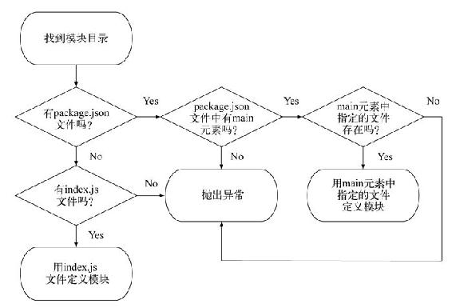

# Node.js

## 总结

### 关于模块

+ 每个文件是一个模块，有自己的作用域
+ 模块内部`module`变量代表模块本身
+ `module.exports`属性代表模块对外接口
+ 通过`module.exports`暴露模块里面的变量和方法

#### exports与module.exports的区别

`exports`是对`module.exports`的一个全局引用。

`exports.myFunc`只是`module.exports.myFunc`的简写。

`exports`用字面量输出的时候会重写`exports`，此时`exports`与`module.exports`没有任何关系。

使用`module.exports`导出没有任何问题。

#### require

引入规则:

当 Node 遇到 require(X) 时，按下面的顺序处理。

1.如果 X 是内置模块（比如 require('http'）)

    a. 返回该模块。
    b. 不再继续执行。

2.如果 X 以 "./" 或者 "/" 或者 "../" 开头

    a. 根据 X 所在的父模块，确定 X 的绝对路径。
    b. 将 X 当成文件，依次查找下面文件，只要其中有一个存在，就返回该文件，不再继续执行。
        X
        X.js
        X.json
        X.node
    c. 将 X 当成目录，依次查找下面文件，只要其中有一个存在，就返回该文件，不再继续执行。
        X/package.json（main字段）
        X/index.js
        X/index.json
        X/index.node

3.如果 X 不带路径

    a. 根据 X 所在的父模块，确定 X 可能的安装目录。
    b. 依次在每个目录中，将 X 当成文件名或目录名加载。

4.抛出 "not found"

##### require特性

+ module被加载的时候执行，加载后缓存(如果一个模块被加载多次，只有第一次加载的时候执行模块中语句)
+ 一旦出现某个模块被循环加载(A,B模块互相引用)，就只输出已经执行的部分，还未执行的部分不会输出

modA.js

```js
module.exports.test = 'A';

const modB = require('./modB');
console.log('modA: ', modB.test);

module.exports.test = 'AA';
```

modB.js

```js
module.exports.test = 'B';

const modA = require('./modA');
console.log('modB: ', modA.test);

module.exports.test = 'BB';
```

main.js

```js
const modA = require('./modA');

const modB = require('./modB');
```

terminal打印

```bash
modB: A
modA: BB
```

### 关于路径

`path.resolve()`用来转换相对当前路径的绝对路径。

以下都是绝对路径

+ `__dirname`: 获取当前执行文件所在目录的完整目录名
+ `__filename`: 获得当前执行文件的带有完整绝对路径的文件名
+ `process.cwd()`: 获得当前执行node命令时的文件夹目录名
+ `path.resolve('./')`: 文件所在目录(与`process.cwd()`一致)

`require`模块的时候，Node会在被执行程序文件(即调用`require`的文件)所在的目录下寻找这个模块。

在`require()`时采用相对路径，其他地方一律使用绝对路径。

## Node简介

+ 事件驱动
+ 非阻塞I/O

### Node特点

#### 异步I/O

Node的结构与Chrome十分相似，都是基于事件驱动的异步架构，浏览器通过事件驱动来服务界面上的交互，Node通过事件驱动来服务I/O。

异步调用中对于结果值得捕获符合"Don't call me,I will call you"原则。

Node中，异步I/O很常见，以读取文件为例，与前端Ajax调用的方式是及其类似的。

```javascript
var fs = require('fs');

fs.readFile('/path', function(err, file) {
    console.log('读取文件完成');
});
console.log('发起读取文件');
```

这里的“发起读取文件”是在“读取文件完成”之前输出的。“读取文件完成”的执行取决于读取文件的异步调用何时结束。

#### 事件与回调函数

事件的编程方式具有轻量级、松耦合、只关注事务点等优势。

回调函数无处不在，JavaScript中函数作为一等公民。将函数作为对象传递给方法进行调用。

#### 单线程

单线程的弱点有3个方面

+ 无法利用多核CPU
+ 错误会引起整个应用退出，应用的健壮性值得考验
+ 大量计算占用CPU导致无法继续调用异步I/O

## 模块机制

B/S和C/S

## Node中的定时器

`Node`在`c++`层和`OS`中使用了`libuv`库处理回调函数执行。

`Node`提供了四个定时器。

+ `setTimeout()`
+ `setInterval()`
+ `setImmediate()`
+ `prcess.nextTick()`

先看一个小例子

```js
// test.js
setTimeout(() => console.log(1));
setImmediate(() => console.log(2));
process.nextTick(() => console.log(3));
Promise.resolve().then(() => console.log(4));
(() => console.log(5))();
```

```js
$ node test.js
5
3
4
1
2
```

### 本轮循环和次轮循环

`process.nextTick`和`Promise`的回调函数追加在本轮循环。

`Node`执行完所有同步任务，就会执行`process.nextTick`的任务队列。

`Promise`对象的回调函数会进入异步任务里面的microtask队列。

> 只有前一个队列全部清空，才会执行下一个队列。

本轮循环的执行顺序为:

1. 同步任务
1. `process.nextTick()`
1. 微任务

## Node实战

第一部分 Node基础

### 第1章 欢迎进入Node.js世界

+ 构建在JavaScript之上
+ 事件驱动和异步的
+ 专为数据密集型实时程序设计的

#### 异步和事件触发:浏览器

浏览器中的`alert`,`prompt`,`confirm`,同步`XHR`会阻塞程序执行。

#### 异步和事件触发:服务器

Nginx采用的就是带有异步I/O的事件轮询

#### DIRT程序

DIRT(data-intensive real-time)数据密集型实时程序

文档在线协作，多人在线游戏

### 第2章 构建有多个房间的聊天室程序

为了提供静态文件，需要使用Node内置的http模块，通过HTTP提供文件时，通常不能只是发送文件中的内容，还应该有所发送文件的类型。也就是说要用正确的`MIME`类型设置HTTP头的`COntent-Type`。

聊天程序需要具备三个基本功能:

+ 给用户的Web浏览器提供静态文件
+ 在服务端处理与聊天相关的消息
+ 在用户的Web浏览器中处理与聊天相关的消息

访问内存(RAM)要比访问文件系统快，Node程序通常会把常用的数据存到内存里，第一次访问的时候会从文件系统中读取，后面就会从缓存中读取。

### 第3章 Node编程基础

#### Node模块

Node模块化视为了重用，他们不会改变全局作用域。

Node模块允许你从被引入文件中选择要暴露给程序的函数和变量。

```js
var canadianDollar = 0.91;

function roundTwoDecimals(amount) {
    return Math.round(amount * 100) / 100;
}

exports.canadianToUS = function(canadian) {
    return roundTwoDecimals(canadian * canadianDollar);
}

exports.USToCanadian = function(us) {
    return roundTwoDecimals(us / canadianDollar);
}
```

这个模块的exports对象上只设定了两个属性，引入这个模块的代码只能访问到`candianToUS`和`USToCanadian`这两个函数。而变量`canadianDollar`作为私有变量仅作用在`candianToUS`和`USToCanadian`的逻辑内部，程序不能直接访问它。

`require`是Node中少数几个同步I/O操作之一。

`require`模块的时候，Node会在被执行程序文件所在的目录下寻找这个模块。



#### 异步编程技术

Node中比较常用的异步有

+ callback
+ 事件监听

事件监听本质上也是回调，它跟事件相关联。

每当服务器收到请求，就触发`handleRequest`这个函数。

```js
server.on('request', handleRequest);
```

callback hell的例子

```js
var http = require('http');
var fs = require('fs');

http.createServer(function (req, res) {
    if (req.url == '/') {
        fs.readFile('./titles.json', function (err, data) {
            if (err) {
                console.error(err);
                res.end('Server Error');
            } else {
                var titles = JSON.parse(data.toString());

                fs.readFile('./template.html', function (err, data) {
                    if (err) {
                        console.error(err);
                        res.end('Server Error');
                    } else {
                        var tmpl = data.toString();

                        var html = tmpl.replace('%', titles.join('</li><li>'));
                        res.writeHead(200, {
                            'Content-Type': 'text/html'
                        });
                        res.end(html);
                    }
                });
            }
        });
    }
}).listen(8000, "127.0.0.1");
```

calback时代的node程序为了减少callback嵌套可以使用创建中间函数，以及尽早返回的方法。

```js
var http = require('http');
var fs = require('fs');

var server = http.createServer(function (req, res) {
    getTitles(res);
}).listen(8000, "127.0.0.1");

function getTitles(res) {
    fs.readFile('./titles.json', function (err, data) {
        if (err) return hadError(err, res);
        getTemplate(JSON.parse(data.toString()), res);
    })
}

function getTemplate(titles, res) {
    fs.readFile('./template.html', function (err, data) {
        if (err) return hadError(err, res);
        formatHtml(titles, data.toString(), res);
    });
}

function formatHtml(titles, tmpl, res) {
    var html = tmpl.replace('%', titles.join('</li><li>'));
    res.writeHead(200, {
        'Content-Type': 'text/html'
    });
    res.end(html);
}

function hadError(err, res) {
    console.error(err);
    res.end('Server Error');
}
```

##### 使用事件发射器处理重复性事件

```js
// 使用on监听事件
socket.on('data', function(data) {
    socket.write(data);
});

// 使用once方法响应单次事件
socket.once('data', function(data) {
    socket.write(data);
});
```

所有触发事件的对象都是`events`的实例。

```js
const EventEmitter = require('events');

class CustomEvent extends EventEmitter {

}

const ce = new CustomEvent();

ce.on('error', (err, time) => {
    console.log(err);
    console.log(time);
});

ce.emit('error', new Error('opps!'), Date.now());
```

##### 扩展事件监听器:文件监视器

扩展事件发射器需要三步

+ 创建类的构造器
+ 继承事件发射器的行为
+ 扩展这些行为

`inherits`函数是Node内置的`util`模块里的，使用`inherits`函数继承另一个对象里的行为非常简洁。

```js
function Watcher(watchDir, processedDir) {
    this.watchDir = watchDir;
    this.processedDir = processedDir;
}

var events = require('events'),
    util = require('util');

util.inherits(Watcher, events.EventEmitter);
```

#### 流程控制(异步逻辑的顺序化)

实现串行化流程控制时，需要跟踪当前执行的任务，或维护一个尚未执行的任务队列。实现并行化流程控制需要跟踪有多少个任务已经执行完成。

```js
var fs = require('fs');
var request = require('request');
var htmlparser = require('htmlparser');
var configFilename = './rss_feeds.txt';

function checkForRSSFile() {
    fs.exists(configFilename, function (exists) {
        if (!exists)
            return next(new Error('Missing RSS file: ' + configFilename));

        next(null, configFilename);
    });
}

function readRSSFile(configFilename) {
    fs.readFile(configFilename, function (err, feedList) {
        if (err) return next(err);

        feedList = feedList
            .toString()
            .replace(/^\s+|\s+$/g, '')
            .split("\n");
        var random = Math.floor(Math.random() * feedList.length);
        next(null, feedList[random]);
    });
}

function downloadRSSFeed(feedUrl) {
    request({
        uri: feedUrl
    }, function (err, res, body) {
        if (err) return next(err);
        if (res.statusCode != 200)
            return next(new Error('Abnormal response status code'))

        next(null, body);
    });
}

function parseRSSFeed(rss) {
    var handler = new htmlparser.RssHandler();
    var parser = new htmlparser.Parser(handler);
    parser.parseComplete(rss);

    if (!handler.dom.items.length)
        return next(new Error('No RSS items found'));

    var item = handler.dom.items.shift();
    console.log(item.title);
    console.log(item.link);
}

var tasks = [checkForRSSFile,
    readRSSFile,
    downloadRSSFeed,
    parseRSSFeed
];

function next(err, result) {
    if (err) throw err;

    var currentTask = tasks.shift();

    if (currentTask) {
        currentTask(result);
    }
}

next();
```

本例中串行化流程控制本质是在需要时让回调进场、而不是简单地把它们嵌套起来。

下面是并行化流程控制，程序会读取几个文本文件的内容，输出单词在整个文件中出现的次数。

```js
var fs = require('fs');
var completedTasks = 0;
var tasks = [];
var wordCounts = {};
var filesDir = './text';

function checkIfComplete() {
    completedTasks++;
    if (completedTasks == tasks.length) {
        for (var index in wordCounts) {
            console.log(index + ': ' + wordCounts[index]);
        }
    }
}

function countWordsInText(text) {
    var words = text
        .toString()
        .toLowerCase()
        .split(/\W+/)
        .sort();
    for (var index in words) {
        var word = words[index];
        if (word) {
            wordCounts[word] = (wordCounts[word]) ? wordCounts[word] + 1 : 1;
        }
    }
}

fs.readdir(filesDir, function (err, files) {
    if (err) throw err;
    for (var index in files) {
        var task = (function (file) {
            return function () {
                fs.readFile(file, function (err, text) {
                    if (err) throw err;
                    countWordsInText(text);
                    checkIfComplete();
                });
            }
        })(filesDir + '/' + files[index]);
        tasks.push(task);
    }
    for (var task in tasks) {
        tasks[task]();
    }
});
```

