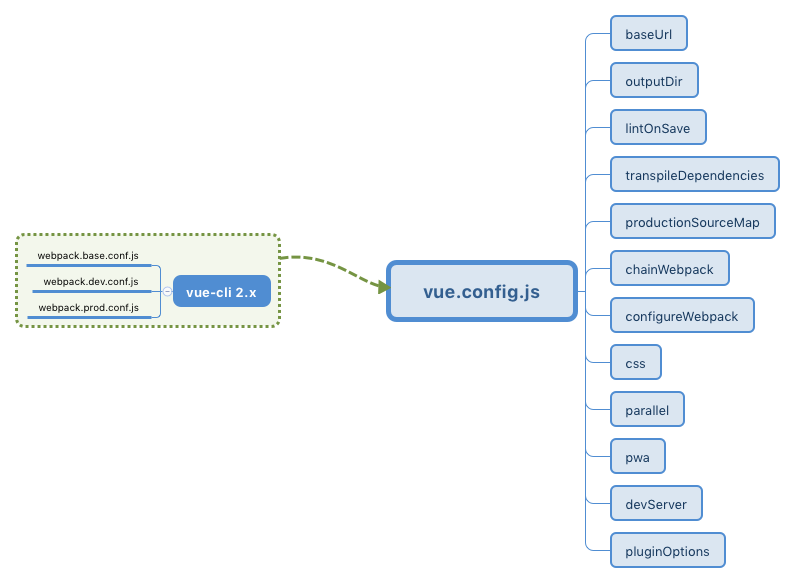

# Vue

## 疑问

- $attrs 是否只是方便组件的参数传递

## 记录

常用命令

```sh
vue ui // 3.0+ cli打开视图命令
```

将数据放在data中，双向绑定，相互影响;

核心思想: 数据驱动，jQuery是结构驱动

目录结构

+ package.json中存放依赖信息
+ config保存一些项目初始化配置
+ build里面保存一些webpack的初始化配置
+ main.js是入口js文件

router

> 根据页面当前url来判断router-view中渲染什么组件

node端之所以能识别.vue文件，是因为前面说的webpack在编译时将.vue文件中的html，js，css都抽出来合成新的单独的文件。

使用锚点路由可以做到不用刷新页面

router中配置的name属性相当于一个备注

script中加入命名标签，打包程序会加上命名空间，确保样式之类不会冲突

props是专门用来暴露组件的属性接口的

那就是页面加载数据时，原始代码会闪现一下。

首先加入一段CSS代码

```html
<style type="text/css">
  [v-cloak] {
    display: none;
  }
</style>
```

直接在vue挂载点上加入`v-cloak`指令

```html
<div id="app" v-cloak>
    <h1>{{message}}</h1>
    <h1>{{name}}</h1>
</div>
```

某些时候异步请求会导致`undefined`，两种解决方案，一种是data中事先就按数据格式写好，另一种是模板中加入`v-if`判断。

移动端使用`@touchmove.prevent`禁用遮罩底层滑动，PC端使用`@scroll.prevent`禁用滚动。

```html
<div class="fixed" @touchmove.prevent>
  <p>大扎好，我系渣渣辉!</p>
</div>
```

```html
<template>
  <div class="wrapper" ref="wrapper">
    <ul class="content">
      <li>...</li>
      <li>...</li>
      ...
    </ul>
  </div>
</template>
```

`Vue.js`提供了我们一个获取`DOM`对象的接口——`vm.$refs`。在这里，我们通过了 `this.$refs.wrapper`访问到了这个`DOM`对象。

`v-if`有更高的切换消耗，适合运营条件不大可能改变；`v-show`有更高的初始渲染消耗，适合频繁切换。

## Vue实例

所有的`Vue`组件都是`Vue`实例，并且接受相同的选项对象 (一些根实例特有的选项除外)。

值得注意的是只有当实例被创建时`data`中存在的属性才是响应式的。

如果添加一个新的属性:

```js
vm.a = 'hehe';
```

`a`的改动不会触发任何视图的更新。

### 生命周期钩子

每个`Vue`实例在被创建时都要经过一系列的初始化过程——例如，需要设置数据监听、编译模板、将实例挂载到`DOM`并在数据变化时更新`DOM`等。同时在这个过程中也会运行一些叫做生命周期钩子的函数，这给了用户在不同阶段添加自己的代码的机会。

> `Vue`中使用箭头函数一定要注意`this`的值。


## 基本指令

声明式渲染

+ `{{}}`也叫`v-text` 文本渲染
+ `v-bind` 属性绑定 :

条件与循环

+ `v-if` DOM不渲染
+ `v-show` 通过display控制隐藏
+ `v-for` 列表渲染

处理用户输入

+ `v-on` 事件绑定 @
+ `v-model` 表单控件使用

### 1. 声明式渲染

#### `{{}}`

采用简洁的模板语法来声明式的将数据渲染进`DOM`

```html
<div id="app">
  {{ message }}
</div>
```

```js
var app = new Vue({
  el: '#app',
  data: {
    message: 'Hello Vue!'
  }
})
```

#### `v-bind`

属性绑定

使用`v-bind`就是让使用`v-bind`的地方当成`JavaScript`表达式来计算。

```html
<div id="app-2">
  <span v-bind:title="message">
    鼠标悬停几秒钟查看此处动态绑定的提示信息！
  </span>
</div>
```

```javascript
var app2 = new Vue({
  el: '#app-2',
  data: {
    message: '页面加载于 ' + new Date().toLocaleString()
  }
})
```

`v-bind:title="message"`可以简写为`:title="message"`

`<div :f="{ active: isActive }"><div>`
通过`isActive`的值来绑定`div`的`active`属性

### 2. 条件与循环

#### `v-if`

```html
<div id="app-3">
  <p v-if="seen">现在你看到我了</p>
</div>
```

```javascript
var app3 = new Vue({
  el: '#app-3',
  data: {
    seen: true
  }
})
```

`v-if`控制的是标签不渲染
`v-show`是设置标签`display:none`

#### `v-for`

```html
<div id="app-4">
  <ol>
    <li v-for="todo in todos">
      {{ todo.text }}
    </li>
  </ol>
</div>
```

```javascript
var app4 = new Vue({
  el: '#app-4',
  data: {
    todos: [
      { text: '学习 JavaScript' },
      { text: '学习 Vue' },
      { text: '整个牛项目' }
    ]
  }
})
```

`app4.todos.push({ text: '新项目' })`会添加新项目，访问`todos`，直接`app4.todos`即可。

### 3. 处理用户输入

#### `v-on`

`v-on`用于监听DOM事件

```html
<div id="app-5">
  <p>{{ message }}</p>
  <button v-on:click="reverseMessage">逆转消息</button>
</div>
```

```javascript
var app5 = new Vue({
  el: '#app-5',
  data: {
    message: 'Hello Vue.js!'
  },
  methods: {
    reverseMessage: function () {
    this.message = this.message.split('').reverse().join('')
    }
  }
})
```

`v-on:click`可以简写为`@click`

#### `v-model`

用来处理表单控件

```html
<div id="app-6">
  <p>{{ message }}</p>
  <input v-model="message">
</div>
```

```javascript
var app6 = new Vue({
  el: '#app-6',
  data: {
    message: 'Hello Vue!'
  }
})
```

## 模板语法

通过使用`v-once`指令，你也能执行一次性地插值，当数据改变时，插值处的内容不会更新。但请留心这会影响到该节点上所有的数据绑定：

```html
<span v-once>这个将不会改变: {{ msg }}</span>
```

### 使用JavaScript表达式

迄今为止，在我们的模板中，我们一直都只绑定简单的属性键值。但实际上，对于所有的数据绑定，Vue.js 都提供了完全的 JavaScript 表达式支持。

```html
{{ number + 1 }}
{{ ok ? 'YES' : 'NO' }}
{{ message.split('').reverse().join('') }}
<div v-bind:id="'list-' + id"></div>
```

这些表达式会在所属 Vue 实例的数据作用域下作为 JavaScript 被解析。有个限制就是，每个绑定都只能包含单个表达式，所以下面的例子都不会生效。

```html
<!-- 这是语句，不是表达式 -->
{{ var a = 1 }}
<!-- 流控制也不会生效，请使用三元表达式 -->
{{ if (ok) { return message } }}
```

> 模板表达式都被放在沙盒中，只能访问全局变量的一个白名单，如`Math`和`Date`。你不应该在模板表达式中试图访问用户定义的全局变量。

### `v-bind` 缩写

``` html
<!-- 完整语法 -->
<a v-bind:href="url"></a>
<!-- 缩写 -->
<a :href="url"></a>
```

### `v-on` 缩写

```html
<!-- 完整语法 -->
<a v-on:click="doSomething"></a>
<!-- 缩写 -->
<a @click="doSomething"></a>
```

## 计算属性

模板中放入过多逻辑会让模板过重难以维护，对于任何复杂逻辑都应该使用**计算属性**。

```html
<div id="example">
  <p>Original message: "{{ message }}"</p>
  <p>ted reversed message: "{{ reversedMessage }}"</p>
</div>
```

```javascript
var vm = new Vue({
  el: '#example',
  data: {
    message: 'Hello'
  },
  computed: {
    // a computed getter
    reversedMessage: function () {
      // `this` points to the vm instance
      return this.message.split('').reverse().join('')
    }
  }
})
```

### 计算属性缓存

在表达式中调用方法同样可以达到目的

```html
<p>Reversed message: "{{ reversedMessage() }}"</p>
```

```javascript
// in component
methods: {
  reversedMessage: function () {
    return this.message.split('').reverse().join('')
  }
}
```

不同的是计算属性是基于它们的依赖关系进行缓存，只要依赖关系没有发生变化，多次访问会立即返回结果，不必再次执行函数。

### 计算属性的`setter`

计算属性默认只有`getter`,也可以添加`setter`

```js
computed: {
  fullName: {
    // getter
    get: function () {
      return this.firstName + ' ' + this.lastName
    },
    // setter
    set: function (newValue) {
      var names = newValue.split(' ')
      this.firstName = names[0]
      this.lastName = names[names.length - 1]
    }
  }
}
```

现在再运行`vm.fullName = 'John Doe'`时，`setter`会被调用，`vm.firstName`和`vm.lastName`也会相应地被更新。

```html
<!-- Since there is already a rich ecosystem of ajax libraries    -->
<!-- and collections of general-purpose utility methods, Vue core -->
<!-- is able to remain small by not reinventing them. This also   -->
<!-- gives you the freedom to just use what you're familiar with. -->
<script src="https://cdn.jsdelivr.net/npm/axios@0.12.0/dist/axios.min.js"></script>
<script src="https://cdn.jsdelivr.net/npm/lodash@4.13.1/lodash.min.js"></script>
<script>
var watchExampleVM = new Vue({
  el: '#watch-example',
  data: {
    question: '',
    answer: 'I cannot give you an answer until you ask a question!'
  },
  watch: {
    // 如果 question 发生改变，这个函数就会运行
    question: function (newQuestion) {
      this.answer = 'Waiting for you to stop typing...'
      this.getAnswer()
    }
  },
  methods: {
    // _.debounce 是一个通过 lodash 限制操作频率的函数。
    // 在这个例子中，我们希望限制访问 yesno.wtf/api 的频率
    // ajax 请求直到用户输入完毕才会发出
    // 学习更多关于 _.debounce function (and its cousin
    // _.throttle)，参考：https://lodash.com/docs#debounce
    getAnswer: _.debounce(
      function () {
        if (this.question.indexOf('?') === -1) {
          this.answer = 'Questions usually contain a question mark. ;-)'
          return
        }
        this.answer = 'Thinking...'
        var vm = this
        axios.get('https://yesno.wtf/api')
          .then(function (response) {
            vm.answer = _.capitalize(response.data.answer)
          })
          .catch(function (error) {
            vm.answer = 'Error! Could not reach the API. ' + error
          })
      },
      // 这是我们为用户停止输入等待的毫秒数
      500
    )
  }
})
</script>
```

## Class与Style绑定

### 绑定HTML Class

#### 对象语法

我们可以传给`v-bind:class`一个对象，以动态地切换class：

```html
<div v-bind:class="{ active: isActive }"></div>
```

上面的语法表示`classactive`的更新将取决于数据属性 `isActive`是否为真值。

结合计算属性一起使用

```html
<div v-bind:class="classObject"></div>
```

```javascript
data: {
  isActive: true,
  error: null
},
computed: {
  classObject: function () {
    return {
      'active': this.isActive && !this.error,
      'text-danger': this.error && this.error.type === 'fatal'
    }
  }
}
```

#### 数组语法

把一个数组传给`v-bind:class`，以应用一个class列表：

```html
<div v-bind:class="[activeClass, errorClass]"></div>
```

```js
data: {
  activeClass: 'active',
  errorClass: 'text-danger'
}
```

渲染为：

```html
<div class="active text-danger"></div>
```

与对象语法结合使用

```html
<div v-bind:class="[{ active: isActive }, errorClass]"></div>
```

## 条件渲染

```html
<div v-if="Math.random() > 0.5">
  Now you see me
</div>
<div v-else>
  Now you don't
</div>
```

`v-else`元素必须紧跟在`v-if`或者`v-else-if`元素的后面——否则它将不会被识别。

v-else-if，顾名思义，充当 v-if 的“else-if 块”，可以连续使用：

```html
<div v-if="type === 'A'">
  A
</div>
<div v-else-if="type === 'B'">
  B
</div>
<div v-else-if="type === 'C'">
  C
</div>
<div v-else>
  Not A/B/C
</div>
```

类似于`v-else`，`v-else-if`也必须紧跟在带`v-if`或者`v-else-if`的元素之后。

## 用`key`管理可复用的元素

`Vue`会尽可能高效地渲染元素，通常会复用已有元素而不是从头开始渲染。

```html
<template v-if="loginType === 'username'">
  <label>Username</label>
  <input placeholder="Enter your username">
</template>
<template v-else>
  <label>Email</label>
  <input placeholder="Enter your email address">
</template>
```

两个模板使用相同的元素，切换的时候仅仅是替换不同的属性或者内容。

如果需要指明两个元素是完全独立的，不需要复用，指定一个`key`即可。

```html
<template v-if="loginType === 'username'">
  <label>Username</label>
  <input placeholder="Enter your username" key="username-input">
</template>
<template v-else>
  <label>Email</label>
  <input placeholder="Enter your email address" key="email-input">
</template>
```

> `label`元素仍然会被复用，因为没有指定`key`

## 列表渲染

变异方法

Vue包含一组观察数组的变异方法，所以它们也将会触发视图更新。这些方法如下：

```js
push()
pop()
shift()
unshift()
splice()
sort()
reverse()
```

使用这些方法对数组进行操作

### `v-for` with `v-if`

当它们处于同一节点，`v-for`的优先级比`v-if`更高，这意味着`v-if`将分别重复运行于每个`v-for`循环中。当你想为仅有的一些项渲染节点时，这种优先级的机制会十分有用，如下:

```html
<li v-for="todo in todos" v-if="!todo.isComplete">
  {{ todo }}
</li>
```

上面的代码只传递了未complete的todos。

### 一个对象的`v-for`

```js
new Vue({
  el: '#v-for-object',
  data: {
    object: {
      firstName: 'John',
      lastName: 'Doe',
      age: 30
    }
  }
})
```

```html
<div v-for="(value, key, index) in object">
  {{ index }}. {{ key }}: {{ value }}
</div>
```

> 遍历对象按照`Object.keys()`的结果遍历，不能保证在不同引擎下的结果一致。

## 对象更改的注意事项

对于已经创建的实例，`Vue`不能动态添加根级别的响应式属性。但是，可以使用`Vue.set(object, key, value)`方法向嵌套对象添加响应式属性。

```js
var vm = new Vue({
  data: {
    userProfile: {
      name: 'Anika'
    }
  }
})
```

```js
//添加一个新的 age 属性到嵌套的 userProfile 对象
Vue.set(vm.userProfile, 'age', 27)
//使用 vm.$set 实例方法，它只是全局 Vue.set 的别名
vm.$set(vm.userProfile, 'age', 27)
```

需要对已有对象赋新属性最好这么做

```js
vm.userProfile = Object.assign({}, vm.userProfile, {
  age: 27,
  favoriteColor: 'Vue Green'
})
```

## 事件处理

`v-on`指令监听DOM事件来触发一些JavaScript代码

```html
<div id="example-1">
  <button v-on:click="counter += 1">增加 1</button>
  <p>这个按钮被点击了 {{ counter }} 次。</p>
</div>
```

```javascript
var example1 = new Vue({
  el: '#example-1',
  data: {
    counter: 0
  }
})
```

### 事件修饰符

在事件处理程序中调用`event.preventDefault()`或 `event.stopPropagation()`是非常常见的需求。尽管我们可以在`methods`中轻松实现这点，但更好的方式是：`methods`只有纯粹的数据逻辑，而不是去处理DOM事件细节。
为了解决这个问题，Vue.js为`v-on`提供了事件修饰符。通过由点 (.) 表示的指令后缀来调用修饰符。

+ .stop
+ .prevent
+ .capture
+ .self
+ .once

```html
<!-- 阻止单击事件冒泡 -->
<a v-on:click.stop="doThis"></a>
<!-- 提交事件不再重载页面 -->
<form v-on:submit.prevent="onSubmit"></form>
<!-- 修饰符可以串联 -->
<a v-on:click.stop.prevent="doThat"></a>
<!-- 只有修饰符 -->
<form v-on:submit.prevent></form>
<!-- 添加事件侦听器时使用事件捕获模式 -->
<div v-on:click.capture="doThis">...</div>
<!-- 只当事件在该元素本身 (比如不是子元素) 触发时触发回调 -->
<div v-on:click.self="doThat">...</div>
<!-- 点击事件将只会触发一次 -->
<a v-on:click.once="doThis"></a>
```

## 按键修饰符

```html
<!-- 只有在 `keyCode` 是 13 时调用 `vm.submit()` -->
<input v-on:keyup.13="submit">

<!-- Vue为常用的按键提供了别名-->

<!-- 同上 -->
<input v-on:keyup.enter="submit">

<!-- 缩写语法 -->
<input @keyup.enter="submit">
```

全部的按键别名：

+ .enter
+ .tab
+ .delete (捕获“删除”和“退格”键)
+ .esc
+ .space
+ .up
+ .down
+ .left
+ .right

可以通过全局`config.keyCodes`对象自定义按键修饰符别名：

```js
// 可以使用 `v-on:keyup.f1`
Vue.config.keyCodes.f1 = 112
```

## 表单输入绑定

`v-model`本质上是语法糖。负责监听用户输入事件以更新数据。

`v-model`会忽略所有表单元素的`value`、`checked`、`selected`特性的初始值而总是将`Vue`实例的数据作为数据来源。你应该通过`JavaScript`在组件的`data`选项中声明初始值。

### 修饰符

1.`.lazy`

当`enter`或者跳出时才更新数据。

## 组件

组件 (`Component`) 是`Vue.js`最强大的功能之一。组件可以扩展`HTML`元素，封装可重用的代码。在较高层面上，组件是自定义元素，`Vue.js`的编译器为它添加特殊功能。

### 全局注册

确保在初始化根实例之前注册组件。

```js
// 注册
Vue.component('my-component', {
  template: '<div>A custom component!</div>'
})

// 创建根实例
new Vue({
  el: '#example'
})
```

### 局部注册

通过某个`Vue`实例/组件的实例选项`components`注册仅在其作用域中可用的组件。

```js
var Child = {
  template: '<div>A custom component!</div>'
}

new Vue({
  // ...
  components: {
    // <my-component> 将只在父组件模板中可用
    'my-component': Child
  }
})
```

### DOM模板解析注意事项

当使用`DOM`作为模板时 (例如，使用`el`选项来把`Vue`实例挂载到一个已有内容的元素上)，你会受到`HTML`本身的一些限制，因为`Vue`只有在浏览器解析、规范化模板之后才能获取其内容。尤其要注意，像`<ul>`、`<ol>`、`<table>`、`<select>`这样的元素里允许包含的元素有限制，而另一些像`<option>`这样的元素只能出现在某些特定元素的内部。

如果使用`JS`内联字符串模板则没有这些限制，`.vue`组件也没有这些限制。

### data必须是函数

在组件实例中`data`必须是一个函数。

这里演示一下为什么这么做。

```js
var data = { counter: 0 }

Vue.component('simple-counter', {
  template: '<button v-on:click="counter += 1">{{ counter }}</button>',
  // 技术上 data 的确是一个函数了，因此 Vue 不会警告，
  // 但是我们却给每个组件实例返回了同一个对象的引用
  data: function () {
    return data
  }
})

new Vue({
  el: '#example-2'
})
```

这样多个组件的状态共享(相同)。

### 组件组合

父子组件的关系可以总结为`prop`向下传递，事件向上传递。

### 单向数据流

每次父组件更新时，子组件的所有`prop`都会更新为最新值。这意味着不应该在子组件内部改变`prop`。如果这么做了，`Vue`会在控制台给出警告。

在两种情况下，我们很容易忍不住想去修改`prop`中数据：

1. `Prop`作为初始值传入后，子组件想把它当作局部数据来用；
1. `Prop`作为原始数据传入，由子组件处理成其它数据输出。

对这两种情况，正确的应对方式是：

定义一个局部变量，并用`prop`的值初始化它：

```js
props: ['initialCounter'],
data: function () {
  return { counter: this.initialCounter }
}
```

定义一个计算属性，处理`prop`的值并返回：

```js
props: ['size'],
computed: {
  normalizedSize: function () {
    return this.size.trim().toLowerCase()
  }
}
```

### `Prop`验证

可以为组件的`prop`指定验证规则。如果传入的数据不符合要求，`Vue`会发出警告。这对于开发给他人使用的组件非常有用。

```js
Vue.component('example', {
  props: {
    // 基础类型检测 (`null` 指允许任何类型)
    propA: Number,
    // 可能是多种类型
    propB: [String, Number],
    // 必传且是字符串
    propC: {
      type: String,
      required: true
    },
    // 数值且有默认值
    propD: {
      type: Number,
      default: 100
    },
    // 数组/对象的默认值应当由一个工厂函数返回
    propE: {
      type: Object,
      default: function () {
        return { message: 'hello' }
      }
    },
    // 自定义验证函数
    propF: {
      validator: function (value) {
        return value > 10
      }
    }
  }
})
```

### 自定义事件

父组件可以在使用子组件的地方直接用`v-on`来监听子组件触发的事件。

```html
<div id="counter-event-example">
  <p>{{ total }}</p>
  <button-counter v-on:increment="incrementTotal"></button-counter>
  <button-counter v-on:increment="incrementTotal"></button-counter>
</div>
```

```js
Vue.component('button-counter', {
  template: '<button v-on:click="incrementCounter">{{ counter }}</button>',
  data: function () {
    return {
      counter: 0
    }
  },
  methods: {
    incrementCounter: function () {
      this.counter += 1
      this.$emit('increment')
    }
  },
})

new Vue({
  el: '#counter-event-example',
  data: {
    total: 0
  },
  methods: {
    incrementTotal: function () {
      this.total += 1
    }
  }
})
```

这个例子中，子组件与和外部完全解耦。

```html
<div id="message-event-example" class="demo">
  <p v-for="msg in messages">{{ msg }}</p>
  <button-message v-on:message="handleMessage"></button-message>
</div>
```

```js
Vue.component('button-message', {
  template: `<div>
    <input type="text" v-model="message" />
    <button v-on:click="handleSendMessage">Send</button>
  </div>`,
  data: function () {
    return {
      message: 'test message'
    }
  },
  methods: {
    handleSendMessage: function () {
      this.$emit('message', { message: this.message })
    }
  }
})

new Vue({
  el: '#message-event-example',
  data: {
    messages: []
  },
  methods: {
    handleMessage: function (payload) {
      this.messages.push(payload.message)
    }
  }
})
```

这给例子子组件与外界仍是完全解耦的。

## 过渡 & 动画

### 单元素/组件的过渡

当插入或删除包含在`transition`组件中的元素时，Vue将会做以下处理：

自动嗅探目标元素是否应用了CSS过渡或动画，如果是，在恰当的时机添加/删除CSS类名。

如果过渡组件提供了JavaScript钩子函数，这些钩子函数将在恰当的时机被调用。

如果没有找到JavaScript钩子并且也没有检测到CSS过渡/动画，DOM 操作 (插入/删除) 在下一帧中立即执行。(注意：此指浏览器逐帧动画机制，和Vue的`nextTick`概念不同)

#### 过渡的类名

在进入/离开的过渡中，会有6个class切换。

`v-enter`：定义进入过渡的开始状态。在元素被插入之前生效，在元素被插入之后的下一帧移除。

`v-enter-active`：定义进入过渡生效时的状态。在整个进入过渡的阶段中应用，在元素被插入之前生效，在过渡/动画完成之后移除。这个类可以被用来定义进入过渡的过程时间，延迟和曲线函数。

`v-enter-to`: **2.1.8版及以上** 定义进入过渡的结束状态。在元素被插入之后下一帧生效(与此同时`v-enter`被移除)，在过渡/动画完成之后移除。

`v-leave`: 定义离开过渡的开始状态。在离开过渡被触发时立刻生效，下一帧被移除。

`v-leave-active`：定义离开过渡生效时的状态。在整个离开过渡的阶段中应用，在离开过渡被触发时立刻生效，在过渡/动画完成之后移除。这个类可以被用来定义离开过渡的过程时间，延迟和曲线函数。

`v-leave-to`: **2.1.8版及以上**定义离开过渡的结束状态。在离开过渡被触发之后下一帧生效(与此同时`v-leave`被删除)，在过渡/动画完成之后移除。


#### CSS过渡

```html
<div id="example-1">
  <button @click="show = !show">
    Toggle render
  </button>
  <transition name="slide-fade">
    <p v-if="show">hello</p>
  </transition>
</div>
```

```js
new Vue({
  el: '#example-1',
  data: {
    show: true
  }
})
```

```css
/* 可以设置不同的进入和离开动画 */
/* 设置持续时间和动画函数 */
.slide-fade-enter-active {
  transition: all .3s ease;
}
.slide-fade-leave-active {
  transition: all .8s cubic-bezier(1.0, 0.5, 0.8, 1.0);
}
.slide-fade-enter, .slide-fade-leave-to
/* .slide-fade-leave-active for below version 2.1.8 */ {
  transform: translateX(10px);
  opacity: 0;
}
```

### 多个元素的过渡

> 相同标签名的元素切换时，需要通过`key`来让Vue区分他们

#### 过渡模式

同时生效的进入和离开的过渡不能满足所有要求，所以Vue提供了过渡模式:

`in-out`：新元素先进行过渡，完成之后当前元素过渡离开。

`out-in`：当前元素先进行过渡，完成之后新元素过渡进入。

### 多个组件的过渡

使用动态组件:

```html
<transition name="component-fade" mode="out-in">
  <component v-bind:is="view"></component>
</transition>
```

```js
new Vue({
  el: '#transition-components-demo',
  data: {
    view: 'v-a'
  },
  components: {
    'v-a': {
      template: '<div>Component A</div>'
    },
    'v-b': {
      template: '<div>Component B</div>'
    }
  }
})
```

```css
.component-fade-enter-active, .component-fade-leave-active {
  transition: opacity .3s ease;
}
.component-fade-enter, .component-fade-leave-to
/* .component-fade-leave-active for below version 2.1.8 */ {
  opacity: 0;
}
```

## 过滤器

在HTML模板中的用法

```html
<!-- 在双花括号中 -->
{{ message | filterTest }}
<!-- 在 `v-bind` 中 -->
<div :id="message | filterTest"></div>
```

在组件script中的用法

## mixin

### 选项合并

数据对象在内部会进行浅合并(一层属性深度)，在和组件的数据发生冲突时以组件数据优先。

同名钩子函数将混合成一个数组，因此都将被调用。且混入对象的钩子将在组件自身钩子之前调用。

值为对象的选项，例如`methods`，`components`和`directives`，将被混合为同一个对象。两个对象键名冲突时，取组件对象的键值对。

## Vue-router

### Getting Start

```js
// 4. 创建和挂载根实例。
// 记得要通过 router 配置参数注入路由，
// 从而让整个应用都有路由功能
const app = new Vue({
  router
}).$mount('#app')
```

通过注入路由，可以在任何组件内通过`this.$router`访问路由。

### Dynamic Route Matching

一个『路径参数』使用冒号`:`标记。当匹配到一个路由时，参数值会被设置到`this.$route.params`，可以在每个组件内使用。

模式|匹配路径|$route.params
---|---|---
/user/:username|/user/evan|`{ username: 'evan' }`
/user/:username/post/:post_id|/user/evan/post/123|`{ username: 'evan', post_id: 123 }`

#### 响应路由参数的变化

当使用路由参数时，比如从`/user/foo`导航到`/user/bar`，原有组件实例会被复用，这意味着不会调用组件的`destroy`钩子。

### Nested Routes

```js
const User = {
  template: `
    <div class="user">
      <h2>User {{ $route.params.id }}</h2>
      <router-view></router-view>
    </div>
  `
}
```

```js
const router = new VueRouter({
  routes: [
    { path: '/user/:id', component: User,
      children: [
        {
          // 当 /user/:id/profile 匹配成功，
          // UserProfile 会被渲染在 User 的 <router-view> 中
          path: 'profile',
          component: UserProfile
        },
        {
          // 当 /user/:id/posts 匹配成功
          // UserPosts 会被渲染在 User 的 <router-view> 中
          path: 'posts',
          component: UserPosts
        }
      ]
    }
  ]
})
```

### Programmatic Navigation

声明式|编程式
---|---
`<router-link :to="...">`|`router.push(...)`

+ `router.push()` 向`history`栈添加一个新记录
+ `router.replace()` 不会向`history`添加新记录，替换掉当前的`history`记录
+ `router.go(n)` 在`history`记录中向前或向后退多少步

### Named Routes

给路由指定一个名称

```js
const router = new VueRouter({
  routes: [
    {
      path: '/user/:userId',
      name: 'user',
      component: User
    }
  ]
})
```

链接到命名路由

```html
<router-link :to="{ name: 'user', params: { userId: 123 }}">User</router-link>
```

```js
router.push({ name: 'user', params: { userId: 123 }})
```

### Named Views

命名视图提供了同级展示多个视图的能力。如果没有给`router-view`设置名字，默认为`default`。

```html
<router-view class="view one"></router-view>
<router-view class="view two" name="a"></router-view>
<router-view class="view three" name="b"></router-view>
```

```js
const router = new VueRouter({
  routes: [
    {
      path: '/',
      components: {
        default: Foo,
        a: Bar,
        b: Baz
      }
    }
  ]
})
```

### Redirect and Alias

/a重定向到/b

```js
const router = new VueRouter({
  routes: [
    { path: '/a', redirect: '/b' }
  ]
})
```

```js
const router = new VueRouter({
  routes: [
    { path: '/a', redirect: { name: 'foo' }}
  ]
})
```

/a 的别名是 /b，意味着，当用户访问 /b 时，URL 会保持为 /b，但是路由匹配则为 /a，就像用户访问 /a 一样。

```js
const router = new VueRouter({
  routes: [
    { path: '/a', component: A, alias: '/b' }
  ]
})
```

别名的功能让你可以自由地将 UI 结构映射到任意的。

### Passing Props to Route Components

### HTML5 History Mode

### route object

(route object)[https://router.vuejs.org/zh-cn/api/route-object.html]

路由信息对象属性

+ $route.path
+ $route.params
+ $route.query
+ $route.hash
+ $route.fullPath
+ $route.matched
+ $route.name
+ $route.redirectedFrom
+ $route.meta // 如果配置了的话,否则为undefined

### Navigation Guards

可以通过`router.beforeEach`注册一个全局前置守卫

```js
const router = new VueRouter({ ... })

router.beforeEach((to, from, next) => {
  // ...
})
```

每个守卫接收三个参数

+ to : Route 即将要进入目标的路由对象
+ from : Route 当前导航正要离开的路由
+ next : Function 调用该方法来`resolve`钩子

### Route Meta Fields

我们称呼`routes`配置中的每个路由对象为 路由记录。路由记录可以是嵌套的，因此，当一个路由匹配成功后，他可能匹配多个路由记录。

一个路由匹配到的所有路由记录会暴露为`$route`对象（还有在导航守卫中的路由对象）的`$route.matched`数组。因此，我们需要遍历`$route.matched`来检查路由记录中的`meta`字段。

```js
router.beforeEach((to, from, next) => {
  if (to.matched.some(record => record.meta.requiresAuth)) {
    // this route requires auth, check if logged in
    // if not, redirect to login page.
    if (!auth.loggedIn()) {
      next({
        path: '/login',
        query: { redirect: to.fullPath }
      })
    } else {
      next()
    }
  } else {
    next() // 确保一定要调用 next()
  }
})
```

### 总结一下钩子的执行顺序

1. beforeRouteLeave(组件): 路由组件的组件离开路由前钩子，可取消路由离开。
1. beforeEach(全局): 路由全局前置守卫，可用于登录验证、全局路由loading等。
1. beforeRouteUpdate(组件): 在重用的组件里调用。
1. beforeEnter(路由配置): 路由独享守卫。
1. beforeRouteEnter(组件): 路由组件的组件进入路由前钩子。
1. beforeResolve(全局): 路由全局解析守卫。
1. afterEach(全局): 路由全局后置钩子，如果定义了scrollBehavior，会在afterEach之后执行
1. beforeCreate(组件生命周期): 不能访问this。
1. created(组件生命周期): 可以访问this，不能访问dom。
1. beforeMount(组件生命周期)
1. deactivated(组件生命周期): 离开缓存组件a，或者触发a的beforeDestroy和destroyed组件销毁钩子。
1. mounted(组件生命周期):访问/操作dom。
1. activated(组件生命周期):进入缓存组件，进入a的嵌套子组件(如果有的话)。
1. 执行beforeRouteEnter回调函数next。

### Data Fetching

数据获取有两种方式，路由跳转之前和路由跳转之后

### Scroll Behavior

### Lazy Loading Routes

```js
const Foo = () => import('./Foo.vue')
```

```js
const router = new VueRouter({
  routes: [
    { path: '/foo', component: Foo }
  ]
})
```

再使用webpack的注释

```js
const Foo = () => import(/* webpackChunkName: "group-foo" */ './Foo.vue')
const Bar = () => import(/* webpackChunkName: "group-foo" */ './Bar.vue')
const Baz = () => import(/* webpackChunkName: "group-foo" */ './Baz.vue')
```

## Vuex

`Vuex`是一个专为`Vue.js`应用程序开发的状态管理模式。它采用集中式存储管理应用的所有组件的状态，并以相应的规则保证状态以一种可预测的方式发生变化。

`Vuex`与简单的全局对象有以下两点不同:

1. `Vuex`的状态存储是响应式的。当`Vue`组件从`store`中读取状态的时候，若`store`中的状态发生变化，那么相应的组件也会相应地得到高效更新。
1. 不能直接改变`store`中的状态。改变`store`中的状态的唯一途径就是显式地提交 (`commit`) `mutation`。这样使得我们可以方便地跟踪每一个状态的变化，从而让我们能够实现一些工具帮助我们更好地了解我们的应用。


### 一个最简单的计数应用

```html
<div id="app">
  <p>{{ count }}</p>
  <p>
    <button @click="increment">+</button>
    <button @click="decrement">-</button>
  </p>
</div>
```

```js
// make sure to call Vue.use(Vuex) if using a module system

const store = new Vuex.Store({
  state: {
    count: 0
  },
  mutations: {
    increment: state => state.count++,
    decrement: state => state.count--
  }
})

new Vue({
  el: '#app',
  computed: {
    count () {
      return store.state.count
    }
  },
  methods: {
    increment () {
      store.commit('increment')
    },
    decrement () {
      store.commit('decrement')
    }
  }
})
```

### 核心概念

1. State
1. Getter
1. Mutation
1. Action
1. Module

#### `State`

`Vuex`通过`store`选项，提供了一种机制将状态从根组件“注入”到每一个子组件中（需调用`Vue.use(Vuex)`）。

```js
const app = new Vue({
  el: '#app',
  // 把 store 对象提供给 “store” 选项，这可以把 store 的实例注入所有的子组件
  store,
  components: { Counter },
  template: `
    <div class="app">
      <counter></counter>
    </div>
  `
})
```

通过在根实例中注册`store`选项，该`store`实例会注入到根组件下的所有子组件中，且子组件能通过`this.$store`访问到。

```js
const Counter = {
  template: `<div>{{ count }}</div>`,
  computed: {
    count () {
      return this.$store.state.count
    }
  }
}
```

使用`mapState`辅助函数来映射到计算属性。

#### `Getter`

`Vuex`允许我们在`store`中定义“getter”（可以认为是`store`的计算属性）。就像计算属性一样，`getter`的返回值会根据它的依赖被缓存起来，且只有当它的依赖值发生了改变才会被重新计算。

`Getter`接受`state`作为其第一个参数:

```js
const store = new Vuex.Store({
  state: {
    todos: [
      { id: 1, text: '...', done: true },
      { id: 2, text: '...', done: false }
    ]
  },
  getters: {
    doneTodos: state => {
      return state.todos.filter(todo => todo.done)
    }
  }
})
```

`Getter`会暴露为`store.getters`对象：

```js
store.getters.doneTodos // -> [{ id: 1, text: '...', done: true }]
```

使用`mapGetter`辅助函数来映射到计算属性。

#### `Mutation`

更改`Vuex`的`store`中的状态的唯一方法是提交`mutation`。

`Vuex`中的`mutation`非常类似于事件：每个`mutation`都有一个字符串的事件类型(`type`)和一个回调函数(`handler`)。这个回调函数就是我们实际进行状态更改的地方，并且它会接受`state`作为第一个参数。

```js
const store = new Vuex.Store({
  state: {
    count: 1
  },
  mutations: {
    increment (state) {
      // 变更状态
      state.count++
    }
  }
})
```

不能直接调用一个`mutation handler`。这个选项更像是事件注册：“当触发一个类型为`increment`的`mutation`时，调用此函数。”要唤醒一个`mutation handler`，你需要以相应的`type`调用`store.commit`方法。

```js
store.commit('increment')
```

可以向`store.commit`传入额外的参数，即`mutation`的 载荷（`payload`）。

```js
// ...
mutations: {
  increment (state, n) {
    state.count += n
  }
}
store.commit('increment', 10)
```

大多情况下载荷应该是一个对象，这样可以包含多个字段并且记录的`mutation`会更易读。

```js
// ...
mutations: {
  increment (state, payload) {
    state.count += payload.amount
  }
}
store.commit('increment', {
  amount: 10
})
```

##### 对象风格的提交方式

提交`mutation`的另一种方式是直接使用包含`type`属性的对象。

```js
store.commit({
  type: 'increment',
  amount: 10
})
```

##### `Mutation`需遵守`Vue`的响应规则

1.最好提前在`store`中初始化好所有所需属性。

2.当需要在对象上添加新属性时，应该使用

```js
Vue.set(obj, 'newProp', 123);
```

或者以新对象替换老对象。利用对象展开运算符我们可以这样写：

```js
state.obj = { ...state.obj, newProp: 123 }
```

##### `Mutation`必须是同步函数

!!!

#### `Action`

`Action`类似于`mutation`。

+ `Action`提交的是`mutation`，而不是直接变更状态。+ `Action`可以包含任意异步操作。

注册一个简单的`Action`：

```js
const store = new Vuex.Store({
  state: {
    count: 0
  },
  mutations: {
    increment (state) {
      state.count++
    }
  },
  actions: {
    increment (context) {
      context.commit('increment')
    }
  }
})
```

`Action`函数接受一个与`store`实例具有相同方法和属性的`context`对象，因此你可以调用`context.commit`提交一个`mutation`，或者通过`context.state`和`context.getters`来获取`state`和`getters`。

使用参数解构来简化代码。

```js
actions: {
  increment ({ commit }) {
    commit('increment')
  }
}
```

##### 分发(dispatch)`Action`

`Action`通过`store.dispatch`方法触发：

```js
store.dispatch('increment')
```

`Mutation`必须同步执行，异步操作在`Action`内部执行。

```js
actions: {
  incrementAsync ({ commit }) {
    setTimeout(() => {
      commit('increment')
    }, 1000)
  }
}
```

`Actions`支持同样的载荷方式和对象方式进行分发：

```js
// 以载荷形式分发
store.dispatch('incrementAsync', {
  amount: 10
})

// 以对象形式分发
store.dispatch({
  type: 'incrementAsync',
  amount: 10
})
```

同样支持`mapActions`辅助函数将组件的`methods`映射为`store.dispatch`调用（需要先在根节点注入`store`）：

```js
import { mapActions } from 'vuex'

export default {
  // ...
  methods: {
    ...mapActions([
      'increment', // 将 `this.increment()` 映射为 `this.$store.dispatch('increment')`

      // `mapActions` 也支持载荷：
      'incrementBy' // 将 `this.incrementBy(amount)` 映射为 `this.$store.dispatch('incrementBy', amount)`
    ]),
    ...mapActions({
      add: 'increment' // 将 `this.add()` 映射为 `this.$store.dispatch('increment')`
    })
  }
}
```

##### 组合`Action`

`store.dispatch`可以处理被触发的`action`的处理函数返回的`Promise`，并且`store.dispatch`仍旧返回`Promise`。

使用`Promise`链式调用或者`async/await`进行复杂异步控制。

#### Module

由于使用单一状态树，应用的所有状态会集中到一个比较大的对象。当应用变得非常复杂时，store 对象就有可能变得相当臃肿。

为了解决以上问题，Vuex 允许我们将 store 分割成模块（module）。每个模块拥有自己的 state、mutation、action、getter、甚至是嵌套子模块——从上至下进行同样方式的分割。

```js
const moduleA = {
  state: { ... },
  mutations: { ... },
  actions: { ... },
  getters: { ... }
}

const moduleB = {
  state: { ... },
  mutations: { ... },
  actions: { ... }
}

const store = new Vuex.Store({
  modules: {
    a: moduleA,
    b: moduleB
  }
})

store.state.a // -> moduleA 的状态
store.state.b // -> moduleB 的状态
```

模块内部的局部状态通过`context.state`暴露出来，根节点状态为`context.rootState`。

## 使用vuex-router-sync

可以在vuex中取到route的参数

```js
store.state.route.path   // current path (string)
store.state.route.params // current params (object)
store.state.route.query  // current query (object)
```

## Axios

`axios.create()`创建一个实例，包含一些习惯的配置。

```js
const instance = axios.create({
  baseURL: 'https://some-domain.com/api/',
  timeout: 1000,
  headers: {'X-Custom-Header': 'foobar'}
});
```

GET请求参数这么带

```js
axios.get('/user', {
  params: {
    ID: 12345
  }
})
.then(function (response) {
  console.log(response);
})
.catch(function (error) {
  console.log(error);
});
```

### Interceptors(拦截器)

intercept requests or responses before they are handled by then or catch.

```js
// Add a request interceptor
axios.interceptors.request.use(function (config) {
    // Do something before request is sent
    return config;
  }, function (error) {
    // Do something with request error
    return Promise.reject(error);
  });

// Add a response interceptor
axios.interceptors.response.use(function (response) {
  // Do something with response data
  return response;
}, function (error) {
  // Do something with response error
  return Promise.reject(error);
});
```

### 与`Vuex`配合使用检测`token`过期

## Vue.js运行机制

## CLI3

### 基础

`vue-cli-service build`提供了一系列可选参数，`--report`生成analyze报告，`--report-json`生成json帮助分析包内容。

### webpack相关

修改均在`vue.config.js`中进行

常见的配置如图所示



baseurl为项目提供base的路径，比如设置为`vue`

`http://localhost:8080/`->`http://localhost:8080/vue/`

