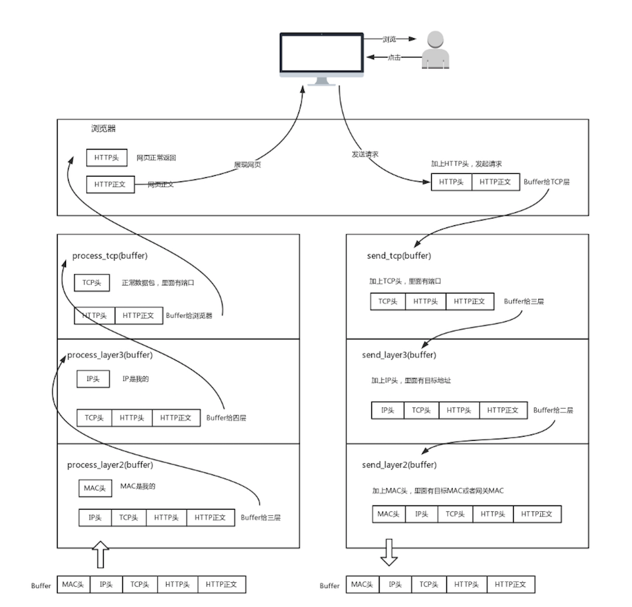

# 网络协议

## 为什么学习网络协议

```js
var print = 'hello world';
console.log(print);
```

最简单不过的`JS`，其实这也是一种协议，是人和计算机沟通的协议，只有通过协议，计算机才知道我们想让它做什么。

这一层协议接近自然语言，机器不能直接读懂，需要翻译，即complile。


协议三要素

+ 语法
+ 语义
+ 顺序

只有通过网络协议，才能让一大片机器互相协作，共同完成一件事。

举一个例子

访问`https://www.kaola.com`，这是个`URL`，首先需要去地址簿协议`DNS`，或者使用更精准的地址簿查找协议`HTTPDNS`。

无论哪一种方式，都能找到门牌号即`IP`地址。

知道地址，浏览器打包请求，`HTTP`或者`HTTPS`。

`DNS`、`HTTP`、`HTTPS`属于应用层，浏览器将应用层的包交给传输层完成，通过`socket`编程来实现。

传输层有两种协议

+ 无连接协议`UDP`
+ 面向连接协议`TCP`

面向连接就是`TCP`会保证这个包能够到达，如果不能就重新发送。

`TCP`协议里有两个端口，浏览器监听的端口和电商服务器监听的端口，操作系统通过端口来判断，得到的包应该给那个进程。

传输层封装完毕后，浏览器将包交给操作系统网络层，使用`IP`协议。

`IP`协议中有源`IP`地址和目标`IP`地址。

去国外要去海关，去外地要去网关，操作系统启动时候被`DHCP`协议分配`IP`地址，以及默认的网关地址`192.168.1.1`。

操作系统 `ARP` `MAC` 网关，将`IP`包叫给了`MAC`层。


网关往往是一个路由器，收到包之后判断下一步怎么走。到某个`IP`怎么走，这是路由表。

路由器像是城关，每个国家都连着两个城关，国家内部可以使用`MAC`通信，越过城关，需要拿出`IP`头。

一个一个国家走，直到走出最后一个城关，目标服务器会回复一个`MAC`地址，网络包过关后，通过这个`MAC`地址找到目标服务器。

目标服务器发现`MAC`对上，取下`MAC`头，`IP`对上，取下`IP`头，`IP`头显示用的是`TCP`，交给传输层。对于`TCP`收到的每一个包，都要有回复说明收到了。

当网络包到达`TCP`，`TCP`头中有目标端口号，将包发给电商应用。

接待请求的`Tomcat`只是个接待员，需要告诉管理库存的进程干啥，管理订单的进程干啥，通过`RPC`远程过程调用来实现。


## 网络分层的真实含义

是个复杂的程序都要分层。



只要是在网络上跑的包，都是完整的，可以有下层没上层，不可能有上层没下层。

## ifconfig 最熟悉又陌生的命令行

+ ifconfig
+ ip addr
+ net-tools
+ iproute2

IP地址是一个网卡在网络世界中的通讯地址，相当于现实世界中的门牌号码。

IP地址`10.100.122.2`布尔分隔为四个部分，每个部分8bit，所以IP地址总共是32位。后来产生了IPv6，`inet6 fe80::f816:3eff:fec7:7975/64`。这个是128位。

无类型域间选择(CIDR)

将32位IP地址一分为二，前面是网络号，后面是主机号，`10.100.122.2/24`。

伴随CIDR存在的，一个是广播地址，`10.100.122.255`，另一个是子网掩码，`255.255.255.0`。

+ IP是地址，有定位功能;MAC是身份证，无定位功能
+ CIDR可是用来判断是不是本地人
+ IP分公有的IP和私有的IP