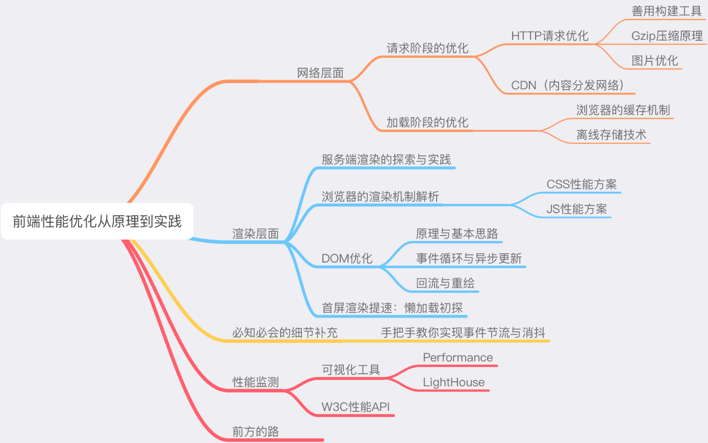
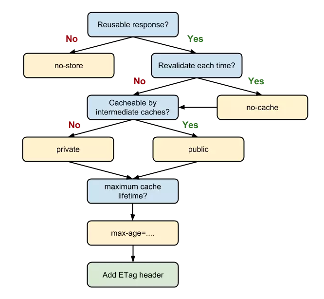

# 前端性能

## 初探

> 任何一个用户端的产品，都要把这六个过程滴水不漏的考虑到自己的性能优化方案内，反复权衡，从而打磨出用户满意的速度。

1. DNS 解析
1. TCP 连接
1. HTTP 请求抛出
1. 服务端处理请求
1. HTTP 响应返回
1. 浏览器拿到响应数据，解析响应内容，把解析的结果展示给用户



## 网络优化

### Webpack性能调优与Gzip原理

前端在DNS与TCP这一层的努力非常有限，HTTP层的优化才是核心。

HTTP优化两个大方向：

- 减少请求次数
- 减少单次请求所花费的时间

#### Webpack

Webpack的优化瓶颈在两个方面：

- 构建时间
- 打包体积

1.不要让loader做太多事情

使用include或者exclude避免不必要的转译，还可以开启缓存，将转译结果缓存至文件系统。

2.第三方库的打包可以使用DLL

```js
const path = require('path')
const webpack = require('webpack')

module.exports = {
  entry: {
    // 依赖的库数组
    vendor: [
    'prop-types',
    'babel-polyfill',
    'react',
    'react-dom',
    'react-router-dom',
    ]
  },
  output: {
    path: path.join(__dirname, 'dist'),
    filename: '[name].js',
    library: '[name]_[hash]',
  },
  plugins: [
    new webpack.DllPlugin({
    // DllPlugin的name属性需要和libary保持一致
    name: '[name]_[hash]',
    path: path.join(__dirname, 'dist', '[name]-manifest.json'),
    // context需要和webpack.config.js保持一致
    context: __dirname,
    }),
  ],
}...
```

3.happypack多进程

4.删除冗余代码

webpack基于ES6的模块系统Tree-Shaking

在Uglify的操作中可以传入很多选项

```js
const UglifyJsPlugin = require('uglifyjs-webpack-plugin');
  module.exports = {
    plugins: [
      new UglifyJsPlugin({
        // 允许并发
        parallel: true,
        // 开启缓存
        cache: true,
        compress: {
          // 删除所有的console语句
          drop_console: true,
          // 把使用多次的静态值自动定义为变量
          reduce_vars: true,
        },
        output: {
          // 不保留注释
          comment: false,
          // 使输出的代码尽可能紧凑
          beautify: false
        }
      })
    ]
  }...
```

#### Gzip

Gzip的内核是Deflate。

压缩原理的背后是在文本文件中找出一些重复出现的字符串，临时替换他们，从而使整个文件变小。根据这个原理，文本中代码的重复率越高，压缩的效率就越高，Gzip的收益也越大。

Webpack中Gzip压缩操作的存在，事实上是为了在构建过程中做掉一部分服务器的工作，为服务器分压。

### 图片优化-质量与性能的博弈



