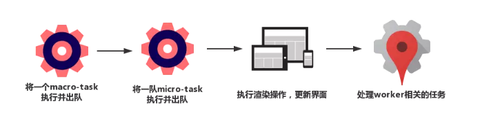
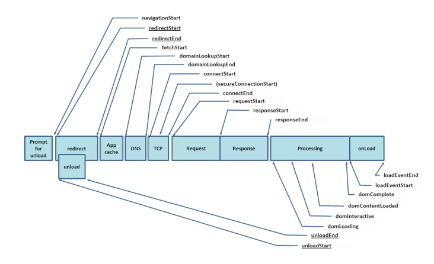

# 前端性能

## 初探

> 任何一个用户端的产品，都要把这六个过程滴水不漏的考虑到自己的性能优化方案内，反复权衡，从而打磨出用户满意的速度。

1. DNS 解析
1. TCP 连接
1. HTTP 请求抛出
1. 服务端处理请求
1. HTTP 响应返回
1. 浏览器拿到响应数据，解析响应内容，把解析的结果展示给用户


## 网络优化

### Webpack性能调优与Gzip原理

前端在DNS与TCP这一层的努力非常有限，HTTP层的优化才是核心。

HTTP优化两个大方向：

- 减少请求次数
- 减少单次请求所花费的时间

#### Webpack

Webpack的优化瓶颈在两个方面：

- 构建时间
- 打包体积

1.不要让loader做太多事情

使用include或者exclude避免不必要的转译，还可以开启缓存，将转译结果缓存至文件系统。

2.第三方库的打包可以使用DLL

```js
const path = require('path')
const webpack = require('webpack')

module.exports = {
  entry: {
    // 依赖的库数组
    vendor: [
    'prop-types',
    'babel-polyfill',
    'react',
    'react-dom',
    'react-router-dom',
    ]
  },
  output: {
    path: path.join(__dirname, 'dist'),
    filename: '[name].js',
    library: '[name]_[hash]',
  },
  plugins: [
    new webpack.DllPlugin({
    // DllPlugin的name属性需要和libary保持一致
    name: '[name]_[hash]',
    path: path.join(__dirname, 'dist', '[name]-manifest.json'),
    // context需要和webpack.config.js保持一致
    context: __dirname,
    }),
  ],
}...
```

3.happypack多进程

4.删除冗余代码

webpack基于ES6的模块系统Tree-Shaking

在Uglify的操作中可以传入很多选项

```js
const UglifyJsPlugin = require('uglifyjs-webpack-plugin');
  module.exports = {
    plugins: [
      new UglifyJsPlugin({
        // 允许并发
        parallel: true,
        // 开启缓存
        cache: true,
        compress: {
          // 删除所有的console语句
          drop_console: true,
          // 把使用多次的静态值自动定义为变量
          reduce_vars: true,
        },
        output: {
          // 不保留注释
          comment: false,
          // 使输出的代码尽可能紧凑
          beautify: false
        }
      })
    ]
  }...
```

#### Gzip

Gzip的内核是Deflate。

压缩原理的背后是在文本文件中找出一些重复出现的字符串，临时替换他们，从而使整个文件变小。根据这个原理，文本中代码的重复率越高，压缩的效率就越高，Gzip的收益也越大。

Webpack中Gzip压缩操作的存在，事实上是为了在构建过程中做掉一部分服务器的工作，为服务器分压。

### 图片优化-质量与性能的博弈

与其说在“优化”，不如说是在做“权衡”，我们的主要任务就是去寻求一个质量与性能之间的平衡点。

#### 不同业务场景下的图片方案选型

在计算机中，像素用二进制数来表示，一个像素对应的二进制位数越多，可以表示的颜色种类就越多，成像效果越细腻，文件体积就越大。

一个二进制位表示两种颜色(0|1 对应 黑|白)，如果一个图片格式对应的二进制位有n个，那么它就可以呈现2^n种颜色。

##### JPEG/JPG

JPG的特点是有损压缩，当把体积压缩至原有体积的50%以下，任然可以保持住60%的品质。

JPG适用于呈现色彩吩咐的图片，JPG常用作大的背景图、轮播图或Banner图出现。

缺陷在于处理矢量图形和Logo等线条感较强、颜色对比强烈的图像时，认为压缩导致的图片模糊比较明显，且不支持透明。

##### PNG-8和PNG-24

8和24这里都是二进制位数，8位PNG支持256种颜色,24位的可以呈现约1600万种颜色。

考虑到PNG在处理线条和颜色对比度方面的优势，主要用来呈现小的Logo、颜色简单且对比强烈的图片或背景等。

比如某宝的Logo，较小的Logo(CSS Sprites)，颜色对比度较强的图片。

##### SVG

SVG文件体积小，压缩性强，图片可以无限放大且不失真。

##### Base64

base64作为CSS Sprites的补充而存在。

Base64编码后，图片大小会膨胀为源文件的4/3。

这是几条适用场景

- 图片的实际尺寸很小(大多不足2kb)
- 图片无法以sprites图片的形式与其它小图结合(sprites图片仍是主要的减少HTTP请求的途径，Base64是sprites的补充)
- 图片的更新频率非常低(不需要我们重复编码和修改文件内容，维护成本较低)

推荐使用webpack的url-loader进行Base64编码。

##### WebP

什么都好除了兼容性

```html

```

在wdbp前面还有一个jpg的后缀，这里是降级方案。

##### 小结

做电商就是做图片...

## 浏览器缓存机制与缓存策略

浏览器缓存机制

- Memory Cache
- Service Worker Cache
- HTTP Cache
- Push Cache(HTTP2新特性)

### HTTP缓存机制

强缓存和协商缓存，命中强缓存失败的情况下，才会走协商缓存。

强缓存中的expires的问题在于对“本地时间”的依赖。

Cache-Control可以视作是expires的完全替代方案。

当下使用expires的唯一目的就是向下兼容。

Cache-Control 相对于 expires 更加准确，它的优先级也更高。当 Cache-Control 与 expires 同时出现时，以 Cache-Control 为准。

Cache-Control不止是`max-age`。

```HTTP header
cache-control: max-age=3600, s-maxage=31536000
```

`s-maxage`用来表示cache服务器(比如cache CDN)的缓存有效时间，并且只对`public`有效。

`public`和`private`是针对资源是否能够被代理服务器缓存而存在的一组对立概念，`private`是默认值。

`no-cache`绕开了浏览器，设置了`no-cache`之后，每一次请求都不会再去询问浏览器的缓存情况，而是直接向服务端去确认该资源是否过期。

`no-store`不使用任何缓存，直接向服务端发送请求，下载完整响应。

`Last-Modified`存在一些缺陷，比如修改文件速度过快(小于1s)，编辑了文件，但文件内容没有变化。于是有了`Etag`作为`Last-Modified`的补充。`Etag`的生成过程需要服务器额外付出开销，影响服务端的性能，这是它的弊端，是否启用`Etag`需要考量。`Etag`并不能替代`Last-Modified`，只作为`Last-Modified`的补充和强化。

`Etag`的优先级更高，当和`Last-Modified`同时存在时，以`Etag`为准。


Service Worker对协议有要求，必须以https协议为前提。

## 本地存储---从cookie到Web Storage、IndexDB

cookie以key-value的形式存在。

cookie的体积有上限，最大4kb。

cookie紧跟域名。

```http header
Set-Cookie: name=xiuyan; domain=xiuyan.me
```

同一个域名下的所有请求，都会携带cookie。cookie虽然小，请求可以有很多，随着请求的叠加，不必要的cookie带来的开销将是无法想象的。

Local Storage、Session Storage和Cookie都遵循同源策略。

Web Storage只能存储字符串。

IndexDB是一个运行在浏览器上的非关系型数据库。

当数据的复杂度和规模上升到了Local Storage无法解决的程度，可以使用IndexDB。

## CDN的缓存和回源机制解析

CDN （内容分发网络）指的是一组分布在各个地区的服务器。这些服务器存储着数据的副本，因此服务器可以根据哪些服务器与用户距离最近，来满足数据的请求。 CDN 提供快速服务，较少受高流量影响。

CDN两个核心功能

- 缓存 把资源copy到CDN服务器上
- 回源 CDN发现自己没有这个资源，向服务器请求这个资源

CDN往往被用来存放静态资源。

业务服务器的核心人物在于生成动态页面或返回非纯静态页面，这两种过程是需要计算的。

“静态资源”是像js、css、图片等不需要业务服务器进行计算即可得到的资源。

许多一线公司，静态资源走CDN并不是一个建议，而是规定。

## 服务端渲染的探索和实践

```js
const Vue = require('vue')
// 创建一个express应用
const server = require('express')()
// 提取出renderer实例
const renderer = require('vue-server-renderer').createRenderer()

server.get('*', (req, res) => {
  // 编写Vue实例（虚拟DOM节点）
  const app = new Vue({
    data: {
      url: req.url
    },
    // 编写模板HTML的内容
    template: `<div>访问的 URL 是： {{ url }}</div>`
  })

  // renderToString 是把Vue实例转化为真实DOM的关键方法
  renderer.renderToString(app, (err, html) => {
    if (err) {
      res.status(500).end('Internal Server Error')
      return
    }
    // 把渲染出来的真实DOM字符串插入HTML模板中
    res.end(`
      <!DOCTYPE html>
      <html lang="en">
        <head><title>Hello</title></head>
        <body>${html}</body>
      </html>
    `)
  })
})

server.listen(8080)
```

把Vue、React等在Node上跑一遍，`renderToString`，将结果插入HTML模板中，将虚拟DOM转化为真实DOM。

## 浏览器背后的运行机制

浏览器内核分为两部分

- 渲染引擎(layout engineer)
- JS引擎(rendering engineer)

常见的渲染引擎

- Trident(IE)
- Gecko(FireFox)
- Blink(Chrome、Opera)
- Webkit(Safari)

Blink是Webkit衍生而来的一个分支。

CSS选择器从右往左匹配，可以有如下优化方案：

- 避免使用通配符
- 关注可以通过继承实现的属性，避免重复匹配重复定义
- 少用标签选择器
- 减少嵌套

CSSOM的解析过程与DOM的解析过程是并行的。

默认情况下，CSS是阻塞的资源，在浏览器构建CSSOM的过程中，不会渲染任何已处理的内容，即便DOM已经解析完了（避免没有CSS的HTML呈现在用户眼前）。

> CSS是阻塞渲染的资源，需要将它尽早。尽快地下载到客户端，以便缩短首次渲染时间。

JS引擎独立与渲染引擎存在，JS代码在何处插入，就在何处执行。

JS的三种加载方式

- 正常模式
- async 加载是异步的，当加载结束，立即执行
- defer 加载异步，执行被推迟，当文档解析完成，DOMContentLoaded事件即将被触发，defer才会依次执行。

## DOM优化原理与基本实践

> 把 DOM 和 JavaScript 各自想象成一个岛屿，它们之间用收费桥梁连接。——《高性能 JavaScript》

形象一点多说法，每次操作DOM，都要过“桥”，过“桥”的次数一多，就会产生明显的性能问题。

## EventLoop与异步更新策略

事件循环的异步队列有两种：macro和micro

常见的macro-task如

- setTimeout
- setInterval
- setImmediate
- script
- I/O
- UI渲染

常见的micro-task如

- process.nextTick
- Promise
- MutationObserver

一个完整的Event Loop可以概括为以下阶段：

1. 初始状态：调用栈空，micro队列空，macro队列里只有一个script脚本
1. 全局上下文(script标签)被推入栈中，同步执行代码，执行的过程中，通过对一些借口的调用，可以产生新的macro-task和micro-task，他们会分别被推入各自的任务队列里。同步代码执行完了，script脚本会被移出macro队列，这个过程本质上是队列macro-task的执行和出队的过程
1. 上一步出队的是macro-task，这一步处理的是micro-task。macro-task的任务是一个一个执行的；micro-task的任务是一队一队执行的。处理micro队列的这一步会逐个执行队列中的任务并把它出队，直到队列被清空。
1. 执行渲染操作(更新界面)
1. 检查是否存在Web worker任务

上述过程循环往复



看一个🌰

```js
// task是一个用于修改DOM的callback
setTimeout(task, 0)
```

macro -> micro -> 更新界面(此次不更新) -> ... -> 下一个更新界面操作(DOM更新)

使用Promise将task包装成一个micro任务

```js
Promise.resove().then(task)
```

当在异步任务中实现DOM修改时，将它包装成micro任务是相对明智的选择。

当我们在用Vue或者React提供的接口去更新数据时，更新不会立即生效，而是会被推入到一个队列里，待到适当的时机，队列中的更新任务会被批量触发，这就是异步更新。

这是vue的nextTick

```js
export function nextTick (cb?: Function, ctx?: Object) {
  let _resolve
  callbacks.push(() => {
    if (cb) {
      try {
        cb.call(ctx)
      } catch (e) {
        handleError(e, ctx, 'nextTick')
      }
    } else if (_resolve) {
      _resolve(ctx)
    }
  })
  // 检查上一个异步任务队列（即名为callbacks的任务数组）是否派发和执行完毕了。pending此处相当于一个锁
  if (!pending) {
    // 若上一个异步任务队列已经执行完毕，则将pending设定为true（把锁锁上）
    pending = true
    // 是否要求一定要派发为macro任务
    if (useMacroTask) {
      macroTimerFunc()
    } else {
      // 如果不说明一定要macro 你们就全都是micro
      microTimerFunc()
    }
  }
  // $flow-disable-line
  if (!cb && typeof Promise !== 'undefined') {
    return new Promise(resolve => {
      _resolve = resolve
    })
  }
}
```

Vue中的异步任务默认情况下都是用Promise来包装的，都是micro-task。

macroTimeFunc的实现

```js
// macro首选setImmediate 这个兼容性最差
if (typeof setImmediate !== 'undefined' && isNative(setImmediate)) {
  macroTimerFunc = () => {
    setImmediate(flushCallbacks)
  }
} else if (typeof MessageChannel !== 'undefined' && (
    isNative(MessageChannel) ||
    // PhantomJS
    MessageChannel.toString() === '[object MessageChannelConstructor]'
  )) {
  const channel = new MessageChannel()
  const port = channel.port2
  channel.port1.onmessage = flushCallbacks
  macroTimerFunc = () => {
    port.postMessage(1)
  }
} else {
  // 兼容性最好的派发方式是setTimeout
  macroTimerFunc = () => {
    setTimeout(flushCallbacks, 0)
  }
}
```

microTimeFunc的实现

```js
// 简单粗暴 不是ios全都给我去Promise 如果不兼容promise 那么你只能将就一下变成macro了
if (typeof Promise !== 'undefined' && isNative(Promise)) {
  const p = Promise.resolve()
  microTimerFunc = () => {
    p.then(flushCallbacks)
    // in problematic UIWebViews, Promise.then doesn't completely break, but
    // it can get stuck in a weird state where callbacks are pushed into the
    // microtask queue but the queue isn't being flushed, until the browser
    // needs to do some other work, e.g. handle a timer. Therefore we can
    // "force" the microtask queue to be flushed by adding an empty timer.
    if (isIOS) setTimeout(noop)
  }
} else {
  // 如果无法派发micro，就退而求其次派发为macro
  microTimerFunc = macroTimerFunc
}
```

flushCallBacks源码

```js
function flushCallbacks () {
  pending = false
  // callbacks在nextick中出现过 它是任务数组（队列）
  const copies = callbacks.slice(0)
  callbacks.length = 0
  // 将callbacks中的任务逐个取出执行
  for (let i = 0; i < copies.length; i++) {
    copies[i]()
  }
}
```

Vue中没产生一个状态更新任务，就会被塞进一个叫callbacks的数组(此处是任务队列的实现形式)，这个任务队列在被丢进micro或macro队列之前，会先去检查当前是否有异步更新任务正在执行(即检查pending锁)，如果锁是开着的，就设置上锁，然后对当前callbacks数组的任务进行派发(丢进micro或macro队列)和执行。设置pending锁的意义在于保证状态更新任务的有序进行，避免发生混乱。

## 回流(reFlow)和重绘(Repaint)

触发回流的操作

- 改变DOM元素的几何属性

常见的几何属性有`width`、`height`、`padding`、`margin`、`left`、`top`、`border`等

- 改变DOM树的结构
- 获取一些特定属性的值

比如说`offsetTop`、`offsetLeft`、`offsetWidth`、`offsetHeight`、`scrollTop`、`scrollLeft`、`scrollWidth`、`scrollHeight`、`clientTop`、`clientLedt`、`clientWidth`、`clientHeight`

他们都是需要即时计算的值。浏览器为了获取这些值，也会进行回流。初次之外，当我们调用`getComputedStyle`方法，也会触发回流。

优化方法

- 避免逐条改变样式，使用类名合并样式

```js
const container = document.getElementById('container')
container.style.width = '100px'
container.style.height = '200px'
container.style.border = '10px solid red'
container.style.color = 'red'
```

优化成

```html
const container = document.getElementById('container')
container.classList.add('basic_style')
```

- 将DOM“离线”

一旦给元素设置`display:none`，将其从页面上“拿掉”，那么后续操作将无法触发回流与重绘，这个将元素拿掉的操作，就叫做DOM离线化。

```js
let container = document.getElementById('container')
container.style.display = 'none'
container.style.width = '100px'
container.style.height = '200px'
container.style.border = '10px solid red'
container.style.color = 'red'
...（省略了许多类似的后续操作）
container.style.display = 'block'
```

- Flush队列

现代浏览器很聪明，缓存了一个flush队列，将触发回流与重绘的任务都塞进去，等到任务多起来、或者达到一定的时间间隔、或者不得已的时候，将这些任务一次性出队。

这里的不得已，比如说获取一些“即时性”很强的属性，浏览器为了获取此时此刻最准确的属性值，提前将flush队列的任务出队。

### 小结

并不是所有浏览器都聪明，养成良好的编码习惯，从根源上解决问题，是最周全的方法。

## 优化首屏体验---Lazy-Load

用户点开页面的瞬间，呈现给他的只有屏幕的一部分(首屏)。

在懒加载的实现中，有两个关键的数值，一个是当前可视区域的高度，另一个是元素距离可视区域顶部的高度。

一个mini的Lazy-Load实现

```js
// 获取所有的图片标签
const imgs = document.getElementsByTagName('img')
// 获取可视区域的高度
const viewHeight = window.innerHeight || document.documentElement.clientHeight
// num用于统计当前显示到了哪一张图片，避免每次都从第一张图片开始检查是否露出
let num = 0
function lazyload(){
    for(let i=num; i<imgs.length; i++) {
        // 用可视区域高度减去元素顶部距离可视区域顶部的高度
        let distance = viewHeight - imgs[i].getBoundingClientRect().top
        // 如果可视区域高度大于等于元素顶部距离可视区域顶部的高度，说明元素露出
        if(distance >= 0 ){
            // 给元素写入真实的src，展示图片
            imgs[i].src = imgs[i].getAttribute('data-src')
            // 前i张图片已经加载完毕，下次从第i+1张开始检查是否露出
            num = i + 1
        }
    }
}
// 监听Scroll事件
window.addEventListener('scroll', lazyload, false);
```

## 事件的节流(throttle)与防抖(debounce)

throttle

```js
// fn是我们需要包装的事件回调, interval是时间间隔的阈值
function throttle(fn, interval) {
  // last为上一次触发回调的时间
  let last = 0

  // 将throttle处理结果当作函数返回
  return function (args) {
      // 保留调用时的this上下文
      let context = this
      // 保留调用时传入的参数
      let args = arguments
      // 记录本次触发回调的时间
      let now = +new Date()

      // 判断上次触发的时间和本次触发的时间差是否小于时间间隔的阈值
      if (now - last >= interval) {
      // 如果时间间隔大于我们设定的时间间隔阈值，则执行回调
          last = now;
          fn.apply(context, args);
      }
    }
}
```

debouce

```js
// fn是我们需要包装的事件回调, delay是每次推迟执行的等待时间
function debounce(fn, delay) {
  // 定时器
  let timer = null

  // 将debounce处理结果当作函数返回
  return function () {
    // 保留调用时的this上下文
    let context = this
    // 保留调用时传入的参数
    let args = arguments

    // 每次事件被触发时，都去清除之前的旧定时器
    if(timer) {
      clearTimeout(timer)
    }
    // 设立新定时器
    timer = setTimeout(function () {
      fn.apply(context, args)
    }, delay)
  }
}

// 用debounce来包装scroll的回调
document.addEventListener('scroll', debounce(() => console.log('触发了滚动事件'), 1000))
```

这个debouce的问题在于用户操作十分频繁的情况下得不到响应，于是用Throttle来优化debounce

```js
// fn是我们需要包装的事件回调, delay是时间间隔的阈值
function throttle(fn, delay) {
  // last为上一次触发回调的时间, timer是定时器
  let last = 0, timer = null
  // 将throttle处理结果当作函数返回

  return function (args) {
      // 保留调用时的this上下文
      let context = this
      // 保留调用时传入的参数
      let args = arguments
      // 记录本次触发回调的时间
      let now = +new Date()
      // 判断上次触发的时间和本次触发的时间差是否小于时间间隔的阈值

      if (now - last < delay) {
      // 如果时间间隔小于我们设定的时间间隔阈值，则为本次触发操作设立一个新的定时器
         clearTimeout(timer)
         timer = setTimeout(function () {
            last = now
            fn.apply(context, args)
          }, delay)
      } else {
          // 如果时间间隔超出了我们设定的时间间隔阈值，那就不等了，无论如何要反馈给用户一次响应
          last = now
          fn.apply(context, args)
      }
    }

// 用新的throttle包装scroll的回调
```

## Performance

W3C规范为我们提供了Performance相关接口。允许我们获取到用户访问每一个页面每个阶段的精确时间。

```js
window.performance
```



举个🌰，获取时间差值

```js
const timing = window.performance.timing
// DNS查询耗时
timing.domainLookupEnd - timing.domainLookupStart

// TCP连接耗时
timing.connectEnd - timing.connectStart

// 内容加载耗时
timing.responseEnd - timing.requestStart
```

通过访问performace的memory属性，还可以获取内存占用的相关数据。
