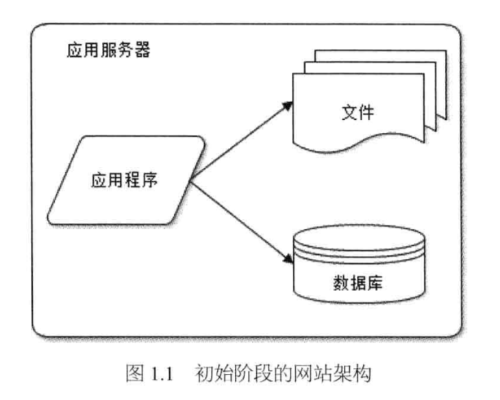
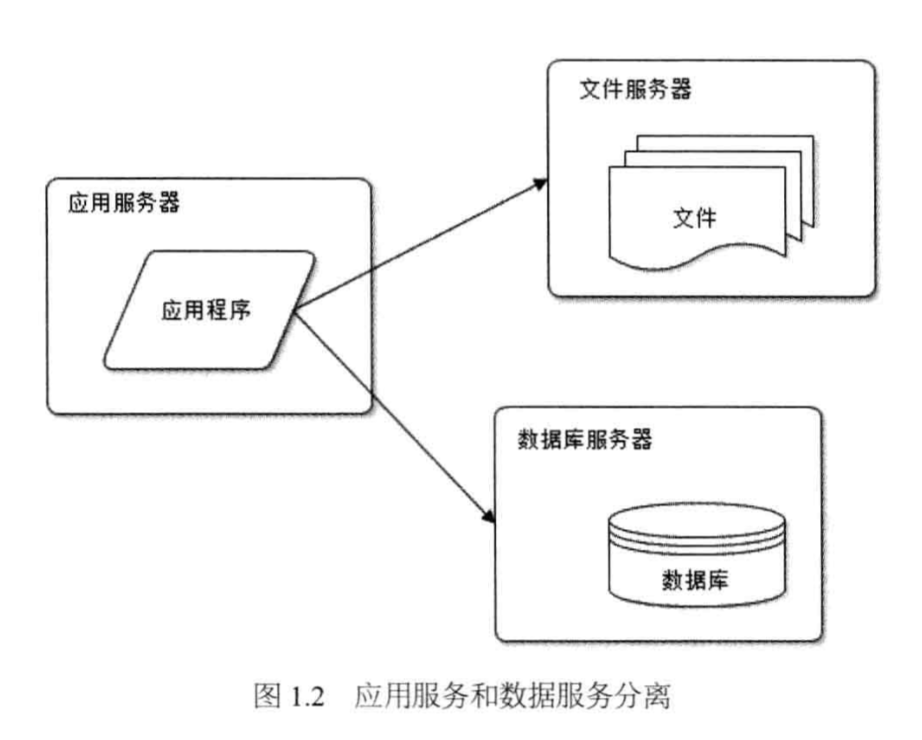
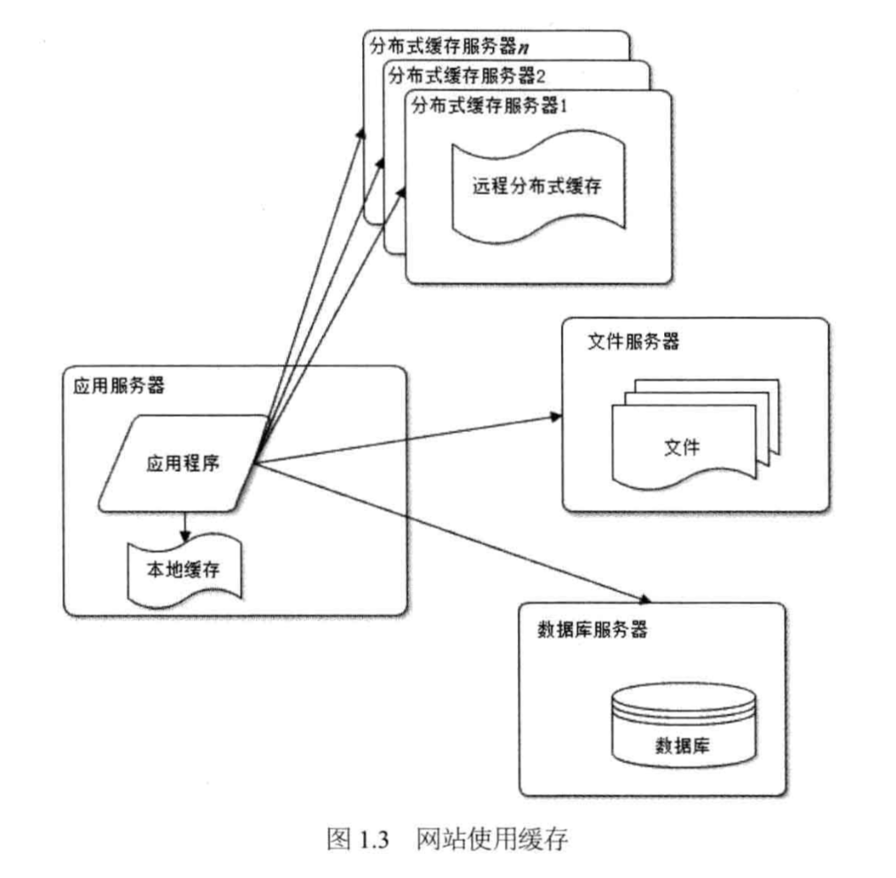
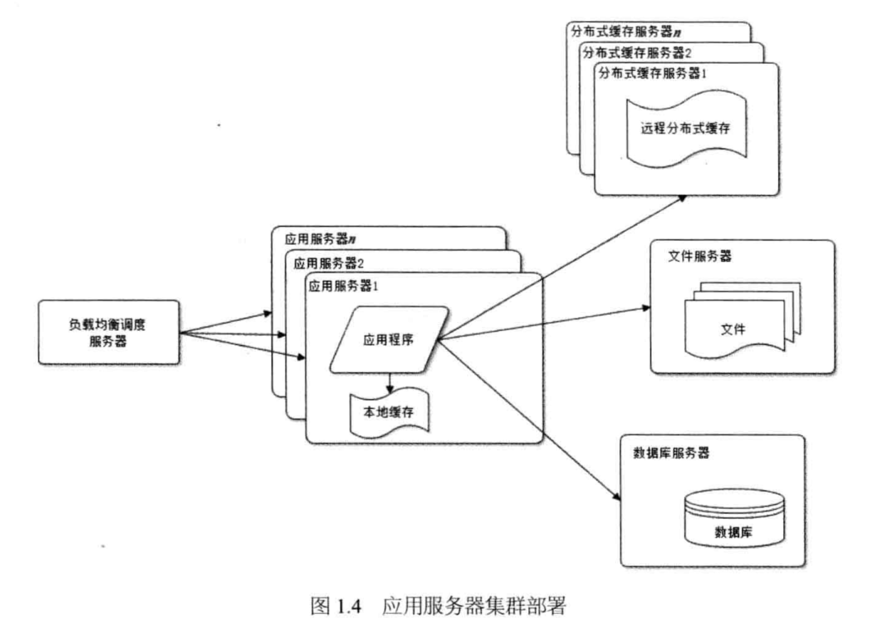
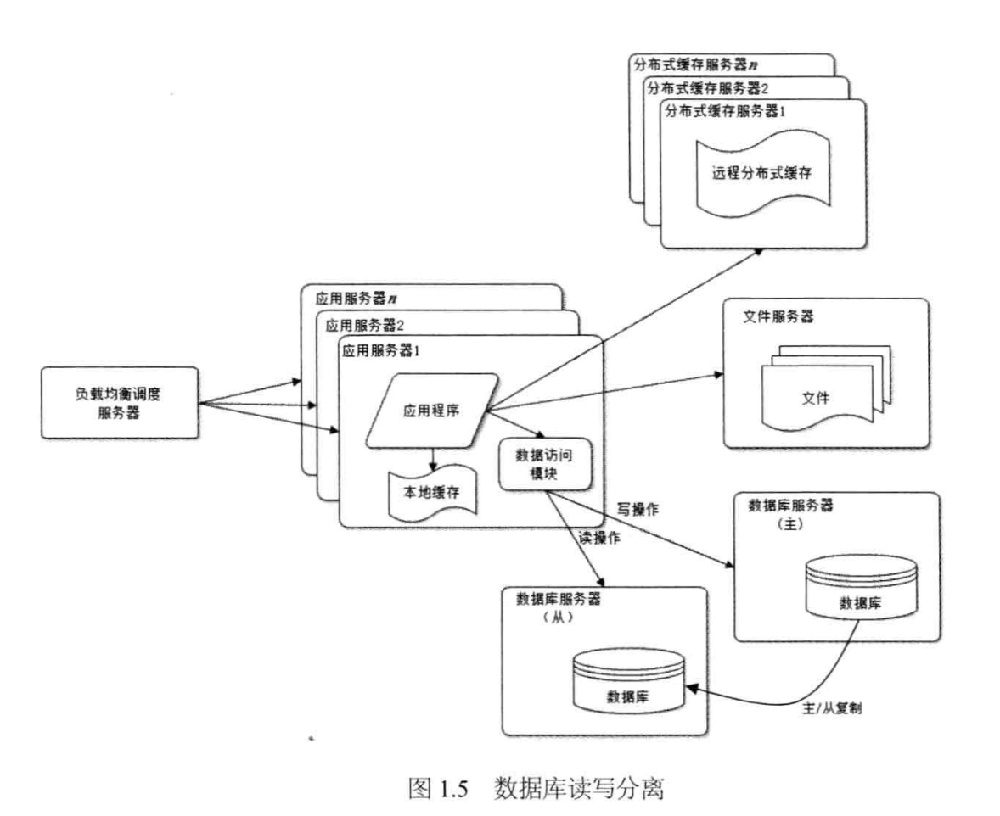
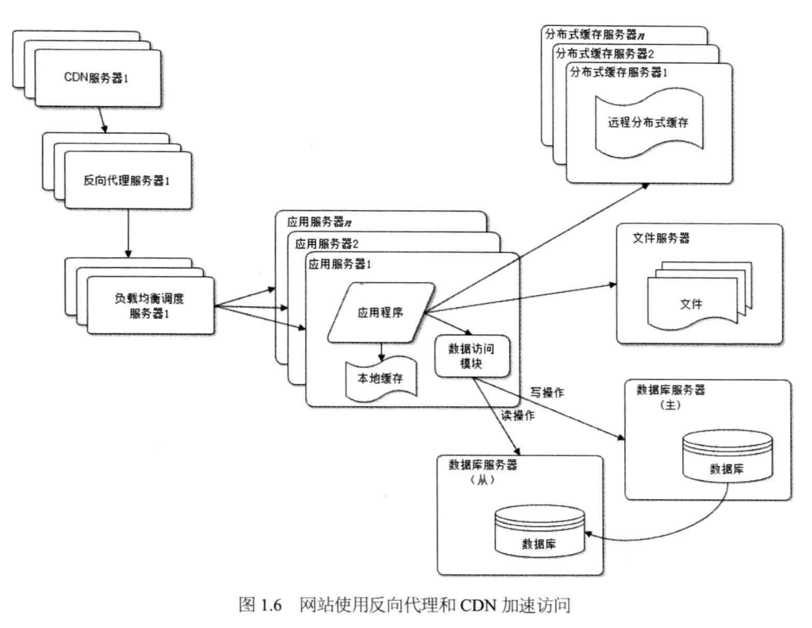
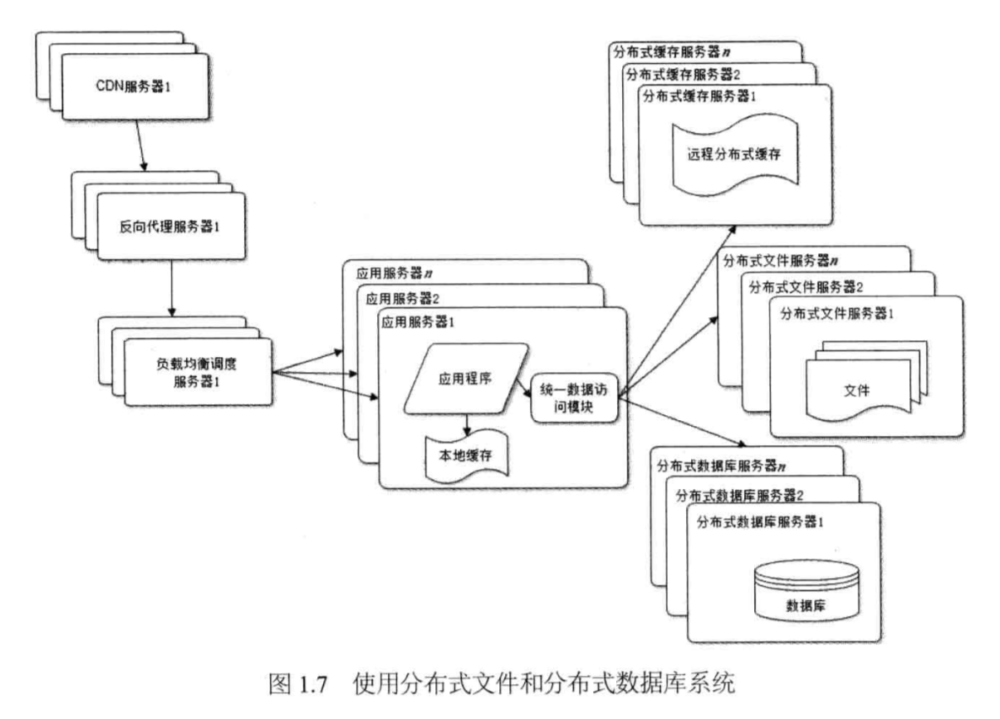
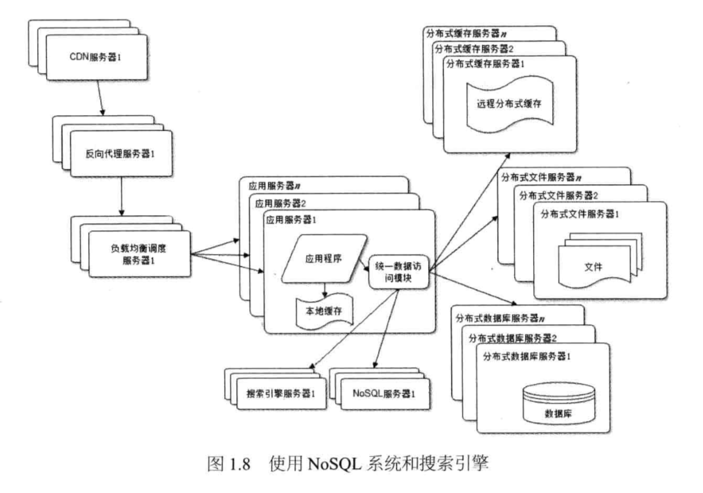
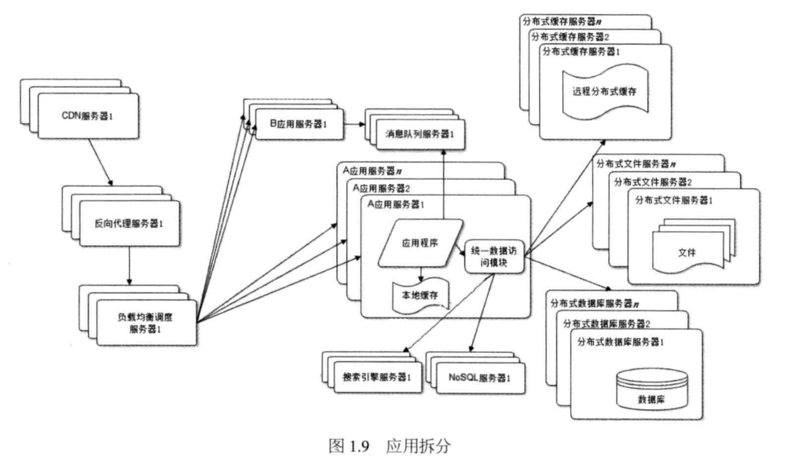
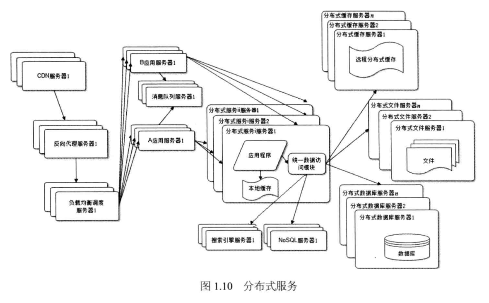

# 大型网站技术架构核心原理与案例分析

## 废话

传统的企业应用系统主要面对的技术挑战一处理复杂凌乱、千变万化的业务逻辑，大型网站面对的技术挑战是处理超大量的用户访问和海量的数据处理；前者的挑战来自功能性需求，后者的挑战来自非功能性需求。

功能性需求可以通过人手解决问题，而非功能性需求大多是实实在在的技术难题。无论多少工程师，做不到就是做不到。

> 好的设计绝不是模仿、不是生搬硬套某个模式，而是在对问题深刻理解之上的创造与创新，即使是‘微创新’，也是让人耳目一新的似曾相识。山寨与创新的最大区别不在于是否抄袭、是否模仿，而在于对问题和需求是否。

从性能、可用性、伸缩性、扩展性、安全性几个网站核心架构要素切入。

## 大型网站架构演化

### 大型网站软件系统的特点

1. 高并发，大流量
1. 高可用(7x24小时不间断服务)
1. 海量数据(存储、管理海量数据)
1. 用户分布广泛，网络情况复杂
1. 安全环境恶劣(易遭受攻击)
1. 需求快速变更，发布频繁
1. 渐进式发展(所有大型互联网网站都是从一个小网站开始逐渐发展起来的)

### 大型网站架构演化发展历程

1.初始阶段的网站架构

应用程序、数据库、文件等所有资源都在一台服务器上。服务器操作系统使用`linux`、应用程序使用`PHP`开发，然后部署在`Apache`上，数据库使用`MySQL`，汇集各种免费开源软件及一台廉价服务器就可以开始网站的发展之路。

2.应用服务和数据服务分离

随着业务发展，一台服务器逐渐不能满足需求。

应用和数据分离后整个网站使用三台服务器：应用服务器、文件服务器和数据库服务器。

应用服务器需要处理大量的业务逻辑，需要强大`CPU`。数据库服务器需要快速检索磁盘和数据缓存，需要更快的硬盘和更大的内存。文件服务器需要存储大量用户上传文件，需要更大的硬盘。

3.使用缓存改善网站性能

二八定律：80%的业务访问集中在20%的数据上。

网站使用的缓存可以分为两种:缓存在应用服务器上的本地缓存和缓存在专门的分布式缓存服务器上的远程缓存。

缓存分为缓存在应用服务器上的本地缓存和缓存在专门的分布式缓存服务器上的远程缓存。

使用缓存后，数据访问压力得到缓解，但是单一应用服务器能够处理的请求连接有限。

4.使用应用服务器集群改善网站的并发处理能力

使用集群是网站解决高并发、海量数据问题的常用手段。

通过负载均衡调度服务器，可将来自用户浏览器的访问请求分发到应用服务器集群中的任何一台。

5.数据库读写分离

网站使用缓存后，绝大多数数据读操作不通过数据库就能完成，但仍有一部分读操作(缓存访问不命中、缓存过期)和全部写的操作需要访问数据库，数据库负载会成为瓶颈。

大部分主流数据库都提供主从热备功能，通过配置两台数据库主从关系，可以将一台数据库服务器的数据更新同步到另一台服务器上。利用数据库这一功能，实现数据库读写分离，从而改善数据库负载压力。

应用服务器在写数据的时候访问主数据库，主数据库通过主从复制机制将数据更新同步到从数据库，这样当应用服务器读数据的时候，就可以从数据库获得数据。

6.使用反向代理和`CDN`加速网站响应

`CDN`和反向代理的基本原理都是缓存，区别在于`CDN`部署在网络提供商的机房，用户在请求网站服务器时，可以从距离自己最近的网络提供商机房获取数据；而反向代理则部署在网站的中心机房，当用户请求到达中心机房后，首先访问的服务器是反向代理服务器，如果反向代理服务器中缓存着用户请求的资源，就将其直接返回给用户。

7.使用分布式文件系统和分布式数据库系统

分布式数据库是网站数据库拆分的最后手段，只有在单表数据规模非常庞大的时候才使用。

8.使用NoSQL和搜索引擎

9.业务拆分

根据产品线的划分，将一个网站拆分成许多不同的应用，每个应用独立部署维护。应用之间通过消息队列进行数据分发,最多的还是通过访问同一个数据存储系统来构成一个关联的完整系统。

10.分布式服务

所有应用都要和所有数据库系统连接，每一个应用系统都要执行许多相同的业务操作，如用户管理、商品管理，可以将这些共用的业务提取出来，独立部署。由这些可复用的业务连接数据库，提供共用业务服务，而应用系统只需要管理用户界面，通过分布式服务调用共用业务服务完成具体业务操作。

### 大型网站架构演化的价值观

是业务成就了技术，是事业成就了人。

脱离网站业务发展的实际，一味追求时髦的新技术，架构之路会越走越难。

技术是用来解决业务问题的，而业务的问题，也可以通过业务的手段去解决。