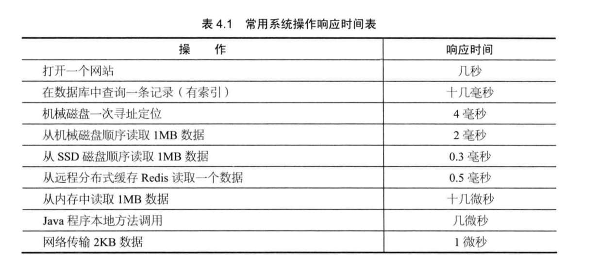
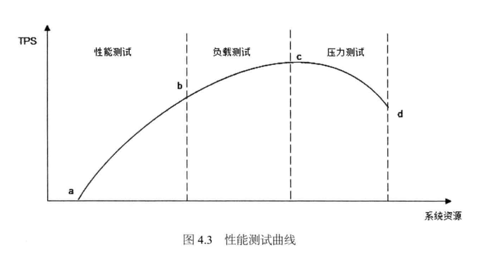
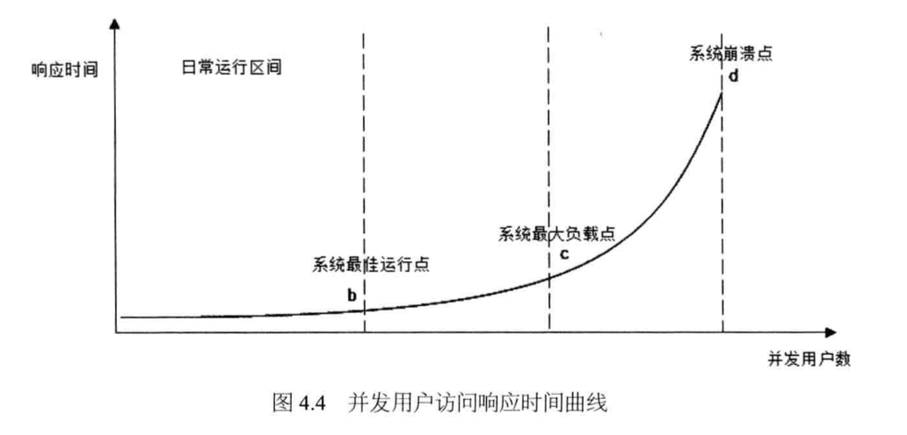
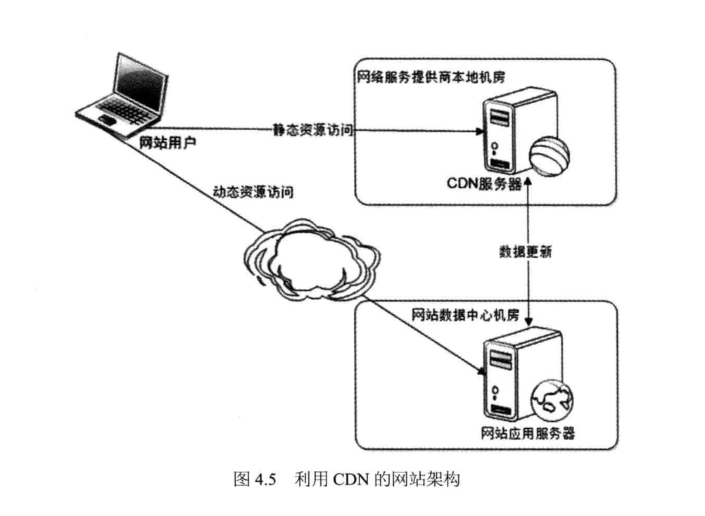
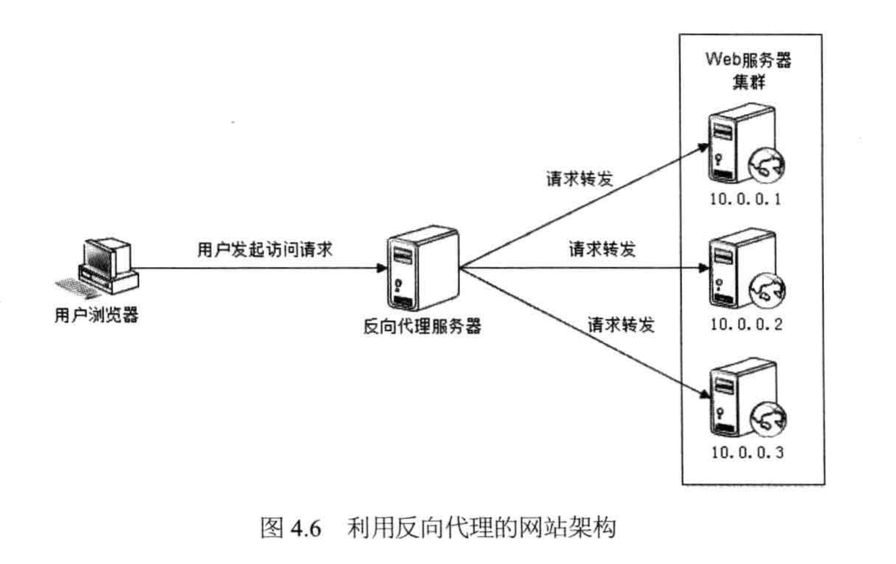
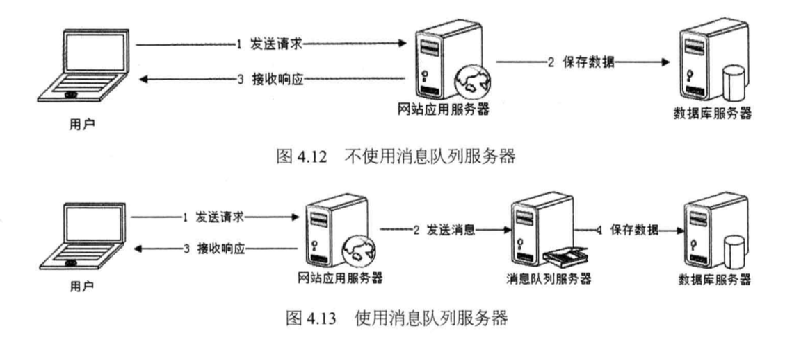

# 大型网站技术架构核心原理与案例分析

## 废话

传统的企业应用系统主要面对的技术挑战一处理复杂凌乱、千变万化的业务逻辑，大型网站面对的技术挑战是处理超大量的用户访问和海量的数据处理；前者的挑战来自功能性需求，后者的挑战来自非功能性需求。

功能性需求可以通过人手解决问题，而非功能性需求大多是实实在在的技术难题。无论多少工程师，做不到就是做不到。

> 好的设计绝不是模仿、不是生搬硬套某个模式，而是在对问题深刻理解之上的创造与创新，即使是‘微创新’，也是让人耳目一新的似曾相识。山寨与创新的最大区别不在于是否抄袭、是否模仿，而在于对问题和需求是否真正理解与把握。

从性能、可用性、伸缩性、扩展性、安全性几个网站核心架构要素切入。

> 产品在设计之初就需要一个明确的定位:什么是产品要实现的功能，什么不是产品提供的特性。在产品漫长的生命周期中，会有形形色色的困难和诱惑来改变产品的发展方向，左右摇摆、什么都想做的产品，最后有可能成为一个失去生命力的四不像。

## 大型网站架构演化

### 大型网站软件系统的特点

1. 高并发，大流量
1. 高可用(7x24小时不间断服务)
1. 海量数据(存储、管理海量数据)
1. 用户分布广泛，网络情况复杂
1. 安全环境恶劣(易遭受攻击)
1. 需求快速变更，发布频繁
1. 渐进式发展(所有大型互联网网站都是从一个小网站开始逐渐发展起来的)

### 大型网站架构演化发展历程

1.初始阶段的网站架构

应用程序、数据库、文件等所有资源都在一台服务器上。服务器操作系统使用`linux`、应用程序使用`PHP`开发，然后部署在`Apache`上，数据库使用`MySQL`，汇集各种免费开源软件及一台廉价服务器就可以开始网站的发展之路。

2.应用服务和数据服务分离

随着业务发展，一台服务器逐渐不能满足需求。

应用和数据分离后整个网站使用三台服务器：应用服务器、文件服务器和数据库服务器。

应用服务器需要处理大量的业务逻辑，需要强大`CPU`。数据库服务器需要快速检索磁盘和数据缓存，需要更快的硬盘和更大的内存。文件服务器需要存储大量用户上传文件，需要更大的硬盘。

3.使用缓存改善网站性能

二八定律：80%的业务访问集中在20%的数据上。

网站使用的缓存可以分为两种:缓存在应用服务器上的本地缓存和缓存在专门的分布式缓存服务器上的远程缓存。

缓存分为缓存在应用服务器上的本地缓存和缓存在专门的分布式缓存服务器上的远程缓存。

使用缓存后，数据访问压力得到缓解，但是单一应用服务器能够处理的请求连接有限。

4.使用应用服务器集群改善网站的并发处理能力

使用集群是网站解决高并发、海量数据问题的常用手段。

通过负载均衡调度服务器，可将来自用户浏览器的访问请求分发到应用服务器集群中的任何一台。

5.数据库读写分离

网站使用缓存后，绝大多数数据读操作不通过数据库就能完成，但仍有一部分读操作(缓存访问不命中、缓存过期)和全部写的操作需要访问数据库，数据库负载会成为瓶颈。

大部分主流数据库都提供主从热备功能，通过配置两台数据库主从关系，可以将一台数据库服务器的数据更新同步到另一台服务器上。利用数据库这一功能，实现数据库读写分离，从而改善数据库负载压力。

应用服务器在写数据的时候访问主数据库，主数据库通过主从复制机制将数据更新同步到从数据库，这样当应用服务器读数据的时候，就可以从数据库获得数据。

6.使用反向代理和`CDN`加速网站响应

`CDN`和反向代理的基本原理都是缓存，区别在于`CDN`部署在网络提供商的机房，用户在请求网站服务器时，可以从距离自己最近的网络提供商机房获取数据；而反向代理则部署在网站的中心机房，当用户请求到达中心机房后，首先访问的服务器是反向代理服务器，如果反向代理服务器中缓存着用户请求的资源，就将其直接返回给用户。

7.使用分布式文件系统和分布式数据库系统

分布式数据库是网站数据库拆分的最后手段，只有在单表数据规模非常庞大的时候才使用。

8.使用NoSQL和搜索引擎

9.业务拆分

根据产品线的划分，将一个网站拆分成许多不同的应用，每个应用独立部署维护。应用之间通过消息队列进行数据分发,最多的还是通过访问同一个数据存储系统来构成一个关联的完整系统。

10.分布式服务

所有应用都要和所有数据库系统连接，每一个应用系统都要执行许多相同的业务操作，如用户管理、商品管理，可以将这些共用的业务提取出来，独立部署。由这些可复用的业务连接数据库，提供共用业务服务，而应用系统只需要管理用户界面，通过分布式服务调用共用业务服务完成具体业务操作。

### 大型网站架构演化的价值观

是业务成就了技术，是事业成就了人。

脱离网站业务发展的实际，一味追求时髦的新技术，架构之路会越走越难。

技术是用来解决业务问题的，而业务的问题，也可以通过业务的手段去解决。

## 大型网站架构模式

> 关于什么是模式，这个来自建筑学的词汇是这样定义的:"每一个模式描述了一个在我们周围不断重复发生的问题及该问题的解决方案的核心。这样，你就能一次又一次地使用该方案而不必做重复工作。"

### 分层

分层是企业应用系统中最常见的一种架构模式，将系统在横向维度上切分成几个部分，每个部分负责一部分相对比较单一的职责，通过上层对下层的依赖和调用组成完整系统。

网站分层架构|作用
---|---
应用层|负责具体业务和视图展示，如网站首页及搜索输入和结果展示
服务层|为应用层提供服务支持，如用户管理服务，购物车服务等
数据层|提供数据存储访问服务，如数据库、缓存、文件、搜索引擎等

在实践中，大的分层结构内部还可以继续分层，如应用层可以再细分为视图层(美工负责)和业务逻辑层(工程师负责);服务层也可以细分为数据接口层(适配各种输入和输出的数据格式)和逻辑处理层。

### 分割

将功能不同的功能和服务分割开来，包装成为高内聚低耦合的模块单元。一方面有助于软件的开发和维护；另一方面，便于不同模块的分布式部署，提高网站的并发处理能力和功能拓展能力。

### 分布式

分层和分割的目的主要是为了切分后模块便于分布式部署，即将不同的模块部署在不同的服务器上，通过远程调用协同工作。

1. 分布式应用和服务
1. 分布式静态资源
1. 分布式数据库和存储
1. 分布式计算

浏览器在同域名下有并发加载的限制，网站的静态资源如`JS`,`CSS`,Logo图片等资源独立分布式部署，并采用独立域名，加快浏览器并发加载的速度。

### 集群

对于用户访问集中的模块(比如网站的首页)，需要将独立部署的服务器集群化。

### 缓存

1. CND
1. 反向代理
1. 本地缓存
1. 分布式缓存

反向代理属于网站前端架构的一部分，部署在网站的前端，当用户请求到达网站数据中心，最先访问到的就是反向代理服务器，这里缓存网站的静态资源，无需将请求继续转发给应用服务器就能返回给用户。

### 异步

> 在单一服务器内部可通过多线程共享内存队列的方式实现异步，处在业务操作前面的线程将输出写入到队列，后面的线程从队列中读取数据进行处理；在分布式系统中，多个服务器集群通过分布式消息队列实现异步，分布式消息队列可以看作内存队列的分布式部署。

### 冗余

访问和负载很小的服务也必须部署至少两台服务器构成一个集群，其目的就是通过冗余实现服务高可用。数据库除了定期备份，存档保存实现冷备份外，为了保证在线业务高可用，还要对数据库进行主从分离，实时同步实现热备份。

### 自动化

1. 发布过程自动化
1. 自动化代码管理
1. 自动化测试
1. 自动化安全测试
1. 自动化部署
1. 自动化监控
1. 自动化报警
1. 自动化失效转移
1. 自动化失效修复
1. 自动化降级
1. 自动化分配资源

### 安全

1. 密码和手机校验码进行身份认证
1. 登录交易操作对网络通信加密
1. 防止机器人程序滥用网络资源攻击网络，使用验证码识别
1. 常见攻击XSS,SQL注入进行编码转换
1. 垃圾信息敏感信息进行过滤
1. 交易转账等信息风险控制

## 大型网站核心架构要素

### 性能

浏览器端，通过浏览器缓存、使用页面压缩、合理布局页面、减少`Cookie`传输等手段改善性能。

衡量网站性能有一系列指标，重要的有响应时间、TPS、系统性能计数器。

### 伸缩性

伸缩性值得是通过不断向集群中加入服务器的手段来缓解不断上升的用户并发访问压力和不断增长的数据存储需求。

衡量架构伸缩性的主要标准就是是否可以用多台服务器构件集群，是否容易向集群中添加新的服务器。加入新的服务器后是否可以提供和原来的服务器无差别的服务。集群中可容纳的总的服务器数量是否有限制。

### 扩展性

衡量网站架构扩展性好坏的主要标准就是在网站增加新的业务产品时，是否可以实现对现有产品透明无影响，不需要任何改动既有业务功能就可以上线新产品。不同产品之间是否很少耦合，一个产品改动对其他产品无影响，其他产品和功能不需要受牵连进行改动。

### 安全性

衡量网站安全架构的标准就是针对现存和潜在的各种攻击与窃密手段，是否有可靠的应对策略。

## 瞬时响应:网站的高性能架构

### 网站性能测试

+ 用户视角: 用户在浏览器上至关感受到的网站响应速度快还是慢
+ 开发人员视角: 应用程序本身及其相关子系统的性能，响应延迟、系统吞吐量、并发处理能力、系统稳定性等技术指标
+ 运维人员视角: 基础设施性能和资源利用率，如网络运营商的带宽能力、服务器硬件的配置、服务器和网络带宽的资源利用率

#### 性能测试指标

1.响应时间

从发出请求到开始收到最后响应数据所需要的时间。

实践中通常采用的办法是重复请求，一个请求操作重复执行一万次，计算单次响应时间。

2.并发数

系统能够同时处理请求的数目，这个数字反映了系统的负载特性。

3.吞吐量

单位时间内系统处理的请求数量，体现系统的整体处理能力。

+ TPS(transactions per second)每秒事务数
+ HPS(HTTP per second)每秒HTTP请求数
+ QPS(queries per second)每秒查询数

吞吐量和系统并发数，以及响应时间的关系可以形象的理解为高速公路的通行状况：吞吐量是每天通过收费站的车辆数目(可以换算成收费站收取的高速费),并发数是高速公路上的正在行驶的车辆数目，响应时间是车速。车辆很少时，车速很快，但是收到的高速费也相应较少;随着高速公路上车辆数目的增多，车速略受影响，但是收到的高速费增加很快;随着车辆的继续增加，车速变得越来越慢，高速公路越来越堵，收费不增反降;如果车流量继续增加，超过某个极限后，任何偶然因素都会导致高速全部瘫痪，车走不动，费也收不着，高速公路成了停车场(资源耗尽)。

4.性能计数器

它是描述服务器或操作系统性能的一些数据指标。包括System Load、对象与线程数、内存使用、CPU使用、磁盘与网络I/O等指标。当监控系统发现性能计数器超过阈值时，就像运维和开发人员报警，及时处理系统异常。

System Load即系统负载，指当前正在被CPU执行和等待被CPU执行的进程数目总和，是反映系统忙闲程度的重要指标。

#### 性能测试方法

+ 性能测试 验证系统在资源可接受范围内，是否达到性能预期
+ 负载测试 对系统不断增加并发请求增加系统压力，知道系统的某项或多项性能指标达到安全临界值，继续对系统施加压力，系统的处理能力不但不能提高，反而会下降
+ 压力测试 超过安全负载的情况下继续施加压力，获得系最大压力承受能力
+ 稳定性测试 模拟生成环境，稳定运行一段时间

#### 性能优化策略

1.性能分析

检查请求处理的各个环节日志，分析哪个环节影响时间不合理、超过预期；然后检查监控数据，分析影响性能的主要因素是内存、磁盘、网络、还是CPU，是代码问题还是架构设计不合理，或者系统资源确实不足。

2.性能优化

+ Web前端性能优化
+ 应用服务器性能优化
+ 存储服务器性能优化

### Web前端性能优化

#### 浏览访问优化

1.减少HTTP请求

合并CSS、合并JS、合并图片。

2.使用浏览器缓存

对于更新频率比较低的文件进行缓存处理。更新静态资源时候可以采用批量更新的思路，逐步更新，避免大量缓存失效，集中更新缓存。

3.启用压缩

服务器开启Gzip传输。

4.CSS放在页面最上面，JavaScript放在页面最下面

减少页面阻塞时间。

5.减小Cookie传输

太大的Cookie严重影响数据传输，对于静态资源的访问发送Cookie没有意义，可以采用静态资源使用独立域名访问，减少Cookie传输的次数。

#### CDN

Content Distribute Networt

本质是一个缓存。

CDN部署在网络运营商的机房，用户请求路由的第一跳就到达了CDN服务器，当CDN中存在浏览器请求的资源时，从CDN直接返回给浏览器，最短路径返回响应，加快用户访问速度，减少数据中心负载压力。

#### 反向代理

代理服务器可以通过配置缓存功能加速Web请求。当用户第一次访问静态内容的时候，静态内容就被缓存在反向代理服务器上，当其他用户访问该静态内容的时候，就可以直接从反向代理服务器返回。

### 应用服务器性能优化

> 网站性能优化第一定律：优先考虑使用缓存优化性能。

#### 分布式缓存

1.缓存的基本原理

缓存指将数据存储在相对较高访问速度的存储介质。

网站的数据访问通常遵循二八定律，80%的访问落在20%的数据上，利用Hash表和内存的告诉访问特性，将这20%的数据缓存起来，可很好的改善性能，提高数据读取速度，降低存储访问压力。

2.合理使用缓存

频繁修改的数据不适合使用缓存，一般来说读写比2:1以上，缓存才有意义。

#### 异步操作

使用消息队列将调用异步化。

不适用消息队列的情况下，用户的请求数据直接写入数据库，在高并发的情况下，会对数据库造成巨大的压力，同时响应延迟加剧，在使用消息队列后，用户请求的数据发送给消息队列后立即返回，再由消息队列的消费者进程(通常情况下，该进程独立部署在专门的服务器集群上)从消息队列中获取数据，异步写入数据库。

> 任何可以晚点做的事情都应该晚点再做。

#### 使用集群

### 代码优化

1.多线程

使用多线程的原因主要有两个：IO阻塞与多CPU。

当前线程进行IO处理的时候，会被阻塞释放CPU以等待IO操作完成，由于IO操作通常耗时较长，这时CPU可以调度其他的线程进行处理。

最佳启动线程数和CPU内核数量成正比，和IO阻塞事件成反比。

多线程编程需要注意的问题是线程安全。

2.资源复用

系统运行时，减小开销很大的系统资源创建和销毁，数据库的连接，网络通信连接、线程、复杂对象等。

3.数据结构

4.垃圾回收

### 存储性能优化

### 小结

网站性能优化技术是在网站性能遇到问题时的解决方案，而网站的性能问题很多是在用户高并发访问时产生的，网站性能优化的主要工作是改善高并发用户访问情况下的网站响应速度。

## 网站的高可用架构